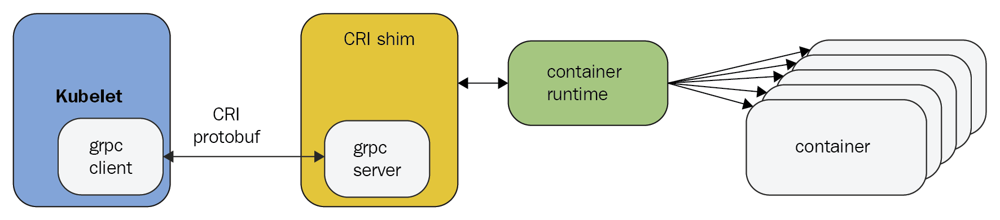
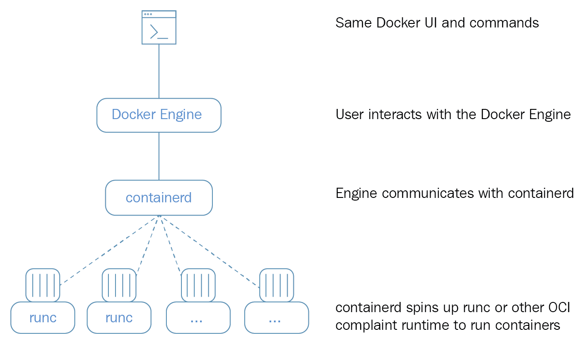
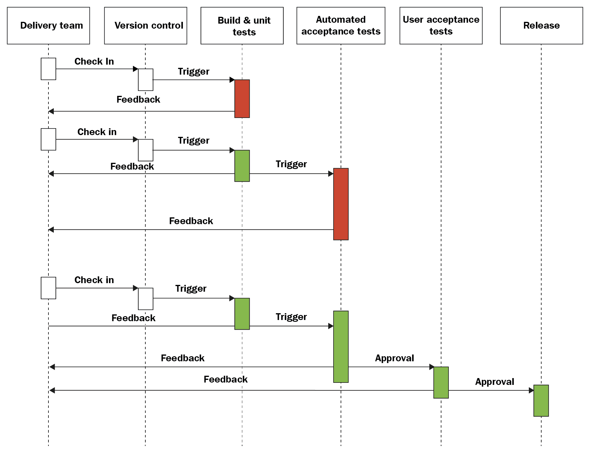

Kubernetes is a big open source project and eco-system with a lot of code and a lot of functionality. Kubernetes came out of Google, but joined the CNCF (Cloud Native Computing Foundation) and became the clear leader in the space of container-based applications. In one sentence it is a platform to orchestrate the deployment, scaling and management of container-based applications. You have probably read about Kubernetes, and maybe even dipped your toes in and used it in a side project or maybe even at work. But to understand what Kubernetes is all about, how to use it effectively, and what the best practices are, requires much more. In this chapter, we will build together the foundation necessary to utilize Kubernetes to its full potential. We will start by understanding what Kubernetes is, what Kubernetes isn't and what container orchestration means exactly. Then we will cover important Kubernetes concepts that will form the vocabulary we will use throughout the book. After that, we will dive into the architecture of Kubernetes proper and look at how it enables all the capabilities Kubernetes provides to its users. Then, we will discuss the various runtimes and container engines that Kubernetes supports (Docker is just one option), and finally, we will discuss the role of Kubernetes in the full continuous integration and deployment pipeline.

At the end of this chapter, you will have a solid understanding of container orchestration, what problems Kubernetes addresses, the rationale for Kubernetes design and architecture, and the different runtimes it supports. You'll also be familiar with the overall structure of the open source repository and be ready to jump in and find answers to any question.

# What is Kubernetes?

Kubernetes is a platform that encompasses a huge number of services and capabilities that keep growing. The core functionality is scheduling workloads in containers across your infrastructure, but it doesn't stop there. Here are some of the other capabilities Kubernetes brings to the table:

- Mounting storage systems
- Distributing secrets
- Checking application health and readiness
- Replicating application instances
- Using Horizontal Pod Autoscaling
- Using Cluster Autoscaling
- Naming and service discovery
- Balancing loads
- Rolling updates
- Monitoring resources
- Accessing and ingesting logs
- Debugging applications
- Providing authentication and authorization


# What Kubernetes is not?

Kubernetes is not a PaaS (platform as a service). It doesn't dictate many important aspects that are left to you or to other systems built on top of Kubernetes such as Deis, OpenShift and Eldarion. For example:

- Kubernetes doesn't require specific application type or framework
- Kubernetes doesn't require a specific programming language
- Kubernetes doesn't provide databases or message queues
- Kubernetes doesn't distinguish apps from services
- Kubernetes doesn't have a click to deploy service marketplace
- Kubernetes doesn't provide a built-in function as a service solution
- Kubernetes doesn't mandate a logging, monitoring and alerting systems

# Understanding container orchestration

The primary responsibility of Kubernetes is container orchestration. That means making sure that all the containers that execute various workloads are scheduled to
run on physical or virtual machines. The containers must be packed efficiently following the constraints of the deployment environment and the cluster configuration. In addition, Kubernetes must keep an eye on all running containers and replace dead, unresponsive, or otherwise unhealthy containers. Kubernetes provides many more capabilities that you will learn about in the following chapters. In this section, the focus is on containers and their orchestration.

## Physical machines, virtual machines, and containers

It all starts and ends with hardware. In order to run your workloads, you need some real hardware provisioned. That includes actual physical machines, with certain compute capabilities (CPUs or cores), memory, and some local persistent storage (spinning disks or SSDs). In addition, you will need some shared persistent storage and to hook up all these machines using networking so they can find and talk to each other. At this point, you run multiple virtual machines on the physical machines or stay at the bare-metal level (no virtual machines). Kubernetes can be deployed on a bare-metal cluster (real hardware) or on a cluster of virtual machines. Kubernetes in turn can orchestrate the containers it manages directly on bare-metal or on virtual machines. In theory, a Kubernetes cluster can be composed of a mix of bare-metal and virtual machines, but this is not very common.

## The Benefits of Containers

Containers represent a true paradigm shift in the development and operation of large complicated software systems. Here are some of the benefits compared to more traditional models:

- Agile application creation and deployment
- Continuous development, integration, and deployment
- Dev and Ops separation of concerns
- Environmental consistency across development, testing, staging, and production
- Cloud and OS distribution portability
- Application-centric management
- Resource isolation
- Resource utilization


## Containers in the cloud

Containers are ideal to package microservices because, while providing isolation to the microservice, they are very lightweight and you don't incur a lot of overhead when deploying many microservices as you do with virtual machines. That makes containers ideal for cloud deployment, where allocating a whole virtual machine 
for each microservice would be cost prohibitive.

All major cloud providers, such as Amazon AWS, Google's GCE, Microsoft's Azure provide container hosting services these days. Many other companies jumped on the Kubernetes wagon and offer managed Kubernetes services including:
- IBM IKS
- Alibaba Alibaba cloud
- DigitalOcean DKS
- Oracle OKS
- OVH Managed Kubernetes
- Rackspace KaaS


Google's GKE was always based on Kubernetes. AWS EKS (Elastic Kubernetes Service) was added in edition to the proprietary AWS ECS orchestration solution. Microsoft Azure's container service used to be based on Apache Mesos, but later switched to Kubernetes with AKS (Azure Kubernetes Service). You could always deploy Kubernetes on all the cloud platforms, but it wasn't deeply integrated with other services. But, at the end of 2017 all cloud providers announced direct support for Kubernetes. Microsoft's launched AKS, AWS released EKS and Alibaba cloud started working on a Kubernetes controller manager to integrate Kubernetes seamlessly.

## Cattle versus pets

In the olden days, when systems were small, each server had a name. Developers and users knew exactly what software was running on each machine. I remember that, in many of the companies I worked for, we had multi-day discussions to decide on a naming theme for our servers. For example, composers and Greek mythology characters were popular choices. Everything was very cozy. You treated your servers like beloved pets. When a server died it was a major crisis. Everybody scrambled to try to figure out where to get another server, what was even running on the dead server, and how to get it working on the new server. If the server stored some important data, then hopefully you had an up-to-date backup and maybe you'd even be able to recover it.

Obviously, that approach doesn't scale. When you have tens or hundreds of servers, you must start treating them like cattle. You think about the collective and not individuals. You may still have some pets like your CI/CD machines (although managed CI/CD solutions becoming more common), but your web servers and backend services are just cattle.

Kubernetes takes the cattle approach to the extreme and takes full responsibility for allocating containers to specific machines. You don't need to interact with individual machines (nodes) most of the time. This works best for stateless workloads. For stateful applications, the situation is a little different, but Kubernetes provides a solution called StatefulSet, which we'll discuss soon.

In this section, we covered the idea of container orchestration and discussed the relationships between hosts (physical or virtual) and containers, as well as the benefits of running containers in the cloud, and finished with a discussion about cattle versus pets. In the following section, we will get to know the world of Kubernetes and learn its concepts and terminology.

# Kubernetes concepts

In this section, I'll briefly introduce many important Kubernetes concepts and give you some context as to why they are needed and how they interact with other concepts. The goal is to get familiar with these terms and concepts. Later, we will see how these concepts are woven together and organized into API groups and resource categories to  achieve awesomeness. You can consider many of these concepts as building blocks. Some of the concepts, such as node and master, are implemented as a set of Kubernetes components. These components are at a different abstraction level, and I discuss them in detail in a dedicated section, _Kubernetes components_.

Here is the famous Kubernetes architecture diagram:


## Cluster

A cluster is a collection of hosts (nodes) that provide compute, memory, storage and networking resources. Kubernetes uses these resources to run the various workloads that comprise your system. Note that your entire system may consist of multiple clusters. We will discuss this advanced use case of federation in detail later.

## Node

A node is a single host. It may be a physical or virtual machine. Its job is to run pods. Each Kubernetes node runs several Kubernetes components, such as the kubelet, the container runtime and the kube proxy. Nodes are managed by a Kubernetes master. The nodes are the worker bees of Kubernetes and shoulder all the heavy lifting. In the past they were called **minions**. If you read some old documentation or articles, don't get confused. Minions are just nodes.

## Master

The master is the control plane of Kubernetes. It consists of several components, such as an API server, a scheduler, and a controller manager. The master is responsible for the global state of the cluster, cluster-level scheduling of pods and handling of events. Usually, all the master components are set up on a single host. When considering high-availability scenarios or very large clusters, you will want to have master redundancy. We will discuss highly available clusters in detail in _Chapter 4_, _Kubernetes High Availability and Scaling_.

## Pod

A pod is the unit of work in Kubernetes. Each pod contains one or more containers. Pods are always scheduled together (always run on the same machine). All the containers in a pod have the same IP address and port space; they can communicate using localhost or standard inter-process communication. In addition, all the containers in a pod can have access to shared local storage on the node hosting the pod. Containers don't get access to local storage or any other storage by default. Volumes of storage must be mounted into each container inside the pod explicitly. Pods are important feature of Kubernetes. It is possible to run multiple applications inside a single Docker container by having something like supervisord as the main Docker process that runs multiple processes, but this practice is often frowned upon for the following reasons:

- **Transparency** : Making the containers within the pod visible to the infrastructure enables the infrastructure to provide services to those containers, such as process management and resource monitoring. This facilitates a number of conveniences for users.
- **Decoupling software dependencies** : The individual containers may be versioned, rebuilt, and redeployed independently. Kubernetes may even support live updates of individual containers someday.
- **Ease of use** : Users don't need to run their own process managers, worry about signal and exit-code propagation, and so on.
- **Efficiency** : Because the infrastructure takes on more responsibility, containers can be more lightweight.

Pods provide a great solution for managing groups of closely related containers that depend on each other and need to co-operate on the same host to accomplish their purpose. It's important to remember that pods are considered ephemeral, throwaway entities that can be discarded and replaced at will. Any pod storage is destroyed with its pod. Each pod gets a unique ID (UID), so you can still distinguish between them if necessary.

## Label

Labels are key-value pairs that are used to group together sets of objects, very often pods. This is important for several other concepts, such as replication controllers, replica sets, deployments and services that operate on dynamic groups of objects and need to identify the members of the group. There is a NxN relationship between objects and labels. Each object may have multiple labels, and each label may be applied to different objects. There are certain restrictions by design on labels. Each label on an object must have a unique key. The label key must adhere to a strict syntax. It has two parts: prefix and name. The prefix is optional. If it exists then it is separated from the name by a forward slash (/) and it must be a valid DNS sub-domain. The prefix must be 253 characters long at most. The name is mandatory and must be 63 characters long at most. Names must start and end with an alphanumeric character (a-z, A-Z, 0-9) and contain only alphanumeric characters, dots, dashes, and underscores. Values follow the same restrictions as names. Note that labels are dedicated for identifying objects and not for attaching arbitrary metadata to objects. This is what annotations are for (see the following section).

## Service

Services are used to expose some functionality to users or other services. They usually encompass a group of pods, usually identified by – you guessed it – a label. You can have services that provide access to external resources, or to pods you control directly at the virtual IP level. Native Kubernetes services are exposed through convenient endpoints. Note that services operate at layer 3 (TCP/UDP). Kubernetes 1.2 added the Ingress object, which provides access to HTTP objects. More on that later. Services are published or discovered via one of two mechanisms: DNS, or environment variables. Services can be load-balanced by Kubernetes. But, developers can choose to manage load balancing themselves in case of services that use external resources or require special treatment.

There are many gory details associated with IP addresses, virtual IP addresses, and port spaces. We will discuss them in depth in a future chapter.

## Volume

Local storage on the pod is ephemeral and goes away with the pod. Sometimes that's all you need, if the goal is just to exchange data between containers of the node, but sometimes it's important for the data to outlive the pod, or it's necessary to share data between pods. The volume concept supports that need. Note that, while Docker has a volume concept too, it is quite limited (although getting more powerful). Kubernetes uses its own separate volumes. Kubernetes also supports additional container runtimes, so it can't rely on Docker volumes even in principle.

There are many volume types. Kubernetes currently directly supports many volume types, but the the modern approach for extending Kubernetes with more volume types is through the Container Storage Interface (CSI), which we'll discuss in detail later. The built-in volume types will be gradually phased out in favor of out-of-tree plugins available though CSI.

## Label selector

Label selectors are used to select objects based on their labels. Equality-based selectors specify a key name and a value. There are two operators, = (or ==) and !=, for equality or inequality based on the value. For example:

role = webserver

This will select all objects that have that label key and value.

Label selectors can have multiple requirements separated by a comma. For example:

role = webserver, application != foo

Set-based selectors extend the capabilities and allow selection based on multiple values:

role in (webserver, backend)

## Replication controller and replica set

Replication controllers and replica sets both manage a group of pods identified by a label selector and ensure that a certain number is always up and running. The main difference between them is that replication controllers test for membership by name equality and replica sets can use set-based selection. Replica sets are the way to go as they are a superset of replication controllers. I expect replication controllers to be deprecated at some point. Kubernetes guarantees that you will always have the same number of pods running as you specified in a replication controller or a replica set. Whenever the number drops due to a problem with the hosting node or the pod itself, Kubernetes will fire up new instances. Note that, if you manually start pods and exceed the specified number, the replica set controller will kill some extra pods.

Replication controllers used to be central to many workflows, such as rolling updates and running one-off jobs. As Kubernetes evolved, it introduced direct support for many of these workflows, with dedicated objects such as Deployment, Job, CronJob, and DaemonSet. We will meet them all later.


## Annotation

Annotations let you associate arbitrary metadata with Kubernetes objects. Kubernetes just stores the annotations and makes their metadata available. Unlike labels, they don't have strict restrictions about allowed characters and size limits.

In my experience, you always need such metadata for complicated systems, and it is nice that Kubernetes recognizes this need and provides it out of the box so you don't have to come up with your own separate metadata store and mapping object to their metadata. While annotations are useful their lack of structure can pose some problems when trying to process annotations in a generic way. Custom resource definitions are often touted as an alternative. We'll cover those later.

## StatefulSet

Pods come and go, and if you care about their data then you can use persistent storage. That's all good. But sometimes you want Kubernetes to manage a distributed data store such as Cassandra or MySQL Galera. These clustered stores keep the data distributed across uniquely identified nodes. You can't model that with regular pods and services. Enter StatefulSet. If you remember earlier, we discussed pets versus cattle and how cattle is the way to go. Well, StatefulSet sits somewhere in the middle. StatefulSet ensures (similar to a replication set) that a given number of instances with unique identities are running at any given time. StatefulSet members have the following properties:

- A stable hostname, available in DNS
- An ordinal index
- Stable storage linked to the ordinal and hostname

StatefulSet can help with peer discovery as well as adding or removing members safely.

## Secret

Secrets are small objects that contain sensitive info such as credentials and tokens. They are stored by default as plaintext in etcd, accessible by the Kubernetes API server, and can be mounted as files into pods (using dedicated secret volumes that piggyback on regular data volumes) that need access to them. The same secret can be mounted into multiple pods. Kubernetes itself creates secrets for its components, and you can create your own secrets. Another approach is to use secrets as environment variables. Note that secrets in a pod are always stored in memory (tmpfs in the case of mounted secrets) for better security.

## Name

Each object in Kubernetes is identified by a UID and a name. The name is used to refer to the object in API calls. Names should be up to 253 characters long and use lowercase alphanumeric characters, dash (-) and dot (.). If you delete an object, you can create another object with the same name as the deleted object, but the UIDs must be unique across the lifetime of the cluster. The UIDs are generated by Kubernetes, so you don't have to worry about it.

## Namespace

A namespace is kind of a virtual cluster. You can have a single physical cluster that contains multiple virtual clusters segregated by namespaces. By default pods in one namespace can access pods and services in other namespaces. In multi-tenancy scenarios where it's important to totally isolate namespaces you can do it with proper network policies. Note that Node objects and persistent volumes don't live in a namespace. Kubernetes may schedule pods from different namespaces to run on the same node. Likewise, pods from different namespaces can use the same persistent storage.

When using namespaces, you have to consider network policies and resource quotas to ensure proper access and distribution of the physical cluster resources.

We've covered most of Kubernetes' primary concepts; there are a few more I mentioned briefly. In the next section, we will continue our journey into Kubernetes architecture by looking into its design motivations, the internals and implementation, and even pick at the source code.

# Diving into Kubernetes architecture in depth

Kubernetes has very ambitious goals. It aims to manage and simplify the orchestration, deployment, and management of distributed systems across a wide range of environments and cloud providers. It provides many capabilities and services that should work across all that diversity, while evolving and remaining simple enough for mere mortals to use. This is a tall order. Kubernetes achieves this by following a crystal-clear, high-level design and well-thought-out architecture that promotes extensibility and pluggability. Many parts of Kubernetes are still hard-coded or environment-aware, but the trend is to refactor them into plugins and keep the core small, generic and abstract. In this section, we will peel Kubernetes like an onion, starting with various distributed systems design patterns and how Kubernetes supports them, then go over the surface of Kubernetes, which is its set of APIs, and then take a look at the actual components that comprise Kubernetes. Finally, we will take a quick tour of the source-code tree to gain even better insight into the structure of Kubernetes itself.

At the end of this section, you will have a solid understanding of Kubernetes architecture and implementation, and why certain design decisions were made.

## Distributed systems design patterns

All happy (working) distributed systems are alike, to paraphrase Tolstoy in Anna Karenina. That means that, to function properly, all well-designed distributed systems must follow some best practices and principles. Kubernetes doesn't want to be just a management system. It wants to support and enable these best practices and provide high-level services to developers and administrators. Let's look at some of those described as design patterns.

### Sidecar pattern

The sidecar pattern is about co-locating another container in a pod in addition to the main application container. The application container is unaware of the sidecar container and just goes about its business. A great example is a central logging agent. Your main container can just log to stdout, but the sidecar container will send all logs to a central logging service where they will be aggregated with the logs from the entire system. The benefits of using a sidecar container versus adding central logging to the main application container are enormous. First, applications are not burdened anymore with central logging, which could be a nuisance. If you want to upgrade or change your central logging policy or switch to a totally new provider, you just need to update the sidecar container and deploy it. None of your application containers change, so you can't break them by accident. The istio service mesh uses the sidecar pattern to inject its proxies into each pod.

### Ambassador pattern

The ambassador pattern is about representing a remote service as if it were local and possibly enforcing some policy. A good example of the ambassador pattern is if you have a Redis cluster with one master for writes and many replicas for reads. A local ambassador container can serve as a proxy and expose Redis to the main application container on the localhost. The main application container simply connects to Redis on localhost:6379 (Redis default port), but it connects to the ambassador running in the same pod, which filters the requests, and sends write requests to the real Redis master and read requests randomly to one of the read replicas. Just like with the sidecar pattern, the main application has no idea what's going on. That can help a lot when testing against a real local Redis. Also, if the Redis cluster configuration changes, only the ambassador needs to be modified; the main application remains blissfully unaware.

### Adapter pattern

The adapter pattern is about standardizing output from the main application container. Consider the case of a service that is being rolled out incrementally: it may generate reports in a format that doesn't conform to the previous version. Other services and applications that consume that output haven't been upgraded yet. An adapter container can be deployed in the same pod with the new application container and massage their output to match the old version until all consumers have been upgraded. The adapter container shares the filesystem with the main application container, so it can watch the local filesystem, and whenever the new application writes something, it immediately adapts it.

### Multi-node patterns

The single-node patterns are all supported directly by Kubernetes via pods. Multi-node patterns such as leader election, work queues, and scatter-gather are not supported directly, but composing pods with standard interfaces to accomplish them is a viable approach with Kubernetes.

# The Kubernetes APIs

If you want to understand the capabilities of a system and what it provides, you must pay a lot of attention to its API. The API provides a comprehensive view of what you can do with the system as a user. Kubernetes exposes several sets of REST APIs for different purposes and audiences via API groups. Some of the APIs are used primarily by tools and some can be used directly by developers. An important aspect of the APIs is that they are under constant development. The Kubernetes developers keep it manageable by trying to extend (adding new objects and new fields to existing objects) and avoid renaming or dropping existing objects and fields. In addition, all API endpoints are versioned, and often have an alpha or beta notation too. For example:

/api/v1

/api/v2alpha1

You can access the API through the kubectl CLI, via client libraries, or directly through REST API calls. There are elaborate authentication and authorization mechanism we will explore in a later chapter. If you have the right permissions you can list, view, create, update and delete various Kubernetes objects. At this point, let's get a glimpse into the surface area of the APIs. The best way to explore the API is via API groups. Some API groups are enabled by default. Other groups can be enabled/disabled via flags. For example, to disable the batch V1 group and enable the batch V2 Alpha group you can set the --runtime-config flag when running the API server as follows:

--runtime-config=batch/v1=false,batch/v2alpha=true

The following resources are enabled by default in addition to the core resources:

- DaemonSets
- Deployments
- HorizontalPodAutoscalers
- Ingress
- Jobs
- ReplicaSets

## Resource Categories

In addition to API groups, another useful classification of available APIs is by functionality. The Kubernetes API is huge and breaking it down into categories helps a lot when you're trying to find your way around. Kubernetes defines the following resource categories:

- **Workloads** : objects you use to manage and run containers on the cluster.
- **Discovery and Load Balancing** : objects you use to expose your workloads to the world as externally accessible, load-balanced services.
- **Config and Storage** : objects you use to initialize and configure your applications, and to persist data that outside the container.
- **Cluster** : objects that define how the cluster itself is configured; these are typically used only by cluster operators.
- **Metadata** : objects you use to configure the behavior of other resources within the cluster, such as HorizontalPodAutoscaler for scaling workloads.

In the following sub-sections I'll list the resources that belong to each group with the API group they belong to. I will not specify the version here because APIs moves rapidly from alpha to beta to GA (general availability) and from V1 to V2, and so on.

### Workloads API

The workloads API contain the following resources:

- Container: core
- CronJob: batch
- DaemonSet: apps
- Deployment: apps
- Job: batch
- Pod: core
- ReplicaSet: apps
- ReplicationController: core
- StatefulSet: apps

Containers are created by Controllers through Pods. Pods run Containers and provide environmental dependencies such as shared or persistent storage Volumes and Configuration or Secret data injected into the container.

Here is a detailed documentation of one of the most common operations, get a list of all
the pods as a REST API:

GET /api/v1/pods

It accepts various query parameters (all optional):

- pretty: If true, the output is pretty printed
- labelSelector: A selector expression to limit the result
- watch: If true, watch for changes and return a stream of events
- resourceVersion: With watch, returns only events that occurred after that version
- timeoutSeconds: Timeout for the list or watch operation

### Discovery and Load Balancing

This category is also known as services APIs. By default, Workloads are only accessible within the cluster, and they must be exposed externally using either a LoadBalancer or NodePort Service. For development, internally accessible Workloads can be accessed via proxy through the API master using the kubectl proxy command.

- Endpoints: core
- Ingress: networking.k8s.io
- Service: core

### Config and Storage

Dynamic configuration without redeployment is a corner stone of Kubernetes and running complex distributed applications on your Kubernetes cluster.

- ConfigMap: core
- CSIDriver: storage.k8s.io
- CSINode: storage.k8s.io
- Secret: core
- PersistentVolumeClaim: core
- StorageClass: storage.k8s.io
- Volume: storage.k8s.io
- VolumeAttachment: storage.k8s.io

### Metadata

The metadata resources typically show up as sub-resources of the resources the configure. For example, a limit range will be part of a pod configuration. You will not interact with these objects directly most of the time. There are many metadata resources. You can find the complete list here: https://kubernetes.io/docs/reference/generated/kubernetes-api/v1.15/#-strong-metadata-apis-strong-

### Cluster

The resources in the cluster category are designed for use by cluster operators as opposed to developers. There are many resources in this category as well. Here are some of the most important resources:

- Namespace: core
- Node: core
- PersistentVolume: core
- ResourceQuota : core
- Role: rbac.authorization.k8s.io
- RoleBinding: rbac.authorization.k8s.io
- ClusterRole: rbac.authorization.k8s.io
- ClusterRoleBinding: rbac.authorization.k8s.io
- NetworkPolicy: networking.k8s.io

Now, that we understand how Kubernetes organizes and exposes its capabilities via API groups and resource categories let's see how it manages the physical infrastructure and keeps it up with the state of the cluster.

# Kubernetes components

A Kubernetes cluster has several master components used to control the cluster, as well as node components that run on each worker node. Let's get to know all these components and how they work together.

## Master components

The master components can all run on one node, but in a highly available setup or a very large cluster, they may be spread across multiple nodes.

### API server

The kubernetes API server exposes the Kubernetes REST API. It can easily scale horizontally as it is stateless and stores all the data in the etcd cluster. The API server is the embodiment of the Kubernetes control plane.

### Etcd

Etcd is a highly reliable distributed data store. Kubernetes uses it to store the entire cluster state. In small, transient cluster a single instance of etcd can run on the same node with all the other master components. But, for more substantial clusters it is typical to have a 3-node or even 5-node etcd cluster for redundancy and high availability.

### Kube controller manager

The Kube controller manager is a collection of various managers rolled up into one binary. It contains the replication controller, the pod controller, the services controller, the endpoints controller, and others. All these managers watch over the state of the cluster via the API and their job is to steer the cluster into the desired state.

### Cloud controller manager

When running in the cloud Kubernetes allows cloud providers to integrate their platform for the purpose of managing nodes, routes, services and volumes. The cloud provider code interacts with Kubernetes code. It replaces some of the functionality of the Kube controller manager. When running Kubernetes with a cloud controller manager you must set the Kube controller manager flag --cloud-provider to "external". This will disable the control loops that the cloud controller manager is taking over. The cloud controller manager was introduced in Kubernetes 1.6 and it's being used by multiple cloud providers already such as:

- GCP
- AWS
- Azure
- BaiduCloud
- Digital Ocean
- Oracle
- Linode

A quick note about Go to help you parse the code: The method name comes first, followed by the method's parameters in parentheses. Each parameter is a pair, consisting of a name followed by its type. Finally, the return values are specified. Go allows multiple return types. It is very common to return an error object in addition to the actual result. If everything is OK, the error object will be nil.

Here is the main interface of the cloudprovider package:

```
package cloudprovider
import (
    "errors"
    "fmt"
    "strings"
    "k8s.io/api/core/v1"
    "k8s.io/apimachinery/pkg/types"
    "k8s.io/client-go/informers"
    "k8s.io/kubernetes/pkg/controller"
)

// Interface is an abstract, pluggable interface for cloud providers.
type Interface interface {
    Initialize(clientBuilder controller.ControllerClientBuilder)
    LoadBalancer() (LoadBalancer, bool)
    Instances() (Instances, bool)
    Zones() (Zones, bool)
    Clusters() (Clusters, bool)
    Routes() (Routes, bool)
    ProviderName() string
    HasClusterID() bool
}
```

Most of the methods return other interfaces with their own method. For example, here is the LoadBalancer interface:

```
type LoadBalancer interface {
    GetLoadBalancer(clusterName string,
                    service *v1.Service) (status *v1.LoadBalancerStatus,
                                          exists bool,
                                          err error)
    EnsureLoadBalancer(clusterName string, 
                       service *v1.Service,
                       nodes []*v1.Node) (*v1.LoadBalancerStatus, error)
    UpdateLoadBalancer(clusterName string, 
                       service *v1.Service, 
                       nodes []*v1.Node) error
    EnsureLoadBalancerDeleted(clusterName string, service *v1.Service) error
}
```

### Kube Scheduler

The kube-scheduler is responsible for scheduling pods into nodes. This is a very complicated task as it needs to consider multiple interacting factors, such as
the following:

- Resource requirements
- Service requirements
- Hardware/software policy constraints
- Node affinity and anti-affinity specifications
- Pod affinity and anti-affinity specifications
- Taints and tolerations
- Data locality
- Deadlines

If you need some special scheduling logic not covered by the default Kube scheduler you can replace it with your own custom scheduler. You can also run your custom scheduler side by side with the default scheduler and have your custom scheduler schedule only some subset of the pods.

### DNS

Starting with Kubernetes 1.3, a DNS service is part of the standard Kubernetes cluster. It is scheduled as a regular pod. Every service (except headless services) receives a DNS name. Pods can receive a DNS name too. This is very useful for automatic discovery.


## Node components

Nodes in the cluster need a couple of components to interact with the cluster master components, receive workloads to execute, and update the Kubernetes API server regarding their status.

### Proxy

The kube proxy does low-level network housekeeping on each node. It reflects the Kubernetes services locally and can do TCP and UDP forwarding. It finds cluster IPs via environment variables or DNS.

### Kubelet

The kubelet is the Kubernetes representative on the node. It oversees communicating with the master components and manages the running pods. That includes the following:

- Receive pod specs
- Download pod secrets from the API server
- Mount volumes
- Run the pod's containers (via the configured runtime)
- Report the status of the node and each pod
- Run container liveness probes

In this section, we dug into the guts of Kubernetes and explored its architecture from a very high level of vision and supported design patterns, through its APIs and the components used to control and manage the cluster. In the next section, we will take a quick look at the various runtimes that Kubernetes supports.

# Kubernetes runtimes

Kubernetes originally only supported Docker as a container runtime engine. But that is no longer the case. Kubernetes now supports several different runtimes:

- Docker (via a CRI shim)
- Rkt (direct integration to be replaced with Rktlet)
- Cri-O
- Frakti (Kubernetes on the Hypervisor, previously Hypernetes)
- Rktlet (CRI implementation for rkt)
- cri-containerd

A major design policy is that Kubernetes itself should be completely decoupled from specific runtimes. The Container Runtime Interface (CRI) enables it.

In this section, you'll get a closer look at the CRI and get to know 
the individual runtime engines. At the end of this section, you'll be able to make a well-informed decision about which runtime engine is appropriate for your use case and under what circumstances you may switch or even combine multiple runtimes in the same system.

## The Container Runtime Interface (CRI)

The CRI is a gRPC API, specifications/requirements and libraries for container runtimes to integrate with kubelet on a node. In Kubernetes 1.7 the internal Docker integration in Kubernetes was replaced with a CRI-based integration. This is a big deal. It opened the door to multiple implementations that can take advantage of advances in the containers world. The Kubelet doesn't need to interface directly with multiple runtimes. Instead, it can talk to any CRI-compliant container runtime. The following diagram illustrates the flow:




There are two gRPC service interfaces: ImageService and RuntimeService that CRI container runtimes (or shims) must implement. The ImageService is responsible for managing images. Here is the gRPC/protobuf interface (this is not Go):

```
service ImageService {
    rpc ListImages(ListImagesRequest) returns (ListImagesResponse) {}
    rpc ImageStatus(ImageStatusRequest) returns (ImageStatusResponse) {}
    rpc PullImage(PullImageRequest) returns (PullImageResponse) {}
    rpc RemoveImage(RemoveImageRequest) returns (RemoveImageResponse) {}
    rpc ImageFsInfo(ImageFsInfoRequest) returns (ImageFsInfoResponse) {}
}
```

The RuntimeService is responsible for managing pods and container. Here is the gRPC/protobuf interface:

```
service RuntimeService {
    rpc Version(VersionRequest) returns (VersionResponse) {}
    rpc RunPodSandbox(RunPodSandboxRequest) returns (RunPodSandboxResponse) {}
    rpc StopPodSandbox(StopPodSandboxRequest) returns (StopPodSandboxResponse) {}
    rpc RemovePodSandbox(RemovePodSandboxRequest) returns (RemovePodSandboxResponse) {}
    rpc PodSandboxStatus(PodSandboxStatusRequest) returns (PodSandboxStatusResponse) {}
    rpc ListPodSandbox(ListPodSandboxRequest) returns (ListPodSandboxResponse) {}
    rpc CreateContainer(CreateContainerRequest) returns (CreateContainerResponse) {}
    rpc StartContainer(StartContainerRequest) returns (StartContainerResponse) {}
    rpc StopContainer(StopContainerRequest) returns (StopContainerResponse) {}
    rpc RemoveContainer(RemoveContainerRequest) returns (RemoveContainerResponse) {}
    rpc ListContainers(ListContainersRequest) returns (ListContainersResponse) {}
    rpc ContainerStatus(ContainerStatusRequest) returns (ContainerStatusResponse) {}
    rpc UpdateContainerResources(UpdateContainerResourcesRequest) returns (UpdateContainerResourcesResponse) {}
    rpc ExecSync(ExecSyncRequest) returns (ExecSyncResponse) {}
    rpc Exec(ExecRequest) returns (ExecResponse) {}
    rpc Attach(AttachRequest) returns (AttachResponse) {}
    rpc PortForward(PortForwardRequest) returns (PortForwardResponse) {}
    rpc ContainerStats(ContainerStatsRequest) returns (ContainerStatsResponse) {}
    rpc ListContainerStats(ListContainerStatsRequest) returns (ListContainerStatsResponse) {}
    rpc UpdateRuntimeConfig(UpdateRuntimeConfigRequest) returns (UpdateRuntimeConfigResponse) {}
    rpc Status(StatusRequest) returns (StatusResponse) {}
}
```

The data types used as arguments and return types are called messages and are also defined in as part of the API. Here is one of them:

```
message CreateContainerRequest {
    string pod_sandbox_id = 1;
    ContainerConfig config = 2;
    PodSandboxConfig sandbox_config = 3;
}
```

As you can see messages can be embedded inside each other. The CreateContainerRequest message has one string field and two other fields, which are themselves messages: ContainerConfig and PodSandboxConfig.

Now that you are familiar at the code level with what Kubernetes considers as a runtime engine, let's look at the individual runtime engines briefly.

## Docker

Docker is, of course, the 800 pound gorilla of containers. Kubernetes was originally designed to manage only Docker containers. The multi-runtime capability was first introduced in Kubernetes 1.3 and the CRI in Kubernetes 1.5. Until then, Kubernetes could only manage Docker containers.

I assume you're very familiar with Docker and what it brings to the table if you are reading this book. Docker enjoys tremendous popularity and growth, but there is also a lot of criticism towards it. Critics often mention the following concerns:

- Security
- Difficulty setting up multi-container applications (in particular, networking)
- Development, monitoring, and logging
- Limitations of Docker containers running one command
- Releasing half-baked features too fast

Docker is aware of the criticisms and has addressed some of these concerns. In particular, Docker invested in its Docker swarm product. Docker swarm is a Docker-native orchestration solution that competes with Kubernetes. It is simpler to use than Kubernetes, but it's not as powerful or mature.

Starting with Docker 1.12, swarm mode is included in the Docker daemon natively, which upset some people due to bloat and scope creep. As a result more people turned to CoreOS rkt as an alternative solution.

Starting with Docker 1.11, released on April 2016, Docker has changed the way it runs containers. The runtime now uses containerd and runC to run **Open Container Initiative** ( **OCI** ) images in containers:




## Rkt

Rkt is a container manager from CoreOS (developers of the CoreOS Linux distro, etcd, flannel, and more). It is not developed anymore as CoreOS was acquired by RedHat, who was was alter acquired by IBM. However, The legacy of Rkt is the proliferation of multiple container runtimes beyond Docker and pushing Docker towards the standardized OCI effort.

The rkt runtime prides itself on its simplicity and strong emphasis on security and isolation. It doesn't have a daemon like the Docker engine and relies on the OS init system, such as systemd, to launch the rkt executable. Rkt can download images (both **App Container** ( **appc** ) images and OCI images), verify them, and run them in containers. Its architecture is much simpler.

### App container

CoreOS started a standardization effort in December 2014 called appc. This includes standard image format (ACI), runtime, signing, and discovery. A few months later, Docker started its own standardization effort with OCI. At this point it seems these efforts will converge. This is a great thing as tools, images, and runtime will be able to interoperate freely. We're not there yet.

## Cri-O

Cri-O is a Kubernetes incubator project. It is designed to provide an integration path between Kubernetes and OCI-compliant container runtimes like Docker. Cri-O provides the following capabilities:

- Support multiple image formats including the existing Docker image format
- Support for multiple means to download images including trust &amp; image verification
- Container image management (managing image layers, overlay filesystems, etc)
- Container process lifecycle management
- Monitoring and logging required to satisfy the CRI
- Resource isolation as required by the CRI

It supports runc and Kata containers right now, but any OCI-compliant container runtime can be plugged in and be integrated with Kubernetes.

## Hyper Containers

Hyper containers are another option. A Hyper container has a lightweight VM (its own guest kernel) and it can run on bare metal. Instead of relying on Linux cgroups for isolation, it relies on a hypervisor. This approach presents an interesting mix compared to standard bare-metal clusters that are difficult to set up and public clouds where containers are deployed on heavyweight VMs.

### Frakti

Frakti lets Kubernetes use hypervisors via the OCI-compliant runV project to run its pods and containers. It's a lightweight, portable and secure approach that provides strong isolation with its own kernel compared to the traditional Linux namespace based approaches, but not as heavyweight as a full-fledged VM.


### Stackube

Stackube (previously called Hypernetes) is a multi-tenant distribution that uses Hyper containers as well as some OpenStack components for authentication, persistent storage, and networking. Since containers don't share the host kernel, it is safe to run containers of different tenants on the same physical host. Stackube uses Frakti of course as its container runtime.

In this section, we've covered the various runtime engines that Kubernetes supports as well as the trend toward standardization, convergence and externalizing the runtime support from core Kubernetes. In the next section, we'll take a step back and look at the big picture, and how Kubernetes fits into the CI/CD pipeline.

# Continuous integration and deployment

Kubernetes is a great platform for running your microservice-based applications. But, at the end of the day, it is an implementation detail. Users, and often most developers, may not be aware that the system is deployed on Kubernetes. But Kubernetes can change the game and make things that were too difficult before possible.

In this section, we'll explore the CI/CD pipeline and what Kubernetes brings to the table. At the end of this section you'll be able to design CI/CD pipelines that take advantage of Kubernetes properties such as easy-scaling and development-production parity to improve the productivity and robustness of day-to-day development and deployment.

## What is a CI/CD pipeline?

A CI/CD pipeline is a set of tools and steps that take a set of changes by developers or operators that modify the code, data or configuration of a system, test them and deploys them to production (and possibly other environments). Some pipelines are fully automated and some are semi-automated with human checks. In large organizations, there may be test and staging environments where changes are deployed to automatically, but release to production requires manual intervention. The following diagram describes a typical pipeline.


It may be worth mentioning that developers can be completely isolated from production infrastructure. Their interface is just a Git workflow, where a good example is Deis Workflow (PaaS on Kubernetes, similar to Heroku):




## Designing a CI/CD pipeline for Kubernetes

When your deployment target is a Kubernetes cluster, you should rethink some traditional practices. For starters, packaging is different. You need to bake images for your containers. Reverting code changes is super easy and instantaneous by using smart labeling. It gives you a lot of confidence that, if a bad change slips through the testing net, somehow you'll be able to revert to the previous version immediately. But you want to be careful there. Schema changes and data migrations can't be automatically rolled back. Another unique capability of Kubernetes is that developers can run a whole cluster locally. That takes some work when you design your cluster, but since the microservices that comprise your system run in containers, and those containers interact via APIs, it is possible and practical to do. As always, if your system is very data-driven, you will need to accommodate for that and provide data snapshots and synthetic data that your developers can use.

There are many commercial CI/CD solutions that support Kubernetes, but there are also several Kubernetes-native solutions such as:
- Tekton
- Argo CD
- Jenkins X

A Kubernetes-native CI/CD solution runs inside your cluster, is specified using Kubernetes CRDs and uses containers to execute the steps. By using a Kubernetes-native CI/CD solution you get to benefit from Kubernetes managing and easily scaling your CI/CD pipelines, which is often a non-trivial task.

# Summary

In this chapter, we covered a lot of ground, and you got to understand the design and architecture of Kubernetes. Kubernetes is an orchestration platform for microservice-based applications running as containers. Kubernetes clusters have master and worker nodes. Containers run within pods. Each pod runs on a single physical or virtual machine. Kubernetes directly supports many concepts, such as services, labels, and persistent storage. You can implement various distributed systems design patterns on Kubernetes. Container runtimes just need to implement the CRI. Docker, rkt, hyper containers and more are supported.

In _Chapter 2_, _Creating Kubernetes Clusters_, we will explore the various ways to create Kubernetes clusters, discuss when to use different options, and build a multi-node cluster.

# Reference

https://github.com/kubernetes/frakti
https://github.com/openstack/stackube
https://cd.foundation/projects/
