# Advanced Kubernetes Networking

In this chapter, we will examine the important topic of networking. Kubernetes as an orchestration platform manages containers/pods running on different machines (physical or virtual) and requires an explicit networking model. We will look at the following topics:

- Kubernetes networking model
- Standard interfaces that Kubernetes supports, such as EXEC, Kubenet, and in particular CNI
- Various networking solutions that satisfy the requirements of Kubernetes networking
- Network policies and load balancing options
- Writing a custom CNI plugin

At the end of this chapter, you will understand the Kubernetes approach to networking and be familiar with the solution space for aspects such as standard interfaces, networking implementations, and load balancing. You will even be able to write your very own CNI plugin if you wish.

# Understanding the Kubernetes networking model

The Kubernetes networking model is based on a flat address space. All pods in a cluster can directly see each other. Each pod has its own IP address. There is no need to configure any NAT (network address translation). In addition, containers in the same pod share their pod's IP address and can communicate with each other through localhost. This model is pretty opinionated, but once set up, it simplifies life considerably both for developers and administrators. It makes it particularly easy to migrate traditional network applications to Kubernetes. A pod represents a traditional node and each container represents a traditional process.

## Intra-pod communication (container to container)

A running pod is always scheduled on one (physical or virtual) node. That means that all the containers run on the same node and can talk to each other in various ways, such as the local filesystem, any IPC mechanism, or using localhost and well-known ports. There is no danger of port collision between different pods because each pod has its own IP address and when a container in the pod uses localhost, it applies to the pod's IP address only. So if container 1 in pod 1 connects to port 1234 that container 2 listens to on pod 1, it will not conflict with another container in pod 2 running on the same node that also listens on port 1234. The only caveat is that if you're exposing ports to the host then you should be careful about pod to node affinity. This can be handled using several mechanisms, such as daemon set and pod anti-affinity.

## Inter-pod communication (pod to pod)

Pods in Kubernetes are allocated a network-visible IP address (not private to the node). Pods can communicate directly without the aid of network address translation, tunnels, proxies, or any other obfuscating layer. Well-known port numbers can be used for a configuration-free communication scheme. The pod's internal IP address is the same as its external IP address that other pods see (within the cluster network; not exposed to the outside world). That means that standard naming and discovery mechanisms such as DNS work out of the box.

## Pod to service communication

Pods can talk to each other directly using their IP addresses and well-known ports, but that requires the pods to know each other's IP addresses. In a Kubernetes cluster, pods can be destroyed and created constantly. There may also be multiple replicas of the same pod spec, each with its own IP address. The service provides a layer of indirection that is very useful because the service is stable even if the set of actual pods that respond to requests is ever-changing. In addition, you get automatic, highly available load balancing because the kube-proxy on each node takes care of redirecting traffic to the correct pod:

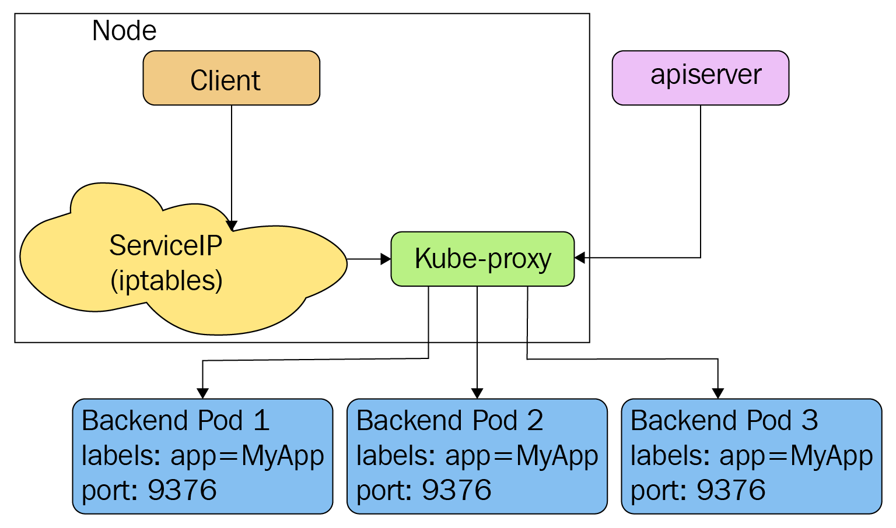
**images/chapter 10 - pod to service communication.png**

## External access

Eventually, some containers need be accessible from the outside world. The pod IP addresses are not visible externally. The service is the right vehicle, but external access typically requires two redirects. For example, cloud provider load balancers are not Kubernetes aware, so they can't direct traffic to a particular service directly to a node that runs a pod that can process the request. Instead, the public load balancer just directs traffic to any node in the cluster and the kube-proxy on that node will redirect again to an appropriate pod if the current node doesn't run the necessary pod.

The following diagram shows how that the external load balancer on the right side just sends traffic to an arbitrary node, where the kube-proxy takes care of further routing if needed:

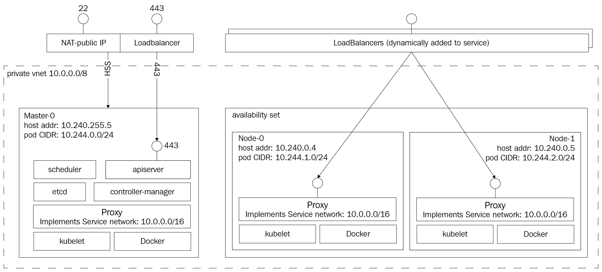
**images/chapter 10 - external access.png**

## Kubernetes networking versus Docker networking

Docker is the incumbent container runtime. It also has its own separate networking model that is not used by Kubernetes, but it is useful to understand. Docker networking follows a different model by default, although over time, it starts to gravitate towards the Kubernetes model. In Docker networking, each container has its own private IP address from the 172.xxx.xxx.xxx address space confined to its own node. It can talk to other containers on the same node via their own 172.xxx.xxx.xxx different IP addresses. This makes sense for Docker because it doesn't have the notion of a pod with multiple interacting containers, so it models every container as lightweight VMs that have their own network identity. Note that with Kubernetes, containers from different pods that run on the same node can't connect over localhost (unless exposing host ports, which is discouraged). The whole idea is that, in general, Kubernetes can kill and create pods anywhere, so different pods shouldn't rely, in general, on other pods available on the node. Daemon sets are a notable exception, but the Kubernetes networking model is designed to work for all use cases and doesn't add special cases for direct communication between different pods on the same node.

How do Docker containers communicate across nodes? The container must publish ports to the host. This obviously requires port coordination because if two containers try to publish the same host port, they'll conflict with each other. Then containers (or other processes) connect to the host's port that gets channeled into the container. A big downside is that containers can't self-register with external services because they don't know what's their host's IP address. You could work around it by passing the host's IP address as an environment variable when you run the container, but that requires external coordination and complicates the process.

The following diagram shows the networking setup with Docker using the bridge network driver. Each container has its own IP address; Docker creates the docker0 bridge on every node:

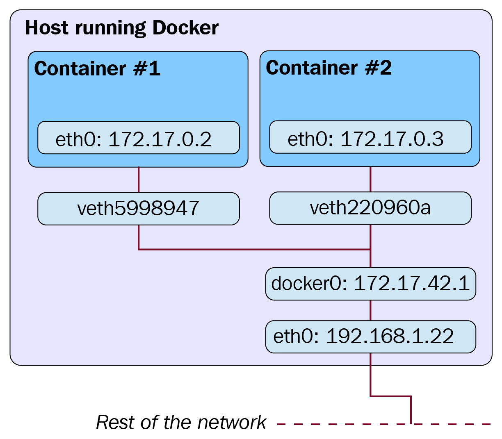
**images/chapter 10 - docker networking.png**

Docker now supports other network drivers with their own models:
- host: use host networking directly
- overlay: use overlay network instead of OS routing to connect across Docker daemons
- macvlan: assign MAC address to container and make it look like a physical device
- none: disable networking when using a custom network driver

There are also 3rd party network plugins.

Now, that we understand the differences between Kubernetes and Docker networking models it's time to talk about how pods and containers find each other. 

## Lookup and discovery

In order for pods and containers to communicate with each other, they need to find each other. There are several ways for containers to locate other containers or announce themselves. There are also some architectural patterns that allow containers to interact indirectly. Each approach has its own pros and cons.

### Self-registration

We've mentioned self-registration several times. Let's understand what it means exactly. When a container runs, it knows its pod's IP address. Each container that wants to be accessible to other containers in the cluster can connect to some registration service and register its IP address and port. Other containers can query the registration service for the IP addresses and port of all registered containers and connect to them. When a container is destroyed (gracefully), it will unregister itself. If a container dies ungracefully then some mechanism needs to be established to detect that. For example, the registration service can periodically ping all registered containers, or the containers are required periodically to send a keepalive message to the registration service.

The benefit of self-registration is that once the generic registration service is in place (no need to customize it for different purposes), there is no need to worry about keeping track of containers. Another huge benefit is that containers can employ sophisticated policies and decide to unregister temporarily if they are unavailable based on local conditions; for example, if a container is busy and doesn't want to receive any more requests at the moment. This sort of smart and decentralized dynamic load balancing can be very difficult to achieve globally. The downside is that the registration service is yet another non-standard component that containers need to know about in order to locate other containers. 

### Services and endpoints

Kubernetes services can be considered as a registration service. Pods that belong to a service are registered automatically based on their labels. Other pods can look up the endpoints to find all the service pods or take advantage of the service itself and directly send a message to the service that will get routed to one of the backend pods. Although most of the time pods will just send their message to the service itself that will forward it to one of the backing pods. Dynamic membership can be achieved using a combination of the replica count of deployments, health checks, readiness checks and horizontal pod autoscaling.

### Loosely coupled connectivity with queues

What if containers can talk to each other without knowing their IP addresses and ports or even service IP addresses or network names? What if most of the communication can be asynchronous and decoupled? In many cases, systems can be composed of loosely coupled components that are not only unaware of the identities of other components, but they are unaware that other components even exist. Queues facilitate such loosely coupled systems. Components (containers) listen to messages from the queue, respond to messages, perform their jobs, and post messages to the queue, on progress, completion status, and error. Queues have many benefits:

- Easy to add processing capacity without coordination, just add more containers that listen to the queue
- Easy to keep track of overall load by queue depth
- Easy to have multiple versions of components running side by side by versioning messages and/or topics
- Easy to implement load balancing as well as redundancy by having multiple consumers process requests in different modes
- Easy to add or remove other types of listeners dynamically 

The downsides of queues are the following:

- Need to make sure that the queue provides appropriate durability and high-availability so it doesn't become a critical SPOF
- Containers need to work with the async queue API (could be abstracted away)
- Implementing request-response requires a somewhat cumbersome listening on response queues

Overall, queues are an excellent mechanism for large-scale systems and they can be utilized in large Kubernetes clusters to ease coordination.

### Loosely coupled connectivity with data stores

Another loosely coupled method is to use a data store (for example, Redis) to store messages and then other containers can read them. While possible, this is not the design objective of data stores and the result is often cumbersome, fragile, and doesn't have the best performance. Data stores are optimized for data storage and not for communication. That being said, data stores can be used in conjunction with queues, where a component stores some data in a data store and then sends a message to the queue that data is ready for processing. Multiple components listen to the message and all start processing the data in parallel.

### Kubernetes ingress

Kubernetes offers an ingress resource and controller that is designed to expose Kubernetes services to the outside world. You can do it yourself, of course, but
many tasks involved in defining ingress are common across most applications for a particular type of ingress such as a web application, CDN, or DDoS protector.
You can also write your own ingress objects.

The ingress object is often used for smart load balancing and TLS termination. Instead of configuring and deploying your own Nginx server, you can benefit from the built-in ingress controller. If you need a refresher, hop on to _Chapter 5_, _Using Kubernetes Resources in Practice_, where we discussed the ingress resource with examples.

## Kubernetes network plugins

Kubernetes has a network plugin system since networking is so diverse and different people would like to implement it in different ways. Kubernetes is flexible enough to support any scenario. The primary network plugin is CNI, which we will discuss in depth. But Kubernetes also comes with a simpler network plugin called Kubenet. Before we go over the details, let's get on the same page with the basics of Linux networking (just the tip of the iceberg).

### Basic Linux networking

Linux, by default, has a single shared network space. The physical network interfaces are all accessible in this namespace. But the physical namespace can be divided into multiple logical namespaces, which is very relevant to container networking.

### IP addresses and ports

Network entities are identified by their IP address. Servers can listen to incoming connections on multiple ports. Clients can connect (TCP) or send/receive data (UDP) to servers within their network.

### Network namespaces

Namespaces group a bunch of network devices such that they can reach other servers in the same namespace, but not other servers even if they are physically on the same network. Linking networks or network segments can be done via bridges, switches, gateways, and routing.

### Subnets, Netmasks and CIDRs

Granular division of networks segments is very useful when designing and maintaining networks. Dividing networks to smaller subnets with a common prefix is a common practice. These subnets can be defined by bitmasks that represent the size of the subnet (how many hosts it can contain). For example, a netmask of 255.255.255.0 means that the first 3 octets are used for routing and only 256 (actually 254) individual hosts are available. The CIDR (Classless Inter-Domain Routing) notation is often used for this purpose these because it is more concise, encodes more information and also allows combining hosts from multiple legacy classes (A, B, C, D, E). For example: 172.27.15.0/24 means that the first 24 bits (3 octets) are used for routing.

### Virtual Ethernet devices

**Virtual Ethernet** ( **veth** ) devices represent physical network devices. When you create a veth that's linked to a physical device you can assign that veth (and by extension the physical device) into a namespace where devices from other namespaces can't reach it directly, even if physically they are on the same local network.

### Bridges

Bridges connect multiple network segments to an aggregate network, so all the nodes can communicate with each other. Bridging is done at the L1 (physical)
and L2 (data link) layers of the OSI network model.

### Routing

Routing connects separate networks, typically based on routing tables that instruct network devices how to forward packets to their destination. Routing is done through various network devices, such as routers, bridges, gateways, switches, and firewalls, including regular Linux boxes.

### Maximum transmission unit

The **maximum transmission unit** ( **MTU** ) determines how big packets can be. On Ethernet networks, for example, the MTU is 1,500 bytes. The bigger the MTU, the better the ratio between payload and headers, which is a good thing. But the downside is that minimum latency is reduced because you have to wait for the
entire packet to arrive and, furthermore, in case of failure, you have to retransmit the entire big packet.

### Pod networking

Here is a diagram that describes the relationship between pod, host, and the global Internet at networking level via veth0:

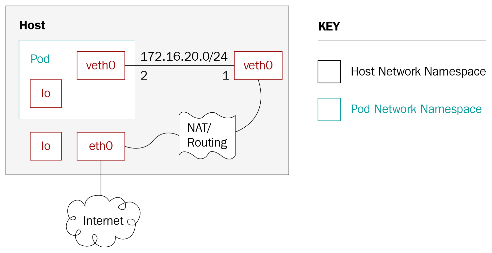
**images/chapter 10 - pod networking.png**

### Kubenet

Back to Kubernetes. Kubenet is a network plugin. It's very rudimentary and just creates a Linux bridge called cbr0 and a veth for each pod. Cloud providers typically use it to set up routing rules for communication between nodes, or in single-node environments. The veth pair connects each pod to its host node
using an IP address from the host's IP addresses range.

#### Requirements

The Kubenet plugin has the following requirements:

- The node must be assigned a subnet to allocate IP addresses for its pods
- The standard CNI bridge, lo, and host-local plugins are required at version 0.2.0 or greater
- The Kubelet must be run with the `--network-plugin=kubenet` argument
- The Kubelet must be run with the `--non-masquerade-cidr=<clusterCidr>` argument
- The kubelet must be run with `--pod-cidr` or the kube-controller-manager must be run with `--allocate-node-cidrs=true` `--cluster-cidr=<cidr>`

#### Setting the MTU

The MTU is critical for network performance. Kubernetes network plugins such as Kubenet make their best efforts to deduce optimal MTU, but sometimes they need help. If an existing network interface (for example, the Docker docker0 bridge) sets a small MTU then Kubenet will reuse it. Another example is IPSEC, that requires lowering the MTU due to the extra overhead from IPSEC encapsulation overhead, but the Kubenet network plugin doesn't take it into consideration. The solution is to avoid relying on the automatic calculation of the MTU and just tell the Kubelet what MTU should be used for network plugins via the `--network-plugin-mtu` command-line switch that is provided to all network plugins. Although, at the moment, only the Kubenet network plugin accounts for this command-line switch.

### Container networking interface

**Container Networking Interface** ( **CNI** ) is a specification as well as a set of libraries for writing network plugins to configure network interfaces in Linux containers
(not just Docker). The specification actually evolved from the rkt network proposal. There is a lot of momentum behind CNI and it is the established industry standard. Some of the organizations that use CNI are:

- Kubernetes
- OpenShift
- Mesos
- Kurma
- Cloud foundry
- Nuage
- IBM
- AWS EKS and ECS
- Lyft


The CNI team maintains some core plugins, but there are a lot of third-party plugins too that contribute to the success of CNI. Here is a non-exhaustive list:

- Project Calico : A layer 3 virtual network
- Weave : A multi-host Docker network
- Contiv networking : Policy-based networking
- Cilium: BPF & XDP for containers
- Multus: a Multi plugin
- CNI-Genie: generic CNI network plugin
- Flannel: a network fabric for containers, designed for Kubernetes
- Infoblox : Enterprise IP address management for containers
- Silk: a CNI plugin designed for Cloud Foundry
- Linen: a CNI plugin designed for overlay networks with Open vSwitch and fit in SDN/OpenFlow network environment
- SR-IOV: a CNI plugin that supports I/O virtualization
- ovn-kubernetes: CNI plugin built on Open vSwitch (OVS) and Open Virtual Networking (OVN)
- DANM: a CNI-compliant networking solution for TelCo workloads running on Kubernetes

CNI plugins provide a standard networking interface to arbitrary networking solutions.

#### Container runtime

CNI defines a plugin spec for networking application containers, but the plugin must be plugged into a container runtime that provides some services. In the context of CNI, an application container is a network-addressable entity (has its own IP address). For Docker, each container has its own IP address. For Kubernetes, each pod has its own IP address and the pod is the CNI container and not the containers within the pod.

Likewise, rkt's app containers are similar to Kubernetes pods in that they may contain multiple Linux containers. If in doubt, just remember that a CNI container must have its own IP address. The runtime's job is to configure a network and then execute one or more CNI plugins, passing them the network configuration in JSON format.

The following diagram shows a container runtime using the CNI plugin interface to communicate with multiple CNI plugins:

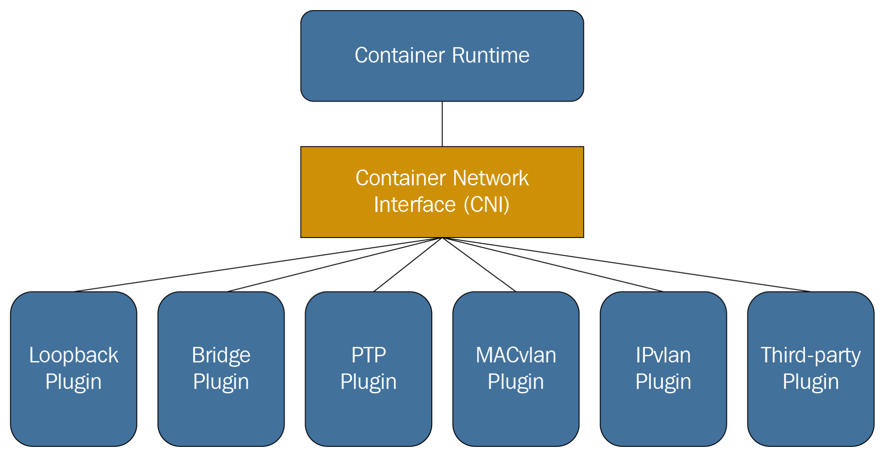
**images/chapter 10 - container runtime with cni.png**

#### CNI plugin

The CNI plugin's job is to add a network interface into the container network namespace and bridge the container to the host via a veth pair. It should then assign an IP address via an IPAM (IP address management) plugin and set up routes.

The container runtime (Docker, rkt or any other CRI-compliant runtime) invokes the CNI plugin as an executable. The plugin needs to support the following operations:

- Add a container to the network
- Remove a container from the network
- Report version

The plugin uses a simple command-line interface, standard input/output, and environment variables. The network configuration in JSON format is passed
to the plugin through standard input. The other arguments are defined as environment variables:

- CNI_COMMAND: Indicates the desired operation; ADD, DEL, or VERSION.
- CNI_CONTAINERID: Container ID.
- CNI_NETNS: Path to network namespace file.
- CNI_IFNAME: Interface name to set up; plugin must honor this interface name or return an error.
- CNI_ARGS: Extra arguments passed in by the user at invocation time. Alphanumeric key-value pairs separated by semicolons, for example, FOO=BAR;ABC=123.
- CNI_PATH: List of paths to search for CNI plugin executables. Paths are separated by an OS-specific list separator, for example `:` on Linux and `;` on Windows.

If the command succeeds, the plugin returns a zero exit code and the generated interfaces (in the case of the ADD command) are streamed to standard output as JSON. This low-tech interface is smart in the sense that it doesn't require any specific programming language or component technology or binary API. CNI plugin writers can use their favorite programming language too.

The result of invoking the CNI plugin with the ADD command looks as follows:

```
{
  "cniVersion": "0.3.0",
  "interfaces": [              (this key omitted by IPAM plugins)
      {
          "name": "<name>",
          "mac": "<MAC address>", (required if L2 addresses are meaningful)
          "sandbox": "<netns path or hypervisor identifier>" (required for container/hypervisor interfaces, empty/omitted for host interfaces)
      }
  ],
  "ip": [
      {
          "version": "<4-or-6>",
          "address": "<ip-and-prefix-in-CIDR>",
          "gateway": "<ip-address-of-the-gateway>",     (optional)
          "interface": <numeric index into 'interfaces' list>
      },
      ...
  ],
  "routes": [                                           (optional)
      {
          "dst": "<ip-and-prefix-in-cidr>",
          "gw": "<ip-of-next-hop>"                      (optional)
      },
      ...
  ]
  "dns": {
    "nameservers": <list-of-nameservers>                (optional)
    "domain": <name-of-local-domain>                    (optional)
    "search": <list-of-additional-search-domains>       (optional)
    "options": <list-of-options>                        (optional)
  }
}
```

The input network configuration contains a lot of information: cniVersion, name, type, args (optional), ipMasq (optional), ipam, and dns. The ipam and dns parameters are dictionaries with their own specified keys. Here is an example of a network configuration:

```
{
  "cniVersion": "0.3.0",
  "name": "dbnet",
  "type": "bridge",
  // type (plugin) specific
  "bridge": "cni0",
  "ipam": {
    "type": "host-local",
    // ipam specific
    "subnet": "10.1.0.0/16",
    "gateway": "10.1.0.1"
  },
  "dns": {
    "nameservers": ["10.1.0.1"]
  }
}
```

Note that additional plugin-specific elements can be added. In this case, the bridge: cni0 element is a custom one that the specific bridge plugin understands.

The CNI spec also supports network configuration lists where multiple CNI plugins can be invoked in order.

Later in this chapter, we will dig into a fully-fledged implementation of a CNI plugin.

# Kubernetes networking solutions

Networking is a vast topic. There are many ways to set up networks and connect devices, pods, and containers. Kubernetes can't be opinionated about it. The
high-level networking model of a flat address space for Pods is all that Kubernetes prescribes. Within that space, many valid solutions are possible, with various capabilities and policies for different environments. In this section, we'll examine some of the available solutions and understand how they map to the Kubernetes networking model.

## Bridging on bare metal clusters

The most basic environment is a raw bare metal cluster with just an L2 physical network. You can connect your containers to the physical network with a Linux bridge device. The procedure is quite involved and requires familiarity with low-level Linux network commands such as brctl, ipaddr, iproute, iplink, and nsenter. If you plan to implement it, this guide can serve as a good start (search for the _With Linux Bridge devices_ section): http://blog.oddbit.com/2014/08/11/four-ways-to-connect-a-docker/.

## Contiv

Contiv is a general-purpose network plugin for container networking and it can be used with Docker directly, Mesos, Docker Swarm, and of course Kubernetes via a CNI plugin. Contiv is focused on network policies that overlap somewhat with Kubernetes' own network policy object. Here are some of the capabilities of the Contiv net plugin:

- Supports both libnetwork's CNM and the CNI specification
- A feature-rich policy model to provide secure, predictable application deployment
- Best-in-class throughput for container workloads
- Multi-tenancy, isolation, and overlapping subnets
- Integrated IPAM and service discovery
- A variety of physical topologies:
- Layer2 (VLAN)
- Layer3 (BGP)
- Overlay (VXLAN)
- Cisco SDN solution (ACI)
- IPv6 support
- Scalable policy and route distribution

Integration with application blueprints, including the following:

- Docker compose
- Kubernetes deployment manager
- Service load balancing is built in east-west microservice load balancing
- Traffic isolation for storage, control (for example, etcd/consul), network, and management traffic

Contiv has many features and capabilities. I'm not sure if it's the best choice for Kubernetes due to its broad surface area and the fact it caters to multiple platforms.

## Open vSwitch

Open vSwitch is a mature software-based virtual switch solution endorsed by many big players. The **Open Virtualization Network** ( **OVN** ) solution lets you build various virtual networking topologies. It has a dedicated Kubernetes plugin, but it is not trivial to set up, as demonstrated by this guide: https://github.com/openvswitch/ovn-kubernetes. The Linen CNI plugin may be easier to set up although it doesn't support all the features of OVN:

https://github.com/John-Lin/linen-cni

Here is a diagram of the Linen CNI plugin:

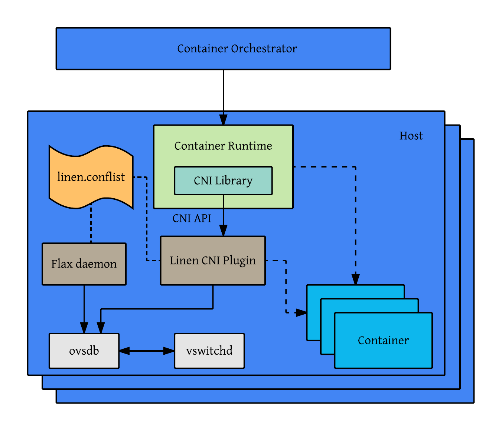
**images/chapter 10 - linen cni plugin.png**

Open vSwitch can connect bare metal servers, VMs, and pods/containers using the same logical network. It actually supports both overlay and underlay modes.

Here are some of its key features:

- Standard 802.1Q VLAN model with trunk and access ports
- NIC bonding with or without LACP on upstream switch
- NetFlow, sFlow(R), and mirroring for increased visibility
- QoS (Quality of Service) configuration, plus policing
- Geneve, GRE, VXLAN, STT, and LISP tunneling
- 802.1ag connectivity fault management
- OpenFlow 1.0 plus numerous extensions
- Transactional configuration database with C and Python bindings
- High-performance forwarding using a Linux kernel module

## Nuage networks VCS

The **Virtualized Cloud Services** ( **VCS** ) product from Nuage networks provides a highly scalable policy-based **Software-Defined Networking** ( **SDN** ) platform. It is an enterprise-grade offering that builds on top of the open source open vSwitch for the data plane along with a feature-rich SDN controller built on open standards.

The Nuage platform uses overlays to provide seamless policy-based networking between Kubernetes Pods and non-Kubernetes environments (VMs and bare
metal servers). Nuage's policy abstraction model is designed with applications in mind and makes it easy to declare fine-grained policies for applications. The platform's real-time analytics engine enables visibility and security monitoring for Kubernetes applications.

In addition, all of VCS components can be installed in containers. There are no special hardware requirements.

## Flannel

Flannel is a virtual network that gives a subnet to each host for use with container runtimes. It runs a flaneld agent on each host that allocates a subnet to the node from a reserved address space stored in etcd. Forwarding packets between containers and, ultimately, hosts is done by one of multiple backends. The most common backend uses **UDP** over a TUN device that tunnels through port 8285
by default (make sure it's open in your firewall).

The following diagram describes in detail the various components of Flannel, the virtual network devices it creates, and how they interact with the host and the pod via the docker0 bridge. It also shows the UDP encapsulation of packets and how they are transmitted between hosts:


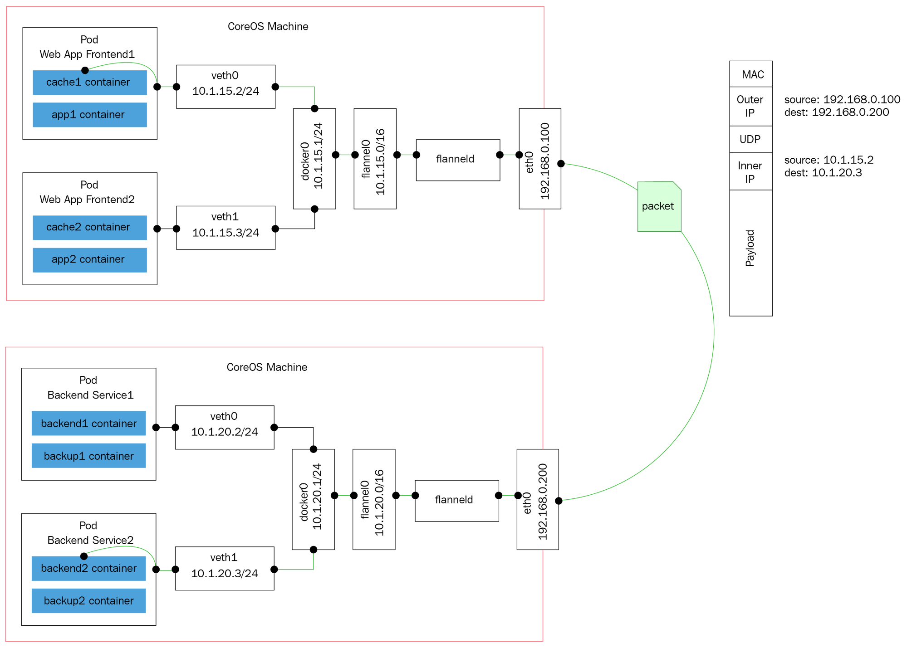
**images/chapter 10 - flannel.png**

Other backends include the following:

- vxlan: Uses in-kernel VXLAN to encapsulate the packets.
- host-gw: Creates IP routes to subnets via remote machine IPs. Note that this requires direct layer2 connectivity between hosts running Flannel.
- aws-vpc: Creates IP routes in an Amazon VPC route table.
- gce: Creates IP routes in a Google compute engine network.
- alloc: Only performs subnet allocation (no forwarding of data packets).
- ali-vpc: Creates IP routes in an alicloud VPC route table.

## Calico project

Calico is a versatile virtual networking and network security solution for containers. Calico can integrate with all the primary container orchestration frameworks
and runtimes:

- Kubernetes (CNI plugin)
- Mesos (CNI plugin)
- Docker (libnework plugin)
- OpenStack (Neutron plugin)

Calico can also be deployed on-premises or on public clouds with its full feature set. Calico's network policy enforcement can be specialized for each workload and make sure that traffic is controlled precisely and packets always go from their source to vetted destinations. Calico can map automatically network policy concepts from orchestration platforms to its own network policy. The reference implementation of Kubernetes' network policy is Calico. Calico can be deployed together with Flannel utilizing Flannel networking layer and Calico's network policy facilities. 

## Romana

Romana is a modern cloud-native container networking solution. It operates at layer 3, taking advantage of standard IP address management techniques. Whole networks can become the unit of isolation as Romana uses Linux hosts to create gateways and routes to the networks. Operating at layer 3 level means that no encapsulation is needed. Network policy is enforced as a distributed firewall across all endpoints and services. Hybrid deployments across cloud platforms and on-premises deployments are easier as there is no need to configure virtual overlay networks. New Romana virtual IPs allow on-premise users to expose services on layer 2 LANs via external IPs and service specs.

Some of the benefits of using real routable IP addresses are:

- Performance: Traffic is forwarded and processed by hosts and network equipment at full speed, no cycles are spent encapsulating packets.
- Scalability: Native, routed IP networking offers tremendous scalability, as demonstrated by the Internet itself. Romana’s use of routed IP addressing for endpoints means that no time, CPU or memory intensive tunnels or other encapsulation needs to be managed or maintained and that network equipment can run at optimal efficiency.
- Visibility: Packet traces show the real IP addresses, allowing for easier trouble shooting and traffic management.

The following diagram shows how Romana eliminates a lot of the overhead by using direct L2 routing where ToR stands for top of rack switch:

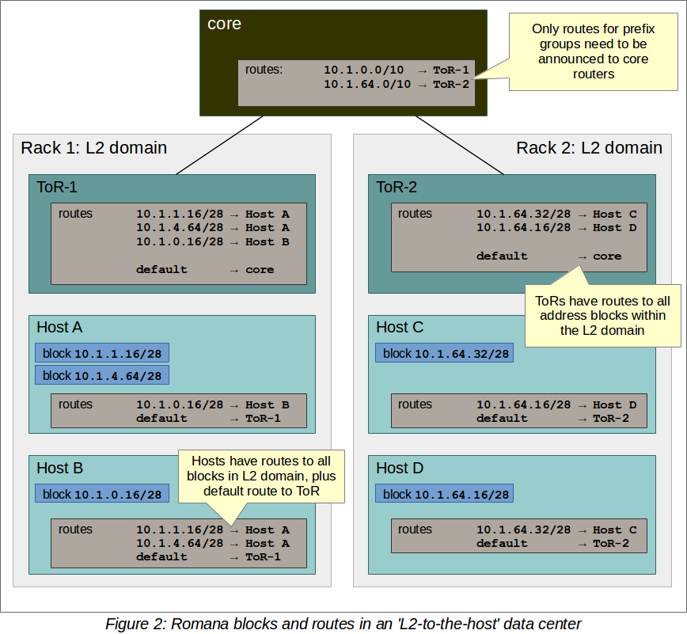
**images/chapter 10 - romana L2.png**

When networks are configured for L3 to host routing, where hots don't necessarily share an L2 segment. In this case there is no need to configure routes between hosts that use the default route to the ToR switch. Here is a diagram that illustrates it:

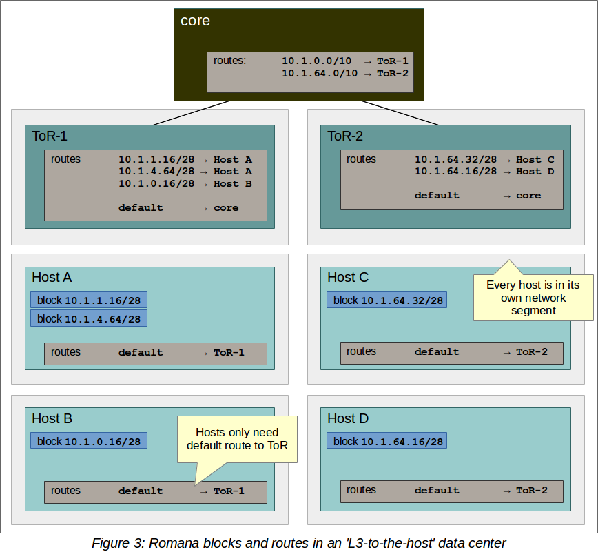
**images/chapter 10 - romana L3.png**

## Weave net

Weave net is all about ease of use and zero configuration. It uses VXLAN encapsulation under the covers and micro DNS on each node. As a developer, you operate at a higher abstraction level. You name your containers and Weave net lets you connect to them and use standard ports for services. That helps migrating existing applications into containerized applications and microservices. Weave net has a CNI plugin for interfacing with Kubernetes (and Mesos). On Kubernetes 1.4 and higher, you can integrate Weave net with Kubernetes by running a single command that deploys a DaemonSet:

```
kubectl apply -f https://git.io/weave-kube
```

The Weave net pods on every node will take care of attaching any new pod you create to the Weave network. Weave net supports the network policy API as well
providing a complete yet easy to set up solution.

# Using network policies effectively

The Kubernetes network policy is about managing network traffic to selected pods and namespaces. In a world of hundreds of microservices deployed and orchestrated, as is often the case with Kubernetes, managing networking and connectivity between pods is essential. It's important to understand that it is not primarily a security mechanism. If an attacker can reach the internal network, they will probably be able to create their own pods that comply with the network policy in place and communicate freely with other pods. In the previous section, we looked at different Kubernetes networking solutions and focused on the container networking interface. In this section, the focus is on network policy, although there are strong connections between the networking solution and how network policy is implemented on top of it.

## Understanding the Kubernetes network policy design

A network policy is a specification of how selections of pods can communicate with each other and other network endpoints. NetworkPolicy resources use labels to select pods and define whitelist rules that allow traffic to the selected pods in addition to what is allowed by the isolation policy for a given namespace.

## Network policies and CNI plugins

There is an intricate relationship between network policies and CNI plugins. Some CNI plugins implement both network connectivity and network policy, while others implement just one aspect, but they can collaborate with another CNI plugin that implements the other aspect (for example, Calico and Flannel).

## Configuring network policies

Network policies are configured via the NetworkPolicy resource. Here is a sample network policy:

```
apiVersion: extensions/v1beta1networking.k8s.io/v1
kind: NetworkPolicy
metadata:
 name: test-network-policy
 namespace: default
spec:
 podSelector:
  matchLabels:
    role: db
 ingress:
  - from:
     - namespaceSelector:
        matchLabels:
         project: awesome-project
     - podSelector:
        matchLabels:
         role: frontend
    ports:
     - protocol: tcp
       port: 6379
```

## Implementing network policies

While the network policy API itself is generic and is part of the Kubernetes API, the implementation is tightly coupled to the networking solution. That means that on each node, there is a special agent or gatekeeper that does the following:

- Intercepts all traffic coming into the node
- Verifies that it adheres to the network policy
- Forwards or rejects each request

Kubernetes provides the facilities to define and store network policies through the API. Enforcing the network policy is left to the networking solution or a dedicated network policy solution that is tightly integrated with the specific networking solution. Calico and Canal are good examples of this approach. Calico has its own networking solution and a network policy solution that works together. But it can also provide network policy enforcement on top of Flannel as part of Canal. In both cases, there is tight integration between the two pieces. The following diagram shows how the Kubernetes policy controller manages the network policies and how agents on the nodes execute it:

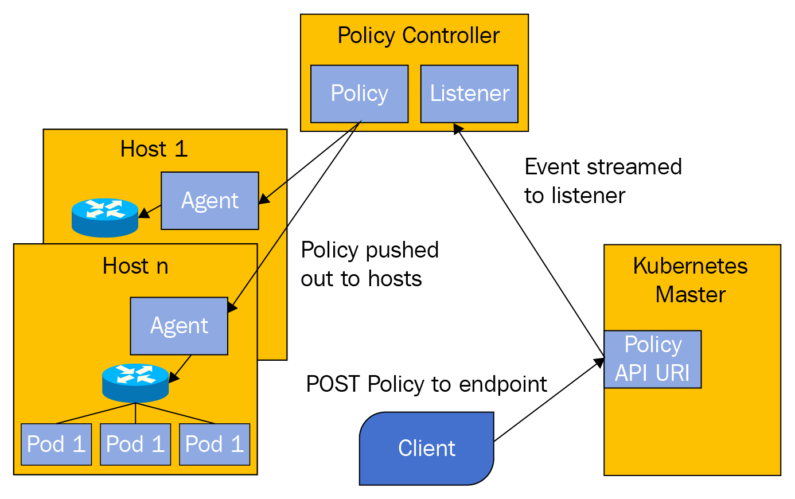
**images/chapter 10 - network policies.png**

# Load balancing options

Load balancing is a critical capability in dynamic systems such as a Kubernetes cluster. Nodes, VMs, and pods come and go, but the clients typically can't keep track of which individual entities can service their requests. Even if they could, it requires a complicated dance of managing a dynamic map of the cluster, refreshing it frequently, and handling disconnected, unresponsive, or just slow nodes. This so-called client-side load balancing is appropriate in special cases only. Server-side load balancing is a battle-tested and well-understood mechanism that adds a layer of indirection that hides the internal turmoil from the clients or consumers outside the cluster. There are options for external as well as internal load balancers. You can also mix and match and use both. The hybrid approach has its own particular pros and cons, such as performance versus flexibility.

## External load balancer

An external Load Balancer is a load balancer that runs outside the Kubernetes cluster., There must be an external load balancer provider that Kubernetes can interact with to configure the external load balancer with health checks, firewall rules, and to get the external IP address of the load balancer.

The following diagram shows the connection between the load balancer (in the cloud), the Kubernetes API server, and the cluster nodes. The external load balancer has an up-to-date picture of which pods run on which nodes and it can direct external service traffic to the right pods:


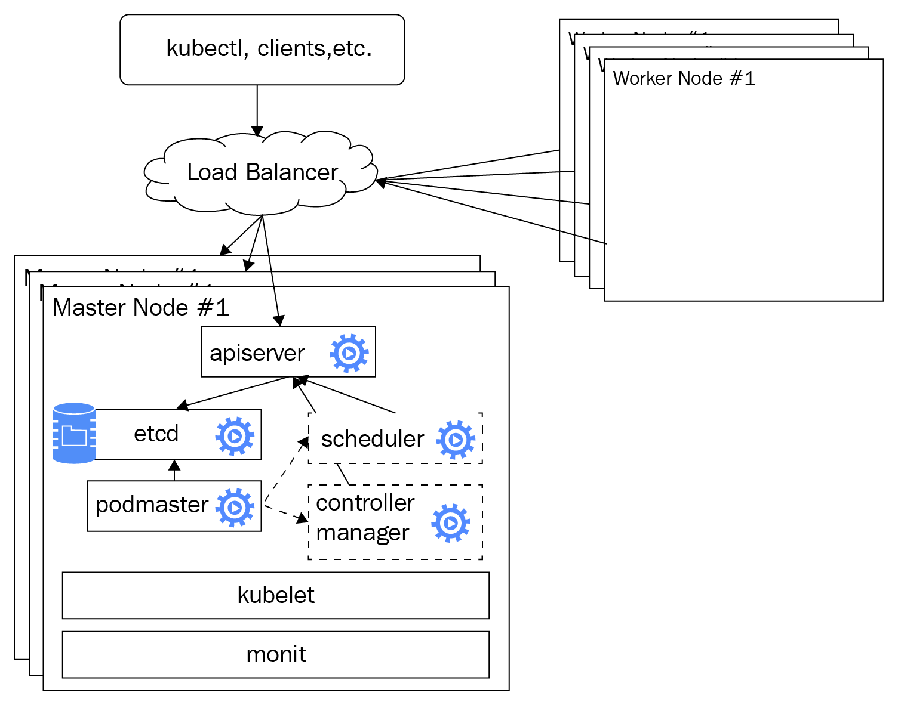
**images/chapter 10 - external load balancer.png**

### Configuring an external load balancer

The external load balancer is configured via the service configuration file or directly through Kubectl. We use a service type of LoadBalancer instead of using a service type of ClusterIP, which directly exposes a Kubernetes node as a load balancer. This depends on an external load balancer provider properly installed and configured in the cluster. Google's GKE is the most well-tested provider, but other cloud platforms provide their integrated solution on top of their cloud load balancer.

#### Via configuration file

Here is an example service configuration file that accomplishes this goal:

```
apiVersion: v1
kind: Service
metadata:
  name: api-gateway
spec:
  type: LoadBalancer
  ports:
  - port:  80
    targetPort: 5000
  selector:
    svc: api-gateway
    app: delinkcious
```

#### Via Kubectl

You may an also accomplish the same result using a direct kubectl command:

```
$ kubectl expose deployment api-gateway --port=80 --target-port=5000 --name=api-gateway --type=LoadBalancer
```

The decision whether to use a service configuration file or kubectl command is usually determined by the way you set up the rest of your infrastructure and deploy your system. configuration files are more declarative and arguably more appropriate for production usage where you want a versioned, auditable, and repeatable way to manage your infrastructure.

### Finding the load balancer IP addresses

The load balancer will have two IP addresses of interest. The internal IP address can be used inside the cluster to access the service. Clients outside the cluster will use the external IP address. It's a good practice to create a DNS entry for the external IP address. It is particularly important if you want to use TLS/SSL which require stable host names. To get both addresses, use the `kubectl describe service` command. The `IP` field denotes the internal IP address and the  `LoadBalancer Ingress` field denotes the external IP address.

```
$ kubectl describe services example-service
Name: example-service
Selector: app=example
Type: LoadBalancer
IP: 10.67.252.103
LoadBalancer Ingress: 123.45.678.9
Port: <unnamed> 80/TCP
NodePort: <unnamed> 32445/TCP
Endpoints: 10.64.0.4:80,10.64.1.5:80,10.64.2.4:80
Session Affinity: None
No events.
```

### Preserving client IP addresses

Sometimes, the service may be interested in the source IP address of the clients. Up until
Kubernetes 1.5, this information wasn't available. In Kubernetes 1.5, there is a beta feature
available only on GKE through an annotation to get the source IP address. In Kubernetes
1.7, the capability to preserve the original client IP was added to the API.

#### Specifying original client IP address preservation

You need to configure the following two fields of the service spec:

- service.spec.externalTrafficPolicy: This field determines whether the service should route external traffic to a node-local endpoint or a cluster-wide endpoint, which is the default. The `Cluster` option doesn't reveal the client source IP and might add a hop to a different node, but spreads the load well. The `Local` option keeps the client source IP and doesn't add an extra hop as long as the service type is `LoadBalancer` or `NodePort`. Its downside is it might not balance the load very well.

- service.spec.healthCheckNodePort - This field is optional. If used, then the service health check will use this port number. The default is the allocate node  port. It has an effect for services of type `LoadBalancer` whose externalTrafficPolicy is set to `Local`.

Here is an example:

```
apiVersion: v1
kind: Service
metadata:
  name: api-gateway
spec:
  type: LoadBalancer
  externalTrafficPolicy: Local
  ports:
  - port:  80
    targetPort: 5000
  selector:
    svc: api-gateway
    app: delinkcious
```


### Understanding even external load balancing

External load balancers operate at the node level; while they direct traffic to a particular pod, the load distribution is done at the node level. That means that if your service has four pods, and three of them are on node A and the last one is on node B, then an external load balancer is likely to divide the load evenly between node A and node B. This will have the three pods on node A handle half of the load (1/6 each) and the single pod on node B handle the other half of the load on its own. Weights may be added in the future to address this issue.

## Service load balancer

Service load balancing is designed for funneling internal traffic within the Kubernetes cluster and not for external load balancing. This is done by using a service type of clusterIP. It is possible to expose a service load balancer directly via a pre-allocated port by using service type of `NodePort` and use it as an external load balancer, but it wasn't designed for that use case. Desirable features such as SSL termination and HTTP caching will not be readily available.

The following diagram shows how the service load balancer (the yellow clouds) can route traffic to one of the backend pods it manages (via labels of course):

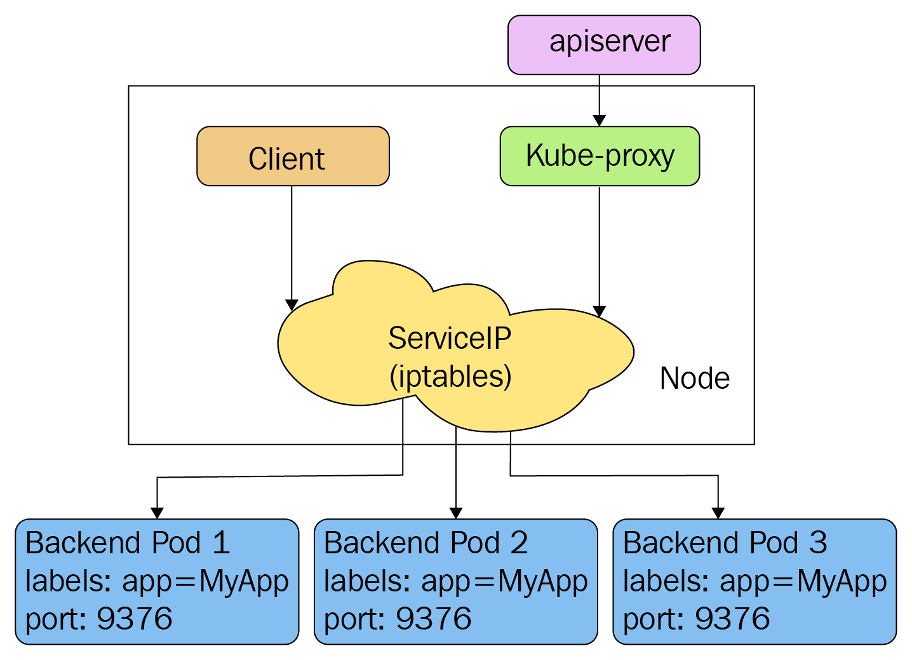
**images/chapter 10 - service load balancer.png**

## Ingress

Ingress in Kubernetes is at its core a set of rules that allow inbound connections to reach cluster services. In addition, some ingress controllers support the following:

- Connection algorithms
- Request limits
- URL rewrites and redirects
- TCP/UDP load balancing
- SSL termination
- Access control and authorization

Ingress is specified using an `Ingress` resource and serviced by an ingress controller. It's important to note that ingress is still in beta (since Kubernetes 1.1) and it doesn't surface yet all the necessary capabilities. Here is an example of an ingress resource that manages traffic into two services. The rules map the externally visible http://foo.bar.com/foo to the s1 service and http://foo.bar.com/bar to the s2 service:

```
apiVersion: extensions/v1beta1
kind: Ingress
metadata:
  name: test
spec:
  rules:
  - host: foo.bar.com
    http:
      paths:
      - path: /foo
        backend:
          serviceName: s1
          servicePort: 80
      - path: /bar
        backend:
          serviceName: s2
          servicePort: 80
```

There are two official ingress controllers right now. One of them is an L7 ingress controller for GCE only, the other is a more general-purpose Nginx ingress controller that lets you
configure the Nginx web server through a ConfigMap. The NGNIX ingress controller is very sophisticated and brings to bear a lot of features that are not available yet through the
ingress resource directly. It uses the endpoints API to directly forward traffic to pods. It supports Minikube, GCE, AWS, Azure, and bare-metal clusters. For more details check out:
 
https://github.com/kubernetes/ingress-nginx

However, there are many more ingress controllers that may be better for your use case such as:

- Ambassador
- Traefik
- Contour
- Gloo

### HAProxy

We discussed using a cloud provider external load balancer using service type LoadBalancer and using the internal service load balancer inside the cluster using ClusterIP. If we want a custom external load balancer we can create a custom external load balancer provider and use LoadBalancer or use the third service type, NodePort. High-Availability (HA) Proxy is a mature and battle-tested load balancing solution. It is considered one the best choices for implementing external load balancing with on-premises clusters. This can be done in several ways:

- Utilize NodePort and carefully manage port allocations
- Implement custom load balancer provider interface
- Run HAProxy inside your cluster as the only target of your frontend servers at the edge of the cluster (load balanced or not)

You can use all these approaches with HAProxy. Regardless, it is still recommended to use ingress objects. The `service-loadbalancer` project is a community project that implemented a load balancing solution on top of HAProxy. You can find it here: https://github.com/kubernetes/contrib/tree/master/service-loadbalancer.

#### Utilizing the NodePort

Each service will be allocated a dedicated port from a predefined range. This usually is a high range such as 30,000 and up to avoid clashing with other applications using low known ports. HAProxy will run outside the cluster in this case and it will be configured with the correct port for each service. Then it can just forward any traffic to any nodes and Kubernetes via the internal service, and the load balancer will route it to a proper pod (double load balancing). This is of course sub-optimal because it introduces another hop. The way to circumvent it is to query the Endpoints API and dynamically manage for each service the list of its backend pods and directly forward traffic to the pods.

#### Custom load balancer provider using HAProxy

This approach is a little more complicated, but the benefit is that it is better integrated with Kubernetes and can make the transition to/from on-premises
from/to the cloud easier.

#### Running HAProxy Inside the Kubernetes cluster

In this approach, we use the internal HAProxy load balancer inside the cluster. There may be multiple nodes running HAProxy and they will share the same configuration to map incoming requests and load balance them across the backend servers
(the Apache servers in the following diagram):

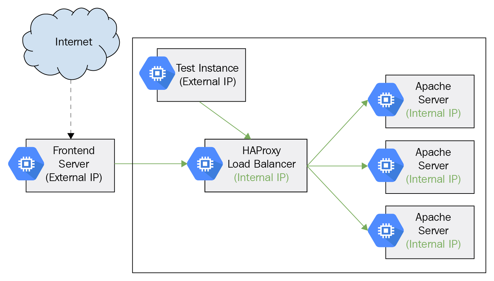
**images/chapter 10 - ha proxy.png**

HAProxy also developed its own Ingress Controller that is Kubernetes aware. This is arguably the most streamlined way to utilize HAProxy in your Kubernetes cluster. Here some of the capabilities you gain when using the HAProxy ingress controller:

- Streamlined integration with the HAProxy load balancer
- SSL termination
- Rate limiting
- IP whitelisting
- Multiple load balancing algorithms: round-robin, least connections, URL hash and random
- Dashboard that shows the health of your pods, current request rates, response times, etc
- Traffic overload protection 

  
### MetalLB

MetalLB also provides a load balancer solution for bare metal clusters. It is highly configurable and supports multiple modes such as L2 and BGP. I had success configuring it even for minikube.

For more details check out:

https://metallb.universe.tf  

### Keepalived VIP

Keepalived Virtual IP (VIP) is not necessarily a load balancing solution of its own.

It can be a complement to the Nginx ingress controller or the HAProxy-based service LoadBalancer. The main motivation is that pods move around in Kubernetes including your load balancer(s). That creates a problem for clients outside the network that require a stable endpoint. DNS is often not good enough due to performance issues. Keepalived provides a high-performance virtual IP address that can serve as the address to the Nginx ingress controller or the HAProxy load balancer. Keepalived utilizes core Linux networking facilities such as IPVS (IP virtual server) and implements high availability via **Virtual Redundancy Router Protocol** ( **VRRP** ). Everything runs at layer 4 (TCP/UDP). It takes some effort and attention to detail to configure it. Luckily, there is a Kubernetes contrib project that can get you started:https://github.com/kubernetes/contrib/tree/master/keepalived-vip.

### Træfic

Træfic is a modern HTTP reverse proxy and load balancer. It was designed to support  microservices. It works with many backends including Kubernetes to manage its configuration automatically and dynamically. This is a game changer compared to traditional load balancers. It has an impressive list of features:

- It's fast
- Single Go executable
- Tiny official docker image
- Rest API
- Hot-reloading of configuration. No need to restart the process
- Circuit breakers, retry
- Round Robin, rebalancer load-balancers load-balancers load-balancers
- Metrics (Rest, Prometheus, Datadog, Statsd, InfluxDB)Statsd, InfluxDB), InfluxDB)
- Clean AngularJS Web UI Web UI Web UI
- Websocket, HTTP/2, GRPC ready, HTTP/2, GRPC ready, HTTP/2, GRPC ready
- Access Logs (JSON, CLF)
- Let's Encrypt support (Automatic HTTPS with renewal)
- High Availability with cluster mode

Load balancing on Kubernetes is an exciting area. It offers many options for both north-south and east-west load balancing. Now, that we covered load balancing in detail let's dive deep into the CNI plugins and how they are implemented.

# Writing your own CNI plugin

In this section, we will look at what it takes to actually write your own CNI plugin. First, we will look at the simplest plugin possible – the loopback plugin. Then, we will examine the plugin skeleton that implements most of the boilerplate associated with writing a CNI plugin. Finally, we will review the implementation of the bridge plugin. Before we dive in, here is a quick reminder of what a CNI plugin is:

- A CNI plugin is an executable
- It is responsible for connecting new containers to the network, assigning unique IP addresses to CNI containers, and taking care of routing
- A container is a network namespace (in Kubernetes, a pod is a CNI container)
- Network definitions are managed as JSON files, but stream to the plugin via standard input (no files are being read by the plugin)
- Auxiliary information can be provided via environment variables

## First look at the loopback plugin

The loopback plugin simply adds the loopback interface. It is so simple that it doesn't require any network configuration information. Most CNI plugins are implemented in Golang and the loopback CNI plugin is no exception. The full source code is available here: https://github.com/containernetworking/plugins/blob/master/plugins/main/loopback

There are multiple packages from the container networking project on GitHub that provide many of the building blocks necessary to implement CNI plugins and the netlink package for adding interfaces, removing interfaces,  setting IP addresses and setting routes. Let's look at the imports of the loopback.go file first:

```
package main

import (
	"encoding/json"
	"errors"
	"fmt"
	"net"

	"github.com/vishvananda/netlink"

	"github.com/containernetworking/cni/pkg/skel"
	"github.com/containernetworking/cni/pkg/types"
	"github.com/containernetworking/cni/pkg/types/current"
	"github.com/containernetworking/cni/pkg/version"

	"github.com/containernetworking/plugins/pkg/ns"
	bv "github.com/containernetworking/plugins/pkg/utils/buildversion"
)
```

Then, the plugin implements two commands, `cmdAdd` and `cmdDel`, which are called when a container is added to or removed from the network. Here is the `add` command, which does all the heavy lifting:

```
func cmdAdd(args *skel.CmdArgs) error {
	conf, err := parseNetConf(args.StdinData)
	if err != nil {
		return err
	}

	var v4Addr, v6Addr *net.IPNet

	args.IfName = "lo" // ignore config, this only works for loopback
	err = ns.WithNetNSPath(args.Netns, func(_ ns.NetNS) error {
		link, err := netlink.LinkByName(args.IfName)
		if err != nil {
			return err // not tested
		}

		err = netlink.LinkSetUp(link)
		if err != nil {
			return err // not tested
		}
		v4Addrs, err := netlink.AddrList(link, netlink.FAMILY_V4)
		if err != nil {
			return err // not tested
		}
		if len(v4Addrs) != 0 {
			v4Addr = v4Addrs[0].IPNet
			// sanity check that this is a loopback address
			for _, addr := range v4Addrs {
				if !addr.IP.IsLoopback() {
					return fmt.Errorf("loopback interface found with non-loopback address %q", addr.IP)
				}
			}
		}

		v6Addrs, err := netlink.AddrList(link, netlink.FAMILY_V6)
		if err != nil {
			return err // not tested
		}
		if len(v6Addrs) != 0 {
			v6Addr = v6Addrs[0].IPNet
			// sanity check that this is a loopback address
			for _, addr := range v4Addrs {
				if !addr.IP.IsLoopback() {
					return fmt.Errorf("loopback interface found with non-loopback address %q", addr.IP)
				}
			}
		}

		return nil
	})
	if err != nil {
		return err // not tested
	}

	var result types.Result
	if conf.PrevResult != nil {
		// If loopback has previous result which passes from previous CNI plugin,
		// loopback should pass it transparently
		result = conf.PrevResult
	} else {
		loopbackInterface := &current.Interface{Name: args.IfName, Mac: "00:00:00:00:00:00", Sandbox: args.Netns}
		r := &current.Result{CNIVersion: conf.CNIVersion, Interfaces: []*current.Interface{loopbackInterface}}

		if v4Addr != nil {
			r.IPs = append(r.IPs, &current.IPConfig{
				Version:   "4",
				Interface: current.Int(0),
				Address:   *v4Addr,
			})
		}

		if v6Addr != nil {
			r.IPs = append(r.IPs, &current.IPConfig{
				Version:   "6",
				Interface: current.Int(0),
				Address:   *v6Addr,
			})
		}

		result = r
	}

	return types.PrintResult(result, conf.CNIVersion)
}
```

The core of this function is setting the interface name to lo (for loopback) and adding the link to the container's network namespace. It supports both IPv4 as well as IPv6.

The `del` command does the opposite and is much simpler:

```
func cmdDel(args *skel.CmdArgs) error {
	if args.Netns == "" {
		return nil
	}
	args.IfName = "lo" // ignore config, this only works for loopback
	err := ns.WithNetNSPath(args.Netns, func(ns.NetNS) error {
		link, err := netlink.LinkByName(args.IfName)
		if err != nil {
			return err // not tested
		}

		err = netlink.LinkSetDown(link)
		if err != nil {
			return err // not tested
		}

		return nil
	})
	if err != nil {
		return err // not tested
	}

	return nil
}
```

The main function simply calls PluginMain() function of the skel package, passing the command functions. The skel package will take care of running the CNI plugin executable and will invoke the cmdAdd and delCmd functions at the right time:

```
func main() {
	skel.PluginMain(cmdAdd, cmdCheck, cmdDel, version.All, bv.BuildString("loopback"))
}
```

### Building on the CNI plugin skeleton

Let's explore the `skel` package and see what it does under the covers. The `PluginMain()` entry point,  is responsible for invoking `PluginMainWithError()`, catching errors, printing them to standard output, and exiting:

```
func PluginMain(cmdAdd, cmdCheck, cmdDel func(_ *CmdArgs) error, versionInfo version.PluginInfo, about string) {
	if e := PluginMainWithError(cmdAdd, cmdCheck, cmdDel, versionInfo, about); e != nil {
		if err := e.Print(); err != nil {
			log.Print("Error writing error JSON to stdout: ", err)
		}
		os.Exit(1)
	}
}
```

The `PluginErrorWithMain()` function instantiates a dispatcher, sets it up with all the I/O streams and the environment, and invokes its internal `pluginMain()` method:

```
func PluginMainWithError(cmdAdd, cmdCheck, cmdDel func(_ *CmdArgs) error, versionInfo version.PluginInfo, about string) *types.Error {
	return (&dispatcher{
		Getenv: os.Getenv,
		Stdin:  os.Stdin,
		Stdout: os.Stdout,
		Stderr: os.Stderr,
	}).pluginMain(cmdAdd, cmdCheck, cmdDel, versionInfo, about)
}
```

Here is, finally, the main logic of the skeleton. It gets the cmd arguments from the environment (which includes the configuration from standard input), detects which cmd is invoked, and calls the appropriate plugin function (cmdAdd or cmdDel). It can also return version information:

```
func (t *dispatcher) pluginMain(cmdAdd, cmdCheck, cmdDel func(_ *CmdArgs) error, versionInfo version.PluginInfo, about string) *types.Error {
	cmd, cmdArgs, err := t.getCmdArgsFromEnv()
	if err != nil {
		// Print the about string to stderr when no command is set
		if err.Code == types.ErrInvalidEnvironmentVariables && t.Getenv("CNI_COMMAND") == "" && about != "" {
			_, _ = fmt.Fprintln(t.Stderr, about)
			return nil
		}
		return err
	}

	if cmd != "VERSION" {
		if err = validateConfig(cmdArgs.StdinData); err != nil {
			return err
		}
		if err = utils.ValidateContainerID(cmdArgs.ContainerID); err != nil {
			return err
		}
		if err = utils.ValidateInterfaceName(cmdArgs.IfName); err != nil {
			return err
		}
	}

	switch cmd {
	case "ADD":
		err = t.checkVersionAndCall(cmdArgs, versionInfo, cmdAdd)
	case "CHECK":
		configVersion, err := t.ConfVersionDecoder.Decode(cmdArgs.StdinData)
		if err != nil {
			return types.NewError(types.ErrDecodingFailure, err.Error(), "")
		}
		if gtet, err := version.GreaterThanOrEqualTo(configVersion, "0.4.0"); err != nil {
			return types.NewError(types.ErrDecodingFailure, err.Error(), "")
		} else if !gtet {
			return types.NewError(types.ErrIncompatibleCNIVersion, "config version does not allow CHECK", "")
		}
		for _, pluginVersion := range versionInfo.SupportedVersions() {
			gtet, err := version.GreaterThanOrEqualTo(pluginVersion, configVersion)
			if err != nil {
				return types.NewError(types.ErrDecodingFailure, err.Error(), "")
			} else if gtet {
				if err := t.checkVersionAndCall(cmdArgs, versionInfo, cmdCheck); err != nil {
					return err
				}
				return nil
			}
		}
		return types.NewError(types.ErrIncompatibleCNIVersion, "plugin version does not allow CHECK", "")
	case "DEL":
		err = t.checkVersionAndCall(cmdArgs, versionInfo, cmdDel)
	case "VERSION":
		if err := versionInfo.Encode(t.Stdout); err != nil {
			return types.NewError(types.ErrIOFailure, err.Error(), "")
		}
	default:
		return types.NewError(types.ErrInvalidEnvironmentVariables, fmt.Sprintf("unknown CNI_COMMAND: %v", cmd), "")
	}

	if err != nil {
		return err
	}
	return nil
}
```

The loopback plugin is one of the simplest CNI plugins. Let's check out the bridge plugin.

### Reviewing the bridge plugin

The bridge plugin is more substantial. Let's look at some of the key parts of its implementation. The full source code is available here:

https://github.com/containernetworking/plugins/tree/master/plugins/main/bridge

The plugin defines in the bridge.go file a network configuration struct with the following fields:

```
type NetConf struct {
	types.NetConf
	BrName       string `json:"bridge"`
	IsGW         bool   `json:"isGateway"`
	IsDefaultGW  bool   `json:"isDefaultGateway"`
	ForceAddress bool   `json:"forceAddress"`
	IPMasq       bool   `json:"ipMasq"`
	MTU          int    `json:"mtu"`
	HairpinMode  bool   `json:"hairpinMode"`
	PromiscMode  bool   `json:"promiscMode"`
	Vlan         int    `json:"vlan"`
}
```

We will not cover what each parameter does and how it interacts with the other parameters due to space limitations. The goal is to understand the flow and have a starting point if you want to implement your own CNI plugin. The configuration is loaded from JSON via the loadNetConf() function. It is called at the beginning of the cmdAdd() and cmdDel() functions:

```
n, cniVersion, err := loadNetConf(args.StdinData)
```

Here is the core of the `cmdAdd()` that uses information from network configuration, sets up the bridge and sets up a veth:

```
br, brInterface, err := setupBridge(n)
	if err != nil {
		return err
	}

	netns, err := ns.GetNS(args.Netns)
	if err != nil {
		return fmt.Errorf("failed to open netns %q: %v", args.Netns, err)
	}
	defer netns.Close()

	hostInterface, containerInterface, err := setupVeth(netns, br, args.IfName, n.MTU, n.HairpinMode, n.Vlan)
	if err != nil {
		return err
	}
```

Later the function handles the L3 mode with its multiple cases:

```
    // Assume L2 interface only
	result := &current.Result{CNIVersion: cniVersion, Interfaces: []*current.Interface{brInterface, hostInterface, containerInterface}}
    if isLayer3 {
		// run the IPAM plugin and get back the config to apply
		r, err := ipam.ExecAdd(n.IPAM.Type, args.StdinData)
		if err != nil {
			return err
		}

		// release IP in case of failure
		defer func() {
			if !success {
				ipam.ExecDel(n.IPAM.Type, args.StdinData)
			}
		}()

		// Convert whatever the IPAM result was into the current Result type
		ipamResult, err := current.NewResultFromResult(r)
		if err != nil {
			return err
		}

		result.IPs = ipamResult.IPs
		result.Routes = ipamResult.Routes

		if len(result.IPs) == 0 {
			return errors.New("IPAM plugin returned missing IP config")
		}

		// Gather gateway information for each IP family
		gwsV4, gwsV6, err := calcGateways(result, n)
		if err != nil {
			return err
		}

		// Configure the container hardware address and IP address(es)
		if err := netns.Do(func(_ ns.NetNS) error {
            ...
		}

		if n.IsGW {
            ...
		}

		if n.IPMasq {
            ...
		}
	}
```

Finally, it updated the MAC address that may have changed and returns the results:

```
	// Refetch the bridge since its MAC address may change when the first
	// veth is added or after its IP address is set
	br, err = bridgeByName(n.BrName)
	if err != nil {
		return err
	}
	brInterface.Mac = br.Attrs().HardwareAddr.String()

	result.DNS = n.DNS

	// Return an error requested by testcases, if any
	if debugPostIPAMError != nil {
		return debugPostIPAMError
	}

	success = true

	return types.PrintResult(result, cniVersion)
```
 
This is just part of the full implementation. There is also route setting and hardware IP allocation. If you plan to write your own CNI plugin I encourage you to pursue the full source code, which is quite extensive, to get the full picture.

# Summary

In this chapter, we covered a lot of ground. Networking is such a vast topic as there are so many combinations of hardware, software, operating environments, and user skills. It is a very complicated endeavor to come up with a comprehensive networking solution that is both robust, secure, performs well, and is easy to maintain. For Kubernetes clusters, the cloud providers mostly solve these issues. But if you run on-premise clusters or need a tailor-made solution, you get a lot of options to choose from. Kubernetes is a very flexible platform, designed for extension. Networking in particular is totally pluggable. The main topics we discussed were the Kubernetes networking model (flat address space where pods can reach other and shared localhost between all containers inside a pod), how lookup and discovery work, the Kubernetes network plugins, various networking solutions at different levels of abstraction (a lot of interesting variations), using network policies effectively to control the traffic inside the cluster, the spectrum of load balancing solutions, and finally we looked at how to write a CNI plugin by dissecting a real-world implementation.

At this point, you are probably overwhelmed, especially if you're not a subject-matter expert. None the less you should have a solid grasp of the internals of Kubernetes networking, be aware of all the interlocking pieces required to implement a fully-fledged solution, and can craft your own solution based on trade-offs that make sense for your system and your skill level.

In _Chapter 11_, _Running Kubernetes on Multiple Clouds and Cluster Federation_, we will go even bigger and look at running Kubernetes on multiple clusters, cloud providers, and federation. This is an important part of the Kubernetes story for geo-distributed deployments and ultimate scalability. Federated Kubernetes clusters can exceed local limitations, but they bring a whole slew of challenges too.
