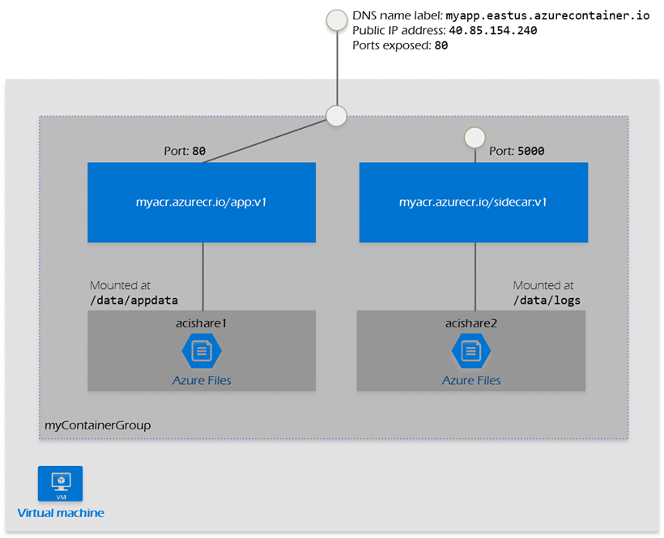
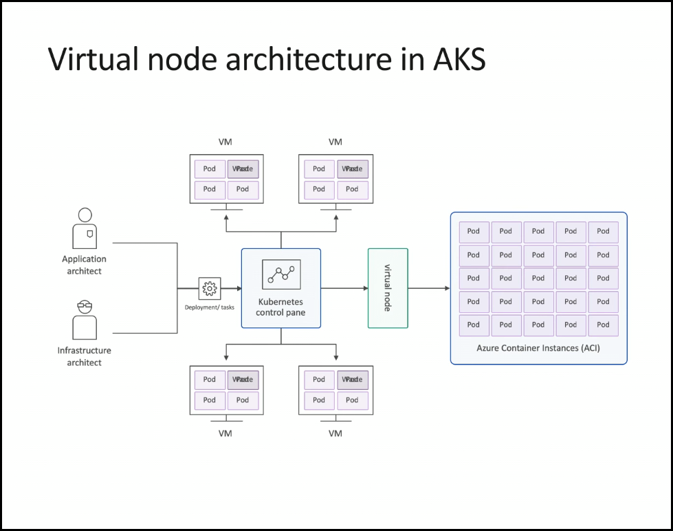
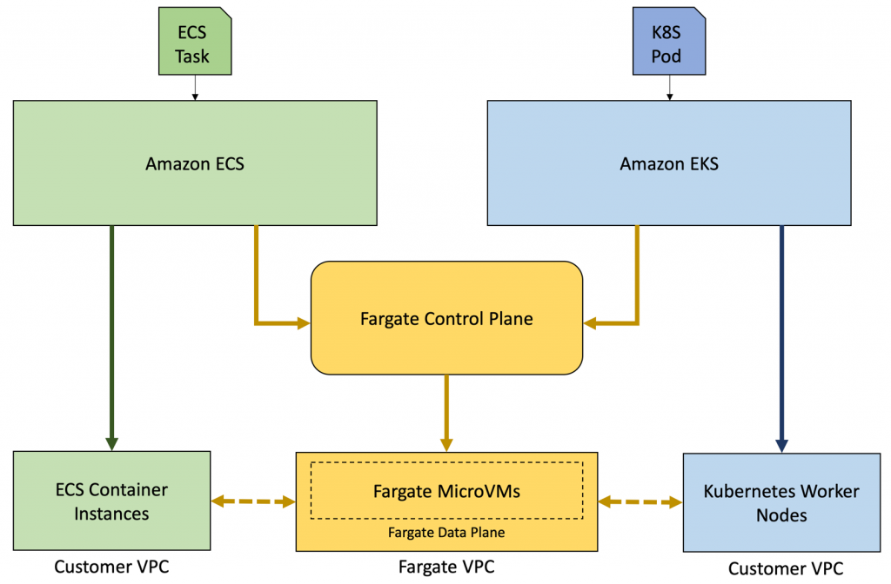
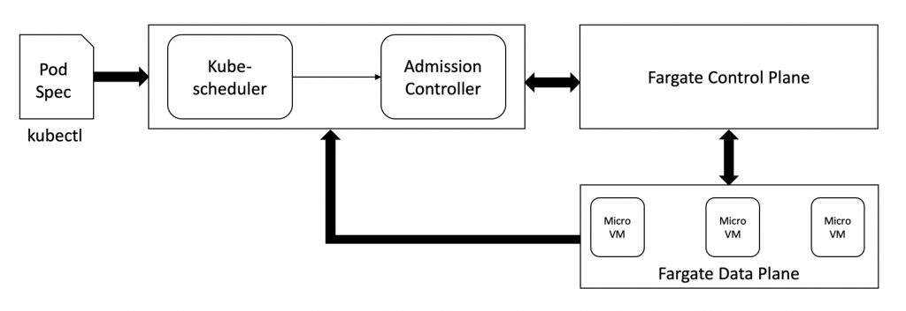
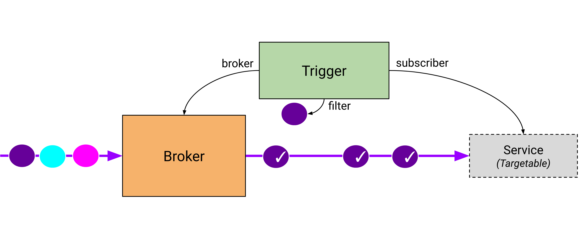
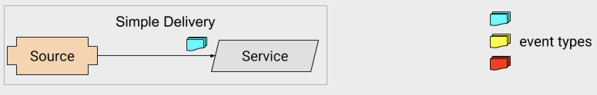
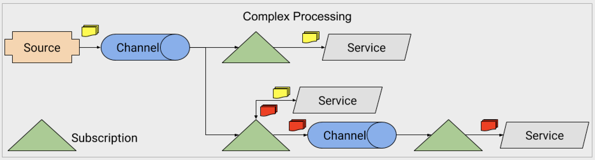
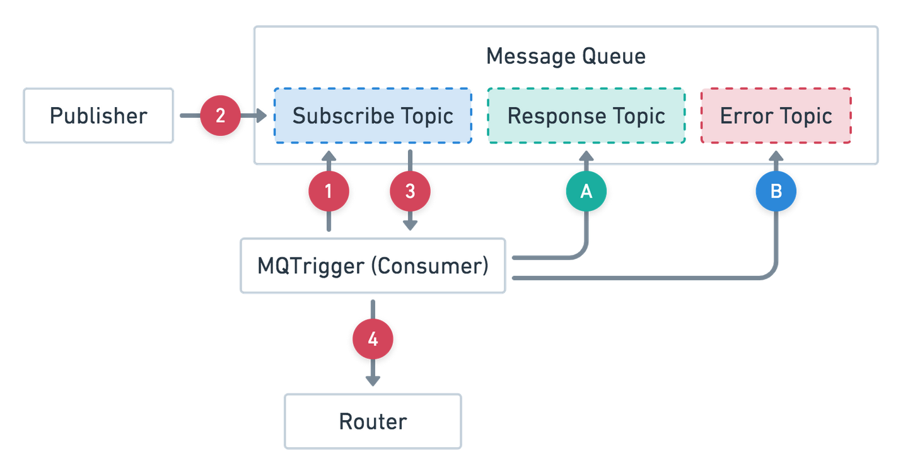
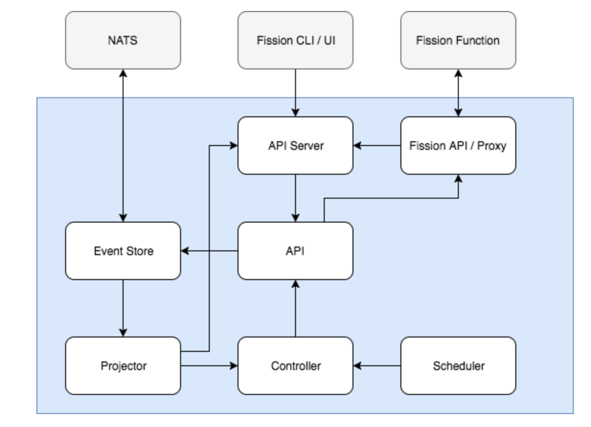
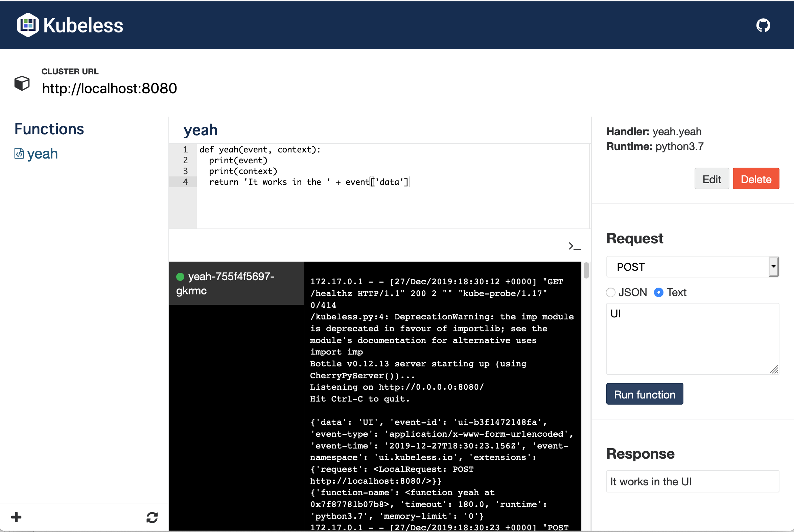

# Serverless computing on Kubernetes

In this chapter, we will explore the fascinating world of serverless computing in the cloud. The term "serverless" is getting a lot of attention, but it is both a misnomer used to describe two different paradigms. A true serverless application, runs as a web application in the user's browser or a mobile app and only interacts with external services. The types of serverless systems we build on Kubernetes are different. We will explain exactly what serverless means on Kubernetes and how it relates to other serverless solutions. We will cover serverless cloud solutions, introduce Knative - the Kubernetes foundation for functions as a service - and dive into Kubernetes FaaS (function as a service) framework.

Let's start by clarifying what serverless is all about.  

# Understanding Serverless computing

OK. Let's get it out of the way. The servers are still there. The term "serverless" means that you don't have to provision, configure and manage the servers yourself. Public cloud platforms were a real paradigm shift by eliminating the need for dealing with physical hardware, data centers and networking. But, even on the cloud it takes a lot of work and knowhow to provision create machine images, provision instances, configure them, upgrade and patch operating systems, define network policies and manage certificates and access control. With serverless computing large chunks of this important but tedious work go away. The allure of serverless is multi-pronged:

- A whole category of problems dealing with provisioning goes away
- Capacity planning is a non-issue
- You pay only for what you use

You lose some control because you have to live with the choices made by the cloud provider. But, there is a lot of customization you can take advantage of and for critical parts of the system. Of course, where you need total control you can still manage your own infrastructure. 

The bottom line is that the serverless approach is not just hype, but provides real benefits. Let's examine the two flavors of serverless 

## Running long-running services on "serverless" infrastructure

Long-running services are the bread and butter of micro-service based distributed systems. These services must be always up, waiting to service requests and can be scaled up and down to match the volume. In the traditional cloud you had to provision enough capacity to handle spikes and changing volumes, which often led to over-provisioning or increased delays in processing when requests were waiting for under-provisioned services.

Serverless services address this issue with zero effort from developers and relatively little effort from operators. The idea is that you just mark your service to run on the serverless infrastructure, you configure it with some parameters such as the expected CPU, memory and limits to scaling. The service appears to other services and clients just like a traditional service you deployed on infrastructure you provisioned yourself.

Services that fall into this category have the following characteristics:

- Always running (never scale down to zero).
- Expose multiple endpoints (such as HTTP and gRPC).
- Require that you implement the request handling and routing yourself
- Can listen to events instead or in addition to exposing endpoints
- Service instances can maintain in-memory caches, long-term connections, and sessions.
- In Kubernetes, microservices are represented directly by the Service resource.      

Now, let's look at function as a service.

## Running functions as a service on "serverless" infrastructure

Even in the largest distributed systems not every workload handles multiple requests per second. There are always tasks that need to run in response to relatively infrequent events, on schedule or invoked in ad-hoc manner. It's possible to have a long-running service just sitting there twiddling its virtual thumbs and processing a request every now and then. But, that's wasteful. You can try to hitch such tasks to other long-running services, but that creates very undesirable coupling, which goes against the philosophy of micro-services.

A much better approach is to treat such tasks separately and provide different abstractions and tooling to address them. Kuberentes has the concept of a Job and a CronJob object. Those address some of issues that FaaS tackle, but not completely.

A function as a service solution is often much simpler to get up and running compared to a traditional service. The developers may only need to write the code of a function. The FaaS solution will take care of the rest:

- Building and packaging
- Exposing as an endpoint
- Trigger based on events
- Provision and scale automatically
- Monitor and provides logs and metrics   

Here are some of the characteristics of function as a service solution:

- Runs on demand (Can scale down to zero).
- Exposes a single endpoint (usually HTTP).
- Can be triggered by events or get an automatic endpoint.
- Often has severe limitations on resource usage and maximum runtime.
- Sometimes, it might have a cold start (that is, when scaling
up from zero).
 
  
# Serverless Kubernetes in the Cloud

All the major cloud provider now supports serverless long-running services for Kubernetes. Surprisingly, Microsoft Azure was the first to offer it. Kubernetes interacts with nodes via the kubelet. The basic idea of serverless infrastructure is that instead of provisioning actual nodes (physical or VMs) a virtual node is created in some fashion. Different cloud providers use different solutions to accomplish this goal. 

## Don't forget the cluster auto scaler

Before jumping into cloud provider specific solutions make sure to check out the Kubernetes-native option of the cluster autoscaler. The cluster auto-scaler scales the nodes in your cluster and it doesn't suffer from the limitations of some of the other solutions. All the Kubernetes scheduling and control mechanisms work out of the box with cluster autoscaler because it just automates adding and removing regular nodes from your cluster. No exotic and provider specific capabilities are used.

But, you may have good reasons to prefer more provider-integrated solution. For example, Fargate runs inside [Firecracker](https://github.com/firecracker-microvm/firecracker) which is a lightweight VM with strong security boundaries (as a sidenote Lambda functions run on Firecracker too). Similarly Google cloud run tuns in gVisor.

## Azure AKS + Azure Container Instances

Azure supported ACI (Azure Container Instances) for a long time. ACI is not Kubernetes-specific. It allows running on-demand containers on Azure in a managed environment. It is similar in some regards to Kubernetes, but is Azure-specific. It even has the concept of a container group, which is similar to a pod. All containers in a container group will be scheduled to run on the same host machine.

  

The integration with Kubernetes/AKS is modeled as bursting from AKS to ACI. The guiding principle here is that for your known workloads you should provision your own nodes, but if there are spikes then the extra load will burst dynamically to ACI. This approach is considered more economical because running on ACI is more expansive than provisioning your own nodes. AKS uses the [virtual kubelet](https://virtual-kubelet.io/) CNCF project to integrate your Kubernetes cluster with the infinite capacity of ACI. It works by adding a virtual node to your cluster backed by ACI that appears on the Kubernetes side as a single node with infinite resources.



Let's see how AWS does it with EKS and Fargate.

## AWS EKS + Fargate

AWS released [Fargate](https://aws.amazon.com/fargate/) in 2018, which is similar to Azure ACI and lets you run containers in a managed environment. Originally, you could use Fargate on EC2 or ECS (AWS proprietary container orchestration). In the big AWS conference Re:invent 2019 Fargate became generally available on EKS too. That means that you now have a fully managed Kubernetes solution, which is truly serverless. EKS takes care of control plane and Fargate takes care of worker nodes for you.


**images/chapter 12 - fargate.png**

EKS + Fargate models the interaction between your Kubernetes cluster and Fargate differently than AKS + ACI. While on AKS a single infinite virtual node represented the entire capacity of ACI on EKS each pod gets its own virtual node. But, those nodes are not real nodes of course. Fargate has its own control plane and data plane that supports EC2, ECS as well as EKS. The EKS-Fargate integration is done via a set of custom Kubernetes controllers that watch for pods that need to be deployed to a particular namespace or have specific labels and forwards those pods to be scheduled by Fargate. The following diagram illustrates the workflow from EKS to 

 
**images/chapter 12 - eks fargate integration.png** 
 
 
 When working with Fargate there are several limitations you should be aware of:

- Maximum of 4 vCPU and 30Gb memory per pod.
- No support for stateful workloads that require persistent volumes or file systems.
- No Daemonsets, Privileged pods, or pods that use HostNetwork or HostPort.
- You can only use the Application Load Balancer.
  
If those limitations are too severe for you, you can try a more direct approach and utilize the virtual kubelet project to integrate Fargate into your cluster. 

What about Google - the father of Kubernetes?

## Google Cloud Run

It may come as a surprise, but Google is the Johny come lately of serverless Kubernetes. Cloud run is Google's serverless offering. It is based on Knative, which we will dissect in depth in the next section. The basic premise is that there are two flavors of Cloud Run. Plain Cloud Run is similar to ACI and Fargate. It lets you run containers in an environment fully managed by Google. Cloud for Anthos supports GKE and On-Prem lets you run containerized workloads in your GKE cluster.

Cloud for Anthos is currently the only serverless platform to allow running on custom machine types (including GPUs). Anthos Cloud run services participate in the Istio service mesh and provide a streamlined Kubernetes-native experience.

Note that while managed cloud run uses gVisor isolation, the Anthos cloud run uses standard Kubernetes isolation (container-based).

It's time to learn more about Knative.

# Knative

Kubernetes doesn't have built-in support for function as a service. As a result many solutions where developed by the community and eco-system. The goal of Knative is to provide building blocks that multiple function as a service solutions can utilize without reinventing the wheel.

But, that's not all! Knative also offers the unique capability of scaling down long-running services all the way to zero. This is a big deal. There are many use cases where you may prefer to have a long running service that can handle a lot of requests coming its way in rapid succession. In those situations it is not the best approach to fire a new function instance per request. But, when there is no traffic coming in, it's great to scale the service to zero instances, pay nothing and leave more capacity for other services that may need more resources at that time. Knative supports other important use case like load balancing based on percentages, load balancing based on metrics, blue-green deployments, canary deployments and advanced routing. It can even optionally do automatic TLS certificates as well as HTTP monitoring. Finally, Knative works with both HTTP and gRPC.

There are currently two Knative components: Knative serving and Knative eventing. There used to be also a Knative build component, but it was factored out to form the foundation of [Tekton](https://github.com/tektoncd/pipeline) - a Kubernetes-native CD project.

Let's start with Knative serving.

## Knative serving

The domain of Knative serving is running versions services on Kubernetes and routing traffic to those services. This is above and beyond standard Kubernetes services. Knative service defines several CRDs to model its domain: Service, Route, Configuration and Revision. The Service manages a Route and a Configuration. A Configuration can have multiple Revisions. The Route can route service traffic to a particular revision. Here is a diagram that illustrates the relationship between the different objects:


**images/chapter 12 - knative crds.png**

### The Knative Service object

The Knative Service combines the Kubernetes Deployment and Service into a single object. That makes a lot of sense because except for the special case of [headless services](https://kubernetes.io/docs/concepts/services-networking/service/#headless-services) there is always a deployment behind every service. 

The Service automatically manages the entire lifecycle of its workload. It is responsible for creating the route and configuration and a new revision whenever the service us updated. This is very convenient because the user just needs to deal with the Service object.

Here is the metadata for the helloworld-go Knative service:

```
$ kubectl get ksvc helloworld-go -o json | jq .metadata
{
  "annotations": {
    "serving.knative.dev/creator": "minikube-user",
    "serving.knative.dev/lastModifier": "minikube-user"
  },
  "creationTimestamp": "2019-12-25T18:44:34Z",
  "generation": 1,
  "name": "helloworld-go",
  "namespace": "default",
  "resourceVersion": "43258",
  "selfLink": "/apis/serving.knative.dev/v1/namespaces/default/services/helloworld-go",
  "uid": "d1979430-464e-49d6-bf68-bb384d1ef0b3"
}
```

And here is the spec:

```
$ kubectl get ksvc helloworld-go -o json | jq .spec
{
  "template": {
    "metadata": {
      "creationTimestamp": null
    },
    "spec": {
      "containerConcurrency": 0,
      "containers": [
        {
          "env": [
            {
              "name": "TARGET",
              "value": "Yeah, it works!!!"
            }
          ],
          "image": "gcr.io/knative-samples/helloworld-go",
          "name": "user-container",
          "readinessProbe": {
            "successThreshold": 1,
            "tcpSocket": {
              "port": 0
            }
          },
          "resources": {}
        }
      ],
      "timeoutSeconds": 300
    }
  },
  "traffic": [
    {
      "latestRevision": true,
      "percent": 100
    }
  ]
}
```

Note the `traffic` section of the spec that directs 100% of requests to the latest revision. This is what determines the Route CRD. 

### The Knative Route object

The Knative Route object allows directing percentage of incoming requests to particular revisions. The default is 100% to the latest revision, but you can change it. This allows advanced deployment scenarios like blue-green deployments as well as canary deployments.

For example, this is how to switch from blue to green when deploying a new version. Start with 100% going to current revision and 0% going to the new revision (tagged v2):

```
apiVersion: serving.knative.dev/v1
kind: Route
metadata:
  name: blue-green-demo # Route name is unchanged, since we're updating an existing Route
  namespace: default
spec:
  traffic:
    - revisionName: blue-green-demo-lcfrd
      percent: 100 # All traffic still going to the first revision
    - revisionName: blue-green-demo-m9548
      percent: 0 # 0% of traffic routed to the second revision
      tag: v2 # A named route
``` 

Then, to switch all traffic to the new version apply the following change to the route:

```
apiVersion: serving.knative.dev/v1
kind: Route
metadata:
  name: blue-green-demo # Updating our existing route
  namespace: default
spec:
  traffic:
    - revisionName: blue-green-demo-lcfrd
      percent: 0
      tag: v1 # Adding a new named route for v1
    - revisionName: blue-green-demo-m9548
      percent: 100
      # Named route for v2 has been removed, since we don't need it anymore
```

If you want more gradual shifting of the load you can do different percentages as long they add up to 100%. 

### The Knative Configuration object

The Configuration CRD contains the latest version of the service and the number of generations. For example if we update the service to version 2:

```
apiVersion: serving.knative.dev/v1 # Current version of Knative
kind: Service
metadata:
  name: helloworld-go # The name of the app
  namespace: default # The namespace the app will use
spec:
  template:
    spec:
      containers:
        - image: gcr.io/knative-samples/helloworld-go # The URL to the image of the app
          env:
            - name: TARGET # The environment variable printed out by the sample app
              value: "Yeah, it still works - version 2 !!!"
```

Then the configuration will contain this new version, but mark it as generation 2:

```
$ kubectl get configurations helloworld-go -o yaml
apiVersion: serving.knative.dev/v1
kind: Configuration
metadata:
  annotations:
    serving.knative.dev/creator: minikube-user
    serving.knative.dev/lastModifier: minikube-user
  creationTimestamp: "2019-12-25T18:44:34Z"
  generation: 2
  labels:
    serving.knative.dev/route: helloworld-go
    serving.knative.dev/service: helloworld-go
  name: helloworld-go
  namespace: default
  ownerReferences:
  - apiVersion: serving.knative.dev/v1alpha1
    blockOwnerDeletion: true
    controller: true
    kind: Service
    name: helloworld-go
    uid: d1979430-464e-49d6-bf68-bb384d1ef0b3
  resourceVersion: "75459"
  selfLink: /apis/serving.knative.dev/v1/namespaces/default/configurations/helloworld-go
  uid: c1ce42e0-e6ec-412f-9e07-4c41370e024c
spec:
  template:
    metadata:
      creationTimestamp: null
    spec:
      containerConcurrency: 0
      containers:
      - env:
        - name: TARGET
          value: Yeah, it still works - version 2 !!!
        image: gcr.io/knative-samples/helloworld-go
        name: user-container
        readinessProbe:
          successThreshold: 1
          tcpSocket:
            port: 0
        resources: {}
      timeoutSeconds: 300
status:
  conditions:
  - lastTransitionTime: "2019-12-26T03:21:45Z"
    status: "True"
    type: Ready
  latestCreatedRevisionName: helloworld-go-l58sn
  latestReadyRevisionName: helloworld-go-l58sn
  observedGeneration: 2
```

But, the Route will still point to version 1:

```
$ kubectl get route helloworld-go -o yaml
apiVersion: serving.knative.dev/v1
kind: Route
metadata:
  annotations:
    serving.knative.dev/creator: minikube-user
    serving.knative.dev/lastModifier: minikube-user
  creationTimestamp: "2019-12-25T18:44:35Z"
  generation: 1
  labels:
    serving.knative.dev/service: helloworld-go
  name: helloworld-go
  namespace: default
  ownerReferences:
  - apiVersion: serving.knative.dev/v1alpha1
    blockOwnerDeletion: true
    controller: true
    kind: Service
    name: helloworld-go
    uid: d1979430-464e-49d6-bf68-bb384d1ef0b3
  resourceVersion: "75500"
  selfLink: /apis/serving.knative.dev/v1/namespaces/default/routes/helloworld-go
  uid: 5a22217f-7090-46d2-b009-61ca0d3b6561
spec:
  traffic:
  - configurationName: helloworld-go
    latestRevision: true
    percent: 100
status:
  address:
    url: http://helloworld-go.default.svc.cluster.local
  conditions:
  - lastTransitionTime: "2019-12-25T18:45:25Z"
    status: "True"
    type: AllTrafficAssigned
  - lastTransitionTime: "2019-12-26T03:21:51Z"
    status: "True"
    type: IngressReady
  - lastTransitionTime: "2019-12-26T03:21:51Z"
    status: "True"
    type: Ready
  observedGeneration: 1
  traffic:
  - latestRevision: true
    percent: 100
    revisionName: helloworld-go-l58sn
  url: http://helloworld-go.default.example.com
```

### The Knative Revision object

However, both the current and new versions will be captured as separate revisions:

```
$ kubectl get revisions
NAME                  CONFIG NAME     K8S SERVICE NAME      GENERATION   READY   REASON
helloworld-go-fltxb   helloworld-go   helloworld-go-fltxb   1            True
helloworld-go-l58sn   helloworld-go   helloworld-go-l58sn   2            True
```
 
As you can see both generations are present and that allows routing to either one or dividing the traffic between them using a route as we saw earlier.

To summarize, Knative serving provides better deployment and networking for Kubernetes for long-running services and functions. Let's see what Knative eventing brings to the table. 

## Knative eventing

Traditional services on Kubernetes or other systems expose API endpoints that consumer can hit (often over HTTP) to send a request for processing. This pattern of request-response is very useful and hence why it is so popular. However, this is not the only pattern of invoking services or functions. Most distributed systems have some form of loosely-coupled interactions where events are published. It is desirable to invoke sone code when events occur.

Before Knative you had to build this capability yourself or use some third party library that binds events to code. Knative eventing aims to provide a standard way to accomplish this task. It is compatible with the CNCF [CloudEvents](https://github.com/cloudevents/spec/blob/master/spec.md#design-goals) specification.

### Getting familiar with Knative eventing terminology

Before diving into the architecture let's define some terms and concepts we will use later.

#### Event Consumer

There are two types of event consumers: Addressable and Callable. Addressable consumers can receive events over HTTP trough their `status.address.url` field. The Kubernetes Service object doesn't have such a field, but it is also considered a special case of an Addressable consumer.

Callable consumers receive an event delivered over HTTP and may return another event in the response that will be consumed just like an external event. Callable consumers provide an effective way to transform events.  

#### Event Source

The originator of an event. Knative supports many common sources and you can write your own custom event source too. Here is a list of supported event sources (many of them are still in early development phase):

- AWS SQS
- Apache Camel
- Apache CouchDB
- Apache Kafka
- BitBucket
- Cron Job
- GCP PubSub
- GitHub
- GitLab
- Google Cloud Scheduler
- Kubernetes (Kubernetes Events)

There are also a few meta controllers that assist in implementing event sources such as:
- ContainerSource: https://github.com/knative/eventing/blob/master/pkg/apis/sources/v1alpha1/containersource_types.go
- AutoContainerSource: https://github.com/Harwayne/auto-container-source
- Same Source: https://github.com/grantr/sample-source 

#### Broker and Trigger

A broker mediates event identified by particular attributes and matches them with consumers via triggers. The trigger includes a filter of event attributes and an addressable consumer. When the event arrives at the broker it forwards it to consumers that have triggers with matching filters to the event attributes. The following diagram illustrates this workflow:


**images/chapter 12 - broker and filter.png** 

#### Event Types and Event Registry

Events can have a type, which is modeled as the EventType CRD. The event registry stores all the event types. Triggers can use event type as one of their filter criteria.

#### Channels and subscriptions

A Channel is an optional persistence layer. Different event types may ne routed to different channels with different backing stores. Some channels may store event in memory, while other channels may persist to disk via NATS streaming, Kafka or similar. Subscribers (consumers) eventually receive and handle the events. 

### The architecture of Knative eventing

The current architecture supports two modes of event delivery:

- Simple delivery
- Fan-out delivery

The simple delivery is just 1:1 source -> consumer. The consumer can be a core Kubernetes service or Knative service. If the consumer is unreachable the source is responsible for handling the fact that the event can't be delivered. The source can retry or log an error or take any other appropriate action.

The following diagram illustrates this simple concept:


**images/chapter 12 - simple delivery.png** 

The fan-out delivery is can support arbitrarily complex processing where multiple consumers subscribe to the same event on a channel. Once an event is received by the channel the source is not responsible for the event any more. This allows more dynamic subscription of consumers because the source doesn't even know who the consumers are. 

The following diagram illustrates the  complex processing and subscriptions patterns that can arise when using channels:


**images/chapter 12 - fanout delivery.png** 


At this point, you should have a decent understanding of the scope of Knative and how it establishes a solid serverless foundation for Kubernetes. Let's play around a little with Knative and see what it feels like.  

## Taking Knative for a ride

Knative is a not a small piece of software. It has many moving parts, it supports many modes of operations and it can integrate with many systems. We will just explore a small part of it using a Minikube cluster . We will perform the following:

- Create a compatible Minikube cluster
- Install Knative using Gloo as it ingress gateway
- Deploy a Knative service
- Invoke the Knative service
- Verify it can scale to Zero

Here we go...

### Installing Knative

There are many ways to install Knative. See https://knative.dev/docs/install. We will use the minikube installation First, let's create a minikube cluster with specific parameters recommended by Knative:

```
$ minikube start --memory=8192 --cpus=4 \
                 --vm-driver=hyperkit   \
                 --disk-size=30g        \
                 --extra-config=apiserver.enable-admission-plugins="LimitRanger,NamespaceExists,NamespaceLifecycle,ResourceQuota,ServiceAccount,DefaultStorageClass,MutatingAdmissionWebhook"

😄  minikube v1.6.2 on Darwin 10.14.6
✨  Selecting 'hyperkit' driver from user configuration (alternates: [])
💾  Downloading driver docker-machine-driver-hyperkit:
    > docker-machine-driver-hyperkit.sha256: 65 B / 65 B [---] 100.00% ? p/s 0s
    > docker-machine-driver-hyperkit: 10.81 MiB / 10.81 MiB  100.00% 8.84 MiB p
🔑  The 'hyperkit' driver requires elevated permissions. The following commands will be executed:

    $ sudo chown root:wheel /Users/gigi.sayfan/.minikube/bin/docker-machine-driver-hyperkit
    $ sudo chmod u+s /Users/gigi.sayfan/.minikube/bin/docker-machine-driver-hyperkit


Password:
💿  Downloading VM boot image ...
    > minikube-v1.6.0.iso.sha256: 65 B / 65 B [--------------] 100.00% ? p/s 0s
    > minikube-v1.6.0.iso: 150.93 MiB / 150.93 MiB [] 100.00% 10.27 MiB p/s 14s
🔥  Creating hyperkit VM (CPUs=4, Memory=8192MB, Disk=30000MB) ...
🐳  Preparing Kubernetes v1.17.0 on Docker '19.03.5' ...
    ▪ apiserver.enable-admission-plugins=LimitRanger,NamespaceExists,NamespaceLifecycle,ResourceQuota,ServiceAccount,DefaultStorageClass,MutatingAdmissionWebhook
💾  Downloading kubeadm v1.17.0
💾  Downloading kubelet v1.17.0
🚜  Pulling images ...
🚀  Launching Kubernetes ...
⌛  Waiting for cluster to come online ...
🏄  Done! kubectl is now configured to use "minikube"
```

Knative requires an ingress gateway. The current options are Istio, Ambassador and Gloo. Let's use Gloo as it is very lightweight.

```
$ curl -sL https://run.solo.io/gloo/install | sh
Attempting to download glooctl version v1.2.12
Downloading glooctl-darwin-amd64...
Download complete!, validating checksum...
Checksum valid.
Gloo was successfully installed 🎉

Add the gloo CLI to your path with:
  export PATH=$HOME/.gloo/bin:$PATH

Now run:
  glooctl install gateway     # install gloo's function gateway functionality into the 'gloo-system' namespace
  glooctl install ingress     # install very basic Kubernetes Ingress support with Gloo into namespace gloo-system
  glooctl install knative     # install Knative serving with Gloo configured as the default cluster ingress
Please see visit the Gloo Installation guides for more:  https://gloo.solo.io/installation/
``` 

Make sure glooctl is on your path (I copied $HOME/.gloo/bin/glooctl to /usr/local/bin) then run the following command to install both Gloo and Knative:

```
$ glooctl install knative
installing Knative CRDs...
installing Knative...
Knative successfully installed!
Creating namespace gloo-system...
Starting Gloo installation...
Gloo was successfully installed!
```


### Deploying a Knative service


At this point we can deploy Knative services. Here is a simple hello-world app that returns a "Hello Yeah, it works!!!" message.
Save the following YAML to service.yaml:

```
apiVersion: serving.knative.dev/v1 # Current version of Knative
kind: Service
metadata:
  name: helloworld-go # The name of the app
  namespace: default # The namespace the app will use
spec:
  template:
    spec:
      containers:
        - image: gcr.io/knative-samples/helloworld-go # The URL to the image of the app
          env:
            - name: TARGET # The environment variable printed out by the sample app
              value: "Yeah, it works!!!"
```

Then deploy it:

```
$ kubectl create -f service.yaml
service.serving.knative.dev/helloworld-go created
```

### Invoking a Knative service

You can view the deployed Knative service by getting the kservice (or ksvc) CRD:

```
$ kubectl get kservice
NAME            URL                                        LATESTCREATED         LATESTREADY           READY   REASON
helloworld-go   http://helloworld-go.default.example.com   helloworld-go-fltxb   helloworld-go-fltxb   True
```

The LATESTCREATED and LATESTREADY columns correspond to a standard Kubernetes service of type ClusterIP that the Knative service delegates the actual work to:

```
$ kubectl get svc helloworld-go-fltxb
NAME                  TYPE        CLUSTER-IP     EXTERNAL-IP   PORT(S)   AGE
helloworld-go-fltxb   ClusterIP   10.96.124.21   <none>        80/TCP    67m
```

Normally, the Gloo external proxy LoadBalancer service receives the incoming requests and routes them to the Knative service. But, minikube  LoadBalancer services have no external IP:

```
$ kubectl get svc knative-external-proxy -n gloo-system
NAME                     TYPE           CLUSTER-IP    EXTERNAL-IP   PORT(S)                      AGE
knative-external-proxy   LoadBalancer   10.96.72.13   <pending>     80:30150/TCP,443:30146/TCP   4h53m 
```
 
To work around this we need to get the URL of the proxy using `glooctl proxy url --name knative-external-proxy` and use that URL to access the service while passing the original URL as a Host header:  
 
```
$ curl -H "Host: helloworld-go.default.example.com" $(glooctl proxy url --name knative-external-proxy)
Hello Yeah, it works!!!!
```

### Checking the scale to zero option of Knative

Knative is configured by default to scale to zero with a grace period of 30 seconds. That means that after 30 seconds of inactivity (no request coming in) all the pods will be terminated until a new request comes in. To verify that we can wait 30 seconds and check the pods in the default namespace:

```
$ kubectl get po
No resources found in default namespace.
```

Then, we can invoke the service and immediately check the pods:

```
$ curl -H "Host: helloworld-go.default.example.com" $(glooctl proxy url --name knative-external-proxy)
Hello Yeah, it works!!!!

$ kubectl get po
NAME                                              READY   STATUS    RESTARTS   AGE
helloworld-go-fltxb-deployment-74b5dc8665-2j7hw   2/2     Running   0          6s
```

Let's watch when the pods disappear by using the `-w` flag. Apparently the pods start terminating after a minute:

```
$ kubectl get po -w
NAME                                              READY   STATUS    RESTARTS   AGE
helloworld-go-fltxb-deployment-74b5dc8665-2j7hw   2/2     Running   0          49s
helloworld-go-fltxb-deployment-74b5dc8665-2j7hw   2/2     Terminating   0          62s
helloworld-go-fltxb-deployment-74b5dc8665-2j7hw   1/2     Terminating   0          83s
helloworld-go-fltxb-deployment-74b5dc8665-2j7hw   0/2     Terminating   0          84s
helloworld-go-fltxb-deployment-74b5dc8665-2j7hw   0/2     Terminating   0          96s
helloworld-go-fltxb-deployment-74b5dc8665-2j7hw   0/2     Terminating   0          96s
```


At this point, we had a little fun with Knative and we can move on to discussing FaaS (Function as a Service) solutions on Kubernetes.

# Kubernetes Function-as-a-Service Frameworks

Let's acknowledge the elephant in the room - Function as a Service. The Kubernetes Job and CronJob are great, Cluster auto scaling and cloud providers managing the infrastructure is awesome. Knative with its scale to zero and traffic routing is super cool. But, what about actual function as a service? Fear not, Kubernetes has many options here. Maybe, too many options. There are more than ten function as a service frameworks for Kubernetes :

- Fission
- Kubeless
- FaaS
- OpenWhisk
- Riff (built on top of Knative)
- Nuclio
- Funktion
- BlueNimble
- Fn
- Gestalt
- Rainbond
- IronFunctions 

We will look into a few of the more popular options. 

## Fission

[Fission](https://fission.io) is a mature and well documented framework. It models the FaaS world as Environments, Functions  and Triggers. Environments are needed to build and run your function code for the specific languages. Each language environment contains an HTTP server and often a dynamic loader (for dynamic languages). Functions are the objects that represent the serverless functions and Triggers are how the functions deployed in the  cluster can be invoked. There are 4 kinds of triggers:

- HTTP Trigger: invoke function via HTTP endpoint.
- Timer Trigger: invoke function at a certain time.
- Message Queue Trigger: invoke function when event is pulled from message queue (support Kafka, NATS, and Azure queues).
- Kubernetes Watch Trigger: invoke function in response to a Kubernetes event in your cluster.

It's interesting the message queue triggers are not just fire and forget. They support optional response and error queues. Here is a diagram that shows the flow:


**images/chapter 12 - fission mq trigger.png** 

Fission is proud of its 100 milli-second cold-start. It achieves it by keeping a pool of “warm” containers with a small dynamic loader. When a function is first called there is a running container ready to go and the code is sent to this container for execution. In a sense, Fission cheats because it never starts cold. The bottom line is that Fission doesn't scale ot Zero, but is very fast for first time calls.


### Fission workflows

Fission has one other claim to fame - Fission workflows. This feature allows you to build sophisticated workflows made of chains of fission functions. Here is a diagram that describes the architecture of fission workflows:


**images/chapter 12 - fission workflows.png**

You define workflows in YAML that specify tasks (often fission functions), inputs, outputs, conditions and delays:

```
apiVersion: 1
description: Send a message to a slack channel when the temperature exceeds a certain threshold
output: CreateResult
# Input: 'San Fransisco, CA'
tasks:
  # Fetch weather for input
  FetchWeather:
    run: wunderground-conditions
    inputs:
      default:
        apiKey: <API_KEY>
        state: "{$.Invocation.Inputs.default.substring($.Invocation.Inputs.default.indexOf(',') + 1).trim()}"
        city: "{$.Invocation.Inputs.default.substring(0, $.Invocation.Inputs.default.indexOf(',')).trim()}"

  ToCelsius:
    run: tempconv
    inputs:
      default:
        temperature: "{$.Tasks.FetchWeather.Output.current_observation.temp_f}"
        format: F
        target: C
    requires:
    - FetchWeather

  # Send a slack message if the temperature threshold has been exceeded
  CheckTemperatureThreshold:
    run: if
    inputs:
      if: "{$.Tasks.ToCelsius.Output.temperature > 25}"
      then:
        run: slack-post-message
        inputs:
          default:
            message: "{'It is ' + $.Tasks.ToCelsius.Output.temperature + 'C in ' + $.Invocation.Inputs.default + ' :fire:'}"
            path: <HOOK_URL>
    requires:
    - ToCelsius

    # Besides the potential Slack message, compose the response of this workflow {location, celsius, fahrenheit}
  CreateResult:
    run: compose
    inputs:
      celsius: "{$.Tasks.ToCelsius.Output.temperature}"
      fahrenheit: "{$.Tasks.FetchWeather.Output.current_observation.temp_f}"
      location: "{$.Invocation.Inputs.default}"
      sentSlackMsg: "{$.Tasks.CheckTemperatureThreshold.Output}"
    requires:
    - ToCelsius
    - CheckTemperatureThreshold
```


Let's give fission a try:

### Experimenting with Fission

First, let's install it using Helm (Helm 3).

```
$ kubectl create ns fission
$ helm install fission --namespace fission \
    --set serviceType=NodePort,routerServiceType=NodePort \
    https://github.com/fission/fission/releases/download/1.7.1/fission-all-1.7.1.tgz
```

Here are all the CRDs it created:

```
$ kubectl get crd -o name | grep fission
customresourcedefinition.apiextensions.k8s.io/canaryconfigs.fission.io
customresourcedefinition.apiextensions.k8s.io/environments.fission.io
customresourcedefinition.apiextensions.k8s.io/functions.fission.io
customresourcedefinition.apiextensions.k8s.io/httptriggers.fission.io
customresourcedefinition.apiextensions.k8s.io/kuberneteswatchtriggers.fission.io
customresourcedefinition.apiextensions.k8s.io/messagequeuetriggers.fission.io
customresourcedefinition.apiextensions.k8s.io/packages.fission.io
customresourcedefinition.apiextensions.k8s.io/timetriggers.fission.io
```


The fission CLI will come in handy too:

```
$ curl -Lo fission https://github.com/fission/fission/releases/download/1.7.1/fission-cli-osx && chmod +x fission && sudo mv fission /usr/local/bin/
```

We need to create an environment to be able to build our function. Let's go with a Python environment:

```
$ fission environment create --name python --image fission/python-env
environment 'python' created
```

With a Python environment in place we can create a serverless function. First save this code to yeah.py:

```
def main():
    return 'Yeah, it works!!!'
```

Then, we create the fission function called "yeah":

```
$ fission function create --name yeah --env python --code yeah.py
Package 'yeah-b9d5d944-9c6e-4e67-81fb-96e047625b74' created
function 'yeah' created
```

We can test the function though the fission CLI:

```
$ fission function test --name yeah
Yeah, it works!!!
```

The real deal is invoking it though an HTTP endpoint. We need to create a route for that:

```
$ fission route create --method GET --url /yeah --function yeah
```

With the route in place we still need to export the FISSION_ROUTER environment variable:

```
$ export FISSION_ROUTER=$(minikube ip):$(kubectl -n fission get svc router -o jsonpath='{...nodePort}')
``` 

With all the preliminaries out of the way, let's invoke our function via httpie:

```
$ http http://${FISSION_ROUTER}/yeah
HTTP/1.1 200 OK
Content-Length: 17
Content-Type: text/html; charset=utf-8
Date: Fri, 27 Dec 2019 01:16:51 GMT

Yeah, it works!!!
```

## Kubeless

Kubeless is another successful Kubernetes FaaS framework. It uses Kubernetes for auto-scaling, routing, monitoring, etc. Its claim to fame is bring the most Kubernetes-native FaaS framework and its great UI. Kubeless models the world using similar concepts to fission. Let's explore its architecture.

### kubeless architecture

Kubeless maintains a Kubernetes deployment and service for each function. It doesn't scale to zero, but as a result has very fast response time. It is based on three pillars: Runtimes, Functions and Triggers. Let's examine them.

#### Kubeless Runtimes

The Kubeless Runtime is basically an image for each supported language that the Kubeless controller manager launches when a new function is created. The controller is watching the function CRD and if it changes it dynamically reloads the code.

Kubeless can tell us exactly what are the supported runtimes:

```
$ kubeless get-server-config
INFO[0000] Current Server Config:
INFO[0000] Supported Runtimes are: ballerina0.981.0, dotnetcore2.0, dotnetcore2.1, go1.10, go1.11, go1.12, java1.8, java11, nodejs6, nodejs8, nodejs10, nodejs12, php7.2, php7.3, python2.7, python3.4, python3.6, python3.7, ruby2.3, ruby2.4, ruby2.5, ruby2.6, jvm1.8, nodejs_distroless8, nodejsCE8, vertx1.8
``` 

#### Kubeless Functions

The Kubeless function CRD actually contains the source code for dynamic languages. When the Kubeless controller manager detects a new function was created it will create a deployment and service for the function. It will also update the deployment if the function ever changes. The function can then be triggered via HTTP or events.  

It is also possible to pre-build function images. It has some performance benefits when redeploying the same function multiple times. 

#### Kubeless Triggers

Kubeless functions can be triggered (invoked) in multiple ways. You can directly invoke them from the CLI or the UI during development, which is very nice. But, the real deal is triggering the functions in production. Similar to other frameworks you can invoke functions via HTTP endpoints (after all they are deployed as Kubernetes services). You will need to expose the service to the outside world yourself though.

Kubeless also support triggering based on event sources. Current event sources include: Kafka, NATS and AWS Kinesis.

It's time to get hands on with Kubeless.

### Playing with Kubeless

Let's install the CLI first via brew:

```
$ brew install kubeless
```

The Helm charts for Kubeless are broken at the moment. It may be fixed by the time you read this. We will install it
directly:

```
$ export RELEASE=$(curl -s https://api.github.com/repos/kubeless/kubeless/releases/latest | grep tag_name | cut -d '"' -f 4)
$ kubectl create ns kubeless
$ kubectl create -f https://github.com/kubeless/kubeless/releases/download/$RELEASE/kubeless-$RELEASE.yaml
configmap/kubeless-config created
deployment.apps/kubeless-controller-manager created
serviceaccount/controller-acct created
clusterrole.rbac.authorization.k8s.io/kubeless-controller-deployer created
clusterrolebinding.rbac.authorization.k8s.io/kubeless-controller-deployer created
customresourcedefinition.apiextensions.k8s.io/functions.kubeless.io created
customresourcedefinition.apiextensions.k8s.io/httptriggers.kubeless.io created
customresourcedefinition.apiextensions.k8s.io/cronjobtriggers.kubeless.io created
```

We can verify kubeless was installed properly by checking the kubeless-controller-manager (should be ready):

```
$ kubectl get deploy kubeless-controller-manager -n kubeless
NAME                          READY   UP-TO-DATE   AVAILABLE   AGE
kubeless-controller-manager   1/1     1            1           11h
```

alright, let's create a function. Here is our test Python function. Note the signature that includes an event object and a context object. The request body
is always in the 'data' field of the event object regardless of how the function was invoked and which programming language is used. In Python the type of the event['data'] is `bytes` and not a `string`. I learned it the hard way when I tried to concatenate the string `'Yeah, '` with the event['data']. I changed it to a bytes type `b'Yeah, '` and all was well:

```
def yeah(event, context):
  print(event)
  print(context)
  return b'Yeah, ' + event['data']
```

We can deploy it to the cluster with `kubeless function deploy` command:

```
$ kubeless function deploy yeah --runtime python3.7   \
                                --from-file yeah.py   \
                                --handler yeah.yeah

INFO[0000] Deploying function...
INFO[0000] Function yeah submitted for deployment
INFO[0000] Check the deployment status executing 'kubeless function ls yeah'
```

After a while the function will be ready:

```
$ kubeless function ls
NAME	NAMESPACE	HANDLER  	RUNTIME  	DEPENDENCIES	STATUS
yeah	default  	yeah.yeah	python3.7	            	1/1 READY
```

Now, we can invoke it from the kubeless CLI:

```
$ kubeless function call yeah --data 'it works!!!'
Yeah, it works!!!
```

We can check the logs too and see the entire event and context that we print inside the function: 

```
$ kubeless logs yeah
{'data': it works!!!', 'event-id': 'cUoOtQDb5bt5V88', 'event-type': 'application/x-www-form-urlencoded', 'event-time': '2019-12-27T17:05:16Z', 'event-namespace': 'cli.kubeless.io', 'extensions': {'request': <LocalRequest: POST http://192.168.64.3:8443/>}}
{'function-name': <function yeah at 0x7f07b3a5a7b8>, 'timeout': 180.0, 'runtime': 'python3.7', 'memory-limit': '0'}
```

### Using the Kubeless UI

Let's check out the famous kubeless web UI.

```
$ kubectl create -f https://raw.githubusercontent.com/kubeless/kubeless-ui/master/k8s.yaml
serviceaccount/ui-acct created
clusterrole.rbac.authorization.k8s.io/kubeless-ui created
clusterrolebinding.rbac.authorization.k8s.io/kubeless-ui created
deployment.apps/ui created
service/ui created
```

The service was deployed in the kubeless namespace. We can use port-forward to expose it:

```
$ kg svc -n kubeless
NAME   TYPE       CLUSTER-IP     EXTERNAL-IP   PORT(S)          AGE
ui     NodePort   10.96.248.15   <none>        3000:32079/TCP   93s
[gigi.sayfan@mac  code (master *+%)]$ k port-forward -n kubeless svc/ui 3000
Forwarding from 127.0.0.1:3000 -> 3000
Forwarding from [::1]:3000 -> 3000
```

It is indeed very user friendly and convenient UI.


**images/chapter 12 - kubeless ui.png**

You can see all your functions run them with different parameters, see the response and the logs. You can even edit your and save your changes all from the comfort of the web UI. I discovered that when passing event data through the event UI you must use a POST and not the default GET and also the data arrives as a string and NOT as bytes like it did when invoking the function though the CLI. This is inconsistent and annoying. It means that the function can't assume what is the type of the event data and must handle both cases. Overall, the kubeless UI definitely justified its reputation.

### Kubeless with the serverless framework

You can also work with Kubeless using the serverless framework. Check out this guide for details:
https://serverless.com/framework/docs/providers/kubeless/guide/intro/

## Knative + riff

Riff is an open source project from Pivotal for running functions on Kubernetes. Its recursive name stands for "riff is for functions". Riff is built on top of Knative and enjoys all its benefits. It adds a CLI and the ability to build the function containers for you via another open source project from Heroku and Pivotal [Cloud-native BuildPacks](https://buildpacks.io/).

Riff is used to power PKS - Pivotal's enterprise Kubernetes offering. That should give you a lot of confidence that it is robust and battle-tested.

### Understanding riff runtimes

Riff supports different runtimes. A riff runtime is unlike a kubeless runtime or a fission environment. It is more about the underlying implementation that riff uses to implement its FaaS capabilities. There are three different runtimes:

- Core
- Knative
- Streaming

The core runtime uses vanilla Kubernetes objects to create a Deployment and a Service. No ingress or auto scaling is provided. It doesn't provide much value really.

The Knative runtime uses Knative obviously and it also depends on Istio (so, no Knative + Gloo if you're using riff).  
 


### Installing riff with Helm 2

At the moment the riff Helm chart are not compatible with Helm 3. Let's use Helm 2 to install riff. 
First, we'll add the project riff charts to our repo list

```
$ helm repo add projectriff https://projectriff.storage.googleapis.com/charts/releases
$ helm repo update
```

Next. we'll install Istio (a version provided by project riff itself to ensure compatibility)

```
$ helm install projectriff/istio --name istio -n istio-system --set gateways.istio-ingressgateway.type=NodePort --wait --devel
```

Finally, riff itself
```
$ helm install projectriff/riff --name riff \ 
       --set tags.core-runtime=true         \ 
       --set tags.knative-runtime=true      \
       --set tags.streaming-runtime=false   \
       --wait --devel
```

Now, that riff is installed in our cluster we can install the riff CLI. On the Mac we can use homebrew:

```
$ brew install riff
```

See instructions for other operating systems here:
https://github.com/projectriff/cli/#installation-of-the-latest-release

We can verify the status of the riff installation with the riff doctor command:

```
$ riff doctor
NAMESPACE     STATUS
riff-system   ok

RESOURCE                              READ      WRITE
configmaps                            allowed   allowed
secrets                               allowed   allowed
pods                                  allowed   n/a
pods/log                              allowed   n/a
applications.build.projectriff.io     allowed   allowed
containers.build.projectriff.io       allowed   allowed
functions.build.projectriff.io        allowed   allowed
deployers.core.projectriff.io         allowed   allowed
processors.streaming.projectriff.io   missing   missing
streams.streaming.projectriff.io      missing   missing
adapters.knative.projectriff.io       allowed   allowed
deployers.knative.projectriff.io      allowed   allowed
```

The status is OK and all the components are installed except the two streaming components we didn't install on purpose (require Kafka).

Functions will be packaged as images and stored in a container registry. So, we need to give riff credentials.

```
$ export DOCKER_ID=g1g1
$ riff credential apply dockerhub-creds --docker-hub $DOCKER_ID --set-default-image-prefix
```

If you follow use your own DockerHub ID. Riff will ask you for your password.

Moving on... it's time to create the function. Riff requires a little more ceremony than other FaaS frameworks. The function code must be in a git repository.
Let's use a simple node.js square function from the riff project itself:

```
module.exports = x => {
    const xx = x ** 2;
    console.log(`the square of ${x} is ${xx}`);
    return xx;
}
```

Here is how to create a function with riff. 

```
$ riff function create square                                     \
   --git-repo https://github.com/projectriff-samples/node-square  \
   --artifact square.js                                           \

Created function "square"
```

The next step is to create a deployer

```
$ riff knative deployer create knative-square --function-ref square --tail
Created deployer "knative-square"
```

To invoke the function we need to get the proper IP address and node port of the Istio ingress gateway from Minikube. In cluster that support public IP addresses, it will be available through a proper DNS name.

```
MINIKUBE_IP=$(minikube ip)
INGRESS_PORT=$(kubectl get svc istio-ingressgateway --namespace istio-system --output 'jsonpath={.spec.ports[?(@.port==80)].nodePort}')
``` 

Now, we can invoke the function:

```
curl http://$MINIKUBE_IP:$INGRESS_PORT/ -w '\n' \
-H 'Host: knative-square.default.example.com' \
-H 'Content-Type: application/json' \
-d 12

144
```

The bottom line is that riff feels a little rough. It provides a CLI and a way to build images from code, but you still have to configure a lot of things and Go through a github repo and container registry. It doesn't feel very agile and definitely there is no UI. For event-based triggering you need to install the streaming runtime separately and it supports only Kafka, which is not everyone's cup of tea. 

# Summary

In this chapter we covered the hot topic of serverless computing. We explained the two meanings of serverless - eliminating the need to manage servers as well as deploying and running functions as a service. We explored in depth the aspects of serverless infrastructure in the cloud especially in the context of Kubernetes. We compared the built-in cluster auto scaler as a Kubernetes-native serverless solution to the offerings of cloud providers like AWS EKS+Fargate, Azure AKS+ACI and Google Cloud Run. We switched gears and dove into the exciting and promising Knative project with its scale to zero capabilities and advanced deployment options. Then, we moved to the wild world of function as a service on Kubernetes. We mentioned the plethora of solutions out there and examined in detail includes hands-on experiments with some of the  prominent solutions out there: Fission, Kubeless and Riff. The bottom line is that both flavors of serverless computing bring real benefits as far as operations and cost management. It's going to be fascinating to watch the evolution and consolidation of these technologies in the cloud and Kubernetes.

In the next chapter our focus will be on monitoring and observability. Complex systems like large Kubernetes clusters with lots of different workloads and continues delivery pipeline and configuration changes must have excellent monitoring in place in order to keep all the balls in the air. Kubernetes has some great options that we should take advantage of.
