# Monitoring Kubernetes Clusters

In the previous chapter we looked at serverless computing and its manifestations on Kubernetes. A lot of innovation happens in this space and its both super useful and fascinating to follow the evolution.   

In this chapter, we're going talk about how to make sure your systems are up and running, performing correctly and how to respond to when they don't. In Chapter 3 - "High Availability and Reliability" - we discussed related topics. The focus here is about knowing what's going on in your system and what practices and tools you can use.

The are many aspects to monitoring such as logging, metrics, distributed tracing, error reporting and alerting. Practices like auto-scaling and self-healing depend on monitoring to detect that there is a need to scale or to heal.

The topics we will cover in this chapter include:

- Understanding observability
- Logging with Kubernetes
- Recording Metrics with Kubernetes
- Distributed Tracing with Jaeger  
- Troubleshooting problems

The Kubernetes community recognizes the importance of monitoring and put a lot of effort to make sure Kubernetes has a solid monitoring story. The CNCF (Cloud Native Computing Foundation) is the de-facto curator of cloud native infrastructure projects. It graduated Eight projects so far (early 2020). Kubernetes was the first project to graduate and out of the the other seven, three projects are focused on monitoring: Prometheus, Fluentd and Jeager. Before we dive in to the ins and out of Kubernetes monitoring and specific projects and tools we should get a better understanding of what monitoring is all about. A good framework for thinking about monitoring is how observable is your system. Indeed observability is another term that people flaunt about these days.    

# Understanding observability

Observability is a big word. What does it mean in practice? There are different definitions out there and big debates how monitoring and observability are similar and different. I take the stance that observability is the property of the system that defines what we can tell about the state and behavior of the system right now and historically. In particular we are interested in the health of the system and its components. Monitoring is the collection of tolls, processes and techniques we use to increase the observability of the system. 

There are different facets of information that we need to collect, record and aggregate in order to get a good sense of what our system is doing. Those facets include logs, metrics, distributed traces and errors. The monitoring or observability data is multi-dimensional and crosses many levels. Just collecting it doesn't help much. We need to be able to query it, visualize it and alert other systems when things go wrong. Let's review the various components of observability. 

## Logging

Logging is a key monitoring tool. Every self-respecting long-running software must have logs. Logs capture timestamped events. They are critical for many applications like business intelligence, security, compliance , audits, debugging and troubleshooting. It's important to understand that a complicated distributed system will have different logs for different components and extracting insights from logs is not a trivial undertaking. 

There are several key attributes to logs: format, storage, aggregation. 

### Log format

Logs may come in various formats. Plain text is very common and human-readable, but requires a lot of work to parse and merge with other logs. Structured logs are better suitable for large systems because they can be processed at scale. Binary logs make sense for systems that generate a lot of logs as they are more space efficient, but requires custom tools and processing to extract their information.  

### Log storage

Logs can be stored in memory, on the file system, in a database, in cloud storage, sent to a remote logging or any combination. In the cloud-native world where software run in containers it's important to pay special attention to where logs are stored and how to fetch them when necessary.

Questions like durability comes to mind when containers can come and go. On Kubernetes the standard output and error of containers is automatically logged and available even when the pod terminates. But, issues like having enough space for logs and log rotation are always relevant.

### Log aggregation

In the end, the best practice to send local logs to a centralized logging service that is designed to handle various log formats, persist them as necessary and aggregate many types of logs in a way that can be queried and reasoned about.

## Metrics

Metrics measure the some aspect of the system over time. Metrics are time series of numerical values (typically floating point number). Each metric has a name and often a set of labels that help later in slicing and dicing. For example the CPU utilization of a node or the error rate of a service are metrics. 

Metrics are much more economical than logs. They require a fixed amount of space that doesn't ebb and flow with incoming traffic like logs. 

Also since metrics are numerical in nature they don't need parsing, transformations and can be easily combined, analyzed using statistical methods and serve as triggers for events and alerts.

A lot of metrics at different levels (node, container, process, networks, disk) are often collected for you automatically by the OS, cloud provider or Kubernetes.

But, you can also create custom metrics that are map to high-level concerns of your system and can be configured with application-level policies. 

## Distributed tracing

Modern distributed systems often use microservice-based architecture where an incoming request is bounced between multiple microservices, wait in queues and trigger serverless functions. When you try to analyze errors, failures, data integrity issues or performance issues it is critical to be able to follow the path of a request. This is where distributed tracing comes in.

A distributed trace is a collection of spans and references. You can think of a trace as a DAG (directed acyclic graph) that represent a request traversal though the components of a distributed system. Each span records the time the request spent in a given component and references are the edges of the graph that connect one space to the following spans.

Here is an example:


**images/chapter 13 - distributed dag.png**

Distributed tracing is indispensable for understanding complex distributed systems  

## Application error reporting

Error and exception reporting is sometimes done as part of logging. You definitely want to log errors and looking at logs when things go wrong is a time honored tradition. However, there are levels for capturing error information that go beyond logging. When an error occurs in one of your applications it useful to capture an error message, the location of the error in the code and the stack trace. This is pretty standard and most programming language can provide all this information, although stack traces are multi-line and don't fit well with line-based logs. A very useful additional information is capturing the local state in each level of the stack trace.

A central error reporting service like Sentry or Rollbar provide a lot of value specific to errors beyond logging, such as rich error information, context and user information.

## Dashboards and Visualization

OK. You've done a great job of collecting logs, defining metrics, tracing your requests and reporting rich errors. Now, you want to figure out what your system or parts of it are doing. What is the baseline? How does traffic fluctuate throughout the day, week and on holidays? When the system is under stress what parts are the most vulnerable?

In a complicated system that involves hundreds and thousands of services, data stores and integrate with external systems you can just look at the raw log files, metrics and traces.

You need to be able combine a lot of information and build system health dashboards, visualize your infrastructure and create business-level reports and diagrams.

You may get some of it (especially for infrastructure) automatically if you're using cloud platforms. But, you should expect to do some serious work around visualization and dashboards.

## Alerting

Dashboards are great for humans that want to to get a broad view of the system and be able to drill down and understand how it behaves. Alerting is all about detecting abnormal situation and triggering some action. Ideally, your system is self-healing and can recover on its own from most situations. But, you should at least report it so humans can review what happened at their leisure and decide if further action is needed.

Alerting can be integrated with emails, chat rooms and on call systems. It is often linked to metrics and when certain conditions apply an alert is raised.   


Now, that we covered in general the different elements involved in monitoring complex systems let's see how to do it with Kubernetes.

# Logging with Kubernetes

We need to consider carefully our logging strategy with Kubernetes. There are several types of logs that are relevant for monitoring purposes. Our workloads run in containers of course and we care about these logs, but we also care about the logs of Kubernetes components like the kubelet and the container runtime. In addition, chasing logs across multiple nodes and containers is a non-starter. The best practice is to use central logging (a.k.a log aggregation). There are several options here that we will explore soon. 

## Container Logs

Kubernetes stores the standard output and standard error of every container. They are available through the `kubectl logs` command.

Here is a pod manifest that prints the current date and time every 10 seconds.

```
apiVersion: v1
kind: Pod
metadata:
  name: now
spec:
  containers:
    - name: now
      image: g1g1/py-kube:0.2
      command: ["/bin/bash", "-c", "while true; do sleep 10; date; done"]
```

We can save it to a file called `now-pod.yaml` and create it:

```
$ kubectl apply -f now-pod.yaml
pod/now created
```

To check out the logs we use the kubectl logs command:

```
$ kubectl logs now
Sat Jan  4 00:32:38 UTC 2020
Sat Jan  4 00:32:48 UTC 2020
Sat Jan  4 00:32:58 UTC 2020
Sat Jan  4 00:33:08 UTC 2020
Sat Jan  4 00:33:18 UTC 2020
```

A few points about container logs. The `kubectl logs` expects a pod name. If the pod has multiple containers you need to specify the container name too:

```
$ kubectl logs <pod name> -c <container name>
```

Also, if a deployment or replica set creates multiple copies of the same pod, you still have to query each pod independently for its logs. There is no way to get the logs of multiple pods in a single call.

If a container crashes for some reason, you can use the `kubectl logs -p` command to look at logs from the container.

## Kubernetes component logs

If you run Kubernetes in a managed environment like GKE, EKS or AKS you won't be able to access Kubernetes component logs, but this is expected. You're not responsible for the Kubernetes control plane. There Kubernetes components that run on master nodes and there are components that run on each worker node:

Here are the master components and their log location:

- API server: /var/log/kube-apiserver.log
- Scheduler: /var/log/kube-scheduler.log
- Controller manager: /var/log/kube-controller-manager.log  

The worker node components and their log locations are:

- Kubelet: /var/log/kubelet.log
- Kube proxy: /var/log/kube-proxy.log

Note that on systemd-based system you'll need to use journalctl to view the logs.

## Centralized Logging

Reading container logs is fine for quick and dirty troubleshooting problems in a single pod. To diagnose and debug system-wide issues we need centralized logging (a.k.a log aggregation). All the logs from our containers should be sent to a central repository and made accessible for slicing and dicing using filters and queries.

When deciding on your central logging approach there are several important decisions:
- How to collect the logs?
- Where to store the logs?
- How to handle sensitive log information?

### Choosing log collection strategy

Logs are collected typically by agent that are running in close proximity to the process generating the logs and making sure to deliver them to the central logging service.

Here are the common approaches:

#### Direct logging with

In this approach there is no log agent. It is the responsibility of each application container to send logs to the remote logging service. This is typically done though a client library. It is a high-touch approach and applications need to be aware of the logging target as well as configured with proper credentials. If you ever want to change your log collection strategy it will require changes to each and every application (at least bumping to a new version of the library).

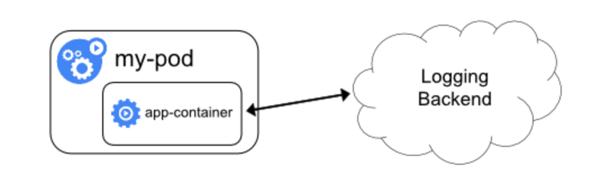
**images/chapter 13 - direct logging.png**

#### Node agent

The node agent approach is best when you control the worker nodes and you want to abstract away the act of log aggregation from your applications. Each application container can simply write to standard output and standard error and the agent running on each node will intercept the logs and deliver them to the remote logging service.

Typically, you deploy the node agent as a DaemonSet, so as nodes are added or removed from the cluster the log agent will always be present without additional work.

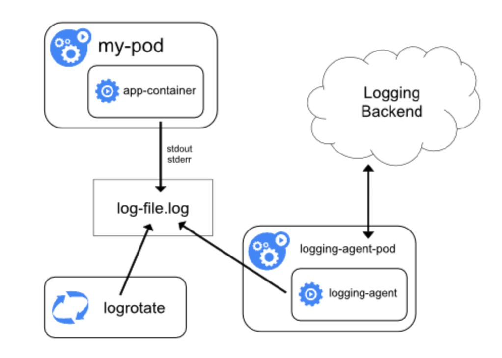
**images/chapter 13 - node agent logging.png**

#### Sidecar container

The sidecar container is best when you don't have control over your cluster nodes or if you use some serverless computing infrastructure to deploy containers, but you don't want to use the direct logging approach. The node agent approach is out of the question, but you can attach a sidecar container that will collect the logs and deliver them to the central logging service. It is not as efficient as the node agent approach because each container will need its own logging sidecar container, but it can be done at the deployment stage without requiring code changes and application knowledge.

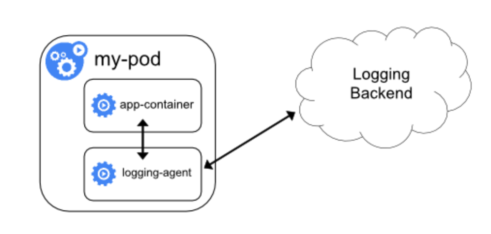
**images/chapter 13 - sidecar container logging.png**

Now, that we covered the topic of log collection lets consider how to store and manage those logs centrally.

### Cluster-level central logging

If your entire system is running in a single Kubernetes cluster then cluster-level logging may be a great choice. You can install a central logging service like Grafana Loki, ElasticSearch or Graylog in your cluster and enjoy a cohesive log aggregation experience without sending your log data elsewhere. 

But, in-cluster central logging is not always possible nor desirable.

### Remote central logging

There use cases where in-cluster central logging doesn't cut it for various reasons:

- Logs are used for audit purposes it may be necessary to log to a separate and controlled location (e.g. on AWS it is common to log to a separate account)

- Your system runs on multiple clusters and logging in each cluster is not really central.

- You run on a cloud provider and prefer to log into the cloud platform logging service (e.g. StackDriver on GCP or CloudWatch on AWS)

- You already work with a remote central logging service like SumoLogic or Splunk and you prefer to continue using them. 

- You just don't want the hustle of collecting and storing log data 

### Dealing with sensitive log information

OK. We can collect the logs and send them to a central logging service. If the central logging service is remote you might need to be selective about, which information you log. 

For example, PII (personally identifiable information) and PHI (protected health information) are two categories of information that you probably shouldn't log without making sure access to te log is properly controlled.

At Helix for example, we redact PII like user names and emails.

## Using Fluentd for log collection

[Fluentd](https://www.fluentd.org) is an open source CNCF graduated project. It is considered best in class on Kubernetes and it can integrate with pretty much every logging backend you want. If you set up your own centralized logging solution I recommend using Fluentd. The following diagram shows how Fluentd can be deployed as a DaemonSet in a Kubernetes cluster:

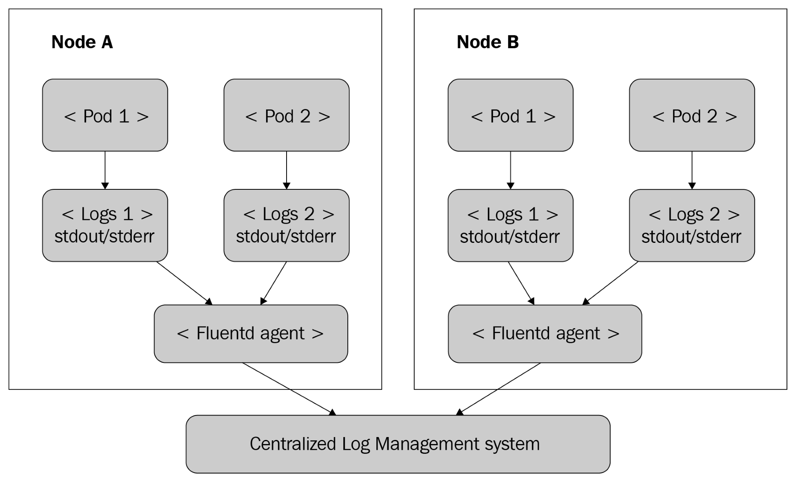

One of the most popular DIY centralized logging solution is ELK whree E stands for ElasticSearch, L stands for LogStash and K  stands for Kibana. On Kubernetes EFK, where Fluentd replaces LogStash is very common and there are Helm charts and a lot of experience deploying and operating it on Kubernetes.

Fluentd has plaugin-based architecture so don't feel limited to EFK. Fluentd doesn't require a lot of resources, but if you really need high-performance solution [Fluentbit](http://fluentbit.io/) is a pure forwarder that uses barely 450KB of memory.

# Collecting Metrics with Kubernetes

If you have some experience with Kubernetes you may be familiar with cAdvisor and Heapster. cAdvisor was integrated into the kube-proxy until Kubernetes 1.12 and then it was removed. Heapster was removed in Kubernetes 1.13. If you wish you can install them, but they are not recommended anymore as there are much better solutions now.

One caveat is that the Kubernetes dashboard v1 still depends on Heapster. The Kubernetes dashboard v2 is still in Beta at the time of writing. Hopefully it will be generally available by the time you read this. 

Kubernetes now has a Metrics API. It supports node and pod metrics out of the box. You can also define your own custom metrics. 

A metric contains a timestamp, a usage field the time range the metric was collected (many metrics are accumulated over a time period). Here is the API definition for node metrics:

```
type NodeMetrics struct {
	metav1.TypeMeta
	metav1.ObjectMeta

	Timestamp metav1.Time
	Window    metav1.Duration

	Usage corev1.ResourceList
}

// NodeMetricsList is a list of NodeMetrics.
type NodeMetricsList struct {
	metav1.TypeMeta
	// Standard list metadata.
	// More info: https://git.k8s.io/community/contributors/devel/sig-architecture/api-conventions.md#types-kinds
	metav1.ListMeta

	// List of node metrics.
	Items []NodeMetrics
}
```

The usage field type is ResourceList, but it's actually a map of a resource name to a
quantity:

```
// ResourceList is a set of (resource name, quantity) pairs.
type ResourceList map[ResourceName]resource.Quantity
```

[Quantity](https://github.com/kubernetes/kubernetes/blob/master/staging/src/k8s.io/apimachinery/pkg/api/resource/quantity.go#L88) is a fixed-point representation of a number. It provides convenient marshaling/unmarshaling in JSON and YAML as well as String() and Int64() accessors.

```
type Quantity struct {
    // i is the quantity in int64 scaled form, if d.Dec == nil
    i int64Amount
    
    // d is the quantity in inf.Dec form if d.Dec != nil
    d infDecAmount

    // s is the generated value of this quantity to avoid recalculation
    s string

    // Change Format at will. See the comment for Canonicalize for more details.
    Format
}
```

## Monitoring with the metrics server

The Kubernetes metrics-server implements the Kubernetes metrics API

You can deploy it with Helm 3:

```
$ helm install metrics-server stable/metrics-server --version 2.8.9 -n kube-system
```

On minikube you enable it as an addon

```
$ minikube addons enable metrics-server
✅  metrics-server was successfully enabled
```

After a few minutes to let the metrics server collect some data you can query it using these commands for node metrics:

```
$ kubectl get --raw "/apis/metrics.k8s.io/v1beta1/nodes" | jq .
{
  "kind": "NodeMetricsList",
  "apiVersion": "metrics.k8s.io/v1beta1",
  "metadata": {
    "selfLink": "/apis/metrics.k8s.io/v1beta1/nodes"
  },
  "items": [
    {
      "metadata": {
        "name": "ip-192-168-13-100.ec2.internal",
        "selfLink": "/apis/metrics.k8s.io/v1beta1/nodes/ip-192-168-13-100.ec2.internal",
        "creationTimestamp": "2020-01-07T20:05:29Z"
      },
      "timestamp": "2020-01-07T20:04:54Z",
      "window": "30s",
      "usage": {
        "cpu": "85887417n",
        "memory": "885828Ki"
      }
    }
  ]
}
```

In addition the `kubectl top` command gets its information from the metrics server:

```
$ kubectl top nodes
NAME                           CPU(cores) CPU% MEMORY(bytes) MEMORY%
ip-192-168-13-100.ec2.internal 85m        4%   863Mi         11%

$ kubectl top pods
NAME                                  CPU(cores) MEMORY(bytes)
api-gateway-795f7dcbdb-ml2tm          1m         23Mi
link-db-7445d6cbf7-2zs2m              1m         32Mi
link-manager-54968ff8cf-q94pj         0m         4Mi
nats-cluster-1                        1m         3Mi
nats-operator-55dfdc6868-fj5j2        2m         11Mi
news-manager-7f447f5c9f-c4pc4         0m         1Mi
news-manager-redis-0                  1m         1Mi
social-graph-db-7565b59467-dmdlw      1m         31Mi
social-graph-manager-64cdf589c7-4bjcn 0m         1Mi
user-db-0                             1m         32Mi
user-manager-699458447-6lwjq          1m         1Mi
```

The metrics server is also the source for performance information in the Kubernetes dashboard.

## Exploring your cluster with the Kubernetes dashboard

The Kubernetes dashboard is a web application that you can install and drill down your cluster though a nice user interface. Depending on your Kubernetes distribution it may or may not be installed. On minikube you install it as an addon:

```
$ minikube addons enable dashboard
✅  dashboard was successfully enabled
```

On other distributions you can install yourself:

```
kubectl apply -f https://raw.githubusercontent.com/kubernetes/dashboard/v2.0.0-beta8/aio/deploy/recommended.yaml
```

I'm a big fan of the dashboard because it gives a very condensed view of your entire cluster, as well as the ability to drill down by namespace, resource type or labels and even general search:

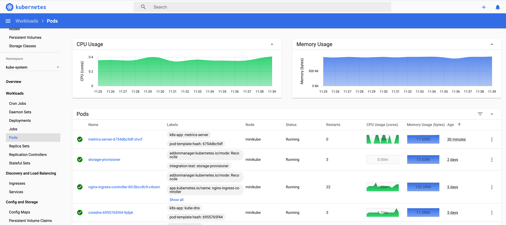
**images/chapter 13 - dashboard.png**

## The rise of Prometheus

[Prometheus](https://prometheus.io/) is yet another graduated CNCF open source project. It focuses on metrics collection and alert management. It has a simple yet powerful data model for managing time-series data a and sophisticated query languageIt is considered best in class in the Kubernetes world. Prometheus lets you define recording rules that are fired at regular intervals and collect data from targets. In addition you can define alerting rules too that evaluate a condition and trigger alerts if the condition is satisfied. 

It has several unique features compared to other monitoring solutions:

- The collection system is pull over HTTP. Nobody has to push metrics to Prometheus (but push is supported via a gateway).
- a multi-dimensional data model (each metric is a named time series with a set of key/value pairs attached to each data point)
- PromQL - powerful and flexible query language to slice and dice your metrics
- Prometheus server nodes are independent and don't rely on shared storage
- target discovery can be dynamic or via static configuration
- built-in time series storage, but supports other backends if necessary
- built-in alert manager and ability to define alerting rules 

The following diagram illustrates the entire system:

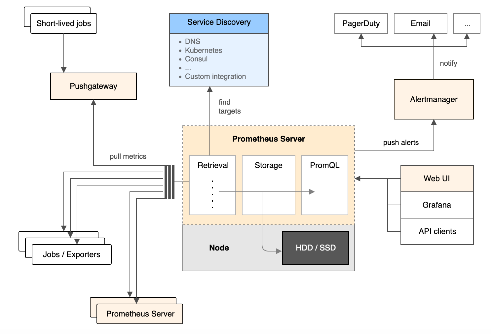
**images/chapter 13 - prometheus architecture.png**


### Installing prometheus

Prometheus is a complex beast as you can see. The best way to install it is using the [Prometheus operator](https://github.com/coreos/prometheus-operator).


But, before you install it make sure to delete the knative-monitoring namespace if you use the same cluster that you installed knative on. Knative quietly installs its own Prometheus-based monitoring system into your cluster.

On minikube it takes some extra steps and configuration to get ready for Prometheus (they should probably make it an addon). 

To prepare minikube for Prometheus we need to start it with some extra arguments:

```
$ minikube start --memory=4096 \
                 --bootstrapper=kubeadm \
                 --extra-config=scheduler.address=0.0.0.0 \
                 --extra-config=controller-manager.address=0.0.0.0
```

The following article dives into the details:
https://medium.com/faun/trying-prometheus-operator-with-helm-minikube-b617a2dccfa3

There is a Helm chart manage by the community for the prometheus operator, but it is incompatible with Helm 3 (it uses the dreaded crd-install hook). We will install it with Helm 2, which requires as you recall installing Tiller too. If you have Tiller installed already from previous chapters yo can skip this step:

```
$ kubectl create serviceaccount tiller --namespace kube-system
$ kubectl create clusterrolebinding tiller-role-binding \
     --clusterrole cluster-admin --serviceaccount=kube-system:tiller
$ helm init --service-account tiller
```

Now we can install the Prometheus operator. It can take a few minutes, so don't be alarmed if it appears to just hang there. The minikube_values.yaml can be found in the prometheus sub-directory of the code directory: 

```
$ helm install stable/prometheus-operator \
       --version=8.5.4 \
       --name monitoring \
       --namespace monitoring \
       --values=minikube_values.yaml
```

The Helm chart installs a comprehensive metric-based monitoring stack with quite a few components:

- prometheus-operator
- prometheus
- alertmanager
- node-exporter
- kube-state-metrics
- grafana

Check out the pods installed in the monitoring namespace. It should look something like:

```
$ kubectl get po -n monitoring
NAME                                                     READY   STATUS    RESTARTS   AGE
alertmanager-monitoring-prometheus-oper-alertmanager-0   2/2     Running   0          15m
monitoring-grafana-697fd7b5cc-2rgmq                      2/2     Running   0          15m
monitoring-kube-state-metrics-574ccf8cd6-ng2mq           1/1     Running   0          15m
monitoring-prometheus-node-exporter-pgnj8                1/1     Running   0          15m
monitoring-prometheus-oper-operator-74d96f6ffb-r5zt7     2/2     Running   0          15m
prometheus-monitoring-prometheus-oper-prometheus-0       3/3     Running   1          15m
```


The Prometheus operator manages Prometheus and its Alertmanager through four CRDs:
- Prometheus
- ServiceMonitor
- PrometheusRule
- Alertmanager 

If you want a more complete and opinionated installation experience check out [kube-prometheus](https://github.com/coreos/kube-prometheus). It installs Prometheus and the Alertmanager in high-availability configuration as well as additional tools and default rules and dashboard. It even has its own metrics API server so you don't need to enable the metrics-server addon in Minikube.

Let's examine Prometheus and the other components.

### Interacting with Prometheus

Prometheus has a basic web UI that you can use to explore its metrics. Let's do port forwarding to localhost:

```
$ POD_NAME=$(kubectl get pods -n monitoring -l "app=prometheus" \
             -o jsonpath="{.items[0].metadata.name}")
$ kubectl port-forward -n monitoring $POD_NAME 9090
``` 

Then, you can browse to http://localhost:9090 where you can select different metrics and view raw data or graphs:

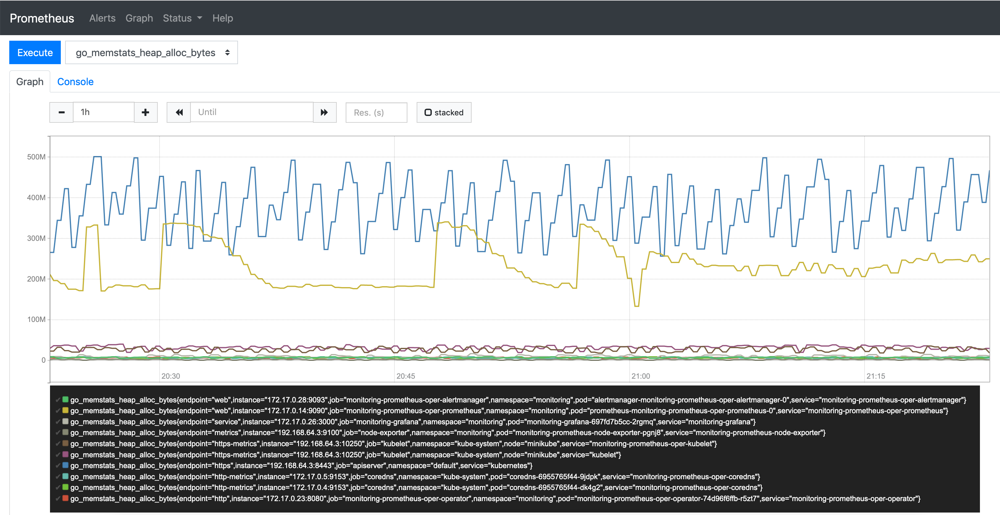
**images/chapter 13 - prometheus ui.png**

Prometheus records outstanding number of metrics (990 in my current setup). The most relevant metrics on Kubernetes are the metrics exposed by the kube-state-metrics and node exporters.

### Incorporating kube-state-metrics

The prometheus operator already installs kube-state-metrics. It is a service, which listens to Kubernetes events and exposes them though a /metrics HTTP endpoint in the format the Prometheus expects. So, it is a prometheus exporter. 

This is very different from the Kubernetes metrics server, which is the standard way Kubernetes exposes metrics for nodes and pods and allows you to expose your own custom metrics too. The Kubernetes metrics server is a service that periodically queries Kubernetes for data and stores is in memory. It exposes its data through the Kubernetes metrics API.

The metrics exposed by kube-state-metrics are vast. Here is the list of the groups of metrics, which is pretty massive on its own. Each group corresponds to a Kubernetes API object and contains multiple metrics:

- CertificateSigningRequest Metrics
- ConfigMap Metrics
- CronJob Metrics
- DaemonSet Metrics
- Deployment Metrics
- Endpoint Metrics
- Horizontal Pod Autoscaler Metrics
- Ingress Metrics
- Job Metrics
- LimitRange Metrics
- MutatingWebhookConfiguration Metrics
- Namespace Metrics
- NetworkPolicy Metrics
- Node Metrics
- PersistentVolume Metrics
- PersistentVolumeClaim Metrics
- Pod Disruption Budget Metrics
- Pod Metrics
- ReplicaSet Metrics
- ReplicationController Metrics
- ResourceQuota Metrics
- Secret Metrics
- Service Metrics
- StatefulSet Metrics
- StorageClass Metrics
- ValidatingWebhookConfiguration Metrics
- VerticalPodAutoscaler Metrics
- VolumeAttachment Metrics 

For example here are the metrics collected for Kubernetes services:

- kube_service_info
- kube_service_labels
- kube_service_created
- kube_service_spec_type
- kube_service_spec_external_ip
- kube_service_status_load_balancer_ingress

### Utilizing the node exporter

kube-state-metrics collects node information from the Kubernetes API server, but this information is pretty limited. Prometheus comes with its own node exporter, which collects tons of low-level information about the nodes. Remember that Prometheus may be the de facto standard metrics platform on Kubernetes, but it is not Kubernetes-specific. For other systems that use Prometheus the node exporter is super important. On Kubernetes, if you manage your own nodes this information can be invaluable too.

Here is a small subset of the metrics exposed by the node exporter:

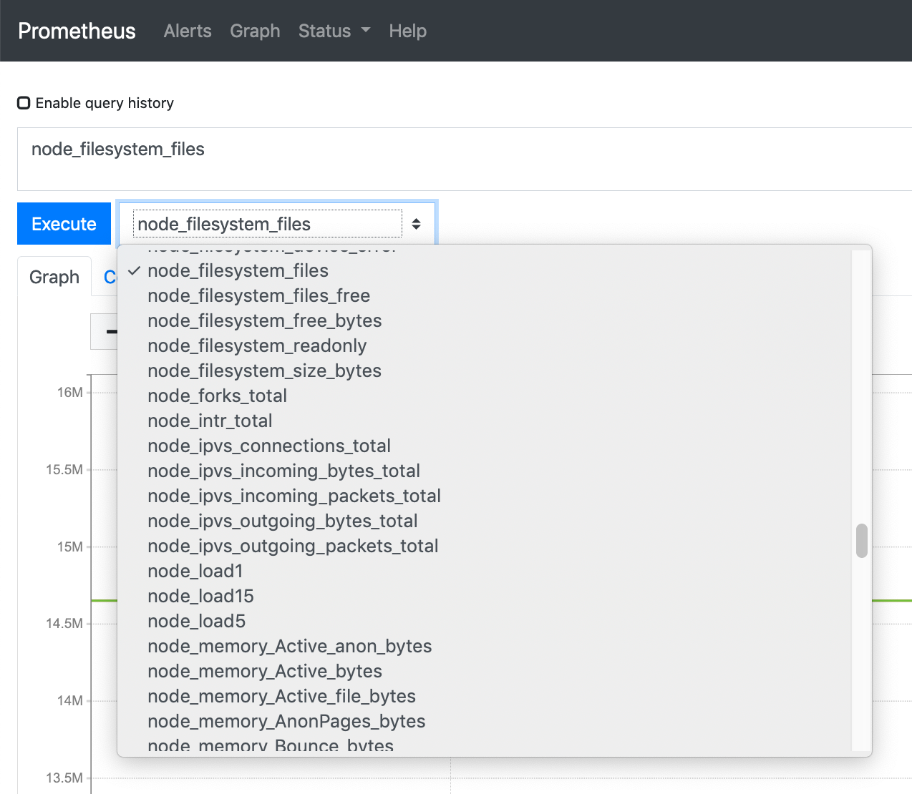

### Incorporating custom metrics

The built-in metrics, node metrics and Kubernetes metrics are great, but very often the most interesting metrics are domain-specific and need to be captured as custom-metrics. There are two ways to do it:

- Write your own exporter and tell Prometheus to scrape it
- Use the Push gateway that allows you to push metrics into Prometheus

In my book [Hands-On Microservices with Kubernetes](https://www.packtpub.com/virtualization-and-cloud/hands-microservices-kubernetes) I provide a full-fledged example how to implement your own exporter from a Go service.

The Push gateway is more appropriate if you already have a push-based metrics collector in place and you just want to have Prometheus record those metrics. It provides a convenient migration path from other metrics collection systems to Prometheus.

### Alerting with Alertmanager

Collecting metrics is great, but when things go south or ideally BEFORE things go south you want to get notified. In prometheus this is the job of the Alertmanager. You can define rules as expressions based metrics and when those expressions become true they trigger an alert. 

Alerts can serve multiple purposes. They can be handled automatically by a controller that is responsible for mitigating specific problems, they can be wake up a poor on call engineer at 3am, they can result in an email, group chat message or any combination.


The Alertmanager lets you group similar alerts into a single notification, inhibiting notifications if other alerts are already firing and silencing alerts. All those features are useful when a large-scale system is in trouble. The stakeholders are aware of the situation and don't need repeated alerts or multiple variations of the same alert firing constantly while troubleshooting and trying to find the root cause. 

One of the cool things about the Prometheus operator is that it manages everything in CRDs. That includes all the rules including the alert rules:

```
$ kubectl get prometheusrules --n monitoring
NAME                                                              AGE
monitoring-prometheus-oper-alertmanager.rules                     2d9h
monitoring-prometheus-oper-etcd                                   2d9h
monitoring-prometheus-oper-general.rules                          2d9h
monitoring-prometheus-oper-k8s.rules                              2d9h
monitoring-prometheus-oper-kube-apiserver-error                   2d9h
monitoring-prometheus-oper-kube-apiserver.rules                   2d9h
monitoring-prometheus-oper-kube-prometheus-node-recording.rules   2d9h
monitoring-prometheus-oper-kube-scheduler.rules                   2d9h
monitoring-prometheus-oper-kubernetes-absent                      2d9h
monitoring-prometheus-oper-kubernetes-apps                        2d9h
monitoring-prometheus-oper-kubernetes-resources                   2d9h
monitoring-prometheus-oper-kubernetes-storage                     2d9h
monitoring-prometheus-oper-kubernetes-system                      2d9h
monitoring-prometheus-oper-kubernetes-system-apiserver            2d9h
monitoring-prometheus-oper-kubernetes-system-controller-manager   2d9h
monitoring-prometheus-oper-kubernetes-system-kubelet              2d9h
monitoring-prometheus-oper-kubernetes-system-scheduler            2d9h
monitoring-prometheus-oper-node-exporter                          2d9h
monitoring-prometheus-oper-node-exporter.rules                    2d9h
monitoring-prometheus-oper-node-network                           2d9h
monitoring-prometheus-oper-node-time                              2d9h
monitoring-prometheus-oper-node.rules                             2d9h
monitoring-prometheus-oper-prometheus                             2d9h
monitoring-prometheus-oper-prometheus-operator                    2d9h
```


Here is the node time rule that checks every second if the node time is deviated more than 0.05 of a second from the time of the node running the Prometheus pod (of course you want to make sure this node's clock is correct by having NTP properly configured): 

```
$ kubectl get prometheusrules monitoring-prometheus-oper-node-time -n monitoring -o yaml
apiVersion: monitoring.coreos.com/v1
kind: PrometheusRule
metadata:
  ...
spec:
  groups:
  - name: node-time
    rules:
    - alert: ClockSkewDetected
      annotations:
        message: Clock skew detected on node-exporter {{ $labels.namespace }}/{{ $labels.pod
          }}. Ensure NTP is configured correctly on this host.
      expr: abs(node_timex_offset_seconds{job="node-exporter"}) > 0.05
      for: 2m
      labels:
        severity: warning
```


Alerts are very important, but there are cases where you want to visualize the overall state of your system or drill down into specific aspects. This is where visualization comes into play.

### Visualizing your metrics with Grafana

You've already seen the Prometheus Expression browser that can display your metrics as a graph or in table form. But, we can do much better. [Grafana](https://grafana.com) is an open source monitoring system that specializes in stunningly beautiful visualizations of metrics. It doesn't store the metrics itslf, but works with many data sources, and Prometheus is one of them. Grafana has an alerting capabilities too, but when working with Prometheus it's best to rely on its Alertmanger.

The Prometheus operator installs Grafana and configures a large number of useful Kubernetes dashboards. Check out this beutiful dashboard of Kubernetes networking of pods filtered by namespace:

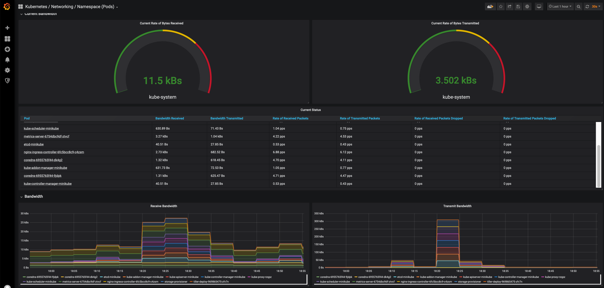
**images/chapter 13 - grafana dashboard.png**

To access Grafana type the following commands:

```
$ POD_NAME=$(kubectl get pods -n monitoring -l "app=grafana" \
             -o jsonpath="{.items[0].metadata.name}")
$ kubectl port-forward -n monitoring $POD_NAME 3000
```

Then you can browse to http://localhost:3000 and have some fun with Grafana. Grafana requires a username and password. The default credentials are admin for the user and prom-operator for the password.

Here are the dashboards that are pre-configured:


**images/chapter 13 - grafana configured dashboard.png**

As you can see the list is pretty extensive, but you can define your own dashboards if you want. There is a lot of fancy visualizations you can create with Grafana. I encourage you to explore it further. The Grafana dashboard are stored as config maps. If you want to adda custom dashboard, just add a config map that contains your dashboard spec. There is a dedicated sidecar container watching new config maps being added and it will make sure to add your custom dashboard.

### Considering Loki

If you like Prometheus and Grafana and you didn't settle on a centralized logging solution yet (or if you're unjappy with your current logging solution) then you should consider [Grafana Loki](https://grafana.com/oss/loki/). Loki is an open source project for log aggregation inspired by Prometheus. Unlike most log aggregation systems, it doesn't index the log contents but rather a set of labels applied to the log. That makes is very efficient. It is still relatively new (started in 2018), so you should evaluate if it fits your needs before making the decision to adopt it. One thing is sure, Loki has excellent Grafana support.

There are several advantages for Loki compared to something like EFK when Prometheus is used as the metrics platform. In particular the set of labels you use to tag your metrics will serve just as well to tag your logs. Also, the fact that Grafana is used as a uniform visualization platform for both logs and metrics is useful.

We dedicated a lot of time to discuss metrics on Kubernetes. Let's talk about distributed tracing and the Jaeger project.   

# Distributed tracing with Jaeger

In micro-service based system every request may travel between multiple microservices calling each other, wait in queues and trigger serverless functions. To debug and troubleshoot such systems you need to be able to keep track of requests and follow them along their path. 

Distributed tracing provides several capabilities that allow you the developers and operators understand their distributed systems:

- Distributed transaction monitoring
- Performance and latency tracking
- Root cause analysis
- Service dependency analysis
- Distributed context propagation

Distributed tracing often requires participation of the applications and services instrumenting endpoints. Since the microservices world is polyglot multiple programming languages may be used. It makes sense to use a shared distributed tracing specification and framework that supports many programming languages. Enter OpenTracing...  

## What is OpenTracing?

[OpenTracing](https://opentracing.io) is an API specification and a set of frameworks and libraries in different languages. It is also an incubating CNCF project. OpenTracing is supported by multiple products and became a de-facto standard. By using a product that complies with OpenTracing you are not locked in and you work with an API that may be familiar to your developers. Note that OpenTracing recently merged with OpenCensus to from OpenTelemtry, which is a specification and platform for collecting both metrics and distributed traces. It is still in early development (Sandbox CNCF project), so we'll stick with OpenTracing at the moment.

Here is a list of the tracers that support OpenTracing:

```
- Jaeger
- LightStep
- Instana
- Apache SkyWalking
- inspectIT
- stagemonitor
- Datadog
- Wavefront by VMware
- Elastic APM
```

Most of the mainstream programming languages are supported:

```
- Go
- JavaScript
- Java
- Python
- Ruby
- PHP
- Objective-C
- C++
- C#
```

### OpenTracing concepts

The two main concepts of OpenTracing are **Span** and **Trace**.

A **Span** is the basic unit of work or operation. It has a name, start time and a duration. Spans can be nested if one operation starts another operation. Spans propagate with a unique id and context. The **Trace** is an acyclic graph of Spans that originated from the same request and share the same context. A **Trace** represents the execution path of a request throughout the system. The following diagram illustrates the relationship between a Trace and Spans:

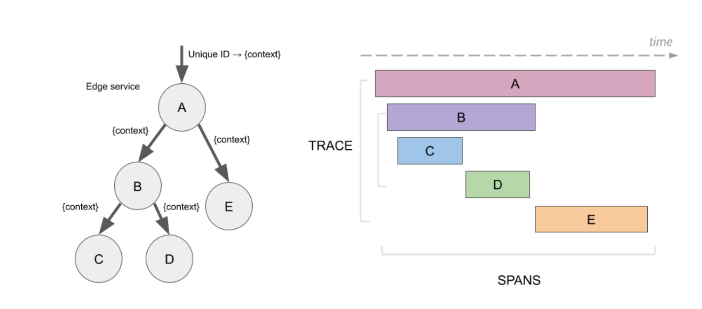   
**images/chapter 13 - trace and spans.png**

Let's take a look at Jaeger...

## Introducing Jaeger

[Jaeger](https://www.jaegertracing.io/) is yet another CNCF graduated project just like Fluentd and Prometheus. It completes the trinity of CNCF-graduated observability projects for Kubernetes. Jaeger was developed originally by Uber and quickly became the fore runner distributed tracing solution for Kubernetes.

There are other open-source distributed tracing system like [Zipkin](https://zipkin.io/) and [AppDash](https://github.com/sourcegraph/appdash). The inspiration for most of these systems (as as well as Jaeger) is Google's [Dapper](https://research.google.com/pubs/pub36356.html). Cloud platform provide their own tracers like AWS X-Ray.

There are various differences between all these systems. Jaeger strong points are:
- Scalable design
- Multiple OpenTracing-compatible clients
- Light memory footprint
- Agents collect metrics over UDP

### Jarger architecture

Jaeger is a scalable system. It can be deployed as single binary with all its components and store the data in memory, but also as a distributed system where spans and traces are stored in persistent storage.

Jaeger has several components that collaborate to provide a word-class distributed tracing experience.
The following diagram illustrates the architecture:  

   
**images/chapter 13 - gaeger architecture.png**

Let's understand what is the purpose of each component.

#### Jaeger client

The Jaeger client is a library that implements the OpenTracing API in order to instrument a service or application for distributed tracing. The client library is used by the service or application to create spans, attach context like trace id, span id and additional payload.

A very important aspect of Jaeger instrumentation is that it uses sampling and only 1 out of 1000 traces are actually sampled. This is very different than logs and metrics that record each and every event. That makes distributed tracing relatively lightweight, while still providing enough insight for high-volume applications.

#### Jaeger agent

The role of the agent is deployed locally to each node. It listens to spans over UDP - which makes it pretty performant - batch them and send them in bulk to the collector. This way services don't need to discover collector or worry about connecting to them. Instrumented services simply send their spans to the local agent. The agent can also inform the client about sampling strategies.

#### Jaegr collector

The collector receives traces from all the agent. It is responsible to validate, index, transform and eventually store the traces. The storage component can be a data store like Cassandra or ElasticSearch. But, it can also be a Kafka instance that enables async processing of traces.
 
#### Jaeger Query

The Jaeger query service is responsible for presenting a UI to query the traces and spans the collector put in storage.  

## Installing Jaeger 

There are Helm charts to install Jaeger and Jaeger operator, which is in Beta at the time of writing. But, let's give it a try and see how far we can go:

```
$ helm repo add jaegertracing https://jaegertracing.github.io/helm-charts
$ helm search repo jaegertracing
NAME                         	CHART VERSION	APP VERSION	DESCRIPTION
jaegertracing/jaeger         	0.18.3       	1.16.0     	A Jaeger Helm chart for Kubernetes
jaegertracing/jaeger-operator	2.12.3       	1.16.0     	jaeger-operator Helm chart for Kubernetes
```

Let's install Jaeger itself first into the monitoring namespace:

```
$ helm install jaeger jaegertracing/jaeger -n monitoring
NAME: jaeger
LAST DEPLOYED: Sun Jan 12 20:03:24 2020
NAMESPACE: monitoring
STATUS: deployed
REVISION: 1
TEST SUITE: None
NOTES:
You can log into the Jaeger Query UI here:

  export POD_NAME=$(kubectl get pods --namespace monitoring -l "app.kubernetes.io/instance=jaeger,app.kubernetes.io/component=query" -o jsonpath="{.items[0].metadata.name}")
  echo http://127.0.0.1:8080/
  kubectl port-forward --namespace monitoring $POD_NAME 8080:16686
``` 

Unfortunately. we can't use Helm 3 to install the Jaeger operator. We must resort to Helm 2 again:

```
$ helm install jaegertracing/jaeger-operator -n jaeger-operator --namespace monitoring
NAME:   jaeger-operator
LAST DEPLOYED: Mon Jan 13 00:42:17 2020
NAMESPACE: monitoring
STATUS: DEPLOYED

RESOURCES:
==> v1/Deployment
NAME             AGE
jaeger-operator  0s

==> v1/Pod(related)
NAME                             AGE
jaeger-operator-b7f44c755-fwmrr  0s

==> v1/Role
NAME             AGE
jaeger-operator  0s

==> v1/RoleBinding
NAME             AGE
jaeger-operator  0s

==> v1/Service
NAME                     AGE
jaeger-operator-metrics  0s

==> v1/ServiceAccount
NAME             AGE
jaeger-operator  0s


NOTES:
jaeger-operator is installed.


Check the jaeger-operator logs
  export POD=$(kubectl get pods-l app.kubernetes.io/instance=jaeger-operator -lapp.kubernetes.io/name=jaeger-operator --namespace monitoring --output name)
  kubectl logs $POD --namespace=monitoring
```

Let's bring up the Jaeger UI

```
$ export POD_NAME=$(kubectl get pods --namespace monitoring -l "app.kubernetes.io/instance=jaeger,app.kubernetes.io/component=query" -o jsonpath="{.items[0].metadata.name}")
$ kubectl port-forward --namespace monitoring $POD_NAME 8080:16686
```

Now, we can browse to http://localhost:8080 and see the Jaeger UI:

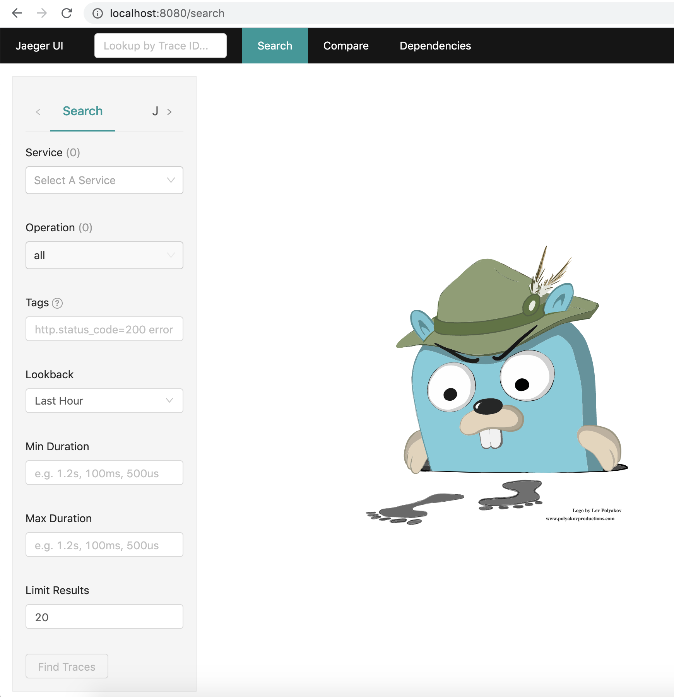
**images/chapter 13 - jaeger ui.png**

In the next chapter - Utilizing Service Meshes - we will see more of Jaeger and how to use it. Now, let's turn our attention to troubleshooting using all the monitoring and observability mechanisms we discussed.

# Troubleshooting problems

Troubleshooting a complex distributed system is no picnic. Abstractions, separation of concerns, information hiding and encapsulation are great during development, testing and when making changes to the system. But, when things go wrong you need to cross all those boundaries and layers of abstraction from the user action in their app through the entire stack all the way to the infrastructure, crossing all the business logic, asynchronous processes, legacy systems and third party integrations. This has is a challenge even with large monolithic systems, but even more so with microservice-based distributed systems. Monitoring will assist you, but let's talk first about preparation, processes and best practices.

## Taking advantage of staging environments

When building a large system developers work on their local machines (ignoring cloud development environment here) and eventually the code is deployed to the production environment. But, there are a few steps between those two extremes. Complex systems operate in an environment that is not easy to duplicate locally. You should test changes to code or configuration in an environment that is similar to your production environment. This is your staging environment where you should catch most problems that can't be caught by the developer running tests locally in their development environment.

The software delivery process should accommodate detection of bad code and configuration as early as possible. But, sometimes bad changes will be detected only in production and cause an incident. You should an incident management process in place as well, which typically involves reverting back to the previous version of whatever component caused the issue and then trying to find root cause, often by debugging in the staging environment.

But, sometimes the problem is not with your code or configuration. In the end your Kubernetes cluster runs on nodes (yes, even if it's managed) and those node can suffer many issues. 

## Detecting problems at the node level

In Kubernetes' conceptual model, the unit of work is the pod. However, pods are scheduled on nodes. When it comes to monitoring and reliability of the infrastructure, the nodes are what require the most attention, because Kubernetes itself (the scheduler, replica sets and horizontal pod autoscalers) takes care of the pods. Nodes can suffer from a variety of problems that Kubernetes is unaware of. As a result, it will keep scheduling pods to the bad nodes and the pods might fail to function properly. Here are some of the problems that nodes may suffer while still appearing functional:

- Bad CPU
- Bad memory
- Bad disk
- Kernel deadlock
- Corrupt filesystem
- Problems with the container runtime (e.g. Docker daemon)

The Kubelet running on each node can't detect these problems. We need another solution. Enter the node problem detector.

The node problem detector is a pod that runs on every node. It needs to solve a difficult problem. It must to detect various low-level problems across different environments, different hardware, and different operating systems. It must be reliable enough not to be affected itself (otherwise, it can't report the problem), and it needs to have relatively-low overhead to avoid spamming the master. In addition, it needs to run on every node. The source code is at https://github. com/kubernetes/node-problem-detector.

The most natural way is to deploy the node problem detector as a DaemonSet, so every node always as a problem detector. On Google's GCE clusters it runs as an addon.

### Problem Daemons
The problem with node problem detector (pun intended) is that there are too many
problems which it needs to handle. Trying to cram all of them into a single codebase can lead to a complex, bloated, and never-stabilizing codebase. The design of the node problem detector calls for separation of the core functionality of reporting node problems to the master from the specific problem detection. The reporting API is based on generic conditions and events. The problem detection should be done by separate problem daemons (each in its own container). This way, it is possible to add and evolve new
problem detectors without impacting the core node problem detector. In addition, the control plane may have a remedy controller that can resolve some node problems automatically, therefore implementing self-healing.

At this stage (Kubernetes 1.17), problem daemons are baked into the node
problem detector binary, and they execute as Goroutines, so you don't get
the benefits of the loosely-coupled design just yet. In the future, each problem daemon will run in its own container.

In addition to problems with nodes the other area where things can break down is networking. The various monitoring tools we discussed earlier can help us identify problems across the infrastructure, in our code or with third party dependencies.

Let's talk about various options in our toolbox, how they compare, and how to utilize them for maximal effect. 

## Dashboards vs. Alerts

Dashboards are purely for humans. The idea of a good dashboard is to provide in one glance a lot of useful information about the state of the system or a particular component. There are many user experience elements to designing good dashboards, just like designing any user interface. Monitoring dashboards can cover a lot of data across many components, over long time periods and may support drilling down into finer and finer levels of details.

Alerts on the other hand are constantly checking certain conditions (often based on metrics) and when triggered can either result in automatic resolution of the cause of the alert or eventually notify a human, who will probably start the investigation by looking at some dashboards.

Beyond self-healing systems that handle certain alerts automatically (or ideally resolve the issue before an alert is even raised) humans will typically be involved in troubleshooting. Even in cases that the system automatically recovered from a problem at some point a human will review the actions the system took and verify that the current behavior, including automatic recovery from problems is adequate.

In many cases, severe problems (a.k.a incidents) discovered by humans looking at dashboards (not scalable) or notified by alert will require some investigation, remediation and later post-mortem. In all those stages, the next layer of monitoring comes into play.  

## Logs vs. metrics vs. error reports

Let's understand where each of these tools excel and how to best combine their strength to debug difficult problems. Let's assume we have good test coverage and our business/domain logic code is by and large correct. We run into problems in the production environment. There could be several types of problems that happen only in production:

- Misconfiguration (production configuration is incorrect out of date)
- Infrastructure provisioning
- Insufficient permissions and access to data, services or 3rd party integrations
- Environment-specific code
- Software bugs that are exposed by production inputs
- Scalability issues

That's quite a list and it's probably not even complete. Typically, when something goes wrong it is in response to some change. What kind of changes are we talking about? Here are a few:

- Deployment of a new version of the code
- Dynamic re-configuration of a deployed application
- New users or existing users changing the way they interact with the system
- Changes to the underlying infrastructure (e.g. by cloud provider)
- New path in the code is utilized for the first time (e.g. fallback to another region)

Since, there is such a broad spectrum of problems and causes it is difficult to suggest a linear path to resolution. For example, if the failure caused an error then looking at an error report might be the best starting point. But, if the issue is that some action that was supposed to happen didn't happen then there is no error to look at. In this case, it might make sense to look at the logs and compare them to the logs from a previous successful request. In case of infrastructure or scalability problems metrics may give us the best initial insight.  

The bottom line is that debugging distributed systems require using multiple tools together in the pursuit of the ever elusive root cause.

Of course in a distributed systems with lots of components and microservices it is not even clear where to look. This where distributed tracing shines and can help us narrow down and identify the culprit.
 
## Detecting performance and root cause with distributed tracing

With distributed tracing in place every request will generate a trace with a graph of spans. Jaeger uses sampling of 1/1000 by default so once in a blue moon issues might escape it, but for persistent problems we will be able to follow the path of a request, see how long each span takes and if the processing of a request bails out for some reason it will be very easy to notice. At this point, you're back to the logs, metrics and errors to hunt the root cause. 

# Summary

In this chapter we covered the topics of monitoring, observability and in general day 2 operations. We started with a review of the various aspects of monitoring: logs, metrics, error reporting and distributed tracing. Then, we discussed at how to incorporate monitoring capabilities into your Kubernetes cluster. We looked at several CNCF projects like Fluentd for log aggregation, Prometheus for metrics collection and alert management, Grafana for visualization and Jaeger for distributed tracing. Then, we explored troubleshooting large distributed systems. We realized how difficult it can be and why we need so many different tools to conquer the issues.

In the next chapter, we we will take it to the next level and dive into service meshes. I'm super excited about service meshes because they take much of the complexity related to cloud-native microservice-based applications and externalizes them outside of the microservices. That has a lot of real-world value.

