# Overview

In the previous chapter we looked at monitoring and observability. One of the obstacles to a comprehensive monitoring story is that it requires a lot of changes to the code that are orthogonal to the business logic.

In this chapter we will learn how service meshes, which allow you to externalize many of those cross-cutting concerns from the application code. The service mesh is a true paradigm shift in the way you can design, evolve and operate distributed systems on Kubernetes. I like to think of it as aspect-oriented programming for cloud-native distributed systems. The topics we will cover are:

- What is a Service Mesh?
- Choosing a service mesh
- Incorporating Istio into your Kubernetes cluster

Let's jump right in.

# What is a Service Mesh?

Service mesh is an architectural pattern for large-scale cloud native applications that are composed of many microservices. When your application is structured as a collection of microservices there is a lot going on in the boundary between microservices internally inside your Kubernetes cluster. This is different from traditional monolithic application where most of the processing was within the same process.

Here some of the concerns that are relevant for each microservice or interaction between microservices:

- Advanced load balancing
- Service discovery
- Support canary deployments
- Caching
- Tracing a request across multiple microservices
- Authentication between services
- Throttling the number requests a service handles at a given time
- Automatically retrying failed requests
- Failing over to alternative component when a component fails consistently
- Collecting metrics
  
All these concerns completely orthogonal to the domain logic of the service, but they are all very important. A naive approach is to simply code all these concerns directly in each microservice. This obviously doesn't scale. So, a typical approach is to package all this functionality in a big library or set of libraries and use these libraries in each service.
 
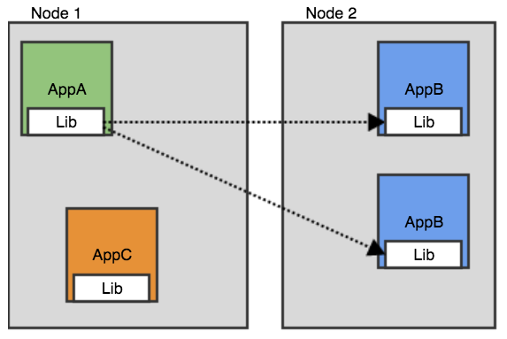
**images/chapter 14 - client library.png**
 
There are several problems with the big library approach:
 
- You need a library that supports all the programming languages you use
- If you want to update your library, you need to bump all your services
- It's difficult to upgrade all services at the same time
  
The service mesh doesn't touch your application. It injects a sidecar proxy container to each pod and a service mesh controller. The proxies intercept all communication between the pods and in collaboration with the mesh controller can take care of all the cross-cutting concerns.
 
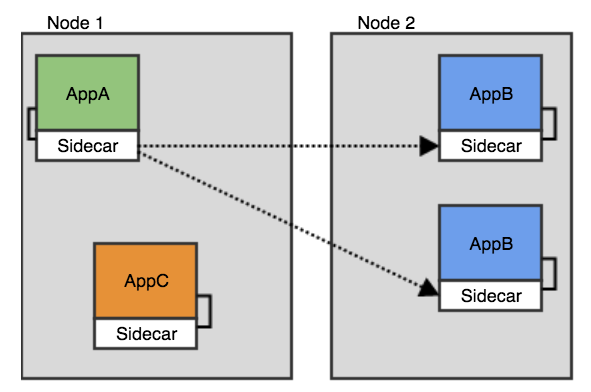
**images/chapter 14 - sidecar container.png** 

Here some of the attributes of the proxy injection approach:

Some of the attributes of sidecar containers are:

- The application is unaware of the service mesh
- You can turn the mesh on or off per pod and update the mesh independently  
- No need to deploy an agent on each node
- Different pods on the same node can have different sidecars (or versions)
- Each pod has its own copy of the proxy

On Kubernetes it looks like:
  
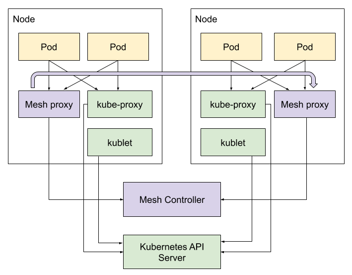
**images/chapter 14 - service mesh.png** 
    
There is another way to implement the service mesh proxy as a node agent, where it is not injected into each pod. This approach is less common, but in some cases (especially in non-Kubernetes environments) it is useful.

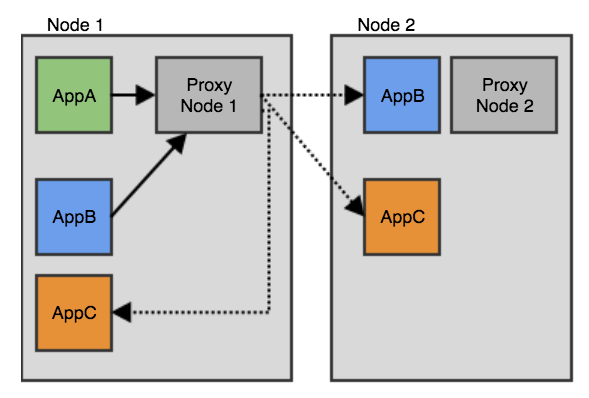
**images/chapter 14 - node agent.png** 

## Control plane and data plane

In the service mesh world there is a control plane, which is typically a set of controllers on Kubernetes and there is a data plane, which are the proxies that connect all the services in the mesh. The data plane consists of all the sidecar containers (or node agent) that intercept all communication between services in the mesh. The control plane is responsible for what actually happens when any traffic between services or a service and the outside world is intercepted.   

Now, that we have a good idea what a service mesh is, how it works and why it is so useful let's review some of the service meshes out there.

# Choosing a service mesh

The service mesh concept is relatively new, but there are already many choices out there. Here is a concise review of the current cohort of service meshes.

## Envoy

[Envoy](https://www.envoyproxy.io/) is yet another CNCF graduated project. It is a very versatile and high-performance L7 proxy. It provides many service mesh capabilities, however it is considered pretty low-level and difficult to configure. It is also not Kubernetes-specific. Some of the Kubernetes service meshes use Envoy as the underlying data plane and provide a Kubernetes-native control plane to configure and interact with it. If you want to use Envoy directly on Kubernetes then the recommendation is to use other open source projects like Ambassador and Gloo as an Ingress controller and/or API gateway.

## Linkered 2

[Linkerd 2](https://linkerd.io/) is a Kubernetes-specific service as well as a CNCF incubating project. It is developed by [Buoyant](https://buoyant.io/). Buoyant coined the term service mesh and introduced it to the world a few years ago. They started with a Scala-based service mesh for multiple platforms including Kubernetes called Linkerd. But, they decided to develop a better and more performant service mesh targeting Kubernetes only. That's where Linkerd 2 comes in. They implemented the data plane (proxy layer) in Rust and and the control plane in Go.

## Kuma

[Kuma](https://kuma.io/) is a service mesh powered by Envoy. It works on Kubernetes as well as other environments. It is developed by Kong. Its claim to fame is that it is super easy to configure.

## AWS App Mesh

AWS of course has its own proprietary service mesh - [AWS App Mesh](https://aws.amazon.com/app-mesh). App Mesh also uses Envoy as its data plane. It can run on EC2, Fargate, ECS and EKS and plain Kubernetes. App Mesh is a bit late to the service mesh scene, so it's not as mature as some of the other service meshes. But, it is based on the solid Envoy, so if you're an AWS shop it may be the best choice due to its tight integration with AWS services.  

## Mæsh


[Mæsh](https://mae.sh/) was developed by the makers of [Træfik](https://containo.us/traefik/). It is interesting because it uses the node agent approach as opposed to sidecar containers. It is based heavily on Traefik middleware to implement the service mesh functionality. You can configure it by using annotations on your services. It may be an interesting and lightweight approach to try service meshes if you utilize Traefik at the edge of your cluster.

## Istio

Last but not least [Istio](https://istio.io/) is the most well-known service mesh on Kubernetes. It is built on top of Envoy and allow you to configure it in a Kubernetes-native way via YAML manifests. Istio was started by Google, IBM and Lyft (the Envoy developers). It's a one-click install on Google GKE, but it is widely used in the Kubernetes community. It is also the default ingress/API gateway solution for Knative, which promotes its adoption even further.


After discussing the various service meshes choices let's take Istio for a ride.

# Incorporating Istio into your Kubernetes cluster

In this section we will get to know Istio a little better, install into into a fresh cluster and explore all the service goodness it provides. 

## Understanding the Istio architecture

First, let's meet the main components of Istio and understand what they do and how they relate.

Istio is a large framework that provides a lot of capabilities, and it has multiple parts that interact with each other and with Kubernetes components (mostly indirectly and unobtrusively). It is divided into a control plane and a data plane. The data plane is a set of proxies (one per pod). Their control plane is a set of components that are responsible for configuring the proxies and collecting telemetry data.

The following diagram illustrates the different parts of Istio, how they are related to each other, and what information is exchanged between them:

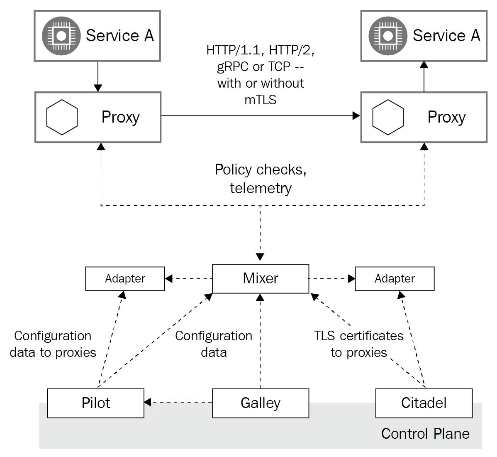
** images/chapter 14 - istio architecture.png**

Let's go a little deeper into each component, starting with the Envoy proxy.

### Envoy

We've discussed Envoy briefly when we reviewed service meshes for Kubernetes. Here it serves as the data plane of Istio. Envoy is implemented in C++ and is a high-performance proxy. For each pod in the service mesh, Istio injects (either automatically or through the istioctl CLI) an Envoy side container that does the heavy lifting, such as:

- Proxy HTTP, HTTP/2, and gRPC traffic between pods
- Sophisticated load balancing
- mTLS termination
- HTTP/2 and gRPC proxies
- Providing service health
- Circuit breaking for unhealthy services
- Percent-based traffic shaping
- Injecting faults for testing
- Detailed metrics

The Envoy proxy controls all the incoming and outgoing communication to its pod. It is, by far, the most important component of Istio. The configuration of Envoy is not trivial, and this is a large part of what the Istio control plane deals with.

The next component is Pilot.

### Pilot

Pilot is responsible for platform-agnostic service discovery, dynamic load balancing, and routing. It translates high-level routing rules into an Envoy configuration. This abstraction layer allows Istio to run on multiple orchestration platforms. Pilot takes all the platform-specific information, converts it into the Envoy data plane configuration format, and propagates it to each Envoy proxy with the Envoy data plane API. Pilot is stateless; in Kubernetes, all the configuration is stored as custom resources definitions (CRDs) in etcd.

Let's move on to the Mixer

### Mixer

Mixer is responsible for abstracting the metrics collection, policies and auditing. These aspects are
typically implemented in services by accessing APIs directly for specific backends. This has
the benefit of offloading this burden from service developers and putting the control into
the hands of the operators that configure Istio. It also enables switching backends easily
without code changes. Here are some the backend types that Mixer can work with:

- Logging
- Authorization
- Quota
- Telemetry
- Billing

The interaction between the Envoy proxy and Mixer is straightforward – before each request, the proxy calls Mixer for precondition checks, which might cause the request to be rejected; after each request, the proxy reports the metrics to Mixer. Mixer has an adapter API to facilitate extensions for arbitrary infrastructure backends. It is a major part of its design.

The next component is Citadel

### Citadel

Citadel is responsible for certificate and key management. It is a key part of Istio security. Citadel integrates with various platforms and aligns with their identity mechanisms. For example, in Kubernetes, it uses service accounts; on AWS, it uses AWS IAM; and on GCP/GKE, it can use GCP IAM. The Istio PKI is based on Citadel. It uses X.509 certificates in SPIFEE format as a vehicle for service identity.

Here is the workflow in Kubernetes:
- Citadel creates certificates and key pairs for existing service accounts.
- Citadel watches the Kubernetes API server for new service accounts to provision
with a certificate a key pair.
- Citadel stores the certificates and keys as Kubernetes secrets.
- Kubernetes mounts the secrets into each new pod that is associated with the
service account (this is standard Kubernetes practice).
- Citadel automatically rotates the Kubernetes secrets when the certificates expire.
- Pilot generates secure naming information that associates a service account with
an Istio service. Pilot then passes the secure naming information to the Envoy
proxy.

The final major component that we will cover is Galley. 

### Galley

Galley is responsible for abstracting the user configuration on different platforms. It provides the ingested configuration to Pilot and Mixer. It is a pretty simple component. 

Now that we have broken down Istio into its major components, let's get ready to install Istio into a Kubernetes cluster.
 
## Preparing a Minikube cluster for Istio

We will use a minikube cluster for checking out Istio. Before installing Istio we should make sure our cluster has enough capacity to handle Istio as well as its demo application BookInfo. We will start minikube with 16MB of memory and four CPUs, which should be adequate:

```
$ minikube start --memory=16384 --cpus=4
``` 

Minikube can provide a load balancer for Istio. Let's run this command in a separate terminal as it will block:

```
$ minikube tunnel

Status:
	machine: minikube
	pid: 20463
	route: 10.96.0.0/12 -> 192.168.64.5
	minikube: Running
	services: []
    errors:
		minikube: no errors
		router: no errors
		loadbalancer emulator: no errors
```

Minikube sometimes doesn't cleanup the tunnel network, so it's recommended to run the following command after you stop the cluster:

```
minikube tunnel --cleanup
```


## Installing Istio

With minikube up and running we can install Istio itself. are There multiple ways to install Istio:

- Customized installation with Istioctl (the Istio CLI)
- Customized installation with Helm
- Using the Istio operator (experimental)
- Multicluster installation

The Helm installation will not be supported in the future, so we will go with the recommended Istioctl option. 

```
$ curl -L https://istio.io/downloadIstio | sh -
```

The `istioctl` tool is located in `istio-1.4.3/bin` (the version may be different when you download it). Make sure it's in your PATH. The Kubernetes installation manifests are in `istio-1.4.3/install/kubernetes` and the examples are in `istio-1.4.3/samples`.

We will install the built-in demo profile, which is great for evaluating Istio:

```
$ istioctl manifest apply --set profile=demo
- Applying manifest for component Base...
✔ Finished applying manifest for component Base.
- Applying manifest for component Citadel...
- Applying manifest for component Tracing...
- Applying manifest for component IngressGateway...
- Applying manifest for component Galley...
- Applying manifest for component Kiali...
- Applying manifest for component EgressGateway...
- Applying manifest for component Prometheus...
- Applying manifest for component Pilot...
- Applying manifest for component Policy...
- Applying manifest for component Injector...
- Applying manifest for component Telemetry...
- Applying manifest for component Grafana...
✔ Finished applying manifest for component Citadel.
✔ Finished applying manifest for component Kiali.
✔ Finished applying manifest for component Galley.
✔ Finished applying manifest for component Prometheus.
✔ Finished applying manifest for component Injector.
✔ Finished applying manifest for component Tracing.
✔ Finished applying manifest for component Policy.
✔ Finished applying manifest for component Grafana.
✔ Finished applying manifest for component IngressGateway.
✔ Finished applying manifest for component Pilot.
✔ Finished applying manifest for component EgressGateway.
✔ Finished applying manifest for component Telemetry.


✔ Installation complete
```

Some familiar names like Prometheus and Grafana pop up already. Let's review our cluster and see what is actually installed. Istio installs itself into the istio-system namespace, which is very convenient since it installs a lot of stuff. Let's check out what services Istio installed

```
$ kubectl get svc -n istio-system -o name
service/grafana
service/istio-citadel
service/istio-egressgateway
service/istio-galley
service/istio-ingressgateway
service/istio-pilot
service/istio-policy
service/istio-sidecar-injector
service/istio-telemetry
service/jaeger-agent
service/jaeger-collector
service/jaeger-query
service/kiali
service/prometheus
service/tracing
service/zipkin
```

There quite a few services with an `istio-` prefix and then a bunch of other services:

- Prometheus
- Grafana
- Jaeger
- Zipkin
- Tracing
- Kiali

That means that if we use Istio in our Kubernetes cluster we don't need to install Prometheus, Grafana and Jaeger. They come with Istio. Also, the fact that Istio endorses them gives even more staying power.

OK. We installed Istio successfully. Let's install the BookInfo application, which is Istio's sample application into our cluster.

## Installing BookInfo

BookInfo is a simple microservice-based application that displays as the name suggests information on a single book such name, description, ISBN and even reviews. The BookInfo developers really embraced the polyglot lifestyle and each micro-service is implemented in a different programming language:

- ProductPage service in Python
- Reviews service in Java
- Details service in Ruby
- Ratings service in Javascript (Node.js)

The following diagram describes the relationships and flow of information between the BookInfo services:


**images/chapter 14 - bookinfo application.svg**

Conveniently enough BookInfo comes with Istio, so we already have it in the `samples` sub-directory and we can install it from there:

```
$ cd samples/bookinfo
```

We're going to install it into its own **bookinfo** namespace. Let's create the namespace and then enable the Istio auto injection of the sidecar proxies by adding a label to the namespace:

```
$ kubectl create ns bookinfo
namespace/bookinfo created

$ kubectl label namespace bookinfo istio-injection=enabled
namespace/bookinfo labeled
```

Instlling the application itself is a simple one liner:

```
$ kubectl apply -f platform/kube/bookinfo.yaml -n bookinfo
service/details created
serviceaccount/bookinfo-details created
deployment.apps/details-v1 created
service/ratings created
serviceaccount/bookinfo-ratings created
deployment.apps/ratings-v1 created
service/reviews created
serviceaccount/bookinfo-reviews created
deployment.apps/reviews-v1 created
deployment.apps/reviews-v2 created
deployment.apps/reviews-v3 created
service/productpage created
serviceaccount/bookinfo-productpage created
deployment.apps/productpage-v1 created
```

Alright, the application was deployd successfully, including separate service accounts for each service. As you can see three version of the reviews service were deployed. This will come in handy later when we play with upgrades and advanced routing and deployment patterns.

Before going on, we still need to wait for all the pods to initialize and then Istio will inject its sidecar proxy container. When the dust settles you should see something like that:

```
$ kubectl get po -n bookinfo
NAME                              READY   STATUS    RESTARTS   AGE
details-v1-78d78fbddf-sdssb       2/2     Running   0          101s
productpage-v1-596598f447-h9576   2/2     Running   0          100s
ratings-v1-6c9dbf6b45-bpqbl       2/2     Running   0          99s
reviews-v1-7bb8ffd9b6-7s6xh       2/2     Running   0          100s
reviews-v2-d7d75fff8-p5lh5        2/2     Running   0          100s
reviews-v3-68964bc4c8-4hqvr       2/2     Running   0          100s
```

Note that under the READY column each pod shows 2/2, which means 2 containers per pod. One is the application container and the other is the injected proxy.

Since, we're going to operate in the bookinfo namespace let's define a little alias that will make our life simpler:

```
$ alias kb='kubectl -n bookinfo'
```

Now, armed with out little jb alias we can verify that get the product page from the ratings service:

```
$ kb exec -it $(kb get pod -l app=ratings -o jsonpath='{.items[0].metadata.name}') -c ratings -- curl productpage:9080/productpage | grep -o "<title>.*</title>"

<title>Simple Bookstore App</title>
```

But, the application is not accessible to the outside world yet. This is where the Istio gateway comes in. Let's deploy it:

```
$ kb apply -f networking/bookinfo-gateway.yaml
gateway.networking.istio.io/bookinfo-gateway created
virtualservice.networking.istio.io/bookinfo created
```


On minikube the external URL for the gatewat can be constructed as:

```
export INGRESS_PORT=$(kubectl -n istio-system get service istio-ingressgateway -o jsonpath='{.spec.ports[?(@.name=="http2")].nodePort}')

$ export GATEWAY_URL=$(minikube ip):${INGRESS_PORT}
``` 

Now we can try it from the outside:

$ http  http://${GATEWAY_URL}/productpage | grep -o "<title>.*</title>"
<title>Simple Bookstore App</title>

You can also open the URL in your browser and see some information about Shakespear's "The Commedy of Errors":


**images/chapter 14 - bookinfo in the browser.jpg**

Alright. We're all set to start exploring the capabilities that Istio brings to the table. Let's start with traffic management.

## Traffic Management

Istio traffic management is about routing traffic to your services according to destination rules you define. Istio keeps a service registry for all your services and their endpoints. The basic traffic management allows traffic between each pair of services and does simple round-robin load balancing between each service instance. But, Istio can do much more. The traffic management API of Istio consists of five resources:

- Virtual services
- Destination rules
- Gateways
- Service entries
- Sidecars

Let's start by applying the default destination rules for BookInfo:

```
$ kubectl apply -f networking/destination-rule-all.yaml
destinationrule.networking.istio.io/productpage created
destinationrule.networking.istio.io/reviews created
destinationrule.networking.istio.io/ratings created
destinationrule.networking.istio.io/details created
```

Then, let's create the Istio virtual services that represent the services in the mesh:

```
$ kubectl apply -f networking/virtual-service-all-v1.yaml
virtualservice.networking.istio.io/productpage created
virtualservice.networking.istio.io/reviews created
virtualservice.networking.istio.io/ratings created
virtualservice.networking.istio.io/details created
``` 

We need to wait a little for the virtual service configuration to propagate. Let's then check out the product page virtual service:

```
$ kubectl get virtualservices productpage -o yaml
apiVersion: networking.istio.io/v1alpha3
kind: VirtualService
metadata:
  ...
  generation: 1
  name: productpage
  namespace: default
spec:
  hosts:
  - productpage
  http:
  - route:
    - destination:
        host: productpage
        subset: v1
```

It is pretty straightforward, specifying the HTTP route and the version. The v1 subset is important for the review service that has multiple versions. The product page service will hit its v1 version because that is the subset that's configured.

Let's make it a little more interesting and do routing based on the logged-in user. Istio itself doesn't have a concept of user identity, but it route traffic based on headers. The BookInfo application adds an end-user header to all requests.

The following command will update the routing rules:

```
$ kubectl apply -f networking/virtual-service-reviews-test-v2.yaml
virtualservice.networking.istio.io/reviews configured
```

Let's check the new rules:

```
$ kubectl get virtualservice reviews -o yaml
apiVersion: networking.istio.io/v1alpha3
kind: VirtualService
metadata:
  ...
spec:
  hosts:
  - reviews
  http:
  - match:
    - headers:
        end-user:
          exact: jason
    route:
    - destination:
        host: reviews
        subset: v2
  - route:
    - destination:
        host: reviews
        subset: v1
```

As you can see if the HTTP header `end-user` matches "json" then the request will routed to subset 2 of the reviews service otherwise to subset 1. Version 2 of the reviews service adds star rating to the reviews part of the page. To test it we can sign in as user "json" (any password will do) and get the following page:

There is much more you Istio can do in the arena of traffic management:
- Fault injection for test purposes
- HTTP and TCP Traffic shifting (gradually shift traffic from one version to the next)
- Request timeouts
- Circuit breaking
- Mirroring

In addition to internal traffic management, Istio supports configuring ingress into the cluster and egress from the cluster including secure options with TLS and mutual TLS.

## Security

Security is a core fixture of Istio. It provides identity management, authentication and authorization, security policies and encryption. The security support is spread across many layers using multiple industry-standard protocols and best-practice security principles like: defense in depth, security by default and zero trust. Here is the big picture of the Istio security architecture:


**chapter 14 - istio security architecture.png**

All these components collaborate to enable a strong security posture:  

- Citadel manages keys and certificates
- Sidecar and perimeter proxies implement authenticated and authorized communication between clients and servers
- Pilot distributes security policies and secure naming information to the proxies
- Mixer manages auditing

Let's break it down piece by piece

### Istio identity

Istio utilizes secure naming where service names as defined the service discovery mechanism (e.g. DNS) are mapped to server identities based on certificates. The clients verify the server identities. The server may be configured to verify the client identity. All the security policies apply to given identities. The servers decide what access a client has based on their identity.

The istio identity model can utilize existing identity infrastructure on the platform it is running on. On Kubernetes, it utilizes Kubernetes service accounts of course.

Istio supports [SPIFEE](https://spiffe.io/) - a standard for secure identity framework. This is convenient because it allows Istio to integrate quickly with any SPIFEE compliant system. Specifically, Kubernetes X.509 certificate are SPIFEE-compliant.  

### Istio PKI


The Istio PKI (public key infrastructure) is based on Citadel to create SPIFEE certificates. The process on Kubernetes involves the following stages:

1. Citadel watches the Kubernetes API server. For each service account it creates a SPIFFE certificate and a key pair, which it then stores as standard Kubernetes secrets.

2. Now, whenever Kubernetes creates a pod it mounts the certificate and key pair as a secret volume called istio-certs that matches the service account.

3. Citadel watches the lifetime of each certificate, and automatically rotates the certificates by rewriting the Kubernetes secrets.

4. Pilot generates the secure naming information, which defines what service account or accounts can run a certain service. Pilot then passes the secure naming information to the sidecar Envoy.


### Istio authentication

The secure identity model underlies the authentication framework of Istio. IStio supports two modes of authentication: transport authentication and origin authentication.

#### Transport authentication

Transport authentication is used for service to service authentication. The cool thing about it, is that Istio provides it with no code changes. It ensures that only service to service communication will take place only between services you configure with authentication policies.

Here is an authentication policy for the reviews service that requires mutual TLS:

```
apiVersion: "authentication.istio.io/v1alpha1"
kind: "Policy"
metadata:
  name: "reviews"
spec:
  targets:
  - name: reviews
  peers:
  - mtls: {}
```

#### Origin authentication

Origin authentication is used for end-user authentication. Istio will verify that the end user making the request is allowed to make this request. This request-level authentication utilizes JWT (JSON Web Token) and supports many OpenID Connect backends.

Here is an example of origin authentication policy that excludes the /health endpoint for callers with with JWT token issued by Google:

```
origins:
- jwt:
    issuer: "https://accounts.google.com"
    jwksUri: "https://www.googleapis.com/oauth2/v3/certs"
    trigger_rules:
    - excluded_paths:
      - exact: /health
```


Once the identity of the caller has been established, the authentication framework passes it along with other claims to the next link in the chain - the authorization framework.

### Istio authorization

Istio can authorize requests at many level:

- Entire mesh
- Entire namespace
- Workload-level

Here is the authroization architecture of Istio:

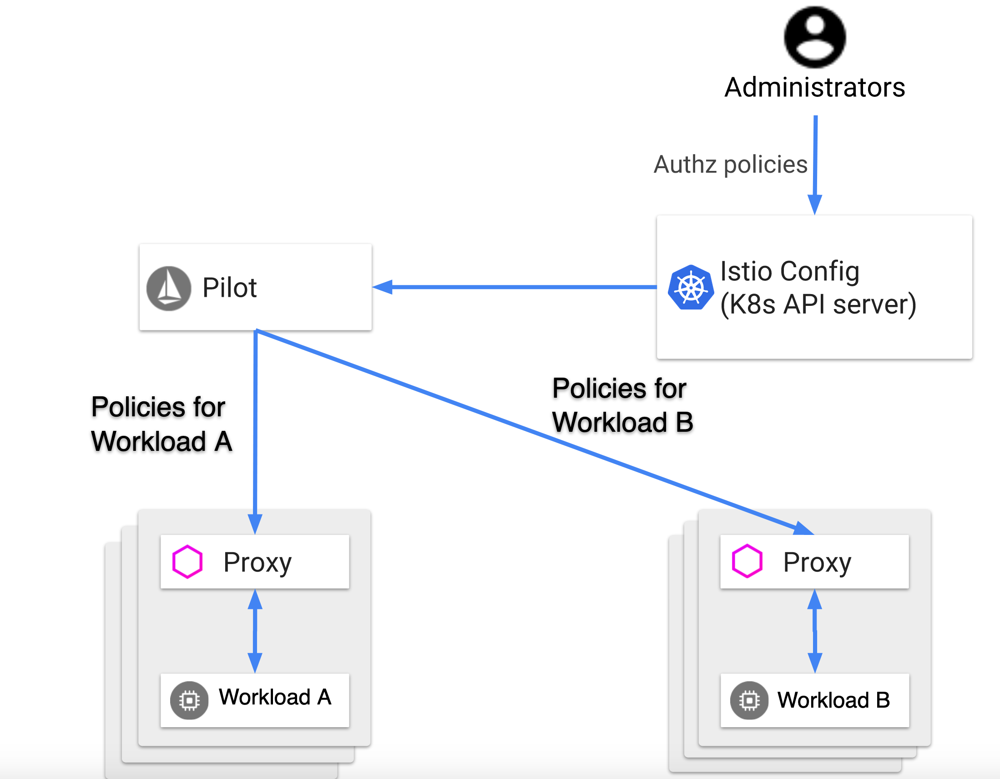
**images/chapter 14 - istio authorization.png**

Authroization is based on authorization polices. Each policy has a selector (what workloads it applies to) and rules (who is allowed to access a resource and under what conditions). 

If no policy is defined on a workload all requests are allowed. However, if a policy is defined for a workload only requests that are allowed by a rule in the policy are allowed. There is no way to define exclusion rules.

Here is an AuthorizationPolicy that allows two sources (service account cluster.local/ns/default/sa/sleep and namespace dev) to access the workloads with labels app: httpbin and version: v1 in namespace foo when the request is sent with a valid JWT token.

```
apiVersion: security.istio.io/v1beta1
kind: AuthorizationPolicy
metadata:
 name: httpbin
 namespace: foo
spec:
 selector:
   matchLabels:
     app: httpbin
     version: v1
 rules:
 - from:
   - source:
       principals: ["cluster.local/ns/default/sa/sleep"]
   - source:
       namespaces: ["dev"]
   to:
   - operation:
       methods: ["GET"]
   when:
   - key: request.auth.claims[iss]
     values: ["https://accounts.google.com"]
```

The granularity doesn't have to be at the workload level. We can limit the access to specific endpoints and methods too.
We can specify the operation using prefix match, suffix match or presence match in addition to exact match. For example, the following policy allows access to all paths that start with `/test/` and all the path that end in `/info`. The allowed methods are GET and HEAD only:  

```
apiVersion: security.istio.io/v1beta1
kind: AuthorizationPolicy
metadata:
  name: tester
  namespace: default
spec:
  selector:
    matchLabels:
      app: products
  rules:
  - to:
    - operation:
        paths: ["/test/*", "*/info"]
        methods: ["GET", "HEAD"]
```

If we want to get even more fancy we can specify conditions. For example, we can allow only requests with a specific header. Here is a policy that requires a version header with a value of v1 or v2:

```
apiVersion: security.istio.io/v1beta1
kind: AuthorizationPolicy
metadata:
 name: httpbin
 namespace: foo
spec:
 selector:
   matchLabels:
     app: httpbin
     version: v1
 rules:
 - from:
   - source:
       principals: ["cluster.local/ns/default/sa/sleep"]
   to:
   - operation:
       methods: ["GET"]
   when:
   - key: request.headers[version]
     values: ["v1", "v2"]
```

For TCP services the `paths` and `methods` fields of the operation don't apply. Istio will simply ignore them. But, we can specify policies for specific ports:

```
apiVersion: "security.istio.io/v1beta1"
kind: AuthorizationPolicy
metadata:
  name: mongodb-policy
  namespace: default
spec:
 selector:
   matchLabels:
     app: mongodb
 rules:
 - from:
   - source:
       principals: ["cluster.local/ns/default/sa/bookinfo-ratings-v2"]
   to:
   - operation:
       ports: ["27017"]
``` 

It is possible to plug in other authorization mechanisms by extending the Mixer, but it is frowned upon. It's best to stick to Istio authorization, which is very powerful and flexible.

Let's move on to the topic of custom policies.

## Policies

Istio is very flexible and lets us enable and define various custom policies to control how requests are handled. Here are some of the policies we can apply:

- Dynamically rate limit traffic to a service
- Whitelisting, blacklisting and denying access to services
- Rewriting headers
- Redirecting requests
- Custom authorization policies

Policies are powered by the Mixer adapter model. The mixer abstracts away infrastructure backends such as telemetry systems, access control systems, quota enforcements systems, billing systems, etc. The mixer adapter operate on a generic set of attributes that it receives from Envoy and feeds to adapter that know how to interact with the infrastructure backends. The operators (you and me) can configure the Mixer with policies that based on the attribute define behaviors for the adapter. Here is a diagram that illustrate the interactions between the different components.

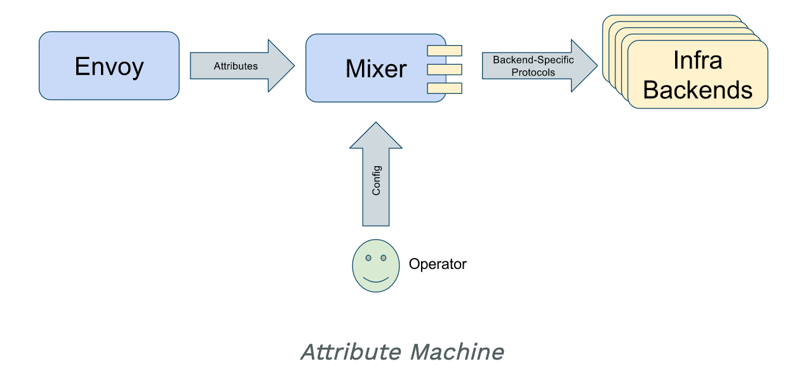
**images/chapter 14 - mixer.png**


Custom policies are not trivial. You have to understand the various objects involved and how to configure them correctly. Also, policy enforcement is disabled by default. If we don't enable it Istio will ignore our policies.
 
 It is configured in the `istio` ConfigMap. Here is how to verify that:

```
$ kubectl -n istio-system get cm istio -o jsonpath="{@.data.mesh}" | grep disablePolicyChecks
disablePolicyChecks: true
```

Here is an easy way to enable it:

```
$ istioctl manifest apply --set values.global.disablePolicyChecks=false
```

If it doesn't work. You can directly edit the ConfigMap:

```
$ kubectl edit -n istio-system cm istio
```
 
Now, we can apply some policies. For example, here is how to apply rate limit policy:

```
$ kubectl apply -f policy/mixer-rule-productpage-ratelimit.yaml

handler.config.istio.io/quotahandler created
instance.config.istio.io/requestcountquota created
quotaspec.config.istio.io/request-count created
quotaspecbinding.config.istio.io/request-count created
rule.config.istio.io/quota created 
``` 

This created several objects: a handler, an instance a quota spec, a quota spec binding and finally a rule that ties all of them together.

Let's take a look at these objects and see how they collaborate to implement rate limiting. The instance is an instance of a quota template. It defines the dimensions, which in this case are the source, destination and destination version.

```
$ kubectl -n istio-system get instance requestcountquota -o yaml

apiVersion: config.istio.io/v1alpha2
kind: instance
metadata:
  generation: 1
  name: requestcountquota
spec:
  compiledTemplate: quota
  params:
    dimensions:
      destination: destination.labels["app"] | destination.service.name | "unknown"
      destinationVersion: destination.labels["version"] | "unknown"
      source: request.headers["x-forwarded-for"] | "unknown"
```

The handler here is a memquota adapter. For production system it is recommended to use a redis adapter. The spec defines multiple quota schemes. First a default quota of 500 request per second:
 
```
spec:
  compiledAdapter: memquota
  params:
    quotas:
    - name: requestcountquota.instance.istio-system 
      maxAmount: 500
      validDuration: 1s      
```
 
Then, it defines overrides for specific services. For example, for the reviews service only one request is allowed every 5 seconds.   

```
      overrides:
      - dimensions:
          destination: reviews
        maxAmount: 1
        validDuration: 5s
```

The productpage service allows 2 requests every 5 seconds:

```
      - dimensions:
          destination: productpage
        maxAmount: 2
        validDuration: 5s
```

Unless the source has IP address 10.28.11.20, in which case it's back to 500 request per second:

```
      - dimensions:
          destination: productpage
          source: 10.28.11.20
        maxAmount: 500
        validDuration: 1s
```

When a request is rejected due to a rate limit the mixer will return a RESOURCE_EXHAUSTED message to Envoy, which will return HTTP 429 status code to the caller.

The rule just ties together the quota instance with the handler.

```
$ kubectl -n istio-system get rule quota -o yaml

apiVersion: config.istio.io/v1alpha2
kind: rule
metadata:
  generation: 1
  name: quota
  namespace: istio-system
spec:
  actions:
  - handler: quotahandler
    instances:
    - requestcountquota
```

The policy can be applied restricted to a namespace. When the namespace is istio-system it applies to the entire service mesh.

Let's look at one of the areas where Istio provides tremendous value - telemetry.

## Monitoring and Observability

Instrumenting your application for telemetry is a thankless job. You need to log, collect metrics and create spans for tracing. This has several downsides:

- It takes time and effort to do it in the first place
- It takes more time and effort to ensure it is consistent across all the services in your cluster
- You can easily miss some important instrumentation point or configure it incorrectly
- If you want to change your log provider or distributed tracing solution you might need to modify all your services
- It litters your code with lots of stuff that obscures th business logic
- You might need to explicitly turn it off for testing   

What if all of it was taken care of automatically and never require any code changes? That's the promise of service mesh telemetry. Of course you may need to do some work especially if you want to capture custom metrics or do some specific logging. If your system is divided into coherent microservices along boundaries that really represent your domain and workflows then Istio can help you get decent instrumentation right out of the box. The idea is that Istio can keep track of what's going on in the seams between your services.

### Logs

Istio can be configured for log collection similar to the way we defined policies. The following command will create a log instance and a log handler:

```
$ kubectl apply -f telemetry/log-entry.yaml
instance.config.istio.io/newlog created
handler.config.istio.io/newloghandler created
```

It uses the logentry template and the stdio built-in adapter. On Kubernetes the logs are collected as the container logs of the mixer. You can find them via the following command:

```
$ kubectl -n istio-system logs -l istio-mixer-type=telemetry | rg newlog
{"level":"warn","time":"2020-01-24T19:27:11.752616Z","instance":"newlog.instance.istio-system","destination":"details","latency":"1.708946ms","responseCode":200,"responseSize":178,"source":"productpage","user":"unknown"}
{"level":"warn","time":"2020-01-24T19:27:11.912198Z","instance":"newlog.instance.istio-system","destination":"details","latency":"1.756211ms","responseCode":200,"responseSize":178,"source":"productpage","user":"unknown"}
{"level":"warn","time":"2020-01-24T19:27:11.918363Z","instance":"newlog.instance.istio-system","destination":"reviews","latency":"29.029062ms","responseCode":200,"responseSize":375,"source":"productpage","user":"unknown"}
{"level":"warn","time":"2020-01-24T19:27:11.758456Z","instance":"newlog.instance.istio-system","destination":"reviews","latency":"4.624288ms","responseCode":200,"responseSize":295,"source":"productpage","user":"unknown"}
{"level":"warn","time":"2020-01-24T19:27:11.918611Z","instance":"newlog.instance.istio-system","destination":"reviews","latency":"27.833674ms","responseCode":200,"responseSize":375,"source":"productpage","user":"unknown"}
istio-mixer-type=telemetry
```

As you can see each log entry contains the log level, the time stamp, source, the destination, the response code and the latency.  

It is also possible to access the Envoy logs if necessary. Note that the Envoy logs are disabled by default. You can enable them in the istio ConfigMap by setting the accessLogFile to /dev/output.

Here are the Envoy logs of the productpage service: 

```
$ kb logs -l app=productpage -c istio-proxy
[2020-01-24T19:27:11.565Z] "GET /reviews/0 HTTP/1.1" 200 - "-" "-" 0 375 19 19 "-" "Mozilla/5.0 (Macintosh; Intel Mac OS X 10_14_6) AppleWebKit/537.36 (KHTML, like Gecko) Chrome/79.0.3945.130 Safari/537.36" "f482f9a7-2033-945f-8885-fd55038fb3ce" "reviews:9080" "172.17.0.18:9080" outbound|9080||reviews.bookinfo.svc.cluster.local - 10.96.145.169:9080 172.17.0.24:54918 - default
[2020-01-24T19:27:11.547Z] "GET /productpage HTTP/1.1" 200 - "-" "-" 0 5282 40 40 "172.17.0.1" "Mozilla/5.0 (Macintosh; Intel Mac OS X 10_14_6) AppleWebKit/537.36 (KHTML, like Gecko) Chrome/79.0.3945.130 Safari/537.36" "f482f9a7-2033-945f-8885-fd55038fb3ce" "192.168.64.6:30828" "127.0.0.1:9080" inbound|9080|http|productpage.bookinfo.svc.cluster.local - 172.17.0.24:9080 172.17.0.1:0 - default
[2020-01-24T19:27:11.752Z] "GET /details/0 HTTP/1.1" 200 - "-" "-" 0 178 1 1 "-" "Mozilla/5.0 (Macintosh; Intel Mac OS X 10_14_6) AppleWebKit/537.36 (KHTML, like Gecko) Chrome/79.0.3945.130 Safari/537.36" "d3c13544-fc06-9e49-8aeb-077608d70316" "details:9080" "172.17.0.27:9080" outbound|9080||details.bookinfo.svc.cluster.local - 10.96.117.135:9080 172.17.0.24:56584 - default
[2020-01-24T19:27:11.758Z] "GET /reviews/0 HTTP/1.1" 200 - "-" "-" 0 295 5 5 "-" "Mozilla/5.0 (Macintosh; Intel Mac OS X 10_14_6) AppleWebKit/537.36 (KHTML, like Gecko) Chrome/79.0.3945.130 Safari/537.36" "d3c13544-fc06-9e49-8aeb-077608d70316" "reviews:9080" "172.17.0.21:9080" outbound|9080||reviews.bookinfo.svc.cluster.local - 10.96.145.169:9080 172.17.0.24:54928 - default
[2020-01-24T19:27:11.747Z] "GET /productpage HTTP/1.1" 200 - "-" "-" 0 4286 18 18 "172.17.0.1" "Mozilla/5.0 (Macintosh; Intel Mac OS X 10_14_6) AppleWebKit/537.36 (KHTML, like Gecko) Chrome/79.0.3945.130 Safari/537.36" "d3c13544-fc06-9e49-8aeb-077608d70316" "192.168.64.6:30828" "127.0.0.1:9080" inbound|9080|http|productpage.bookinfo.svc.cluster.local - 172.17.0.24:9080 172.17.0.1:0 - default
[2020-01-24T19:27:11.912Z] "GET /details/0 HTTP/1.1" 200 - "-" "-" 0 178 1 1 "-" "Mozilla/5.0 (Macintosh; Intel Mac OS X 10_14_6) AppleWebKit/537.36 (KHTML, like Gecko) Chrome/79.0.3945.130 Safari/537.36" "9f6f8d93-fb3f-98b7-9911-1b1e74aabfbf" "details:9080" "172.17.0.27:9080" outbound|9080||details.bookinfo.svc.cluster.local - 10.96.117.135:9080 172.17.0.24:56596 - default
[2020-01-24T19:27:11.918Z] "GET /reviews/0 HTTP/1.1" 200 - "-" "-" 0 375 29 28 "-" "Mozilla/5.0 (Macintosh; Intel Mac OS X 10_14_6) AppleWebKit/537.36 (KHTML, like Gecko) Chrome/79.0.3945.130 Safari/537.36" "9f6f8d93-fb3f-98b7-9911-1b1e74aabfbf" "reviews:9080" "172.17.0.18:9080" outbound|9080||reviews.bookinfo.svc.cluster.local - 10.96.145.169:9080 172.17.0.24:54940 - default
[2020-01-24T19:27:11.906Z] "GET /productpage HTTP/1.1" 200 - "-" "-" 0 5282 43 43 "172.17.0.1" "Mozilla/5.0 (Macintosh; Intel Mac OS X 10_14_6) AppleWebKit/537.36 (KHTML, like Gecko) Chrome/79.0.3945.130 Safari/537.36" "9f6f8d93-fb3f-98b7-9911-1b1e74aabfbf" "192.168.64.6:30828" "127.0.0.1:9080" inbound|9080|http|productpage.bookinfo.svc.cluster.local - 172.17.0.24:9080 172.17.0.1:0 - default
[Envoy (Epoch 0)] [2020-01-24 19:36:20.012][19][warning][config] [bazel-out/k8-opt/bin/external/envoy/source/common/config/_virtual_includes/grpc_stream_lib/common/config/grpc_stream.h:91] gRPC config stream closed: 13,
[Envoy (Epoch 0)] [2020-01-24 20:06:38.171][19][warning][config] [bazel-out/k8-opt/bin/external/envoy/source/common/config/_virtual_includes/grpc_stream_lib/common/config/grpc_stream.h:91] gRPC config stream closed: 13,
```

The format of the Envoy logs is text, but you can configure it to be JSON, by setting the `accessLogEncoding` to JSON in the ConfigMap. You can even set the format of the logs.

On Kubernetes, you can use fluentd to send all these logs to a centralized logging system.

Let's deploy a complete EFK (Elastic search, Kibana, Fluentd) logging stack and see how it integrates with Istio. 
We will run the following command (the logging-stack.yaml file is in the code directory):

```
$ kubectl apply -f logging-stack.yaml
namespace/logging created
service/elasticsearch created
deployment.apps/elasticsearch created
service/fluentd-es created
deployment.apps/fluentd-es created
configmap/fluentd-es-config created
service/kibana created
deployment.apps/kibana created
```

The stack is deployed in its own logging namespace. We need to configure Istio to send its logs through fluentd. As usual this done, by going through the Mixer and defining Instance, Handler and Rule:

```
$ kubectl apply -f telemetry/fluentd-istio.yaml
instance.config.istio.io/newlog created
handler.config.istio.io/handler created
rule.config.istio.io/newlogtofluentd created
``` 

The next step is make Kibana - the logging UI - accessible:

```
kubectl -n logging port-forward $(kubectl -n logging get pod -l app=kibana -o jsonpath='{.items[0].metadata.name}') 5601:5601
```

Now, we can browse to http://localhost:5601 and start playing with Kibana. Here is what it looks like:

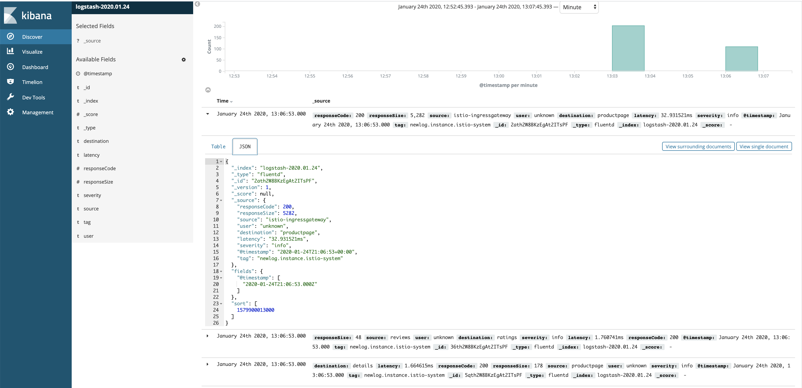
**images/chapter 14 - kibana-ui.png**

That pretty much covers logging with Istio. Let's see what Istio has to offer for metrics. 

### Metrics

Istio collects three types of metrics:

- Proxy metrics
- Control plane metrics
- Service metrics

The collected metrics cover all traffic into, from and inside the service mesh. As operators we need to configure Istio. Istio follows the four golden signals doctrine and records the latency, traffic, errors and saturation. 

Istio installs Prometheus and Grafana as its metrics collection and visualization backend.

To setup metrics collection let's run the following command:

```
$ kubectl apply -f telemetry/metrics.yaml
instance.config.istio.io/doublerequestcount created
handler.config.istio.io/doublehandler created
rule.config.istio.io/doubleprom created
```


Here is an example of Proxy-level metrics:

```
envoy_cluster_internal_upstream_rq{response_code_class="2xx",cluster_name="xds-grpc"} 7163
envoy_cluster_upstream_rq_completed{cluster_name="xds-grpc"} 7164
envoy_cluster_ssl_connection_error{cluster_name="xds-grpc"} 0
envoy_cluster_lb_subsets_removed{cluster_name="xds-grpc"} 0
envoy_cluster_internal_upstream_rq{response_code="503",cluster_name="xds-grpc"} 1
```

And here is an example of service-level metric:

```
istio_requests_total{
  connection_security_policy="mutual_tls",
  destination_app="details",
  destination_principal="cluster.local/ns/default/sa/default",
  destination_service="details.default.svc.cluster.local",
  destination_service_name="details",
  destination_service_namespace="default",
  destination_version="v1",
  destination_workload="details-v1",
  destination_workload_namespace="default",
  reporter="destination",
  request_protocol="http",
  response_code="200",
  response_flags="-",
  source_app="productpage",
  source_principal="cluster.local/ns/default/sa/default",
  source_version="v1",
  source_workload="productpage-v1",
  source_workload_namespace="default"
} 214
```

We can also collect metrics for TCP services. Let's install v2 of the ratings service that uses MongoDB (a TCP service):

```
$ kb apply -f platform/kube/bookinfo-ratings-v2.yaml
serviceaccount/bookinfo-ratings-v2 created
deployment.apps/ratings-v2 created
```

Next. we install MongoDB itself:

```
$ kb apply -f platform/kube/bookinfo-db.yaml
service/mongodb created
deployment.apps/mongodb-v1 created
```

Finally, we need to create virtual services for the reviews and ratings service:

```
$ kb apply -f networking/virtual-service-ratings-db.yaml
virtualservice.networking.istio.io/reviews configured
virtualservice.networking.istio.io/ratings configured
```

At this point we can expose Prometheus:

```
kubectl -n istio-system port-forward $(kubectl -n istio-system get pod -l app=prometheus -o jsonpath='{.items[0].metadata.name}') 9090:9090 &
```

We can view the slew of new metrics available from both Istio services, Istio control plane and especially Envoy. Here is a very small subset of the available metrics:

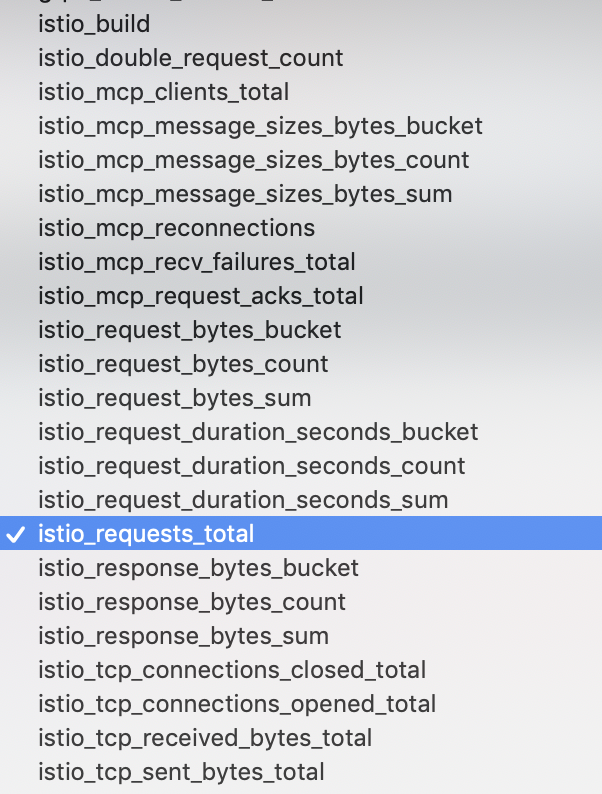
**images/chapter 14 - istio metrics.png**

The last pillar of observability is distributed tracing.

### Distributed Tracing    

Istio configures the Envoy proxies to generate trace spans for theie associated services. The services thmeselves are responsible to forward the request context. Istio can work with multiple tracing backends such as:

- Gaeger
- Zipkin
- LightStep
- DataDog

Here the request headers that services should propagate (only some may be present for each request depending on the tracing backend):

```
    x-request-id
    x-b3-traceid
    x-b3-spanid
    x-b3-parentspanid
    x-b3-sampled
    x-b3-flags
    x-ot-span-context 
    x-cloud-trace-context
    traceparent
    grpc-trace-bin
```

The sampling rate of traces is controlled by an environment variable  of the Pilot: `PILOT_TRACE_SAMPLING`:

```
$ kubectl -n istio-system get deploy istio-pilot -o yaml | grep "name: PILOT_TRACE_SAMPLING" -A 1
        - name: PILOT_TRACE_SAMPLING
          value: "100"
```

The demo profile of BookInfo samples 100% of the requests, we can change it to a lower rate with granularity of 0.01. The default is 1%.

Now, we can start the Jaeger UI and explore the traces:

```
$ istioctl dashboard jaeger
http://localhost:52466
Handling connection for 9090
```

Your browser will automatically open and you should see the familiar Jaeger dashboard where you can select a service and search for traces:

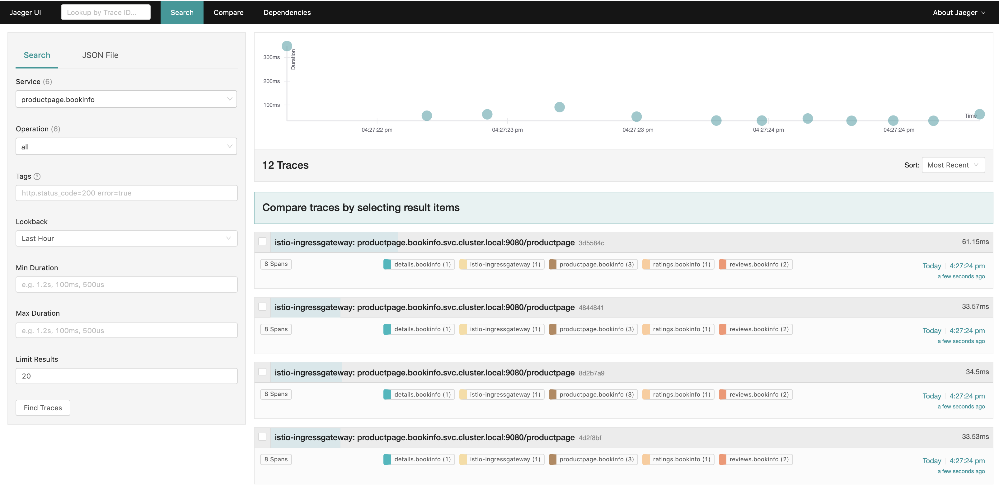
**images/chapter 14 - istio jaeger ui.png**

You can click on a trace to see a detailed view of the flow of the request through the system:

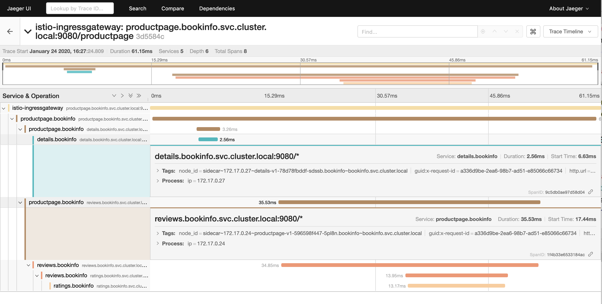
**images/chapter 14 - jaeger trace details.png**

We've seen a lot of different tools with their own UI. Let's look at dedicated service mesh visualization.


### Visualizing your service mesh with Kiali

Kiali is an open source project that ties together Prometheus, Grafana and Jaeger to provide an observability console to your Istio service mesh. It can answer questions like:

- What microservices participate in the Istio service mesh?
- How are these microservices connected?
- How are these microservices performing?

It has various views and it really allow to slice and dice your service mesh with zooming in and out, filtering and selecting various properties to display. It's got several views that you can switch between. Here is the overview page:

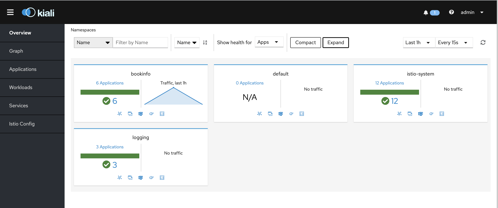
**images/chapter 14 - kiali overview.png**

But, the most interesting view is the graph view that can show your services, how they relate to each other and is fully aware of versions, requests flowing between different workloads including percentage of requests and latency. It can show both HTTP and TCP services and really provide a great picture of how your service mesh behaves.

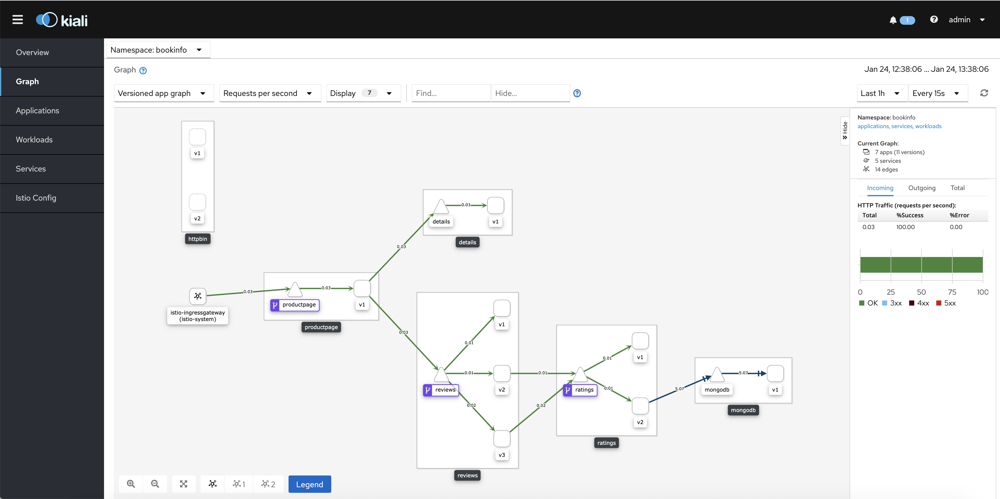
**images/chapter 14 - kiali ui.png**
 
# Summary

In this chapter we did a very comprehensive study of service meshes on Kubernetes. Service meshes are here to stay. They are simply the right way to operate a complex distributed system. Separating all the operations concerns to the proxies and having the service mesh to control them is a paradigm shift. Kubernetes of course is designed primarily for complex distributed systems, so the value of the service mesh becomes clear right away. It is also great to see that there are many options for service meshes on Kubernetes. While most service meshes are not specific to Kubernetes, it is one of the most important deployment platforms. In addition, we did a thorough review of Istio - arguably the service mesh with the most momentum - and took it through it paces. We demonstrated many of the benefits of service meshes and how it integrates with various other systems. You should be able to evaluate how useful a service mesh can be for your system and if you should deploy it and start enjoying the benefits.

In the next chapter, we look at the myriad ways that we can extend Kubernetes and take advantage of its modular and flexible design. This is one of the hallmarks of Kubernetes and why it was adopted so quickly by so many communities.
