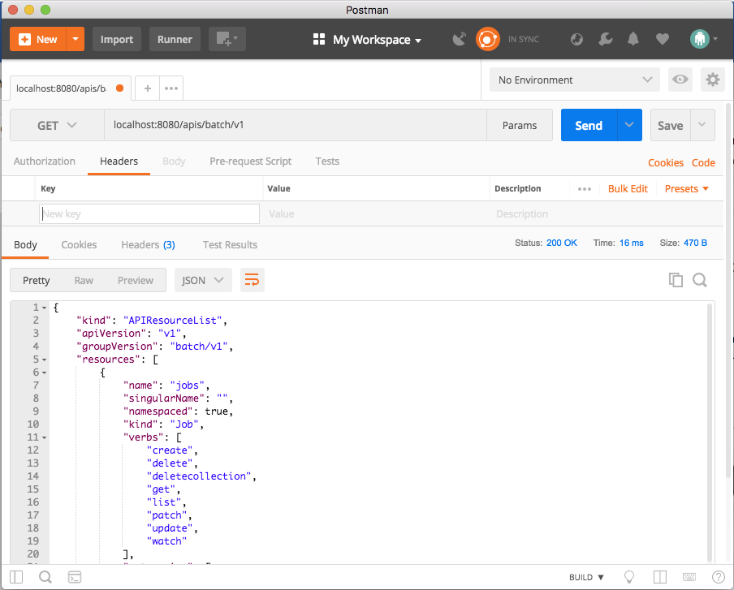
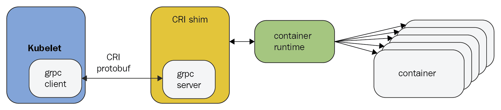
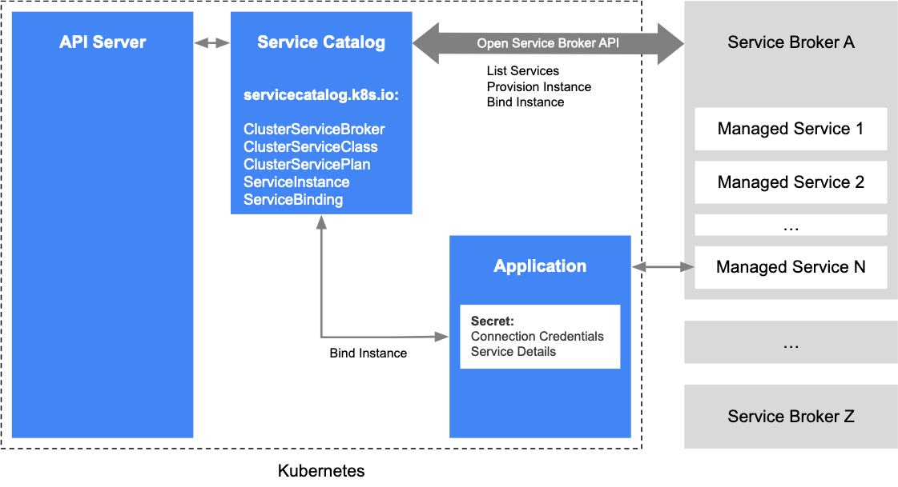
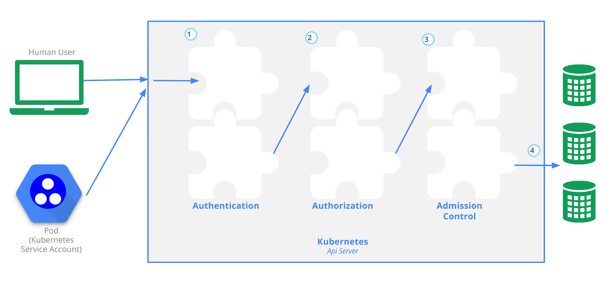

# Overview

In this chapter, we will dig deep into the guts of Kubernetes. We will start with
the Kubernetes API and learn how to work with Kubernetes programmatically via direct access to the API, the Python client, and automating Kubectl. Then, we'll look into extending the Kubernetes API with custom resources. The last part is all about the various plugins Kubernetes supports. Many aspects of Kubernetes operation are modular and designed for extension. We will examine the API aggregation layer and several types of plugins, such as custom schedulers, authorization, admission control, custom metrics and volumes. Finally, we'll look into extending Kubectl and adding your own commands

The covered topics are as follows:

- Working with the Kubernetes API
- Extending the Kubernetes API
- Writing Kubernetes and Kubectl plugins
- Writing webhooks

# Working with the Kubernetes API

The Kubernetes API is comprehensive and encompasses the entire functionality of Kubernetes. As you may expect, it is huge. But it is designed very well using best practices, and it is consistent. If you understand the basic principles, you can discover everything you need to know.

## Understanding OpenAPI

OpenAPI allows API providers to define their operations and models, and enables developers to automate their tools and generate their favorite language's client to talk to that API server. Kubernetes has supported Swagger 1.2 (an older version of the OpenAPI spec) for a while, but the spec was incomplete and invalid, making it hard to generate tools/clients based on it.

In Kubernetes 1.4, alpha support was added for the OpenAPI spec (formerly known as Swagger 2.0 before it was donated to the OpenAPI Initiative) by upgrading the current models and operations. In Kubernetes 1.5, support for the OpenAPI spec has been completed by auto-generating the spec directly from Kubernetes source, which will keep the spec and documentation completely in sync with future changes in  operations in operations/models.

The new spec enables better API documentation and and an auto-generated Python client that we will explore later.

The spec is modular and divided by group version. This is future-proof. You can run multiple API servers that support different versions. Applications can transition gradually to newer versions.

The structure of spec is explained in detail in the OpenAPI spec definition. The Kubernetes team used the operation's tags to separate each group version and fill in as much information as possible about paths/operations and models. For a specific operation, all parameters, methods of call, and responses are documented. The result is impressive.

## Setting up a proxy

To simplify access you can use Kubectl to set up a proxy:

```
$ kubectl proxy --port 8080
```

Now, you can access the API server on http://localhost:8080 and it will reach the same Kubernetes API server that Kubectl is configured for.

## Exploring the Kubernetes API directly

The Kubernetes API is highly discoverable. You can just browse to the URL of the API server at http://localhost:8080 and get a nice JSON document that describes all the available operations under the paths key.

Here is a partial list due to space constraints:

```
{
  "paths": [
    "/api",
    "/api/v1",
    "/apis",
    "/apis/apps",
    "/apis/storage.k8s.io/v1",
    .
    .
    .
    "/healthz",
    "/healthz/ping",
    "/logs",
    "/metrics",
    "/swaggerapi/",
    "/ui/",
    "/version"
  ]
}
```

You can drill down any one of the paths. For example, here is the response from `/api/v1/namespaces/default` endpoint:

```
{
    "apiVersion": "v1",
    "kind": "Namespace",
    "metadata": {
        "creationTimestamp": "2017-12-25T10:04:26Z",
        "name": "default",
        "resourceVersion": "4",
        "selfLink": "/api/v1/namespaces/default",
        "uid": "fd497868-e95a-11e7-adce-080027c94384"
    },
    "spec": {
        "finalizers": [
            "kubernetes"
        ]
    },
    "status": {
        "phase": "Active"
    }
}
```

I discovered this endpoint by going first to `/api`, then discovered `/api/v1`,
which told me there is `/api/v1/namespaces` that pointed me to `/api/v1/namespaces/default`.

### Using Postman to explore the Kubernetes API

Postman (https://www.getpostman.com) is a very polished application for working with RESTful APIs. If you lean more to the GUI side, you may find it extremely useful.

The following screenshot shows the available endpoints under the batch V1
API group:



**images/chapter 15 - postman.png**

Postman has a lot of options and it organizes the information in a very pleasing way. Give it a try.

### Filtering the output with httpie and jq

The output from the API can be too verbose sometimes. Often, you're interested just in one value out of a huge chunk of JSON response. For example, if you want to get the names of all running services you can hit the `/api/v1/services` endpoint. The response, however, includes a lot of additional information that is irrelevant. Here is a very partial subset of the output:

```
$ http http://localhost:8080/api/v1/services
{
    "apiVersion": "v1",
    "items": [
        {
            "metadata": {
                "creationTimestamp": "2020-02-02T05:18:30Z",
                "labels": {
                    "component": "apiserver",
                    "provider": "kubernetes"
                },
                "name": "kubernetes",
                …
            },
            "spec": {
                …
            },
            "status": {
                "loadBalancer": {}
            }
        },
        …
    ],
    "kind": "ServiceList",
    "metadata": {
        "resourceVersion": "1076",
        "selfLink": "/api/v1/services"
    }
}
```

The complete output is 121 lines long! Let's see how to use httpie and jq to gain full control over the output and show only the names of the services. I prefer (https://httpie.org/) over cURL for interacting with REST APIs on the command-line. The jq (https://stedolan.github.io/jq/) command-line JSON processor is great for slicing and dicing JSON.

Examining the full output, you can see that the service name is in the metadata section of each item in the items array. The jq expression that will select just the name is as follows:

```
.items[].metadata.name
```

Here is the full command and output:

```
$ http http://localhost:8080/api/v1/services | jq .items[].metadata.name
"kubernetes"
"kube-dns"
"kubernetes-dashboard"
```

## Creating a pod via the Kubernetes API

The API can be used for creating, updating, and deleting resources too. Unlike working with kubectl, the API require specifying the manifests in JSON and not YAML syntax (although every JSON document is also valid YAML). Here is a JSON pod definition (nginx-pod.json):

```
{
  "kind": "Pod",
  "apiVersion": "v1",
  "metadata":{
    "name": "nginx",
    "namespace": "default",
    "labels": {
      "name": "nginx"
    }
  },
  "spec": {
    "containers": [{
                     "name": "nginx",
                     "image": "nginx",
                     "ports": [{"containerPort": 80}]
                   }]
  }
}
```

The following command will create the pod via the API:

```
$ http POST http://localhost:8080/api/v1/namespaces/default/pods @nginx-pod.json
```

To verify it worked, let's extract the name and status of the current pods. The endpoint is `/api/v1/namespaces/default/pods`

The jq expression is `items[].metadata.name,.items[].status.phase`.

Here is the full command and output:

```
$ FILTER='.items[].metadata.name,.items[].status.phase'
$ http http://localhost:8080/api/v1/namespaces/default/pods | jq $FILTER
"nginx"
"Running"
```

## Accessing the Kubernetes API via the Python client

Exploring the API interactively using httpie and jq is great, but the real power of APIs comes when you consume and integrate them with other software. The Kubernetes incubator project provides a full-fledged and very well-documented Python client library. It is available at https://github.com/kubernetes-incubator/client-python.

First, make sure you have Python installed (either 2.7 or 3.5+) work. Then install the Kubernetes package:

```
$ pip install kubernetes
```

To start talking to a Kubernetes cluster, you need to connect to it. Start an interactive Python session:

```
$ python
Python 3.8.0 (default, Nov 28 2019, 16:12:10)
[Clang 10.0.1 (clang-1001.0.46.4)] on darwin
Type "help", "copyright", "credits" or "license" for more information.
>>>
```

The Python client can read your Kubectl config:

```
>>> from kubernetes import client, config
>>> config.load_kube_config()

>>> v1 = client.CoreV1Api()
```

Or it can connect directly to an already running proxy:

```
>>> from kubernetes import client, config
>>> client.Configuration().host = 'http://localhost:8080'
>>> v1 = client.CoreV1Api()
```

Note that the client module provides methods to get access to different group versions, such as CoreV1API.

### Dissecting the CoreV1API group

Let's dive in and understand the CoreV1API group. The Python object has 397 public attributes!

```
>>> attributes = [x for x in dir(v1) if not x.startswith('__')]
>>> len(attributes)
397
```

We ignore the attributes that start with double underscores because those are special class/instance methods unrelated to Kubernetes.

Let's pick ten random methods and see what they look like:

```
>>> import random
>>> from pprint import pprint as pp
>>> pp(random.sample(attributes, 10))
['list_namespaced_secret',
 'connect_post_namespaced_pod_proxy',
 'patch_namespaced_replication_controller_with_http_info',
 'patch_node_status_with_http_info',
 'replace_persistent_volume',
 'read_namespaced_service_status',
 'read_namespaced_replication_controller_status',
 'list_namespaced_secret_with_http_info',
 'replace_namespaced_event_with_http_info',
 'replace_namespaced_resource_quota_with_http_info']
 ```

Very interesting. The attributes begin with a verb such as list, patch, or read. Many of them have a notion of a namespace and many have a `with_http_info` suffix. To understand better, let's count how many verbs exist and how many attributes use each verb (where the verb is the first token before the underscore):

```
>>> from collections import Counter
>>> verbs = [x.split('_')[0] for x in attributes]
>>> pp(dict(Counter(verbs)))
{'api': 1,
 'connect': 96,
 'create': 36,
 'delete': 56,
 'get': 2,
 'list': 56,
 'patch': 48,
 'read': 52,
 'replace': 50}
```

We can drill further and look at the interactive help for a specific attribute:

```
>>> help(v1.create_node)


Help on method create_node in module kubernetes.client.apis.core_v1_api:

create_node(body, **kwargs) method of kubernetes.client.apis.core_v1_api.CoreV1Api instance
    create a Node
    This method makes a synchronous HTTP request by default. To make an
    asynchronous HTTP request, please pass async_req=True
    >>> thread = api.create_node(body, async_req=True)
    >>> result = thread.get()

    :param async_req bool
    :param V1Node body: (required)
    :param str pretty: If 'true', then the output is pretty printed.
    :param str dry_run: When present, indicates that modifications should not be persisted. An invalid or unrecognized dryRun directive will result in an error response and no further processing of the request. Valid values are: - All: all dry run stages will be processed
    :param str field_manager: fieldManager is a name associated with the actor or entity that is making these changes. The value must be less than or 128 characters long, and only contain printable characters, as defined by https://golang.org/pkg/unicode/#IsPrint.
    :return: V1Node
             If the method is called asynchronously,
             returns the request thread.
```

You can poke around yourself and learn more about the API. Let's look at some common operations, such as listing, creating, watching, and deleting objects.

### Listing objects

You can list different kinds of object. The method names start with `list_`. Here is an example listing all namespaces:

```
>>> for ns in v1.list_namespace().items:
...     print(ns.metadata.name)
...
default
kube-public
kube-system
```

### Creating objects

To create an object, you need to pass a body parameter to the create method. The body must be a Python dictionary that is equivalent to a YAML configuration file you would use with Kubectl. The easiest way to do it is to actually use a YAML and then use the Python YAML module (not part of the standard library and must be installed separately) to read the YAML file and load it into a dictionary. For example, to create an nginx-deployment with 3 replicas, we can use this YAML configuration file (nginx-deployment.yaml):

```
apiVersion: apps/v1
kind: Deployment
metadata:
  name: nginx-deployment
spec:
  replicas: 3
  selector:
    matchLabels:
      app: nginx  
  template:
    metadata:
      labels:
        app: nginx
    spec:
      containers:
        - name: nginx
          image: nginx:1.17.8
          ports:
            - containerPort: 80
```

To install the yaml Python module, type this command:

```
$ pip install yaml
```

Then the following Python 3 program (create_nginx_deployment.py) will create the deployment:

```
from os import path
import yaml
from kubernetes import client, config

def main():

    # Configs can be set in Configuration class directly or using
    # helper utility. If no argument provided, the config will be
    # loaded from default location.
    config.load_kube_config()

    with open(path.join(path.dirname(__file__),
                        'nginx-deployment.yaml')) as f:

        dep = yaml.safe_load(f)
        k8s = client.AppsV1Api()
        dep = k8s.create_namespaced_deployment(body=dep,
                                               namespace="default")
        print(f"Deployment created. status='{dep.status}'")


if __name__ == '__main__':
    main()
```

### Watching objects

Watching objects is an advanced capability. It is implemented using a separate watch module. Here is an example to watch for 10 namespace events and print them to the screen (watch_demo.py):

```
from kubernetes import client, config, watch

# Configs can be set in Configuration class directly or using helper utility
config.load_kube_config()
v1 = client.CoreV1Api()

count = 3
w = watch.Watch()
for event in w.stream(v1.list_namespace, _request_timeout=60):
    print(f"Event: {event['type']} {event['object'].metadata.name}")
    count -= 1
    if count == 0:
        w.stop()
print('Done.')
```

Here is the output:

```
$ python watch_demo.py
Event: ADDED default
Event: ADDED kube-public
Event: ADDED kube-system
Done.
```

### Invoking Kubectl programmatically

If you're not a Python developer and don't want to deal with the REST API directly or client libraries, you have another option. Kubectl is used mostly as an interactive command-line tool, but nothing is stopping you from automating it and invoking it through scripts and programs. There are some benefits for using Kubectl as your Kubernetes API client:

- Easy to find examples for any usage
- Easy to experiment on the command line to find the right combination of commands and arguments
- Kubectl supports output in JSON or YAML for quick parsing
- Authentication is built-in via Kubectl configuration

### Using Python subprocess to run Kubectl

I'll use Python again, so you can compare using the official Python client versus rolling your own. Python has a module called subprocess that can run external processes such as Kubectl and capture the output. Here is a Python 3 example running Kubectl on its own and displaying the beginning of the usage output:

```
>>> import subprocess
>>> out = subprocess.check_output('kubectl').decode('utf-8')
>>> print(out[:276])

>>> import subprocess
>>> out = subprocess.check_output('kubectl').decode('utf-8')
>>> print(out[:276])
kubectl controls the Kubernetes cluster manager.

 Find more information at: https://kubernetes.io/docs/reference/kubectl/overview/

Basic Commands (Beginner):
  create         Create a resource from a file or from stdin.
  expose         Take a replication controller, servic
```


The check_checkout() function captures the output as a bytes array that needs to be decoded to utf-8 to display it properly. We can generalize it a little bit and create a convenience function called k() in the `k.py` file. It accepts any number of arguments it feeds to Kubectl, and then decodes the output and returns it:

```
from subprocess import check_output

def k(*args):
    out = check_output(['kubectl'] + list(args))
    return out.decode('utf-8')
```

Let's use it to list all the running pods in the default namespace:

```
>>> from k import k
>>> print(k('get', 'po'))
>>> from k import k
>>> print(k('get', 'po'))
NAME                                                      READY   STATUS             RESTARTS   AGE
nginx                                                     1/1     Running            0          4h48m
nginx-deployment-679f9c75b-c79mv                          1/1     Running            0          132m
nginx-deployment-679f9c75b-cnmvk                          1/1     Running            0          132m
nginx-deployment-679f9c75b-gzfgk                          1/1     Running            0          132m
```

This is nice for display, but Kubectl already does that. The real power comes when you use the structured output options with the -o flag. Then the result can be converted automatically to a Python object. Here is a modified version of the k() function that accepts a boolean use_json keyword argument (default to False), and if True adds `-o json` and then parses the JSON output to a Python object (dictionary):

```
from subprocess import check_output
import json

def k(*args, use_json=False):
    cmd = ['kubectl'] + list(args)
    if use_json:
        cmd += ['-o', 'json']
    out = check_output(cmd).decode('utf-8')
    if use_json:
        out = json.loads(out, )

    return out
```

That returns a full-fledged API object, which can be navigated and drilled down just like when accessing the REST API directly or using the official Python client:

```
>>> for r in result['items']:
...     print(r['metadata']['name'])
...
nginx-deployment-679f9c75b-c79mv
nginx-deployment-679f9c75b-cnmvk
nginx-deployment-679f9c75b-gzfgk
```

Let's see how to delete the deployment and wait until all the pods are gone. The Kubectl delete command doesn't accept the `-o json` option (although it has `-o name`), so let's leave out `use_json`:


```
k('delete', 'deployment', 'nginx-deployment')
while len(k('get', 'po', use_json=True)['items']) > 0:
    print('.')
print('Done.')

.
.
.
.
Done.
```

Now, that we accessed Kubernetes programmatically via its REST API and by controlling kubectl it's time to learn how to extend Kubernetes.

# Extending the Kubernetes API

Kubernetes is an extremely flexible platform. It was designed from the get go for extensibility and as it evolved more parts of Kubernetes were opened up, exposed thought robust interfaces and can be replaced by alternative implementations. I venture to say that the exponential adoption of Kubernetes across the board by startups, large companies, infrastructure providers and cloud providers is a direct result of Kubernetes providing a lot of capabilities out of the box, but allowing easy integration with other actors. In this section we will cover many of the available extensions points such as:

- User defined types (custom resources)
- API access extensions
- Infrastructure extensions
- Operators
- Scheduler extensions
 
Let's understand the various ways you can extend Kubernetes.

## Understanding Kubernetes extensions points and patterns

Kubernetes is made of multiple components: API server, etcd state store, controller manager, kube-proxy, kubelet and container runtime. You can extend and customize deeply each and every one of these components as well as add your own custom components that watch and react to events, handle new requests and modify everything about incoming requests.

The following diagram shows some of the available extension points and how they are connected to various Kubernetes components:


**images/chapter 15 - extension points.png**

### Extending Kubernetes with plugins

Kubernetes defines several interfaces that allows it to interact with a wide variety of plugins by infrastructure providers. We discussed some of these interfaces and plugins in detail in previous chapters. We will just list them here for completeness:

CNI - the container networking interface supports a large number of networking solutions for connecting nodes and containers
CSI - the container storage interface supports a large number of storage options for Kubernetes.
Device plugins - allow a node to discover new node resources beyond cpu and memory (e.g. gpu) 

### Extending Kubernetes with the cloud controller manager

Kubernetes needs to be deployed eventually on some nodes and use some storage and networking resources. Initially Kubernetes supported only the Google cloud platform  and AWS. Other cloud providers had to customize multiple Kubernetes core components (Kubelet, Kubernetes Controller Manager, Kubernetes API server) in order to integrate with Kubernetes. The Kubernetes developers identified it as a problem for adoption and created the cloud controller manager (AKA CCM). The CCM  cleanly defines the interaction between Kubernetes and the infrastructure layer it is deployed on. Now, cloud provider just provide an implementation of the CCM tailored to their infrastructure and they can utilize upstream Kubernetes without costly and error-prone modification to the Kubernetes code. All the Kubernetes components interact with the CCM via the predefined interfaces and Kubernetes is blissfully unaware which cloud (or no cloud) it is running on. The following diagram demonstrates the interaction between Kubernetes and a cloud provider via the CCM:

![Cloud controller manager(images/ chapter 15 - cloud controller manager.png)
**images/ chapter 15 - cloud controller manager.png** 

If you want to learn more about CCM check out this concise article I wrote a couple of years ago: https://medium.com/@the.gigi/kubernetes-and-cloud-providers-b7a6227d3198

### Extending Kubernetes with webhooks

Plugins run in the cluster, but in some cases a better extensibility pattern is to delegate some function to out of cluster service. This is very common in the area of access control where companies and organization may already have centralized solution for identity and access control. In those cases the webhook extensibility pattern is useful. The idea is that you can configure Kubernetes with an endpoint (webhook). Kubernetes will call the endpoint where you can implement your own custom functionality and the Kubernetes will take action based on the response. We've seen this pattern when we discussion authentication, authorization and dynamic admission control.

Kubernetes defines the the expected payloads for each webhook. The webhook implementation must adhere to them in order to successfully interact with Kubernetes.

### Extending Kubernetes with controllers and operators

The controller pattern is where you write a program that can run inside the cluster or outside the cluster, watches for events and responds to them. The conceptual model for a controller is to reconcile the current state of the cluster (the parts the controller is interested in) with a desired state. A common practice for controllers is to read the .spec of an object, take some actions and update its .status. A lot of the core logic of Kubernetes is implemented by a large set of controllers managed by the controller manager, but there is nothing stopping us from deploying our own controllers to the cluster or running controllers that access the API server remotely. 

The operator pattern is another flavor of the controller pattern. Think of an operator as a controller that also has its own set of custom resources that represents some application it manages. The goal of operators is to manage the lifecycle of some application that is deployed in the cluster. A great example is the etcd-operator: https://github.com/coreos/etcd-operator

If you plan to build your own controllers I recommend to start with [kubebuilder](https://github.com/kubernetes-sigs/kubebuilder). It is a project maintained by the Kubernetes API Machinery SIG and has support for defining multiple custom APIs using CRDs, and scaffolds out the controller code to watch these resources.

For operators consider using the [Operator framework](https://github.com/operator-framework) as your starting point.

### Extending Kubernetes scheduling

Kubernetes' job in one sentence is to schedule pods to nodes. Scheduling is at the heart of what Kubernetes does and it does it well. The Kubernetes scheduler can be configured in very advanced ways (daemon sets, taints, tolerations, etc). But, still the Kubernetes developer recognize that there may be extraordinary circumstances where you may want to control the core scheduling algorithm. It is possible to replace the core Kubernetes scheduler with your own scheduler or run another scheduler side by side the build-in scheduler to control the scheduling of a subset of the pods. We will see how to do that lter in the chapter.  

### Extending Kubernetes with custom container runtimes

Kubernetes originally supported only Docker as a container runtime. The Docker support was embedded in the core Kubernetes codebase. Later, dedicated support for rkt was added. But, the Kubernetes developers saw the light and introduced the CRI (container runtime interface) a gRPC interface, which enabled any container runtime that implements it to communicate with the kubelet. Eventually, the hard-coded support for Docker and rkt was phased out and now the kubelet talks to the container runtime only though CRI.


**images/chapter 15 - cri.png**

Since the introduction of CRI the number of container runtimes that work with Kubernetes exploded.

## Introducing custom resources

One of the primary ways to extend Kubernetes is to define new types of resources called custom resources.  What can you do with custom resources? Plenty. You can use them to manage through the Kubernetes API resources that live outside the Kubernetes cluster, but your pods communicate with. By adding those external resources as custom resources, you get a full picture of your system and you benefit from many Kubernetes API features such as the following:

- Custom CRUD REST endpoints
- Versioning
- Watches
- Automatic integration with generic Kubernetes tooling

Other use cases for custom resources are metadata for custom controllers and automation programs.

Custom resources that were introduced in Kubernetes 1.7 are a significant improvement over the now deprecated third-party resources. Let's dive in and see what custom resources are all about.

In order to play nice with the Kubernetes API server, custom resources must conform to some basic requirements. Similar to built-in API objects, they must have the following fields:

- apiVersion: apiextensions.k8s.io/v1
- metadata: Standard Kubernetes object metadata
- kind: CustomResourceDefinition
- spec: Describes how the resource appears in the API and tools
- status: Indicates the current status of the CRD

The spec has internal structure that includes fields like group, names, scope, validation and version. The status includes the fields acceptedNames and Conditions. In the next section I'll show you an example that clarifies the meaning of these fields

## Developing custom resource definitions

You develop your custom resources using custom resource definitions AKA CRD. The intention is for CRDs to integrate smoothly with Kubernetes, its API and tooling so you need to provide a lot of information. Here is an example for a custom resource called Candy:

```
apiVersion: apiextensions.k8s.io/v1
kind: CustomResourceDefinition
metadata:
  # name must match the spec fields below, and be in the form: <plural>.<group>
  name: candies.awesome.corp.com
spec:
  # group name to use for REST API: /apis/<group>/<version>
  group: awesome.corp.com
  # version name to use for REST API: /apis/<group>/<version>
  versions:
    - name: v1
      # Each version can be enabled/disabled by Served flag.
      served: true
      # One and only one version must be marked as the storage version.
      storage: true
      schema:
        openAPIV3Schema:
          type: object
          properties:
            spec:
              type: object
              properties:
                flavor:
                  type: string
  # either Namespaced or Cluster
  scope: Namespaced
  names:
    # plural name to be used in the URL: /apis/<group>/<version>/<plural>
    plural: candies
    # singular name to be used as an alias on the CLI and for display
    singular: candy
    # kind is normally the CamelCased singular type. Your resource manifests use this.
    kind: Candy
    # shortNames allow shorter string to match your resource on the CLI
    shortNames:
      - cn
```

The Candy CRD has several interesting parts. The metadata has a fully qualified name that should be unique since CRDs are cluster-scoped. The spec has a versions entry, which can contain multiple versions with a schema for each version that specifies the field of the custom resource. The schema is follows the [OpenAPI V3](https://github.com/OAI/OpenAPI-Specification/blob/master/versions/3.0.0.md#schemaObject) specification. 
The scope field could be either Namespaced or Cluster. If the scope is Namespaced then the custom resources you create from the CRD will exist only in the namespace they were created in, which Cluster-scoped custom resources are available in any namespace. 
Finally the names section refers to the names of the custom resource (not the name of the CRD from the metadata section). The names have plural, singular, kind and short names options.

Let's create the CRD:

```
$ kubectl create -f candy-crd.yaml
customresourcedefinition.apiextensions.k8s.io/candies.awesome.corp.com created
```

Note, that the metadata name is returned. It is common to use a plural name. Now, let's verify we can access it:

```
$ kubectl get crd
NAME                       CREATED AT
candies.awesome.corp.com   2020-02-08T10:19:09Z
```

There is also an API endpoint for managing this new resource:

```
/apis/awesome.corp.com/v1/namespaces/<namespace>/candies/
```

## Integrating custom resources

Once the CustomResourceDefinition object has been created, you can create custom resources of that resource kind, in particular, Candy in this case (candy becomes CamelCase Candy). Custom resources must respect the schema from the CRD. In the following example, the flavor field is set on the Candy object with a name of chocolate. The apiVersion field is derived from the CRD spec's group and versions fields:

```
apiVersion: awesome.corp.com/v1
kind: Candy
metadata:
  name: chocolate
spec:
  flavor: sweeeeeeet
```

Let's create it:

```
$ k create -f chocolate.yaml
candy.awesome.corp.com/chocolate created
```

Note that the spec must contain the `flavor` field from the schema. 

At this point, kubectl can operate on Candy objects just like it works on built-in objects. Note that resource names are case-insensitive when using kubectl:

```
$ kubectl get candies
NAME        AGE
chocolate   2m
```

We can also view the raw JSON data using the standard `-o json` flag. Let's use the short name cn this time:

```
$ kubectl get cn -o json
{
    "apiVersion": "v1",
    "items": [
        {
            "apiVersion": "awesome.corp.com/v1",
            "kind": "Candy",
            "metadata": {
                "creationTimestamp": "2020-02-08T10:22:25Z",
                "generation": 1,
                "name": "chocolate",
                "namespace": "default",
                "resourceVersion": "1664",
                "selfLink": "/apis/awesome.corp.com/v1/namespaces/default/candies/chocolate",
                "uid": "1b04f5a9-9ae8-475d-bc7d-245042759304"
            },
            "spec": {
                "flavor": "sweeeeeeet"
            }
        }
    ],
    "kind": "List",
    "metadata": {
        "resourceVersion": "",
        "selfLink": ""
    }
}
```

### Dealing with unknown fields

The schema in the spec was introduced with the `apiextensions.k8s.io/v1` version of CRDs that became stable in Kubernetes 1.17. With `apiextensions.k8s.io/v1beta` schema wasn't required so arbitrary fields were the way to go. If you just try to change the version of your CRD from v1beta to v1 you're in for a rude awakening. Kubernetes will let you update the CRD, but when you try to create a custom resource later with unknown fields it will fail.  

You must define a schema for all your CRDs. If you must deal with custom resources that may have additional unknown fields you can turn validation off, but the additional fields will be stripped off.

Here is a Candy resource that has an extra field `texture` not specified in the schema:

```
apiVersion: awesome.corp.com/v1
kind: Candy
metadata:
  name: gummy-bear
spec:
  flavor: delicious
  texture: rubbery
```

If we try to create it with validation it will fail:

```
$ kubectl create -f gummy-bear.yaml
error: error validating "gummy-bear.yaml": error validating data: ValidationError(Candy.spec): unknown field "texture" in com.corp.awesome.v1.Candy.spec; if you choose to ignore these errors, turn validation off with --validate=false
```

But, if we follow turn validation off then all is well, except that only the flavor field will be present and the texture field will not:

```
$ kubectl create -f gummy-bear.yaml --validate=false
candy.awesome.corp.com/gummy-bear created

$ kubectl get cn gummy-bear -o yaml
apiVersion: awesome.corp.com/v1
kind: Candy
metadata:
  creationTimestamp: "2020-02-08T22:02:18Z"
  generation: 1
  name: gummy-bear
  namespace: default
  resourceVersion: "93551"
  selfLink: /apis/awesome.corp.com/v1/namespaces/default/candies/gummy-bear
  uid: 1900b97e-55ba-4235-8366-24f469f449e3
spec:
  flavor: delicious
```

If you want to add arbitrary fields you need to turn validation off with `--validate=false`.

### Finalizing Custom Resources

Custom resources support finalizers just like standard API objects. A finalizer is a mechanism where objects are not deleted immediately but have to wait for special controllers that run in the background and watch for deletion requests. The controller may perform any necessary cleanup options and then remove its finalizer from target object. There may be multiple finalizers on an object. Kubernetes will wait until all finalizers have been removed and only then delete the object. The finalizers in the metadata are just arbitrary strings that their corresponding controller can identify. Kubernetes doesn't know what they mean. It just waits patiently for all the finalizers to be removed before deleting the object. Here is an example with a candy object that has two finalizers: `eat-me` and `drink-me`:

```
apiVersion: awesome.corp.com/v1
kind: Candy
metadata:
  name: chocolate
  finalizers:
  - eat-me
  - drink-me
spec:
  flavor: sweeeeeeet

```

### Adding custom printer columns

By default when you list custom resources with kubectl you get only the name and the age of the resource:

```
$ kubectl get cn
NAME         AGE
chocolate    11h
gummy-bear   16m
```

But, the CRD schema allows for adding your own columns. Let's add the flavor and the ageas printable columns to our candy objects:

```
apiVersion: apiextensions.k8s.io/v1
kind: CustomResourceDefinition
metadata:
  name: candies.awesome.corp.com
spec:
  group: awesome.corp.com
  versions:
    - name: v1
        ...
      additionalPrinterColumns:
        - name: Flavor
          type: string
          description: The flavor of the candy
          jsonPath: .spec.flavor
        - name: Age
          type: date
          jsonPath: .metadata.creationTimestamp
   ... 
```

Then we can create it, add our candies again and list them:

```
$ kubectl create -f candy-with-flavor-crd.yaml
customresourcedefinition.apiextensions.k8s.io/candies.awesome.corp.com created

$ kubectl create -f chocolate.yaml
candy.awesome.corp.com/chocolate created

$ kubectl create -f gummy-bear.yaml --validate=false
candy.awesome.corp.com/gummy-bear created

$ kubectl get candies
NAME         FLAVOR       AGE
chocolate    sweeeeeeet   64s
gummy-bear   delicious    59s
```


## Understanding API server aggregation

CRDs are great when all you need is some CRUD operations on your own types. You can just piggy back on the Kubernetes API server, which will store your objects and provide API support and integration with tooling like kubectl. If you need more power you can run controllers that watch for your custom resources and perform some operations when they are created, updated or deleted. The [kubebuilder](https://github.com/kubernetes-sigs/kubebuilder) project is a great framework for building Kubernetes APIs on top of CRDs with your own controllers.

But, CRDs have limitations. If you need more advanced features and customization you can use API server aggregation and write your own API server that the Kubernetes API server will delegate to. Your API server will use the same API machinery as the Kubernetes API server itself. Some of the advanced capabilities are that are only available through the aggregation layer are:


- Makes your apiserver adopt different storage APIs rather than etcd v3
    Extends long-running subresources/endpoints like websocket for your own resources
    Integrates your apiserver with whatever other external systems


- Control the storage of your objects (custom resources are always stored in etcd)
- Provide long-running like web sockets for your own resources
- Custom operations beyond CRUD (e.g. exec or scale)
- Using protocol buffers payloads
- Integrate your API server with any external system

Writing an extension API server is a non-trivial effort. If you decide you need all that power I recommend using the API builder alpha project: https://github.com/kubernetes-sigs/apiserver-builder-alpha

It is a young project, but it takes care of a lot of the necessary boilerplate code. The API builder provides the following capabilities:

- Bootstrap complete type definitions, controllers, tests as well as documentation
- An the extension control plane you can run locally, inside minikube or on an actual remote cluster.
- Your generated controllers will be able to watch and update API objects
- Adding resources (including sub-resources)
- Default values you can override if needed

## Utilizing the service catalog

The Kubernetes [service catalog](https://github.com/kubernetes-sigs/service-catalog) project allows you to integrate smoothly and painlessly any external service that support the Open Service Broker API specification: https://github.com/openservicebrokerapi/servicebroker

The intention of open service broker API is to expose external services to any cloud environment through a standard specification with supporting documentation and  comprehensive test suite. That lets providers implement a single specification and support multiple cloud environments. The current environments include Kubernetes and CloudFoundry. The project works towards broad industry adoption.

The service catalog is useful in particular for integrating the services of cloud platform providers. Here are some example of such services:

- Microsoft Azure Cloud Queue
- Amazon Simple Queue Service
- Google Cloud Pub/Sub

The following diagram describes the architecture and workflow of the service catalog, which is implemented as an API server extension using the aggregation layer:


**images/chapter 15 - service catalog.png**

This capability is a real boon for organizations that are committed to the cloud. You get to build your system on Kubernetes, but you don't have to deploy, manage and maintain every service in your cluster yourself. You can offload that to your cloud provider, enjoy deep integration and focus on your application.

The service catalog can potentially make your Kubernetes cluster fully autonomous by allowing you to provision cloud resources through service brokers. We're not there yet, but the direction is very promising.

This concludes our discussion of accessing and extending Kubernetes from the outside. In the next section, we will direct our gaze inward and look into customizing the inner workings of Kubernetes itself via plugins.

# Writing Kubernetes plugins

In this section, we will dive into the guts of Kubernetes and learn to take advantage of its famous flexibility and extensibility. We will learn about different aspects that can be customized via plugins and how to implement such plugins and integrate them with Kubernetes.

## Writing a custom scheduler

Kubernetes is all about orchestrating containerized workloads. The most fundamental responsibility is to schedule pods to run on cluster nodes. Before we can write our own scheduler we need to understand how scheduling works in Kubernetes.  

### Understanding the design of the Kubernetes scheduler

The Kubernetes scheduler has a very simple role - when a new pod needs to be created assign it to a target node. That's it. The Kubelet on the target node will take it from there and instruct the container runtime on the node to runs the pod's container.

The Kubernetes scheduler implements the Controller pattern:

- Watch for pending pods
- Select the proper node for the pod
- Update the node's spec by setting the nodeName field

The only complicated part is selecting the target node. This process involved two steps:

1. Filtering nodes
2. Ranking nodes

The scheduler takes a tremendous amount of information and configuration into account. Filtering removes nodes that don't satisfy one of the hard constraints from the candidate list. Ranking nodes assigns a score for each of the remaining nodes and choosing the best node.

Here are the factors the scheduler evaluates when filtering nodes:

- Check if a Node has free ports for the Pod ports the Pod is requesting.
- Checks if a Pod specifies a specific Node by its hostname.
- Check if the Node has enough resources (cpu, memory etc) to meet the requirement of the Pod.
- Check if the Pod’s Node Selector matches the Node’s labels.
- Evaluate if the Volumes that the Pod requests are available on the Node, given the failure zone restrictions for that storage.
- Check if a Pod can fit on a Node due to the volumes it requests, and those that are already mounted.
- Decides how many CSI volumes should be attached, and whether that’s over a configured limit.
- Check if a Node is reporting memory pressure.
- Check if a Node is reporting that process IDs are scarce.
- Check if a Node is reporting a filesystem is full or nearly full
- Check other conditions reported by the node like networking is unavailable or kubelet is not ready.
- Checks if a Pod’s tolerations can tolerate the Node’s taints .
- Check if a Pod can fit due to the volumes it requests.

Once the nodes have been filtered the scheduler will score the modes based the following policies (that you can configure):

- Spread pods across hosts, considering Pods that belong to the same Service , StatefulSet or ReplicaSet .
- Inter Pod affinity priority
- Least requested priority - favors nodes with fewer requested resources. This policy spreads pods across all nodes of the cluster
- Most requestedPriority - favors nodes with most requested resources. This policy will pack the pods into the smallest set of nodes.
- Requested to capacity ratio priority: creates a requestedToCapacity based ResourceAllocationPriority using default resource scoring function shape.
- Balanced resource allocation: favors nodes with balanced resource usage.
- Node prefer avoid pods priority: prioritizes nodes according to the node annotation scheduler.alpha.kubernetes.io/preferAvoidPods. You can use this to hint that two different Pods shouldn’t run on the same Node.
- Node affinity priority: Prioritizes nodes according to node affinity scheduling preferences indicated in PreferredDuringSchedulingIgnoredDuringExecution.
- Taint toleration priority: Prepares the priority list for all the nodes, based on the number of intolerable taints on the node. This policy adjusts a node’s rank taking that list into account.
- Image locality priority: Favors nodes that already have the container images the Pod required.
- Service spreading priority: Favor spreading the pods backing a service across different nodes
- Pod anti-affinity
- Equal priority map - all nodes get the same weight. No favorites.


As you see the default scheduler is very sophisticated and can be configured at a very fine-grained way to accommodate most of your needs. But, under some circumstances it might not be the best choice. In particular in large clusters with many nodes (hundreds or thousands), every time a pod is scheduled all the nodes need to go through this rigorous and heavyweight procedure of filtering and scoring. Now, consider situation where you need to schedule a large number of pods at once (e.g. training machine learning models). This can put a lot of pressure on your cluster and lead to performance issues.

Kubernetes has recently introduced ways to make the filtering and scoring process more lightweight by allowing to filter and score only some of the nodes, but still you may want better control.

Fortunately, Kubernetes allows influencing the scheduling process in several ways. Those ways include:

- Direct scheduling of pods to nodes
- Replacing the scheduler with your own scheduler
- Extending the scheduler with additional filters
- Adding another scheduler that runs side by side the default scheduler

### Scheduling pods manually

Guess what? we can just tel Kubernetes where to place our pod when we create the pod. All it takes is to specify a node name in the pod's spec and the scheduler will ignore it. If you think about the loosely-coupled nature of the controller pattern it all makes sense. The scheduler is watching for pending pods that DON'T have a node name assigned yet. If you are passing the node name yourself, then the Kubelet on the target node, who watches for pending pods that DO have a node name will just go ahead and make sure to create a new pod.

Here is a pod with a pre-defined node name:

```
apiVersion: v1
kind: Pod
metadata:
    name: some-pod-manual-scheduling
spec:
  containers:
    - name: some-container
      image: gcr.io/google_containers/pause:2.0
  nodeName: k3d-k3s-default-worker-1
  schedulerName: no-such-scheduler
```  

If we create and describe the pod we can see that It was indeed scheduled to the k3d-k3s-default-worker-1 node as requested.

```
$ kubectl describe po some-pod-manual-scheduling
Name:         some-pod-manual-scheduling
Node:         k3d-k3s-default-worker-1/172.19.0.4
Status:       Running
  ...
Containers:
  ...
Conditions:
  Type              Status
  Initialized       True
  Ready             True
  ContainersReady   True
  PodScheduled      True
Events:          <none>
```

Direct scheduling is useful also for troubleshooting when you want to schedule a temporary pod to a any tainted node without mucking around with adding tolerations.  


Let's create our own custom scheduler now.

### Preparing our own scheduler

Our scheduler will be super simple. It will just schedule all pending pods that request to be scheduled by the "custom-sceduler" to node k3d-k3s-default-worker-1. Here is the Python implementation that uses the kubernetes client package:

```
from kubernetes import client, config, watch


def schedule_pod(cli, name):
    target = client.V1ObjectReference()
    target.kind = 'Node'
    target.apiVersion = 'v1'
    target.name = 'k3d-k3s-default-worker-1'
    meta = client.V1ObjectMeta()
    meta.name = name
    body = client.V1Binding(metadata=meta, target=target)
    return cli.create_namespaced_binding('default', body)


def main():
    config.load_kube_config()
    cli = client.CoreV1Api()
    w = watch.Watch()
    for event in w.stream(cli.list_namespaced_pod, 'default'):
        o = event['object']
        if o.status.phase != 'Pending' or o.spec.scheduler_name != 'custom-scheduler':
            continue

        schedule_pod(cli, o.metadata.name)


if __name__ == '__main__':
    main()
```

If you want to run a custom scheduler long term then you should deploy it into the cluster just like any other workload. But, if you just want to play around with it or you're still developing your custom scheduler logic you can run it locally as long as it has the correct credentials to access the cluster and have permissions to watch for pending pods and update their node name. 

### Assigning pods to the custom scheduler

OK. We have a custom scheduler that we can run alongside the default scheduler. But how does Kubernetes choose which scheduler to use to schedule a pod when there are multiple schedulers? 

The answer is that Kubernetes doesn't care. The pod can specify which scheduler it wants to schedule it. The default scheduler will schedule any pod that doesn't specify the schedule or that specifies explicitly the "default-scheduler". Other custom schedulers should be responsible and only schedule pods that request them. If multiple schedulers try to schedule the same pod we will probably end up with multiple copies or naming conflicts.

For example, our simple custom scheduler is looking for pending pods that specify a scheduler name of  "custom-scheduler". All other pods will be ignored by it:

```
if o.status.phase != 'Pending' or o.spec.scheduler_name != 'custom-scheduler':
    continue
```

Here is a pod spec that specified the "custom-scheduler" in its spec:

```
apiVersion: v1
kind: Pod
metadata:
  name: some-pod-with-custom-scheduler
spec:
  containers:
    - name: some-container
      image: gcr.io/google_containers/pause:2.0
  schedulerName: custom-scheduler
```

What happens if our custom scheduler is not running and we try to create this pod?

```
$ kubectl create -f some-pod-with-custom-scheduler.yaml
pod/some-pod-with-custom-scheduler created

$ kubectl get po
NAME                             READY   STATUS    RESTARTS   AGE
some-pod-manual-scheduling       1/1     Running   0          23h
some-pod-with-custom-scheduler   0/1     Pending   0          25s
```

The pod is created just fine (meaning the kubernetes API server stored it in etcd), but it is pending, which means it wasn't scheduled yet. Since, it specified an explicit scheduler the default scheduler ignores it.

But, if we run our scheduler... it will immediately get scheduled:

```
python custom_scheduler.py
Waiting for pods to schedule
Scheduling pod some-pod-with-custom-scheduler
```

Now, we can see that the pod was assigned to a node and it is in a running state:

```
$ kubectl get pod -o wide
NAME                             READY   STATUS    IP          NODE                       
some-pod-manual-scheduling       1/1     Running   10.42.0.5   k3d-k3s-default-worker-1
some-pod-with-custom-scheduler   1/1     Running   10.42.0.8   k3d-k3s-default-worker-1
```

### Verifying that the pods were scheduled using the correct scheduler

We can look at the pod events and see that for pods scheduled using the default scheduler you can expect the following events:

```
$ kubectl describe po some-pod | grep Events: -A 10
Events:
  Type    Reason     Age        From                               Message
  ----    ------     ----       ----                               -------
  Normal  Scheduled  <unknown>  default-scheduler                  Successfully assigned default/some-pod to k3d-k3s-default-worker-0
  Normal  Pulled     12m        kubelet, k3d-k3s-default-worker-0  Container image "gcr.io/google_containers/pause:2.0" already present on machine
  Normal  Created    12m        kubelet, k3d-k3s-default-worker-0  Created container some-container
  Normal  Started    12m        kubelet, k3d-k3s-default-worker-0  Started container some-container
```

But, for our custom scheduler there is no `Scheduled` event:

```
$ k describe po some-pod-with-custom-scheduler | grep Events: -A 10
Events:
  Type    Reason   Age   From                               Message
  ----    ------   ----  ----                               -------
  Normal  Pulled   22m   kubelet, k3d-k3s-default-worker-1  Container image "gcr.io/google_containers/pause:2.0" already present on machine
  Normal  Created  22m   kubelet, k3d-k3s-default-worker-1  Created container some-container
  Normal  Started  22m   kubelet, k3d-k3s-default-worker-1  Started container some-container
```

That was a deep dive into scheduling and custom schedulers. Let's check out kubectl plugins 

## Writing kubectl plugins

Kubectl is the workhorse of the aspiring Kubernetes developer and admin. There are now very good visual tools like [k9s](https://github.com/derailed/k9s), [octant](https://github.com/vmware-tanzu/octant) and of course the Kubernetes dashboard. But, kubectl is the most complete way to work interactively with your cluster as well participate in automation workflows.

Kubectl encompasses an impressive list of capabilities, but you will often need to string together multiple commands or a long chain of parameters and accomplish some task. You may also want to run some additional tools installed in your cluster.

You can package such functionality as scripts or containers or any other way, but then you'll run into the issue of where to place them, how to discover them and how to manage them. Kubectl plugin gives you a one stop shop for those extended capabilities. For example, recently I needed to periodically list and move around files on SFTP server managed by a containerized application running on Kubernetes cluster. I quickly wrote a few kubectl plugins that took advantage of my KUBECONFIG credentials to get access to secrets in the cluster that contained the credentials to access the SFTP server and then implemented a lot of application-specific logic for accessing and managing those SFTP directories and files.

### Understanding kubectl plugins

Until Kubernetes 1.12 kubectl plugins required a dedicated YAML file where you specified various metadata and other files that implemented the functionality. In Kubernetes 1.12 kubectl started using the git extension model where any executable on your path with the prefix `kubectl-` is treated as a plugin.

Kubectl provides the `kubectl plugins list` command to list all your current plugins. This model was very successful with git and it is extremely simple now to add your own kubectl plugins.

If you added an executable called `kubectl-foo` then you can run it via `kubectl foo`. You can have nested commands too. Add kubectl-foo-bar to your path and run it via `kubectl foo bar`. If you want to use dashes in your commands then in your executable use underscores. For example, the executable `kubectl-do_stuff` can be run using `kubectl do-stuff`. 

The executable itself can be implemented in any language, have its own command-line arguments and flags and display its own usage and help information.

### Managing kubectl plugins with Krew

The lightweight plugin model is great for writing your own plugins, but what if you want to share your plugins with the community?
[Krew](https://github.com/kubernetes-sigs/krew) is a package manager for kubectl plugins that lets you discover, install and manage curated plugins. 

You can install krew with brew on mac or follow the installation instructions for other platforms. Krew is itself a kubectl plugin as its executable is kubectl-krew. This means you can either run it directly: `kubectl-krew` or through kubectl `kubectl krew`. If you have a `k` alias for `kubectl` you would probably prefer the latter:

```
$ k krew
  krew is the kubectl plugin manager.
  You can invoke krew through kubectl: "kubectl krew [command]..."
  
  Usage:
    krew [command]
  
  Available Commands:
    help        Help about any command
    info        Show information about a kubectl plugin
    install     Install kubectl plugins
    list        List installed kubectl plugins
    search      Discover kubectl plugins
    uninstall   Uninstall plugins
    update      Update the local copy of the plugin index
    upgrade     Upgrade installed plugins to newer versions
    version     Show krew version and diagnostics
  
  Flags:
    -h, --help      help for krew
    -v, --v Level   number for the log level verbosity
  
  Use "krew [command] --help" for more information about a command.
```  

Note that the `krew list` command shows only krew-managed plugins and not all kubectl plugins. It doesn't even show itself :-)

I recommend that you check out the available plugins. Some of them are very useful and they may give you an idea for writing your own plugins. Let's see how easy it is to write our own plugin. 

### Creating your own kubectl plugin

I was recently handed the unpleasant job of baby-sitting a critical application deployed in a Kubernetes cluster on GKE. The original development team wasn't around anymore and there were higher priorities than migrating it into our infrastructure on AWS. I noticed that some of the deployments owned multiple replica sets where the desired number of replicas is zero. There is nobody around to ask why these replica sets are still around. My guess is that it is an artifact or updates where the old replica set was scaled down to zero, while the new replica set was scaled up, but the old replica set was left there hanging of the deployment. Anyway, let's write a kubectl plugin that lists stale replica sets with zero replicas.

It turns out to be super simple. Let's use Python and the excellent sh module that lets us run command-line commands naturally from Python. In this case, we're just going to run kubectl itself and get all the replica sets with a custom columns format, then we're going to keep the replica sets that have zero replicas and display them with their owning deployment: 

```
#!/usr/bin/env python3
import sh


def main():
    """ """
    o = "-o custom-columns='NAME:.metadata.name,DEPLOYMENT:.metadata.ownerReferences[0].name,REPLICAS:.spec.replicas"
    all_rs = sh.kubectl.get.rs(o.split()).stdout.decode('utf-8').split('\n')
    all_rs = [r.split() for r in all_rs if r]
    results = ((name, deployment) for (name, deployment, replicas) in all_rs[1:] if replicas == '0')

    for name, deployment in results:
        print(name, deployment)

if __name__ == '__main__':
    main()
```

We can name the file `kubectl-show-stale_replica_sets` and run it with `kubectl show stale-replica-sets`. Before running it, we mustn't forget to make it executable:

```
$ chmod +x kubectl-show-stale_replica_sets

$ kubectl show stale-replica-sets
cool-app-559f7bd67c cool-app
cool-app-55dc8c5949 cool-app
mice-app-5bd847f99c nice-app
...
```

If you want to develop plugins and share them on Krew there is a more rigorous process there. I highly recommend developing the plugin in Go and take advantage of projects like the Kubernetes [cli-runtime](https://github.com/kubernetes/cli-runtime/) and the [krew-plugin-template](https://github.com/replicatedhq/krew-plugin-template) project.


Kubectl plugins are awesome, but there some gotchas you should be aware of.

### Kubectl plugin gotchas

I ran into some of this issues when working with kubectl plugins.

### Don't forget your shebangs!

If you don't specify a shebang for your executable you will get an obscure error message:

```
$ k show stale-replica-sets
exec format error
```

### Naming

Choosing a name for your plugin is not easy. Luckily there are some good guidelines: https://github.com/kubernetes-sigs/krew/blob/master/docs/NAMING_GUIDE.md 

Those naming guidelines are not just for Krew plugins, but make sense for any kubectl plugin.

### Overriding existing kubectl commands

I originally named the plugin `kubectl-get-stale_replica_sets`. In theory, kubectl should try to match the longest plugin name to resolve ambiguities. But, apparently it doesn't work with build-in commands like `kubectl get`. This is the error I got:

```
$ kubectl get stale-replica-sets
error: the server doesn't have a resource type "stale-replica-sets"
```

Renaming the `kubectl-show-stale_replica_sets` solved the problem.

### Flat namespace for Krew plugins

There space of kubectl plugins is flat. If you choose a generic plugin name like `kubectl-login` you'll have a lot of problems. Even if you qualify it with something like `kubectl-gcp-login` you maight conflict with some other plugin. This is a scalability problem. I think the solution should involve some strong naming scheme for plugins like DNS and then ability to define short names and aliases for convenience. 

Let's now take a look how to extend access control with webhooks.

# Employing access control webhooks

Kubernetes always provided ways for you to customize access control. In Kubernetes access control can be denoted as triple-A: Authentication, Authorization and Admission control. In early versions it was though plugins that required Go programming, installing into your cluster, registration and other invasive procedures. Now, Kubernetes lets you customize authentication, authorization and admission control web hooks. Here is the access control workflow:


**images/chapter 15 - access workflow.png**

## Using an authentication webhook

Kubernetes lets extend the authentication process by injecting a webhook for bearer tokens. It requires two pieces of information: how to access the remote authentication service and the duration of authentication decision (it defaults to two minutes).

To provide this information and enable authentication webhooks start the API server with the following command-line arguments:

```

- --authentication-token-webhook-config-file=<authentication config file> 
- --authentication-token-webhook-cache-ttl (how long to cache auth decisions, default to 2 minutes)
```

The configuration file uses the kubeconfig file format. Here is an example:

```
# Kubernetes API version
apiVersion: v1
# kind of the API object
kind: Config
# clusters refers to the remote service.
clusters:
  - name: name-of-remote-authn-service
    cluster:
      certificate-authority: /path/to/ca.pem         # CA for verifying the remote service.
      server: https://authn.example.com/authenticate # URL of remote service to query. Must use 'https'.

# users refers to the API server's webhook configuration.
users:
  - name: name-of-api-server
    user:
      client-certificate: /path/to/cert.pem # cert for the webhook plugin to use
      client-key: /path/to/key.pem          # key matching the cert

# kubeconfig files require a context. Provide one for the API server.
current-context: webhook
contexts:
- context:
    cluster: name-of-remote-authn-service
    user: name-of-api-sever
  name: webhook
```

Note that a client certificate and key must be provided to Kubernetes for mutual authentication against the remote authentication service.

The cache TTL is useful because often users will make multiple consecutive requests to Kubernetes. Having the authentication decision cached can save a lot of rounds trips to the remote authentication service.

When an API HTTP request comes in, Kubernetes extracts the bearer token from its headers and posts a TokenReview JSON request to the remote authentication service via the webhook:

```
{
  "apiVersion": "authentication.k8s.io/v1beta1",
  "kind": "TokenReview",
  "spec": {
    "token": "<bearer token from original request headers>"
  }
}
```

The remote authentication service will respond with a decision. The status authentication will either be "true" or "false". Here is an example of a successful authentication:

```
{
  "apiVersion": "authentication.k8s.io/v1beta1",
  "kind": "TokenReview",
  "status": {
    "authenticated": true,
    "user": {
      "username": "gigi@gg.com",
      "uid": "42",
      "groups": [
        "developers",
      ],
      "extra": {
        "extrafield1": [
          "extravalue1",
          "extravalue2"
        ]
      }
    }
  }
}
```

A rejected response is much more concise:

```
{
  "apiVersion": "authentication.k8s.io/v1beta1",
  "kind": "TokenReview",
  "status": {
    "authenticated": false
  }
}
```

## Using an authorization webhook

The authorization webhook is very similar to the authentication webhook. It requires just a configuration file, which is in the same format as the authentication webhook configuration file. There is no authorization caching because unlike authentication, the same user may make lots of requests to different API endpoints with different parameters and authorization decisions may be different, so caching is not a viable option.

You configure the webhook by passing the following command-line argument to the API server:

```--authorization-webhook-config-file=<configuration filename>```

When a request passes authentication, Kubernetes will send a SubjectAccessReview JSON object to the remote authorization service. It will contain the requesting user (and any user groups it belongs to) and other attributes like:
- requested API group
- namespace
- resource
- verb

```
{
  "apiVersion": "authorization.k8s.io/v1beta1",
  "kind": "SubjectAccessReview",
  "spec": {
    "resourceAttributes": {
      "namespace": "awesome-namespace",
      "verb": "get",
      "group": "awesome.example.org",
      "resource": "pods"
    },
    "user": "gigi@gg.com",
    "group": [
      "group1",
      "group2"
    ]
  }
}
```

The request will either be allowed:

```
{
  "apiVersion": "authorization.k8s.io/v1beta1",
  "kind": "SubjectAccessReview",
  "status": {
    "allowed": true
  }
}
```

Or denied with a reason:

```
{

  "apiVersion": "authorization.k8s.io/v1beta1",
  "kind": "SubjectAccessReview",
  "status": {
    "allowed": false,
    "reason": "user does not have read access to the namespace"
  }
}
```

A user may be authorized to access a resource, but not some non-resource attributes such as: /api, /apis, /metrics, /resetMetrics, /logs, /debug, /healthz, /swagger-ui/, /swaggerapi/, /ui, and /version.

Here is how to request access to the logs:

```
{
  "apiVersion": "authorization.k8s.io/v1beta1",
  "kind": "SubjectAccessReview",
  "spec": {
    "nonResourceAttributes": {
      "path": "/logs",
      "verb": "get"
    },
    "user": "gigi@gg.com",
    "group": [
      "group1",
      "group2"
    ]
  }
}
```

We can check using kubectl if we are authorized to perform some operation using the `can-i` command. For example, let's see if we can create deployments:

```
$ kubectl auth can-i create deployments
yes
```

We can also check if other users or service account are authorized to do something. The default service account is NOT allowed to create deployments

```
$ kubectl auth can-i create deployments --as default
no
```

## Using an admission control webhook

Dynamic admission control supports webhooks too. It is generally availabe since Kubernetes 1.16. You need to enable the  MutatingAdmissionWebhook and ValidatingAdmissionWebhook admission controllers using `--enable-admission-plugins=Mutating,ValidatingAdmissionWebhook`. There are several other admission controllers that the Kubernetes developers recommend to run (order matters):

```
--admission-control=NamespaceLifecycle,LimitRanger,ServiceAccount,DefaultStorageClass,DefaultTolerationSeconds,MutatingAdmissionWebhook,ValidatingAdmissionWebhook,ResourceQuota
```


### Configure webhook admission controller on the fly

The authentication and authorization webhooks must be configured when you start the API server. The admission control webhooks can be configured dynamically by creating MutatingWebhookConfiguration or ValidatingWebhookConfiguration API objects. Here is an example:

```
apiVersion: admissionregistration.k8s.io/v1
kind: ValidatingWebhookConfiguration
...
webhooks:
- name: admission-webhook.example.com
  rules:
  - operations: ["CREATE", "UPDATE"]
    apiGroups: ["apps"]
    apiVersions: ["v1", "v1beta1"]
    resources: ["deployments", "replicasets"]
    scope: "Namespaced"
  ...
```

An admission server access AdmissionReview requests such as:

```
{
  "apiVersion": "admission.k8s.io/v1",
  "kind": "AdmissionReview",
  "request": {
    "uid": "705ab4f5-6393-11e8-b7cc-42010a800002",
    "kind": {"group":"autoscaling","version":"v1","kind":"Scale"},
    "resource": {"group":"apps","version":"v1","resource":"deployments"},
    "subResource": "scale",
    "requestKind": {"group":"autoscaling","version":"v1","kind":"Scale"},
    "requestResource": {"group":"apps","version":"v1","resource":"deployments"},
    "requestSubResource": "scale",
    "name": "cool-deployment",
    "namespace": "cool-namespace",
    "operation": "UPDATE",
    "userInfo": {
      "username": "admin",
      "uid": "014fbff9a07c",
      "groups": ["system:authenticated","my-admin-group"],
      "extra": {
        "some-key":["some-value1", "some-value2"]
      }
    },

    "object": {"apiVersion":"autoscaling/v1","kind":"Scale",...},
    "oldObject": {"apiVersion":"autoscaling/v1","kind":"Scale",...},
    "options": {"apiVersion":"meta.k8s.io/v1","kind":"UpdateOptions",...},
    "dryRun": false
  }
}
```

If the request is admitted the response will be:

```
{
  "apiVersion": "admission.k8s.io/v1",
  "kind": "AdmissionReview",
  "response": {
    "uid": "<value from request.uid>",
    "allowed": true
  }
}
```

If the request is not admitted then allowed will be False. the admission server may provide a status section too with HTTP status code and message:

```
{
  "apiVersion": "admission.k8s.io/v1",
  "kind": "AdmissionReview",
  "response": {
    "uid": "<value from request.uid>",
    "allowed": false,
    "status": {
      "code": 403,
      "message": "You cannot do this because I say so!!!!"
    }
  }
}
``` 

## Providing custom metrics for horizontal pod autoscaling

Prior to Kubernetes 1.6 custom metrics were implemented as a Heapster model. In Kubernetes 1.6 new custom metrics API landed and matured gradually. As of Kubernetes 1.9 they are enabled by default. Custom metrics rely on API aggregation. The recommended path is to start with the custom metrics API server boilerplate available here: https://github.com/kubernetes-sigs/custom-metrics-apiserver

Then, you implement the CustomMetricsProvider interface:

```
type CustomMetricsProvider interface {
	// GetMetricByName fetches a particular metric for a particular object.
	// The namespace will be empty if the metric is root-scoped.
	GetMetricByName(name types.NamespacedName, 
                    info CustomMetricInfo, 
                    metricSelector labels.Selector) (*custom_metrics.MetricValue, error)

	// GetMetricBySelector fetches a particular metric for a set of objects matching
	// the given label selector.  The namespace will be empty if the metric is root-scoped.
	GetMetricBySelector(namespace string, selector labels.Selector, info CustomMetricInfo, metricSelector labels.Selector) (*custom_metrics.MetricValueList, error)

	// ListAllMetrics provides a list of all available metrics at
	// the current time.  Note that this is not allowed to return
	// an error, so it is reccomended that implementors cache and
	// periodically update this list, instead of querying every time.
	ListAllMetrics() []CustomMetricInfo
}
```


## Extending Kubernetes with custom storage

Volume plugins are yet another type of plugin. Prior to Kubernetes 1.8 you had to write a kubelet plugin that required resgistration with Kubernetes and linking with the Kubelet. Kubernetes 1.8 introduced the FlexVolum, which is much more versatile. Kubernetes 1.9 took it to the next level with the CSI (Container Storage Interface) that we covered in "Chapter 6 - Managing Storage". At this point if you need to write storage plugins CSI is the way to go. Since CSI uses the gRPC protocol the CSI plugin must implement the following gRPC interface:

```
service Controller {
  rpc CreateVolume (CreateVolumeRequest)
	returns (CreateVolumeResponse) {}

  rpc DeleteVolume (DeleteVolumeRequest)
	returns (DeleteVolumeResponse) {}

  rpc ControllerPublishVolume (ControllerPublishVolumeRequest)
	returns (ControllerPublishVolumeResponse) {}

  rpc ControllerUnpublishVolume (ControllerUnpublishVolumeRequest)
	returns (ControllerUnpublishVolumeResponse) {}

  rpc ValidateVolumeCapabilities (ValidateVolumeCapabilitiesRequest)
	returns (ValidateVolumeCapabilitiesResponse) {}

  rpc ListVolumes (ListVolumesRequest)
	returns (ListVolumesResponse) {}

  rpc GetCapacity (GetCapacityRequest)
	returns (GetCapacityResponse) {}

  rpc ControllerGetCapabilities (ControllerGetCapabilitiesRequest)
	returns (ControllerGetCapabilitiesResponse) {}  
}
```

This is not a trivial undertaking and typically only storage solution providers should implement CSI plugins.

# Summary

In this chapter, we covered three major topics: working with the Kubernetes API, extending the Kubernetes API, and writing Kubernetes plugins. The Kubernetes API supports the OpenAPI spec and is a great example of REST API design that follows all current best practices. It is very consistent, well organized, and well documented. Yet it is a big API and not easy to understand. You can access the API directly via REST over HTTP, using client libraries including the official Python client, and even by invoking Kubectl.

Extending the Kubernetes API involves defining your own custom resources and optionally extending the API server itself via API aggregation. Custom resources are most effective when you combine them with additional custom plugins or controllers  when controllers when you query and update them externally.

Plugins and webhooks are a foundation of Kubernetes design. Kubernetes was always meant to be extended by users to accommodate any need. We looked at various plugins such custom schedulers, kubectl plugins and access control webhooks. It is very cool that Kubernetes provides such a seamless experience for writing, registering an integrating all those plugins.

We also looked at custom metrics and even how to extend Kubernetes with custom storage options.

At this point, you should be well aware of all the major mechanisms to extend, customize, and control Kubernetes via API access, custom resources, controllers, operators and custom plugins. You are in a great position to take advantage of these capabilities to augment the existing functionality of Kubernetes and adapt it to your needs and your systems.

In the next chapter that will conclude the book we will look at the future of Kubernetes and the road ahead. Spoiler alert - the future is very bright. Kubernetes established itself as the gold standard for cloud native computing. It is being used across the board and it keeps evolving responsibly. An entire support system developed around Kubernetes including training, open source projects, tools and products. The community is amazing and the momentum is very strong.
