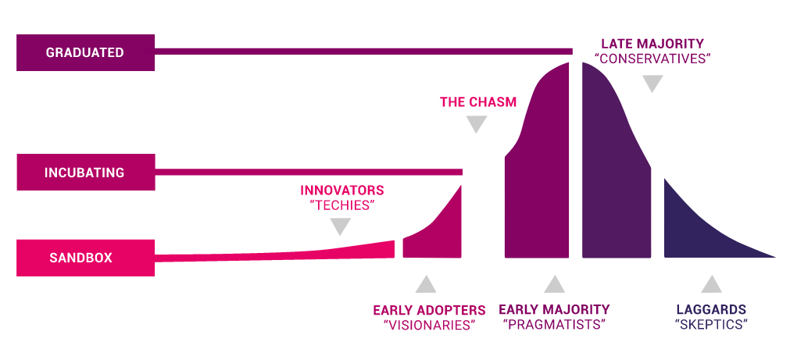
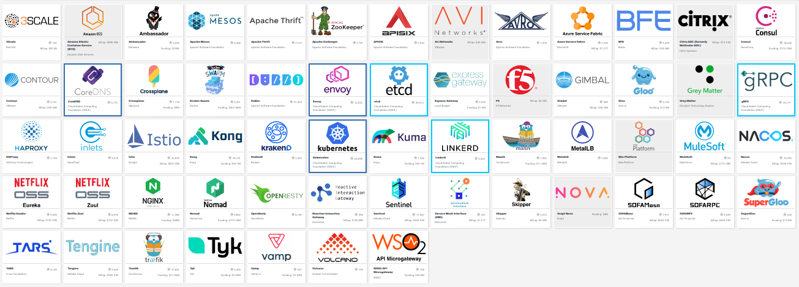

# The future of Kubernetes

In this chapter, we look at the future of Kubernetes from multiple angles. We'll start with the momentum of Kubernetes since its inception, across  dimensions such as community, ecosystem, and mindshare. Spoiler alert - Kubernetes won the container orchestration wars by a land slide. As Kubernetes grows and matures the battle lines shift from beating competitors to fighting against its own complexity. Usability, tooling and education will play a major role as container orchestration is still new, fast-moving, and not a well-understood domain. Then we will take a look some very interesting patterns and trends and finally we will review my predictions from the 2nd edition and I will make some new predictions.

The covered topics are as follows:

- The Kubernetes momentum
- The importance of CNCF
- Kubernetes extensibility
- Service mesh integration
- Serverless computing on Kubernetes
- Kubernetes and VMs
- Cluster autoscaling
- Ubiquitous operators

# The Kubernetes momentum

Kubernetes is undeniably a juggernaut. Not only did Kubernetes beat all the other container orchestrators, but it is also the de facto solution on public clouds, utilized in many private clouds and even VMWare - the virtual machine company - is focused on Kubernetes solutions and integrating its products with Kubernetes. 

Kubernetes works very well in multi-cloud and hybrid cloud scenarios due to its extensible design.

In addition Kubernetes makes inroads in the edge too, with custom distributions that expand even more its broad applicability.

The Kubernetes project continues to release new version every 3 months like clock-work. The community just keeps growing.

The [Kubernetes](https://github.com/kubernetes/kubernetes) Github repository has 64,000 stars.   
One of the most major drivers of this phenomenal growth is the CNCF (Cloud Native Computing Foundation).

## The importance of the CNCF

The CNCF (Cloud Native Computing Foundation) has become a very important organization in the cloud computing scene. While, it is not Kubernetes-specific the dominance of Kubernetes is undeniable. Kubernetes is the first project to graduate and most of the other projects lean heavily towards Kubernetes. In particular, the CNCF offers certification and training only for Kubernetes. The CNCF among other roles ensures the cloud technologies will not suffer from vendor lock-in. Check out this crazy diagram of the entire CNCF landscape: https://landscape.cncf.io/zoom=60 

### Project Curation

The [CNCF](https://cncf.io) assigns maturity levels to projects: graduated, incubating and sandbox:

**images/chapter 16 - cncf maturity levels.png**

[Projects](https://www.cncf.io/projects/) start at a certain level - sandbox or incubating - and over time can graduate. That doesn't mean that only graduated projects can be safely used. Many incubating and even sandbox projects are used heavily in production. For example, etcd is the persistent state store of Kubernetes itself and it is just an incubating project. Obviously, it is a highly trusted component. Virtual Kubelet is a sandbox project that powers AWS Fargate and Microsoft ACI. This is clearly enterprise-grade software.

The main benefit of the CNCF curation of projects is to help navigate the incredible eco-system that grew around Kubernetes. When you look to extend your Kubernetes solution with additional technologies and tools the CNCF projects are a good place to start. 

### Certification

When technologies start to offer certification programs you can tell they are here to stay. The CNCF offers several types of certifications. 

- [Certified Kubernetes](https://www.cncf.io/certification/software-conformance/) for conforming Kubernetes distributions and installers (about 90)
-[Kubernetes Certified Service Provider (KCSP)](https://www.cncf.io/certification/kcsp/) - for vetted service providers with deep Kubernetes experience (134 providers)
-[Certified Kubernetes Administrator (CKA)](https://www.cncf.io/certification/cka/) for administrators
- [Certified Kubernetes Application Developer (CKAD)](https://www.cncf.io/certification/ckad/) for developers

### Training

The CNCF offers [training](https://www.cncf.io/certification/training/) too. There is a free introduction to Kubernetes course and several paid courses that align with the CKA and CKAD certification exams. In addition, the CNCF maintains a list of [Kubernetes training partners](https://landscape.cncf.io/category=kubernetes-training-partner&format=card-mode&grouping=category).

If you're looking for free Kubernetes training here are a couple of options:

- [VMWare Kubernetes academy](https://kube.academy/)
- [Google Kubernetes Engine on Coursera](https://www.coursera.org/learn/google-kubernetes-engine)

### Community and education

The CNCF also organizes conferences like KubeCon, CloudNativeCon, meetups and maintains several communication avenues like slack channels and mailing lists. It also publishes surveys and reports.

The numbers of attendees and participants keeps growing year over year.

## Tooling

The number of tools to manage containers and clusters, the various addons, extensions and plugins just keeps growing and growing. Here is a subset of the tools, projects and companies that participate in the Kubernetes eco-system:

**images/chapter 16 - tools.png**

# The rise of managed Kubernetes platforms

Pretty much every cloud provider has a solid managed Kubernetes offering these days, sometimes there are multiple flavors and ways of running Kubernetes on a given cloud provider.

## Public cloud Kubernetes platforms

Here are some of the prominent managed platforms

- [Google GKE](https://cloud.google.com/kubernetes-engine/)
- [Microsoft AKS]((https://azure.microsoft.com/en-us/services/kubernetes-service/)) 
- [Amazon EKS](https://aws.amazon.com/eks/)
- [Digital Ocean](https://www.digitalocean.com/products/kubernetes/) 
- [Oracle Cloud](https://www.oracle.com/cloud/compute/container-engine-kubernetes.html)
- [IBM Cloud Kubernetes service](https://www.ibm.com/cloud/container-service)
- [Alibaba ACK](https://www.alibabacloud.com/product/kubernetes)
- [Tencent TKE](https://intl.cloud.tencent.com/product/tke)

Of course you can always roll your own and use the public cloud providers just as infrastructure providers. This is a very common use case with Kubernetes.

## Bare metal, private clouds, and Kubernetes on the edge

Here you can find Kubernetes distributions that are designed or configured to run in special environments, often in your own data centers as a private cloud or in more restricted environments like edge computing on small devices.

- [Google Anthos for GKE](https://cloud.google.com/anthos/gke/)
- [OpenStack](https://docs.openstack.org/openstack-helm/latest/install/developer/kubernetes-and-common-setup.html)
- [Rancher k3S](https://rancher.com/docs/k3s/latest/en/)
- [Kubernetes on Raspberry PI](https://www.shogan.co.uk/kubernetes/building-a-raspberry-pi-kubernetes-cluster-part-1-routing/)
- [KubeEdge](https://kubeedge.io/en/)

## Kubernetes PaaS (Platform as a Service) 

This category of offerings aims to abstract some of the complexity of Kubernetes and put a simpler facade in front of it. There are many varieties here. Some of them cater to the multi-cloud and hybrid cloud scenarios, some expose function as a service interface, some just focus on a better installation and support experience.

- [Google Cloud Run](https://cloud.google.com/run/)
- [VMWare PKS](https://cloud.vmware.com/vmware-enterprise-pks)
- [Platform 9 PMK](https://platform9.com/managed-kubernetes/)
- [Giant Swarm](https://www.giantswarm.io)
- [OpenShift](https://www.openshift.com/)
- [Rancher RKE](https://www.openshift.com/)

# Upcoming trends

Let's talk about some of technological trends in the Kubernetes that will be important in the near future. Some of these trends are already there.

## Security

Security is of course is a paramount concern for large-scale systems. Kubernetes is  primarily a platform for managing containerized workloads. Those containerized workloads are often run in a multi-tenant environment. The isolation between tenants is super important. Containers are lightweight and efficient because they share an OS and maintain their isolation through various mechanisms like namespace isolation, filesystem isolation and cgroup resource isolation. In theory, this should be enough. In practice, the surface area is large and there were multiple breakouts out of container isolation.

To address this risk multiple lightweight VMs were designed to add a hypervisor (machine-level virtualization) as an additional isolation level between the container and the OS kernel. The big cloud providers already support these technologies and the Kubernetes CRI interface provides a streamlined way to take advantage of these more secure runtimes.

For example [FireCracker](https://firecracker-microvm.github.io/) is integrated with containerd via the [firecracker-containerd](https://github.com/firecracker-microvm/firecracker-containerd). Google gVisor is another sandbox technology. It is a userspace kernel that implements most of the Linux system calls and provides a buffer between the application and the host OS. It is also available through containerd via the [gvisor-containerd-shim](https://github.com/google/gvisor-containerd-shim).     

## Networking

Networking is another area that is an ongoing source of innovation. The Kubernetes CNI allows any number of innovative networking solutions behind a simple interface. A major theme is incorporating eBPF - a relatively new Linux kernel technology - into Kubernetes.

eBPF stands for extended Berkeley Packet Filter. The core of eBPF is a mini-VM in the Linux kernel that executes special programs attached to kernel objects when certain events occur such as a packet is being transmitted or received. Originally, only sockets were supported and the technology was called just BPF. Later additional objects were added to the mix and that's when the "e" for "extended" came along. eBPF claim to fame is its performance due to the fact it runs highly-optimized compiled BPF programs in the kernel and doesn't require extending the kernel with kernel modules.

There are many applications for eBPF:

dynamic network control - iptables-based approach don't scale very well in a dynamic environment like a Kubernetes cluster where. Replacing iptables with BPF programs is both more performant and more managable. [Cillium](https://github.com/cilium/cilium) is focused on routing and filtering traffic using eBPF

monitoring connections - creating an up to date map of TCP connections between containers is possible by attaching a BPF program kprobes that track socket-level events. [WeaveScope](https://github.com/weaveworks/scope) utilizes this capability by running an agent on each node that collects this information and sends it to a server that provides a visual representation though a slick UI.  
 
Restricting syscalls - The linux kernel provides more than 300 system calls. In a security-sensitive container environment it is highly desirable. The original [seccomp](https://en.wikipedia.org/wiki/Seccomp) facility was pretty course-grained. In Linux 3.5 seccomp was extended to support BPF for advanced custom filters.     
 
Raw perofrmance - eBPF provides significant performance benefits and projects like [Calico](https://www.projectcalico.org/) take advantage and implemented a faster data plane that uses less resources.  
 
## Custom hardware and devices

Kubernetes manages nodes, networking and storage at a relatively high-level. But, there are many benefits for integrating specific hardware at a fine-grained level. For example, GPUs, high-performance network cards, FPGAs, infiniband adapters and other compute, networking and storage resources. This is where the [device plugin](https://github.com/kubernetes/community/blob/master/contributors/design-proposals/resource-management/device-plugin.md) framework comes in. It is still in Beta (since Kubernetes 1.10) and there is ongoing innovation in this area. For example, monitoring device plugin resources is also in beta since Kubernetes 1.15. It is very interesting to see what devices will be harnessed to Kubernetes. The framework itself is following modern Kubernetes extensibility practices by utilizing gRPC.    
  
## Service Mesh

The service mesh is arguably the most important trend over the last couple of years. We covered service meshes in depth in chapter 14 - "Utilizing Service Meshes". The adoption is impressive and I predict that most Kubernetes distribution will provide a default service mesh and allow easy integration with other service meshes. The benefits that service meshes provide are just too valuable and it makes sense to provide a default platform that includes Kubernetes with an integrated service mesh. That said, Kubernetes itself will not absorb some service mesh and expose it through its API. This goes against the grain of keeping the core of Kubernetes small.

Google [Anthos](https://cloud.google.com/anthos/) is a good example where Kubernetes + Knative + Istio are combined to provide a unified platform that provides an opinionated best-practices bundle that would take an organization a lot of time and resources to build on top of vanilla Kubernetes.  

Another push in this direction is the [sidecar container KEP](https://github.com/kubernetes/enhancements/blob/master/keps/sig-apps/sidecarcontainers.md)

The sidecar container pattern has been a staple of Kubernetes from the get go. After all pods can contain multiple containers. But, there was no notion of a main container and a sidecar container. All containers in the pod has the same status. Most service meshes use sidecar containers to intercept traffic and perform their jobs. Formalizing sidecar containers will help those efforts and push service meshes even further.

It's not clear at this stage if Kubernetes and the service mesh will be hidden behind a simpler abstraction on most platforms or if they will be front and center.

## Serverless computing

Serverless computing is another trend that is here to stay. We discussed it at length in chapter 12 - "Serverless computing on Kubernetes". Kubernetes and serverless can be combined on multiple levels. Kubernetes can utilize serverless cloud solutions like AWS Fargte and AKS ACI (Azure Container Instances) to save the cluster administrator from managing nodes. This approach also caters to integrating lightweight VMs transparently with Kubernetes, since the cloud platforms don't use naked Linux containers for their container-as-a-service platforms.

Another avenue is to reverse the roles and expose containers as a service powered by Kubernetes under the covers. This is exactly what Google [Cloud Run](https://cloud.google.com/run/) is doing. The lines blear here as there are multiple products from Google to manage containers and/or Kubernetes ranging from just GKE, through Anthos GKE (bring your own cluster to GKE environment for your private data center), Anthos (managed Kubernetes+ service mesh), Anthos cloud run.

Finally, there are function as a service and scale to zero projects running inside your Kubernetes cluster. I believe Knative will become the leader here, as it is already used by many frameworks and it is deployed heavily through various Google products.  

## Kubernetes on the Edge

Kubernetes is the poster boy of cloud native computing, but with IoT (Internet of Things) revolution there is more and more need to perform computation at the edge of the network. Sending all data to the backend for processing suffers from several drawbacks:

- Latency
- Need for enough bandwidth
- Cost

With edge locations collecting a lot of data via sensors, video cameras etc the amount of edge data grows and it makes more sense to perform more and more sophisticated processing at the edge. Kubernetes grew out of Google's Borg, which was definitely not designed to run at the edge of the network. But, Kubernetes' design proved to be flexible enough to accommodate it. I expect that we will see more and more Kubernetes deployments at the edge of the network, which will lead to very interesting systems that are composed of many Kubernetes clusters that will need to be managed centrally.

[KubeEdge](https://kubeedge.io/en/) is an open source framework that is built on top of Kubernetes and Mosquito - an open source implementation of MQTT message broker - to provide a foundation for networking, application deployment and metadata synchronization between the cloud and the edge.

## Native CI/CD

For developers on of the most important questions is the construction of a CI/CD pipeline. There are many options and choosing between them can be difficult. The [CD foundation](https://cd.foundation/) is an open source foundation that was formed to standardize concepts like pipelines and workflows and define industry specifications that will allow different tools and communities to interoperate better. The current projects are:

- [Jenkins](https://jenkins.io)
- [Jenkins X](https://jenkins-x.io)
- [Tekton](https://github.com/tektoncd/pipeline)
- [Spinnaker](https://www.spinnaker.io)

There is also an incubating project: [Screwdriver.cd](https://screwdriver.cd)

One of my favorite native CD projects [Argo CD](https://github.com/argoproj/argo-cd) is not part of the CD foundation at the moment. I took action and opened a [Github issue](https://github.com/argoproj/argo-cd/issues/3265) asking to sumbit argo-cd to the CDF. 

Another project to watch is [CNB](https://buildpacks.io) - Cloud native build packs. The project takes source and creates OCI (think Docker) images. It is important for FaaS frameworks and native in-cluster CI. It is also a CNCF sandbox project. 

## Operators

The Operator pattern emerged in 2016 from CoreOS (acquired by RedHat, acquired by IBM) and gained a lot of success in the community. An Operator is a combination of custom resources and a controller used to manage an application. At my current job I write operators to manage various aspects of infrastructure and it is a joy. It is already the established way to distribute non-trivial applications to Kubernetes clusters. Check out https://operatorhub.io/ for a huge list of existing operators. I expect this trend to continue. 

# Summary

In this chapter, we looked at the future of Kubernetes, and it looks great! The technical foundation, the community, the broad support, and the momentum are all very impressive. Kubernetes is still young, but the pace of innovation and stabilization is very encouraging. The modularization and extensibility principles of Kubernetes let it become the universal foundation for modern cloud native applications.

At this point, you should have a clear idea of where Kubernetes is right now and where it's going from here. You should be confident that Kubernetes is not just here to stay, but that it will be the leading container orchestration platform for many years to come and integrate with any major offering and environment you can just imagine from planet-scale public cloud platforms, private clouds, data centers, edge locations and all the way down to your development laptop and Raspberry pie.

That's it! this is the end of the book.

Now it's up to you to use what you've learned and build amazing things
with Kubernetes!

# References

Kubernetes on Github - https://github.com/kubernetes/kubernetes
CNCF - https://cncf.io
CD foundation -  https://cd.foundation/
FireCracker - https://firecracker-microvm.github.io/
gVisor - https://github.com/google/gvisor-containerd-shim
Cillium - https://github.com/cilium/cilium
Calico - https://www.projectcalico.org/
Google Anthos - https://cloud.google.com/anthos/
Google Cloud Run - https://cloud.google.com/run/
KubeEdge - https://kubeedge.io/en/
OperatorHub - https://operatorhub.io/
