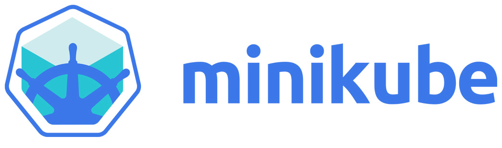
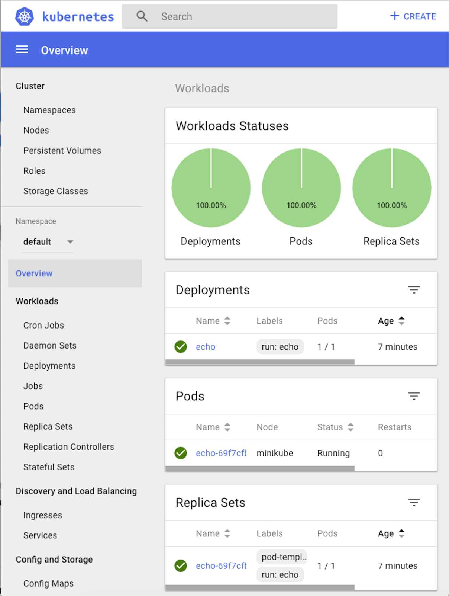

# Overview

In the previous chapter, we learned what Kubernetes is all about, how it is designed, what concepts it supports, its runtime engines, and how it fits within the CI/CD pipeline.

Creating a Kubernetes cluster from scratch is a non-trivial task. There are many options and tools to select from. There are many factors to consider. In this chapter, we will roll our sleeves and build us some Kubernetes clusters using minikube, kind and k3d. We will discuss and evaluate other tools such as Kubeadm, Kube-spray, bootkube and stackube. We will also look into deployment environments such as local, cloud, and bare metal. The topics we will cover are as follows:

- Creating a single-node cluster with Minikube
- Creating a multi-node cluster with Kind
- Creating a multi-node cluster using k3d
- Creating clusters in the cloud
- Creating bare-metal clusters from scratch
- Reviewing other options for creating Kubernetes clusters

At the end of this chapter, you will have a solid understanding of the various options to create Kubernetes clusters and knowledge of the best-of-breed tools to support the creation of Kubernetes clusters, and you will also build several clusters, both single-node and multi-node.

# Creating a single-node cluster with Minikube

In this section, we will create a local single-node cluster using Minikube. Local clusters are most useful for developers that want quick edit-test-deploy-debug cycles on their machine before committing their changes. Local clusters are very useful for DevOps and operators too that want to play with Kubernetes locally without concerns about breaking a shared environment. While Kubernetes is typically deployed on Linux in production, many developers work on Windows PCs or Macs. That said, there aren't too many differences if you do want to install Minikube on Linux.



## Meet Kubectl

Before we start creating clusters let's talk about kubectl. It is the official Kubernetes CLI and it interacts with your Kubernetes cluster's API server via its API. It is configured by default using the ~/.kube/config file, which is a YAML file that contains metadata, connection info and authentication tokens or certificates for one or more clusters. Kubectl provides commands to view your configuration and switch between clusters if it contains more than one. You can also point kubectl at a different config file by setting the KUBECONFIG environment variable. I prefer a third approach, which is keeping separate config file for each cluster and copying the active cluster's config file to ~/.kube/config (symlinks don't work). 

We will discover together what kubectl can do along the way. The purpose here is just to avoid confusion when working with different clusters and configuration files.

## Quick Introduction to Minikube

Minikube is the most mature local Kubernetes cluster. It runs the latest stable Kubernetes release and it supports Windows, macOS and Linux. It supports

- LoadBalancer service type - via minikube tunnel
- NodePort service type - via minikube service
- Multiple clusters
- Filesystem mounts
- GPU support - for machine learning
- RBAC
- Persistent Volumes
- Ingress
- Dashboard - via minikube dashboard
- Custom container runtimes - via the start --container-runtime flag
- Configuring API server and kubelet options via command-line flags
Add-ons

## Getting ready

There are some pre-requisites to install before you can create the cluster itself. These include VirtualBox, the kubectl command-line interface to Kubernetes, and of course, Minikube itself. Here is a list of the latest versions at the time of writing:

- **VirtualBox** : https://www.virtualbox.org/wiki/Downloads
- **Kubectl** : https://kubernetes.io/docs/tasks/tools/install-kubectl/
- **Minikube** : https://kubernetes.io/docs/tasks/tools/install-minikube/

## On Windows

Install VirtualBox and make sure kubectl and Minikube are on your path. I personally just throw all command-line programs I use into c:\windows. You may prefer another approach. I use the excellent ConEMU to manage multiple consoles, terminals, and SSH sessions. It works with cmd.exe, PowerShell, PuTTY, Cygwin, msys, and Git-Bash. It doesn't get much better than that on Windows.

With Windows 10 Pro you have the option to use the Hyper-V hypervisor. This is technically a better solution than VirtualBox, but it requires the Pro version of Windows and is completely Windows-specific. By using VirtualBox, these instructions are universal and will be easy to adapt to other versions of Windows, or other operating systems altogether. If you have Hyper-V enabled, you must disable it because VirtualBox can't co-exist with Hyper-V.

I recommend using PowerShell in administrator mode. You can add the following alias and function to your PowerShell profile:


```
Set-Alias -Name k -Value kubectl

function mk
{
  minikube-windows-amd64 `
  --show-libmachine-logs `
  --alsologtostderr      `
  @args
}
```
## On macOS

On Mac you have the option of using HyperKit instead of VirtualBox

```
$ curl -LO https://storage.googleapis.com/minikube/releases/latest/docker-machine-driver-hyperkit \
  && chmod +x docker-machine-driver-hyperkit \
  && sudo mv docker-machine-driver-hyperkit /usr/local/bin/ \
  && sudo chown root:wheel /usr/local/bin/docker-machine-driver-hyperkit \
  && sudo chmod u+s /usr/local/bin/docker-machine-driver-hyperkit
```


You can add aliases to your .bashrc file (similar to the PowerShell alias and function on Windows):

```
alias k='kubectl'

alias mk='/usr/local/bin/minikube'
```

If you chose HyperKit instead of VirtualBox you need to add the flag `--vm-driver=hyperkit` when starting the cluster.

It is also important to disable any VPN when using HyperKit.


Now you can use k and mk and type less. The flags to Minikube in the mk function provide better logging that way and direct it to the console in addition to files (similar to tee).

Type mk version to verify Minikube is correctly installed and functioning:

```
$ mk version

minikube version: v1.2.0
```

Type k version to verify kubectl is correctly installed and functioning:

```
$ k version
Client Version: version.Info{Major:"1", Minor:"14", GitVersion:"v1.14.0", GitCommit:"641856db18352033a0d96dbc99153fa3b27298e5", GitTreeState:"clean", BuildDate:"2019-03-26T00:04:52Z", GoVersion:"go1.12.1", Compiler:"gc", Platform:"darwin/amd64"}
The connection to the server localhost:8080 was refused - did you specify the right host or port?
Unable to connect to the server: dial tcp 192.168.99.100:8443: getsockopt: operation timed out
```

Don't worry about the error on the last line. There is no cluster running, so kubectl can't connect to anything. That's expected.

You can explore the available commands and flags for both Minikube and kubectl. I will not go over each and every one, only the commands I use.

## Creating the cluster

The Minikube tool supports multiple versions of Kubernetes. At the time of writing, the latest version is 1.15.0, which is also the default.

```
$ mk start
😄  minikube v1.2.0 on darwin (amd64)
🔥  Creating virtualbox VM (CPUs=2, Memory=2048MB, Disk=20000MB) ...
🐳  Configuring environment for Kubernetes v1.15.0 on Docker 18.09.6
🚜  Pulling images ...
🚀  Launching Kubernetes ...
⌛  Verifying: apiserver proxy etcd scheduler controller dns
🏄  Done! kubectl is now configured to use "minikube"
```

When you restart an existing stopped cluster you'll see the following output

```
$ mk start
😄  minikube v1.2.0 on darwin (amd64)
💡  Tip: Use 'minikube start -p <name>' to create a new cluster, or 'minikube delete' to delete this one.
🔄  Restarting existing virtualbox VM for "minikube" ...
⌛  Waiting for SSH access ...
🐳  Configuring environment for Kubernetes v1.15.0 on Docker 18.09.6
🔄  Relaunching Kubernetes v1.15.0 using kubeadm ...
⌛  Verifying: apiserver proxy etcd scheduler controller dns
🏄  Done! kubectl is now configured to use "minikube"
```

Let's review what Minikube did behind the curtains for you. You'll need to do a lot of it when creating a cluster from scratch:

1. Start a VirtualBox VM
2. Create certificates for the local machine and the VM
3. Download images
4. Set up networking between the local machine and the VM
5. Run the local Kubernetes cluster on the VM
6. Configure the cluster
7. Start all the Kubernetes control plane components
8. Configure kubectl to talk to the cluster

## Troubleshooting

If something goes wrong during the process, try to follow the error messages. You can add the --alsologtostderr flag to get detailed error info to the console. Everything minikube does is organized neatly under ~/.minikube. Here is the directory structure:

```
$ tree ~/.minikube -L 2
/Users/gigi.sayfan/.minikube
├── addons
├── apiserver.crt
├── apiserver.key
├── ca.crt
├── ca.key
├── ca.pem
├── cache
│   ├── images
│   ├── iso
│   └── v1.15.0
├── cert.pem
├── certs
│   ├── ca-key.pem
│   ├── ca.pem
│   ├── cert.pem
│   └── key.pem
├── client.crt
├── client.key
├── config
├── files
├── key.pem
├── logs
├── machines
│   ├── minikube
│   ├── server-key.pem
│   └── server.pem
├── profiles
│   └── minikube
├── proxy-client-ca.crt
├── proxy-client-ca.key
├── proxy-client.crt
└── proxy-client.key

13 directories, 19 files
```

## Checking out the cluster

Now that we have a cluster up and running, let's peek inside.

First, let's ssh into the VM:

```
$ mk ssh
                         _             _
            _         _ ( )           ( )
  ___ ___  (_)  ___  (_)| |/')  _   _ | |_      __
/' _ ` _ `\| |/' _ `\| || , <  ( ) ( )| '_`\  /'__`\
| ( ) ( ) || || ( ) || || |\`\ | (_) || |_) )(  ___/
(_) (_) (_)(_)(_) (_)(_)(_) (_)`\___/'(_,__/'`\____)

$ uname -a

Linux minikube 4.15.0 #1 SMP Sun Jun 23 23:02:01 PDT 2019 x86_64 GNU/Linux

$
```

Great! That works. The weird marks symbols are ascii art for 'minikube'. Now, let's start using kubectl, because it is the Swiss Army Knife of Kubernetes and will be useful for all clusters (including federated clusters).

Disconnect from the VM via ctrl+D or typing:

```
$ logout
```

We will cover many of the kubectl commands in our journey. First, let's check the cluster status using cluster-info:

```
$ k cluster-info
Kubernetes master is running at https://192.168.99.103:8443
KubeDNS is running at https://192.168.99.103:8443/api/v1/namespaces/kube-system/services/kube-dns:dns/proxy

To further debug and diagnose cluster problems, use 'kubectl cluster-info dump'.
```

You can see that the master is running properly. To see much more detailed view of all the objects in the cluster as JSON type: k cluster-info dump. The output can be a little daunting let's use more specific commands to explore the cluster.

Let's check out the nodes in the cluster using get nodes.

```
$ k get nodes
NAME       STATUS   ROLES    AGE   VERSION
minikube   Ready    master   28m   v1.15.0
```

So, we have one node called minikube. To get a lot more information about it, type 

`k describe node minikube`. 

The output is verbose; I'll let you try it yourself.

## Doing work

We have a nice empty cluster up and running (well, not completely empty as the DNS service and dashboard run as pods in the kube-system namespace). It's time to deploy some pods:

```
$ k create deployment echo --image=gcr.io/google_containers/echoserver:1.8
deployment.apps/echo created
```

Let's check out the pod that was created

```
$ k get pods
NAME                   READY   STATUS    RESTARTS   AGE
echo-855975f9c-r6kj8   1/1     Running   0          2m11s
```

To expose our pod as a service, type the following:

```
$ k expose deployment echo --type=NodePort --port=8080
service/echo exposed
```

Exposing the service as type NodePort means that it is exposed to the host on some port. But it is not the 8080 port we ran the pod on. Ports get mapped in the cluster. To access the service, we need the cluster IP and exposed port:

```
$ mk ip
192.168.99.103

$ k get service echo --output="jsonpath='{.spec.ports[0].nodePort}'"
31800
```

Now we can access the echo service, which returns a lot of information :

```
$ curl http://192.168.99.103:31800/hi

    Hostname: echo-855975f9c-r6kj8
    
    Pod Information:
        -no pod information available-
    
    Server values:
        server_version=nginx: 1.13.3 - lua: 10008
    
    Request Information:
        client_address=172.17.0.1
        method=GET
        real path=/hi
        query=
        request_version=1.1
        request_uri=http://192.168.99.103:8080/hi
    
    Request Headers:
        accept=*/*
        host=192.168.99.103:31800
        user-agent=curl/7.54.0
    
    Request Body:
        -no body in request-
```

Congratulations! You just created a local Kubernetes cluster, deployed a service and exposed it to the world.

## Examining the cluster with the dashboard

Kubernetes has a very nice web interface, which is deployed, of course, as a service in a pod. The dashboard is well designed and provides a high-level overview of your cluster as well as drilling down into individual resources, viewing logs, editing resource files, and more. It is the perfect weapon when you want to check out your cluster manually. To launch it, type:

```
$ mk dashboard
🔌  Enabling dashboard ...
🤔  Verifying dashboard health ...
🚀  Launching proxy ...
🤔  Verifying proxy health ...
🎉  Opening http://127.0.0.1:56853/api/v1/namespaces/kube-system/services/http:kubernetes-dashboard:/proxy/ in your default browser...
```

Minikube will open a browser window with the dashboard UI. Note that, on Windows, Microsoft Edge can't display the dashboard. I had to run it myself on a different browser.

Here is the workloads view, which displays deployments, replica sets, replication controllers, and pods.




It can also display daemon sets, stateful sets, and jobs, but we don't have any in this cluster.

In this section, we created a local single-node Kubernetes cluster on Windows, explored it a little bit using kubectl, deployed a service, and played with the web UI. In the next section, we'll move to a multi-node cluster.

# Creating a multi-node cluster with KinD

In this section, we'll create a multi-node cluster using KinD. We will also repeat the deployment of the echo server we deployed on Minikube and observe the differences. Spoiler alert - everything will be faster and easier!

## Quick introduction to KinD

KinD stands for Kubernetes in Docker. It is a tool for creating ephemeral clusters (no persistence storage). It was built primarily for running the Kubernetes conformance tests. It supports Kubernetes 1.11+. Under the covers it uses kubeadm to bootstrap Docker containers as nodes in the cluster. KinD is a combination of a library and a CLI. You can use the library in your code to for testing or other purposes. KinD can create highly-available clusters with multiple master nodes. Finally, KinD is a CNCF conformant Kubernetes installer. It better be if it's used for the conformance tests of Kubernetes itself :-).

KinD is super fast to start, but it has some limitations too:
- No persistent storage
- No support for alternative runtimes yet, only Docker

Let's install KinD and get going.

## Installing KinD

You must have Docker installed as KinD is literally running as a Docker container. If you have Go installed you can install the KinD CLI via:

```
GO111MODULE="on" go get sigs.k8s.io/kind@v0.6.1
```

Otherwise, on macOS type:

```
curl -Lo ./kind-darwin-amd64 https://github.com/kubernetes-sigs/kind/releases/download/v0.6.1/kind-darwin-amd64
chmod +x ./kind-darwin-amd64
mv ./kind-darwin-amd64 /usr/local/bin/kind
```

On Windows type (in PowerShell):

```
curl.exe -Lo kind-windows-amd64.exe https://github.com/kubernetes-sigs/kind/releases/download/v0.6.1/kind-windows-amd64
Move-Item .\kind-windows-amd64.exe c:\windows\kind.exe
```

## Creating the cluster with KinD

Creating a cluster is super-easy. 

```
$ kind create cluster
Creating cluster "kind" ...
 ✓ Ensuring node image (kindest/node:v1.13.4) 🖼
 ✓ Preparing nodes 📦
 ✓ Creating kubeadm config 📜
 ✓ Starting control-plane 🕹️
Cluster creation complete. You can now use the cluster with:

export KUBECONFIG="$(kind get kubeconfig-path --name="kind")"
kubectl cluster-info
```

Kind suggests to export KUBECONFIG, but as I mentioned earlier I prefer tp copy the config file to ~/.kube/config so I don't have to export again if I want to access the cluster from another terminal window.

```
$ cp $(kind get kubeconfig-path --name="kind") ~/.kube/config
```

Now, we can access the cluster using kubectl

```
$ k cluster-info
Kubernetes master is running at https://localhost:58560
KubeDNS is running at https://localhost:58560/api/v1/namespaces/kube-system/services/kube-dns:dns/proxy

To further debug and diagnose cluster problems, use 'kubectl cluster-info dump'.
```

But, this creates a single node cluster:

```
$ k get nodes
NAME                 STATUS   ROLES    AGE   VERSION
kind-control-plane   Ready    master   11m   v1.13.4
```

Let's delete it and create a multi-node cluster:

```
$ kind delete cluster
Deleting cluster "kind" ...
```

To create a multi-node cluster we need to provide a configuration file with the specification of our nodes. Here is a configuration file that   will create a cluster with one control-plane nodes and 2 worker nodes:

```
kind: Cluster
apiVersion: kind.sigs.k8s.io/v1alpha3
nodes:
- role: control-plane
- role: worker
- role: worker
```

Let's save the configuration file as kind-multi-node-config.yaml and create the cluster
```
$ kind create cluster --config kind-multi-node-config.yaml
Creating cluster "kind" ...
 ✓ Ensuring node image (kindest/node:v1.13.4) 🖼
 ✓ Preparing nodes 📦📦📦
 ✓ Creating kubeadm config 📜
 ✓ Starting control-plane 🕹️
 ✓ Joining worker nodes 🚜
Cluster creation complete. You can now use the cluster with:

export KUBECONFIG="$(kind get kubeconfig-path --name="kind")"
kubectl cluster-info
```

Yeah, it works! we have a local 3 nodes cluster now:

```
$ k get nodes
NAME                  STATUS     ROLES    AGE   VERSION
kind-control-plane    Ready      master   12m   v1.13.4
kind-worker           NotReady   <none>   11m   v1.13.4
kind-worker2          NotReady   <none>   11m   v1.13.4
```

KinD is also kind enough (see what I did there) to let us create HA (highly available clusters) with multiple control plane nodes for redundancy. Let's give it a try and see what it looks like with two control plane nodes and to worker nodes:

```
kind: Cluster
apiVersion: kind.sigs.k8s.io/v1alpha3
nodes:
- role: control-plane
- role: control-plane
- role: worker
- role: worker
```

Let's save the configuration file as kind-ha-multi-node-config.yaml, delete the current cluster and create a new HA cluster 
 
```
$ kind delete cluster
Deleting cluster "kind" ...
$ kind create cluster --config kind-ha-multi-node-config.yaml
Creating cluster "kind" ...
 ✓ Ensuring node image (kindest/node:v1.13.4) 🖼
 ✓ Preparing nodes 📦📦📦📦📦
 ✓ Starting the external load balancer ⚖️
 ✓ Creating kubeadm config 📜
 ✓ Starting control-plane 🕹️
 ✓ Joining more control-plane nodes 🎮
 ✓ Joining worker nodes 🚜
Cluster creation complete. You can now use the cluster with:
export KUBECONFIG="$(kind get kubeconfig-path --name="kind")"
kubectl cluster-info
```

Hmmm... there is something new here. Now kind creates an external load balancer as well as joining more control-plane nodes before joining the worker nodes. The load balancer is necessary to distribute requests across all the control plane nodes.

Note that the external load balancer doesn't show as a node using kubectl

```
$ k get nodes
NAME                  STATUS   ROLES    AGE     VERSION
kind-control-plane    Ready    master   8m31s   v1.13.4
kind-control-plane2   Ready    master   8m14s   v1.13.4
kind-worker           Ready    <none>   7m35s   v1.13.4
kind-worker2          Ready    <none>   7m35s   v1.13.4
```

But, kind has its own get nodes command, where you can see the load balancer:

```
$ kind get nodes
kind-control-plane2
kind-worker
kind-control-plane
kind-worker2
kind-external-load-balancer
```

## Doing work with KinD

Let's deploy our echo service on the kind cluster. It starts the same:

```
$ k create deployment echo --image=gcr.io/google_containers/echoserver:1.8
deployment.apps/echo created

$ k expose deployment echo --type=NodePort --port=8080
service/echo exposed
```

Checking our services we can see the echo service front and center:

```
$  k get svc echo
NAME   TYPE       CLUSTER-IP     EXTERNAL-IP   PORT(S)          AGE
echo   NodePort   10.105.48.21   <none>        8080:31550/TCP   3m5s
```

But, there is no external IP to the service. With minikube we got the IP of the minikube node itself via $(minikube ip) and we could use it in combination with the node port to access the service. That is not an option with kind clusters. Let's see how to use a proxy to access the echo service.

## Accessing Kubernetes services locally though a proxy

We will go into a lot of detail about networking, services and how to expose them outside the cluster.

Here, I just show to get it done and keep you in suspense for now. First, we need to run the kubectl proxy command that exposes the API server, pods and services on localhost:  

```
$ k proxy &
[1] 10653
Starting to serve on 127.0.0.1:8001
```

Then, we can access the echo service though a specially crafted proxy URL that includes the exposed port (8080) and NOT the node port.

I use httpie here. You can use curl too. To install httpie follow the instructions here: https://httpie.org/doc#installation 

```
$ http http://localhost:8001/api/v1/namespaces/default/services/echo:8080/proxy/
HTTP/1.1 200 OK
Content-Length: 534
Content-Type: text/plain
Date: Wed, 24 Jul 2019 21:27:56 GMT
Server: echoserver

Hostname: echo-74545d499-wqkn9

Pod Information:
	-no pod information available-

Server values:
	server_version=nginx: 1.13.3 - lua: 10008

Request Information:
	client_address=10.40.0.0
	method=GET
	real path=/
	query=
	request_version=1.1
	request_uri=http://localhost:8080/

Request Headers:
	accept=*/*
	accept-encoding=gzip, deflate
	host=localhost:8001
	user-agent=HTTPie/0.9.9
	x-forwarded-for=127.0.0.1, 172.17.0.1
	x-forwarded-uri=/api/v1/namespaces/default/services/echo:8080/proxy/

Request Body:
	-no body in request-
```

We will deep dive into exactly what's going on in a future chapter. Let's check out my favorite local cluster solution - k3d.


# Creating a multi-node cluster with k3d

In this section, we'll create a multi-node cluster using k3d from Rancher. We will not repeat the deployment of the echo server because it's identical to the KinD cluster including accessing it though a proxy. Spoiler alert - it is even faster and more user-friendly than KinD!

## Quick introduction to k3s and k3d

Rancher created k3s, which is a lightweight Kubernetes distribution. Rancher says that k3s is 5 less than k8s if that makes any sense. The basic idea is to remove features and capabilities that most people don't need such as:

- Non-default features
- Legacy features
- Alpha features
- In-tree storage drivers
- In-tree cloud providers

But, the big ticket item is that k3s removed Docker and uses containerd instead. You can still bring Docker back if you depend on it.

Another major change is that k3s stores its state in a sqlite DB instead of etcd.

For networking and DNS k3s uses Flannel and CoreDNS.

k3s also added a simplified installer that takes care of SSL and certificate provisioning.

The end result is astonishing - a single binary (less than 40MB) that needs only 512MB of memory. 

Unlike Minikube and KinD, k3s is actually designed for production. The primary use case is for edge computing, IoT and CI systems. It is optimized for ARM devices.

OK. That's k3s, but what's k3d? k3d takes all the goodness that is k3s and packages it in Docker (similar to KinD) and adds a friendly CLI to manage it.

## Installing k3d

Installing k3d is as simple as:

curl -LO https://raw.githubusercontent.com/rancher/k3d/master/install.sh | bash

The usual disclaimer is in effect - make sure to read the installation script, before downloading and piping it to bash.


## Creating the cluster with k3d

Are you ready to be amazed? Creating a single node cluster with k3d takes less than two seconds!

```
$ time k3d create --workers 1
2019/07/24 17:07:36 Created cluster network with ID f09fde83314b059d1a442ec1d01fcd62e522e5f1d838121528c5a1ae582e3cbf
2019/07/24 17:07:36 Creating cluster [k3s-default]
2019/07/24 17:07:36 Creating server using docker.io/rancher/k3s:v0.5.0...
2019/07/24 17:07:36 Booting 1 workers for cluster k3s-default
2019/07/24 17:07:37 Created worker with ID 8a6bd47f7a5abfbac5c396c45f13db04c7e18749ff4d2e054e737fe7f7843010
2019/07/24 17:07:37 SUCCESS: created cluster [k3s-default]
2019/07/24 17:07:37 You can now use the cluster with:

export KUBECONFIG="$(k3d get-kubeconfig --name='k3s-default')"
kubectl cluster-info

real	0m1.896s
user	0m0.009s
sys	0m0.011s
```

What about multi-node cluster? We saw that KinD was much slower, especially when creating a HA cluster with multiple control-plane nodes and external load balancer.

Let's delete the single node cluster first:

```
$ k3d delete
2019/07/24 17:08:42 Removing cluster [k3s-default]
2019/07/24 17:08:42 ...Removing 1 workers
2019/07/24 17:08:43 ...Removing server
2019/07/24 17:08:45 SUCCESS: removed cluster [k3s-default]
```

Now, let's create a cluster with 3 worker nodes. That takes a little over Five seconds

```
$ time k3d create --workers 3
2019/07/24 17:09:16 Created cluster network with ID 5cd1e01434edb1facdab28e563b78b605af416e2ad062dc121400c3f8a5d166c
2019/07/24 17:09:16 Creating cluster [k3s-default]
2019/07/24 17:09:16 Creating server using docker.io/rancher/k3s:v0.5.0...
2019/07/24 17:09:17 Booting 3 workers for cluster k3s-default
2019/07/24 17:09:19 Created worker with ID 4b442116f8df7debecc9d70cee8ae8fb8f16783c0a8f111268be531f71dd54fa
2019/07/24 17:09:20 Created worker with ID 369879f1a38d60935908705f56b34a95caf6a44970beeb509c0cfb2047cd503a
2019/07/24 17:09:20 Created worker with ID d531937996fd25490276e32150b69aa2356c90cfcd1b480ab77ec3d2be08a2f6
2019/07/24 17:09:20 SUCCESS: created cluster [k3s-default]
2019/07/24 17:09:20 You can now use the cluster with:

export KUBECONFIG="$(k3d get-kubeconfig --name='k3s-default')"
kubectl cluster-info

real	0m5.164s
user	0m0.011s
sys	0m0.019s
```

Let's verify the cluster works as expected:

```
$ export KUBECONFIG="$(k3d get-kubeconfig --name='k3s-default')"
$ kubectl cluster-info
Kubernetes master is running at https://localhost:6443
CoreDNS is running at https://localhost:6443/api/v1/namespaces/kube-system/services/kube-dns:dns/proxy

To further debug and diagnose cluster problems, use 'kubectl cluster-info dump'.
```

Here are the nodes. Note that there is just one master called k3d-k3s-default-server:

```
$ k get nodes
NAME                       STATUS   ROLES    AGE   VERSION
k3d-k3s-default-server     Ready    <none>   14h   v1.14.1-k3s.4
k3d-k3s-default-worker-0   Ready    <none>   14h   v1.14.1-k3s.4
k3d-k3s-default-worker-1   Ready    <none>   14h   v1.14.1-k3s.4
k3d-k3s-default-worker-2   Ready    <none>   14h   v1.14.1-k3s.4
```

You can stop and start clusters, create multiple clusters and list existing clusters using the k3d CLI. Here are all the commands. Feel free to explore further:

```
$ k3d
NAME:
   k3d - Run k3s in Docker!

USAGE:
   k3d [global options] command [command options] [arguments...]

VERSION:
   v1.2.2

AUTHORS:
   Thorsten Klein <iwilltry42@gmail.com>
   Rishabh Gupta <r.g.gupta@outlook.com>
   Darren Shepherd

COMMANDS:
     check-tools, ct  Check if docker is running
     shell            Start a subshell for a cluster
     create, c        Create a single- or multi-node k3s cluster in docker containers
     delete, d, del   Delete cluster
     stop             Stop cluster
     start            Start a stopped cluster
     list, ls, l      List all clusters
     get-kubeconfig   Get kubeconfig location for cluster
     help, h          Shows a list of commands or help for one command

GLOBAL OPTIONS:
   --verbose      Enable verbose output
   --help, -h     show help
   --version, -v  print the version
```

You can repeat the steps for deploying, exposing and accessing the echo service on your own. It works just like KinD.

OK. We created clusters using minikube, KinD and k3d. Let's compare them, so you can decide, which one works for you.

# Comparing Minikube, KinD and k3d

Minikube is the official local Kubernetes release. It is part of Kubernetes, it's very mature and very full-featured. That said, it requires a VM and is both slow to install and to start. It also can get into trouble with networking at arbitrary times and sometimes the only remedy is deleting the cluster and rebooting. Also, minikube supports a single node only. I suggest to use Minikube only if it supports some feature that you need and is not available in either KinD or k3d.

KinD is much faster than Minikube and is used for Kubernetes conformance tests, so by definition it is a conformant Kubernetes distribution. It is the only local cluster solution that provides HA cluster with multiple control-plane nodes. It is also designed to be used as a library, which I don't find as a big attraction because it is very easy to automate CLIs from code. The main downside of KinD for local development is that it is ephemeral. I recommend to use KinD if you contribute to Kubernetes itself and want to test against it.

k3d is the clear winner for me. Lightning fast, supports multiple clusters and multiple worker nodes per cluster. Easy to stop and start clusters without losing state.

Alright. Let's take a look at the cloud.
 

# Creating clusters in the cloud (GCP, AWS, Azure)

Creating clusters locally is fun. It's also important during development and when trying to troubleshoot problems locally. But, in the end, Kubernetes is designed for cloud-native applications (applications that run in the cloud). Kubernetes doesn't want to be aware of individual cloud environments because that doesn't scale. Instead, Kubernetes has the concept of a cloud-provider interface. Every cloud provider can implement this interface and then host Kubernetes. Note that, as of version 1.5, Kubernetes still maintains implementations for many cloud providers in its tree, but in the future, they will be refactored out.

## The cloud-provider interface

The cloud-provider interface is a collection of Go data types and interfaces. It is defined in a file called cloud.go, available at:
https://github.com/kubernetes/cloud-provider/blob/master/cloud.go 

Here is the main interface:

```
type Interface interface {
    Initialize(clientBuilder controller.ControllerClientBuilder)
    LoadBalancer() (LoadBalancer, bool)
    Instances() (Instances, bool)
    Zones() (Zones, bool)
    Clusters() (Clusters, bool)
    Routes() (Routes, bool)
    ProviderName() string
    HasClusterID() bool
}
```

This is very clear. Kubernetes operates in terms of instances, zones, clusters, and routes, and also requires access to a load balancer and provider name. The main interface is primarily a gateway. Most methods return yet other interfaces.

For example, the Clusters interface is very simple:

```
type Clusters interface {
  ListClusters() ([]string, error)
  Master(clusterName string) (string, error)
}
```

The ListClusters() method returns cluster names. The Master() method returns the IP address or DNS name of the master node.

The other interfaces are not much more complicated. The entire file is 214 lines long (at the time of writing) including lots of comments. The take-home point is that it is not too complicated to implement a Kubernetes provider if your cloud utilizes those basic concepts.

## GCP

The **Google Cloud Platform (GCP)** supports Kubernetes out of the box. The so-called **Google Kubernetes Engine (GKE)** is a container management solution built on Kubernetes. You don't need to install Kubernetes on GCP, and you can use the Google cloud API to create Kubernetes clusters and provision them. The fact that Kubernetes is a built-in part of the GCP means it will always be well integrated and well tested, and you don't have to worry about changes in the underlying platform breaking the cloud-provider interface.

All in all, if you plan to base your system on Kubernetes and you don't have any existing code on other cloud platforms, then GCP is a solid choice. It leads the pack in terms of maturity, polish, depth of integration to GCP services and is usually the first to update to newer versions of Kubernetes.

## AWS

**AWS** has its own container management service called ECS, that is not based on Kubernetes. It also has a managed Kubernetes service called EKS. But, you can run Kubernetes yourself on AWS EC2 instances. In fact, most of the production Kubernetes deployments in the world run on AWS EC2. Let's talk about how to roll your own Kubernetes first and then we'll discuss EKS
 
### Kubernetes on EC2
 
AWS was a supported cloud provider from the get go. There is a lot of documentation on how to set it up. While you could provision some EC2 instances yourself and use kubeadm to create a cluster, I recommend using the kops (Kubernetes Operations) project. Kops is a Kubernetes project available on GitHub:
 https://github.com/kubernetes/kops/blob/master/docs/aws.md
 It is not part of the core Kubernetes repository, but it is developed and maintained by the Kubernetes developers.

It supports the following features:

- Automated Kubernetes cluster CRUD for the cloud (AWS)
- Highly Available (HA) Kubernetes clusters
- Uses a state-sync model for dry-run and automatic idempotency
- Custom support for kubectl add-ons
- Kops can generate Terraform configuration
- Based on a simple meta-model defined in a directory tree
- Easy command-line syntax
- Community support

To create a cluster, you need to do some minimal DNS configuration via route53, set up a S3 bucket to store the cluster configuration, and then run a single command:

kops create cluster --cloud=aws --zones=us-east-1c ${NAME}

The complete instructions are here:
https://github.com/kubernetes/kops/blob/master/docs/aws.md

At the end of 2017 AWS joined the CNCF and made two big announcements regarding Kubernetes: Its own Kubernetes-based container orchestration solution (EKS) and a container-on-demand solution (Fargate).

### AWS EKS

**EKS (Amazon Elastic Container Service for Kubernetes)** is a fully managed and highly available Kubernetes solution. It has three masters running in three AZs. EKS also takes care of upgrades and patching. The great thing about EKS is that it runs a stock Kubernetes. This means you can use all the standard plugins and tools developed by the community. It also opens the door to convenient cluster federation with other cloud providers and/or your own on-premise Kubernetes clusters.

EKS provides deep integration with AWS infrastructure like IAM authentication is integrated with Kubernetes RBAC (Role-based access control)

You can also use PrivateLink if you want to access your Kubernetes masters directly from your own Amazon VPC. With PrivateLink, your Kubernetes masters and the Amazon EKS service endpoint appear as an elastic network interface with private IP addresses in your Amazon VPC.

Another important piece of the puzzle is a special CNI plugin that lets your Kubernetes components talk to each other using AWS networking.

EKS keeps getting better and Amazon demonstrated that it is committed to keeping it up to date and improving it. If you are an AWS shop and getting into Kubernetes I recommend to start with EKS as opposed to building your own cluster.

The eksctl tool is a great CLI for creating and managing EKS clusters and node groups. I successfully created, deleted and added nodes to several Kubernetes clusters on AWS using eksctl. Check out https://eksctl.io/.

### Fargate

**Fargate** lets you run containers directly without worrying about provisioning hardware. It eliminates a huge part of the operational complexity at the cost of losing some control. When using Fargate you package your application into a container, specify CPU and memory requirements, define networking and IAM policies and you're off to the races. Fargate can run on top of ECS at the moment and EKS in the future. It is a very interesting member in the serverless camp although it's not directly related to Kubernetes.

## Azure

**Azure** used to have its own container management service. You could use the Mesos-based DC/OS or Docker Swarm to manage them. But you can also use Kubernetes, of course. You could also provision the cluster yourself (for example, using Azure's desired state configuration) then create the Kubernetes cluster using kubeadm. Azure doesn't have a Kops equivalent, but the Kubespray project is a good option.

But, in the second half of 2017 Azure jumped on the Kubernetes bandwagon too and introduced AKS – Azure Container Service. It is similar to Amazon EKS, although it's a little further ahead in its implementation.

AKS provides a REST API as well as a CLI to manage your Kubernetes cluster. But, you can use kubectl and any other Kubernetes tooling directly.

Here are some of the benefits of using AKS:

- Automated Kubernetes version upgrades and patching
- Easy cluster scaling
- Self-healing hosted control plane (masters)
- Cost savings - pay only for running agent pool nodes

AKS also offers integration with ACI (Azure Container Instances), which is similar to AWS Fargate. This means that not only the control plane of your Kubernetes cluster is managed, but also the worker nodes.

Another interesting feature of AKS is AKS-Engine - https://github.com/Azure/aks-engine. AKS-Engine is an open-source project, which is the core of AKS. One of the downsides of using a managed service is that you have to accept the choices of the cloud provider. If you have special requirements then the other option is to create your own cluster, which is a big undertaking. With AKS engine you get to take the work the AKS team did and customize just the parts that are important to you. 


## Other cloud providers

GCP, AWS and Azure are leading the pack, but there are quite a few other companies that offer managed Kubernetes services. In general, I recommend using these providers if you already have significant business connections or integrations.


### Once upon a time in China

If you operate in China with its special constraints and limitations you should probably use a Chinese cloud platform. There three big ones: Alibaba, Tencent and Huawei, 

The Chinese **Alibaba** cloud is an up and comer on the cloud platform scene. It mimics AWS pretty closely, although its English documentation leaves a lot to be desired. I deployed some production application on Ali cloud, but not Kubernetes clusters. The Alibaba cloud supports Kubernetes in several ways via its ACK (Alibaba container service for Kubernetes): 
- Run your own dedicated Kubernetes cluster (you must create 3 master nodes and upgrade and maintain them)
- Use the managed Kubernetes cluster (you're just responsible for the worker nodes)
- Use the serverless Kubernetes cluster via ECI (Elastic container instances), which is similar to Fargate and ACI.

ACK is a CNCF certified Kubernetes distribution. If you need to deploy cloud-native applications in China then ACK looks like a solid option.

Tencent is another large Chinese company with it own cloud platform and Kubernetes support. TKE (Tencent Kubernetes engine) seems less mature than ACK.

Finally, the Huawei cloud platform offers CCE (Cloud Container Engine), which is built on Kubernetes. It supports VMs. bare metal and GPU accelerated instances.

### IBM Kubernetes Service

IBM is investing heavily in Kubernetes. It acquired RedHat at the end of 2018. RedHat was of course a major player in the Kubernetes world, building its OpenShift Kubernetes-based platform and contributing RBAC to Kubernetes. IBM has its own cloud platform and it offers a managed Kubernetes cluster. You can try it out for free with $200 credit.

IBM is also involved in the development of Istio and Knative, so IKS will likely have deep integration with those up and coming technologies.

### Oracle Container Service

Oracle also has a cloud platform and of course it offers a managed Kubernetes service too, with high availability, bare metal instances and multi-AZ support.


In this section, we covered the cloud-provider interface and looked at the recommended ways to create Kubernetes clusters on various cloud providers. The scene is still young and the tools evolve quickly. I believe convergence will happen soon. Tools and projects like Kargo and Kubernetes-anywhere have already been deprecated or merged into other projects. Kubeadm has matured and is the underlying foundation of many other tools to bootstrap and create Kubernetes clusters on and off the cloud. Let's consider now what it takes to create bare-metal clusters where you have to provision the hardware and low-level networking too.

# Creating a bare-metal cluster from scratch

In the previous section, we looked at running Kubernetes on cloud providers. This is the dominant deployment story for Kubernetes. But there are strong use cases for running Kubernetes on bare metal. I don't focus here on hosted versus on-premises. This is yet another dimension. If you already manage a lot of servers on-premises, you are in the best position to decide.

## Use cases for bare-metal

Bare-metal clusters are a bear, especially if you manage them yourself. There are companies that provide commercial support for bare-metal Kubernetes clusters, such as Platform 9, but the offerings are not mature yet. A solid open-source option is Kubespray, which can deploy industrial-strength Kubernetes clusters on bare metal, AWS, GCE, Azure and OpenStack.

Here are some use cases where it makes sense:

- **Price** : If you already manage large-scale bare clusters, it may be much cheaper to run Kubernetes clusters on your physical infrastructure
- **Low network latency** : If you must have low latency between your nodes, then the VM overhead might be too much
- **Regulatory requirements** : If you must comply with regulations, you may not be allowed to use cloud providers
- **You want total control over hardware** : Cloud providers give you many options, but you may have special needs

## When should you consider creating a bare-metal cluster?

The complexities of creating a cluster from scratch are significant. A Kubernetes cluster is not a trivial beast. There is a lot of documentation on the Web on how to set up bare-metal clusters, but as the whole ecosystem moves forward, many of these guides get out of date quickly.

You should consider going down this route if you have the operational capability to trouble to debug problems at every level of the stack. Most of the problems will probably be networking-related, but filesystems and storage drivers can bite you too, as well as general incompatibilities and version mismatches between components such as Kubernetes itself, Docker (or other runtimes, if you use them),  images, your OS, your OS kernel, and the various add-ons and tools you use. If you opt for using VMs on top of bare metal then you add another layer of complexity.

## Understanding the process

There is a lot to do. Here is a list of some of the concerns you'll have to address:

- Implementing your own cloud-provider interface or sidestepping it
- Choosing a networking model and how to implement it (CNI plugin, direct compile)
- Whether or not to use network policies
- Select images for system components
- Security model and SSL certificates
- Admin credentials
- Templates for components such as API Server, replication controller, and scheduler
- Cluster services: DNS, logging, monitoring, and GUI

I recommend the following guide from the Kubernetes site to get a deeper understanding of what it takes to create a HA cluster from scratch using kubeadm: 

https://kubernetes.io/docs/setup/production-environment/tools/kubeadm/high-availability/
 
## Using virtual private cloud infrastructure

If your use case falls under the bare-metal use cases but you don't have the necessary skilled manpower or the inclination to deal with the infrastructure challenges of bare metal, you have the option to use a private cloud such as OpenStack with Stackube - https://github.com/openstack/stackube. If you want to aim a little higher in the abstraction ladder, then Mirantis offers a cloud platform built on top of OpenStack and Kubernetes.

Let's review a few more tools for building Kubernetes clusters on bare metal. Some of these tools support OpenStack as well. 


## Building your own cluster with Kubespray

Kubespray is a project for deploying production-ready highly available Kubernetes clusters. It uses Ansible and can deploy Kubernetes on a large number of targets such as:

- AWS
- GCE
- Azure
- OpenStack
- vSphere
- Packet (bare metal)
- Oracle Cloud Infrastructure (Experimental)

And also to plain bare metal.

It is highly customizable and support multiple operating systems for the nodes, multiple CNI plugins for networking and multiple container runtimes. 

If you want to test it locally it can deploy to a multi-node vagrant setup too. If you're an Ansible fan Kubespray may be a great choice for you.

## Building your cluster with KRIB

KRIB is a Kubernetes installer for bare metal clusters that are provisioned using Digital Rebar Provision (AKA DRP). DRP is a single Golang executable that takes care of a lot of the heavy lifting like DHCP, bare metal provisioning (PXE/iPXE) and workflow automation platform.
KRIB drives kubeadm to ensure it ends up with a valid Kubernetes cluster. The process involves:
- Server discovery
- Installation of the KRIB Content and Certificate Plugin 
- Starting the cluster deployment
- Monitoring the deployment
- Accessing the cluster

See https://kubernetes.io/docs/setup/production-environment/tools/krib/ for more details.

## Building your cluster with Rancher RKE

RKE (Rancher Kubernetes Engine) is a friendly Kubernetes installer that can install Kubernetes on on bare-metal as well as virtualized servers. RKE sims to address the complexity of installing Kubernetes.
It is open source and has great documentation. Check it out here:
http://rancher.com/docs/rke/v0.1.x/en/ 


## Bootkube

**Bootkube** is very interesting too. It can launch self-hosted Kubernetes clusters. Self-hosted means that most of the cluster components run as regular pods and can be managed, monitored and upgraded using the same tools and processes you use for your containerized applications. There are significant benefits to this approach that simplifies the development and operation of Kubernetes clusters.

It is a Kubernetes incubator project, but it doesn't seem very active. Check it out here:
https://github.com/kubernetes-incubator/bootkube

In this section, we considered the option to build a bare-metal cluster Kubernetes cluster. We looked into the use cases that require it and highlighted the challenges and difficulties.

# Summary

In this chapter, we got into some hands-on cluster creation. We created a single-node cluster using Minikube and a multi-node cluster using kubeadm. Then we looked at the many options to create Kubernetes clusters on cloud providers. Finally, we touched on the complexities of creating Kubernetes clusters on bare metal. The current state of affairs is very dynamic. The basic components are changing rapidly, the tooling is getting better, and there are different options for each environment. Kubeadm is now the cornerstone of most installation options, which is great for consistency and consolidation of effort. It's still not completely trivial to stand up a Kubernetes cluster on your own, but with some effort and attention to detail you can get it done quickly.

In the next chapter, we will explore the important topics of scalability and high-availability. Once your cluster is up and running you need to make sure it stays that way even as the volume of requests increases. This requires ongoing attention and building the ability to recover from failures as well adjusting to changes in traffic
