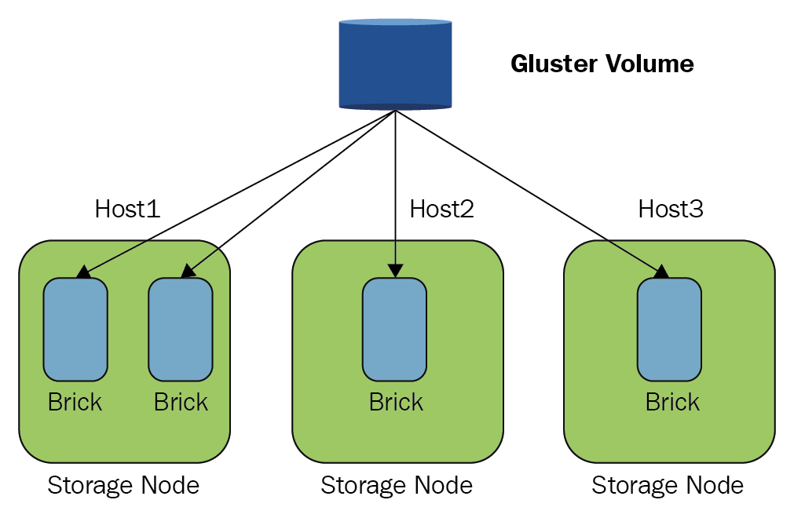
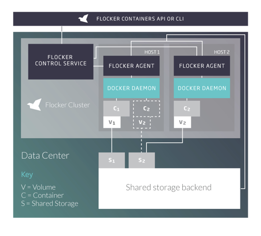
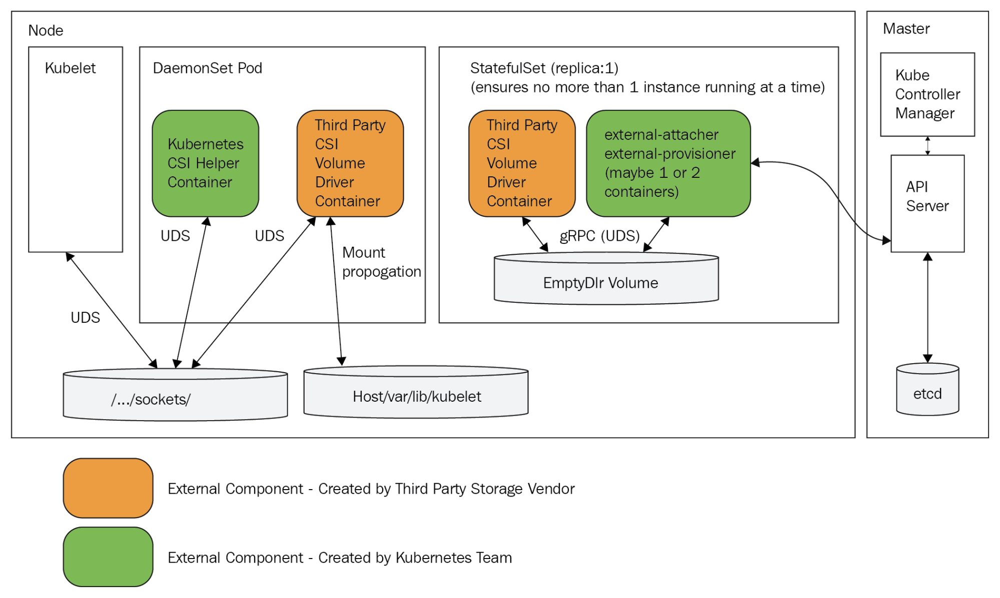

In this chapter, we'll look at how Kubernetes manages storage. Storage is very different from compute, but at a high level they are both resources. Kubernetes as a generic platform takes the approach of abstracting storage behind a programming model and a set of plugins for storage providers. First, we'll go in to detail about the storage conceptual model and how storage is made available to containers in the cluster. Then, we'll cover the common case cloud platform storage providers, such as AWS, GCE, and Azure. Then we'll look at a prominent open source storage provider (GlusterFS from Red Hat), which provides a distributed filesystem. We'll also look into an alternative solution – Flocker – that manages your data in containers as part of the Kubernetes cluster. Finally, we'll see how Kubernetes supports integration of existing enterprise storage solutions.

At the end of this chapter, you'll have a solid understanding of how storage is represented in Kubernetes, the various storage options in each deployment environment (local testing, public cloud, enterprise), and how to choose the best option for your use case.

You should try the code samples in this chapter on minikube or another cluster that supports storage adequately. The KinD cluster has some problems related to labeling nodes, which is necessary for some storage solutions.  

# Persistent volumes walkthrough

In this section, we will understand the Kubernetes storage conceptual model and see how to map persistent storage into containers so they can read and write. Let's start by understanding the problem of storage. Containers and pods are ephemeral. Anything a container writes to its own filesystem gets wiped out when the container dies. Containers can also mount directories from their host node and read or write to them. That will survive container restarts, but the nodes themselves are not immortal. Also, if the pod itself is re-scheduled to a different node the container will not have access to the old node host file system.  

There are other problems, such as ownership for mounted hosted directories when the container dies. Just imagine a bunch of containers writing important data to various data directories on their host and then go away leaving all that data all over the nodes with no direct way to tell what container wrote what data. You can try to record this information, but where would you record it? It's pretty clear that for a large-scale system, you need persistent storage accessible from any node to reliably manage the data.

## Volumes

The basic Kubernetes storage abstraction is the volume. Containers mount volumes that bind to their pod and they access the storage wherever it may be as if it's in their local filesystem. This is nothing new, and it is great because, as a developer who writes applications that need access to data, you don't have to worry about where and how the data is stored.


### Using emptyDir for intra-pod communication

It is very simple to share data between containers in the same pod using a shared volume. Container 1 and container 2 simply mount the same volume and can communicate by reading and writing to this shared space. The most basic volume is the emptyDir. An emptyDir volume is an empty directory on the host. Note that it is not persistent because when the pod is removed from the node, the contents are erased. If a container just crashes, the pod will stick around and you can access it later. Another very interesting option is to use a RAM disk, by specifying the medium as Memory. Now, your containers communicate through shared memory, which is much faster but more volatile of course. If the node is restarted, the emptyDir's volume contents are lost.

Here is a pod configuration file that has two containers that mount the same volume called shared-volume. The containers mount it in different paths, but when the hue-global-listener container is writing a file to /notifications, the hue-job-scheduler will see that file under /incoming:

```
apiVersion: v1
kind: Pod
metadata:
  name: hue-scheduler
spec:
  containers:
  - image: g1g1/hue-global-listener
    name: hue-global-listener
    volumeMounts:
    - mountPath: /notifications
      name: shared-volume
  - image: g1g1/hue-job-scheduler
    name: hue-job-scheduler
    volumeMounts:
    - mountPath: /incoming
      name: shared-volume
  volumes:
  - name: shared-volume
    emptyDir: {}
```

To use the shared memory option, we just need to add medium: Memory to the emptyDir section:

```
  volumes:
  - name: shared-volume
    emptyDir:
     medium: Memory
```

To verify it worked let's create the pod and then write a file using one container and read it using the other container.

```
$ kubectl create -f hue-scheduler.yaml
pod/hue-scheduler created
```

Note that the pod has two containers:

```
$ kubectl get pod hue-scheduler -o json | jq .spec.containers
[
  {
    "image": "g1g1/hue-global-listener:1.0",
    "name": "hue-global-listener",
    "volumeMounts": [
      {
        "mountPath": "/notifications",
        "name": "shared-volume"
      },
      ...
    ]
    ...
  },
  {
    "image": "g1g1/hue-job-scheduler:1.0",
    "name": "hue-job-scheduler",
    "volumeMounts": [
      {
        "mountPath": "/incoming",
        "name": "shared-volume"
      },
      ...  
    ]
    ...
  }
]
```

Now, we can create a file in the /notifications directory of the hue-global-listener container and list it in the /incoming directory of the hue-job-scheduler container:

```
$ kubectl exec -it hue-scheduler -c hue-global-listener touch /notifications/1.txt
$ kubectl exec -it hue-scheduler -c hue-job-scheduler ls /incoming
1.txt
```

### Using HostPath for intra-node communication

Sometimes you want your pods to get access to some host information (for example, the Docker Daemon) or you want pods on the same node to communicate with each other. This is useful if the pods know they are on the same host.  Since Kubernetes schedules pods based on available resources, pods usually don't know what other pods they share the node with. There are several cases where a pod can rely on other pods being scheduled with it on the same node:

- In a single-node cluster all pods obviously share the same node
- DaemonSet pods always share a node with any other pod that matches
their selector
- Pods are always scheduled together due to node or pod affinity 

For example, in _Chapter 5_, _Using Critical Kubernetes Resources_, we discussed a DeamonSet pod that serves as an aggregating proxy to other pods. Another way to implement this behavior is for the pods to simply write their data to a mounted volume that is bound to a host directory and the DaemonSet pod can directly read
it and act on it.

Before you decide to use HostPath volume, make sure you understand
the limitations:

- The behavior of pods with the same configuration might be different if they are data-driven and the files on their host are different.
- It can violate resource-based scheduling (coming soon to Kubernetes) because Kubernetes can't monitor HostPath resources.
- The containers that access host directories must have a security context with privileged set to true or, on the host side, you need to change the permissions to allow writing.

Here is a configuration file that mounts the /coupons directory into the hue-coupon-hunter container, which is mapped to the host's /etc/hue/data/coupons directory:

```
apiVersion: v1
kind: Pod
metadata:
  name: hue-coupon-hunter
spec:
  containers:
  - image: the\_g1g1/hue-coupon-hunter
    name: hue-coupon-hunter
    volumeMounts:
    - mountPath: /coupons
      name: coupons-volume
  volumes:
  - name: coupons-volume
    host-path:
        path: /etc/hue/data/coupons
```

Since the pod doesn't have a privileged security context, it will not be able to
write to the host directory. Let's change the container spec to enable it by adding
a security context:

```
  - image: the\_g1g1/hue-coupon-hunter
    name: hue-coupon-hunter
    volumeMounts:
    - mountPath: /coupons
      name: coupons-volume
    securityContext:
      privileged: true
```

In the following diagram, you can see that each container has its own local storage area inaccessible to other containers or pods and the host's /data directory is mounted as a volume into both container 1 and container 2:


### Using Local Volumes for Durable Node Storage

Local volumes are similar to HostPath, but they persist across pod restarts and node restarts. In that sense they are considered persistent volumes. They were added in Kubernetes 1.7. As of Kubernetes 1.14 they are considered stable. The purpose of local volumes is to support StatefulSets where specific pods need to be scheduled on nodes that contain specific storage volumes. Local volumes have node affinity annotations that simplify the binding of pods to the storage they need to access.


We need to define a storage class for using local volumes. We will cover storage classes in depth later in this chapter. In one sentence, storage class use provisioner to allocate storage to pods. Let's define the storage class in a file called local-storage-class.yaml and create :

```
apiVersion: storage.k8s.io/v1
kind: StorageClass
metadata:
  name: local-storage
provisioner: kubernetes.io/no-provisioner
volumeBindingMode: WaitForFirstConsumer
```

```
$ kubectl create -f local-storage-class.yaml
storageclass.storage.k8s.io/local-storage created 
```

Now, we can create a persistent volume using the storage class that will persist even after the pod that's using it is terminated.

```
apiVersion: v1
kind: PersistentVolume
metadata:
  name: local-pv
  labels:
    release: stable
    capacity: 100Gi
spec:
  capacity:
    storage: 100Gi
  volumeMode: Filesystem
  accessModes:
  - ReadWriteOnce
  persistentVolumeReclaimPolicy: Delete
  storageClassName: local-storage
  local:
    path: /mnt/disks/disk-1
  nodeAffinity:
    required:
      nodeSelectorTerms:
      - matchExpressions:
        - key: kubernetes.io/hostname
          operator: In
          values:
          - minikube
```

### Provisioning persistent volumes

While emptyDir volumes can be mounted and used by containers, they are not persistent and don't require any special provisioning because they use existing storage on the node. HostPath volumes persist on the original node, but if a pod is restarted on a different node, it can't access the HostPath volume from its previous node. Local volumes are real persistent volumes that use storage provisioned ahead of time by administrators or dynamic provisioning via storage classes. They persist on the node and can survive pod restarts and rescheduling and even node restarts. Some persistent volumes use external storage (not a disk physically attached to the node) provisioned ahead of time by administrators. In cloud environments, the provisioning may be very streamlined but it is still required, and as a Kubernetes cluster administrator you have to at least make sure your storage quota is adequate and monitor usage versus quota diligently.

Remember that persistent volumes are resources that the Kubernetes cluster is using similar to nodes. As such they are not managed by the Kubernetes API server.

You can provision resources statically or dynamically.

**Provisioning persistent volumes statically** :

- Static provisioning is straightforward. The cluster administrator creates persistent volumes backed up by some storage media ahead of time, and these persistent volumes can be claimed by containers.

**Provisioning persistent volumes dynamically** :

Dynamic provisioning may happen when a persistent volume claim doesn't match any of the statically provisioned persistent volumes. If the claim specified a storage class and the administrator configured that class for dynamic provisioning, then a persistent volume may be provisioned on the fly. We will see examples later when we discuss persistent volume claims and storage classes.

**Provisioning persistent volumes externally**:

One of the recent trends is to move storage provisioners out of Kubernetes core into volume plugins (AKA out-of-tree). External provisioners work just like in-tree dynamic provisioners, but can be deployed and updated independently. More and more in-tree storage provisioners migrate out-of-tree. Check out this Kubernetes incubator project:

https://github.com/kubernetes-incubator/external-storage

## Creating persistent volumes

Here is the configuration file for an NFS persistent volume:

```
apiVersion: v1
kind: PersistentVolume
metadata:
  name: pv-777
spec:
  capacity:
    storage: 100Gi
  volumeMode: Filesystem
  accessModes:
    - ReadWriteMany
    - ReadOnlyMany
  persistentVolumeReclaimPolicy: Recycle
  storageClassName: slow
  mountOptions:
    - hard
    - nfsvers=4.1
  nfs:
    path: /tmp
    server: 172.17.0.2
```

A persistent volume has a spec and metadata that possibly includes a storage class name. Let's focus on the spec here. There are four sections: capacity, volume mode, access modes, reclaim policy, storage class and the volume type (nfs in the example).

### Capacity

Each volume has a designated amount of storage. Storage claims may be satisfied by persistent volumes that have at least that amount of storage. In the example, the persistent volume has a capacity of 100 Gibibytes (a single gibibyte is 2 to the power of 30 bytes).
 It is important when allocating static persistent volumes to understand the storage request patterns. For example, if you provision 20 persistent volumes with 100 GiB capacity and a container claims a persistent volume with 150 GiB, then this claim will not be satisfied even though there is enough capacity overall in the cluster:

```
capacity:
    storage: 100Gi
```

### Volume mode

The optional volume mode was added in Kubernetes 1.9 as an Alpha feature (moved to Beta in Kubernetes 1.13) for static provisioning. It lets you specify if you want a file system ("Filesystem") or raw storage ("Block"). If you don't specify volume mode then the default is "Filesystem" just like it was pre-1.9.

### Access modes

There are three access modes:

- ReadOnlyMany: Can be mounted read-only by many nodes
- ReadWriteOnce: Can be mounted as read-write by a single node
- ReadWriteMany: Can be mounted as read-write by many nodes

The storage is mounted to nodes, so even with ReadWriteOnce multiple containers on the same node can mount the volume and write to it. If that causes a problem, you need to handle it though some other mechanism (for example, claim the volume only in DaemonSet pods that you know will have just one per node).

Different storage providers support some subset of these modes. When you provision a persistent volume, you can specify which modes it will support. For example, NFS supports all modes, but in the example, only these modes were enabled:

```
accessModes:
    - ReadWriteMany
    - ReadOnlyMany
```

### Reclaim policy

The reclaim policy determines what happens when a persistent volume claim is deleted. There are three different policies:

- **Retain** – the volume will need to be reclaimed manually
- **Delete** – the associated storage asset such as AWS EBS, GCE PD, Azure disk, or OpenStack Cinder volume is deleted
- **Recycle** – delete content only (rm -rf /volume/*)

The Retain and Delete policies mean the persistent volume is not available anymore for future claims. The recycle policy allows the volume to be claimed again.

Currently, only NFS and HostPath support recycling. AWS EBS, GCE PD, Azure disk, and Cinder volumes support deletion. Dynamically provisioned volumes are always deleted.

### Storage Class

You can specify a storage class using the optional storageClassName  field of the spec. If you do then only persistent volume claims that specify the same storage class can be bound to the persistent volume. If you don't specify a storage class then only PV claims that don't specify a storage class can be bound to it.

```
  storageClassName: slow
```


### Volume type

The volume type is specified by name in the spec. There is no volumeType section.
In the preceding example, nfs is the volume type:

```
nfs:
    path: /tmp
    server: 172.17.0.8
```

Each volume type may have its own set of parameters. In this case, it's a path
and server.

We will go over various volume types later.

### Mount options

Some persistent volumes type have additional mount options you can specify. The mount options are not validated. If you provide an invalid mount option, the volume provisioning will fail. For example NFS supports additional mount options.

```
  mountOptions:
    - hard
    - nfsvers=4.1
``` 

## Making persistent volume claims

When containers want access to some persistent storage they make a claim (or rather, the developer and cluster administrator coordinate on necessary storage resources to claim). Here is a sample claim that matches the persistent volume from the previous section:

```
kind: PersistentVolumeClaim
apiVersion: v1
metadata:
  name: local-storage-claim
spec:
  accessModes:
    - ReadWriteOnce
  resources:
    requests:
      storage: 80Gi
  storageClassName: local-storage
  selector:
    matchLabels:
      release: "stable"
    matchExpressions:
      - {key: capacity, operator: In, values: [80Gi, 100Gi]}
```

Let's create the claim and then explain what the different pieces do:

```
$ kubectl create -f local-persistent-volume-claim.yaml
persistentvolumeclaim/local-storage-claim created
```

The name `storage-claim` will be important later when mounting the claim into a container.

The access mode in the spec is ReadWriteOnce, which means if the claim is satisfied no other claim with the ReadWriteOnce access mode can be satisfied, but claims for ReadOnlyMany can still be satisfied.

The resources section requests 80 GiB. This can be satisfied by our persistent volume, which has a capacity of 100 Gi. But, this is a little bit of a waste because 20 Gi will
not be used by definition.

The storage class name is "normal". As mentioned earlier it must match the class name of the persistent volume. However, with PVC there is a difference between empty class name ("") and no class name at all. The former (empty class name) matches persistent volumes with no storage class name. The latter (no class name) will be able to bind to persistent volumes only if the DefaultStorageClass admission plugin is turned off or if the it's on and default storage class is used.

The selector section allows you to filter available volumes further. For example, here the volume must match the label release:stable and also have a label with either capacity:80Gi or capacity:100Gi. Imagine that we have several other volumes provisioned with capacities of 200 Gi and 500 Gi. We don't want to claim a 500 Gi volume when we only need 80 Gi.

Kubernetes always tries to match the smallest volume that can satisfy a claim, but if there are no 80 Gi or 100 Gi volumes then the labels will prevent assigning a 200 Gi or 500 Gi volume and use dynamic provisioning instead.

It's important to realize that claims don't mention volumes by name. You can't claim a specific volume. The matching is done by Kubernetes based on storage class, capacity, and labels.

Finally, persistent volume claims belong to a namespace. Binding a persistent volume to a claim is exclusive. That means that a persistent volume will be bound to a namespace. Even if the access mode is ReadOnlyMany or ReadWriteMany, all the pods that mount the persistent volume claim must be from that claim's namespace.

## Mounting claims as volumes

OK. We have provisioned a volume and claimed it. It's time to use the claimed storage in a container. This turns out to be pretty simple. First, the persistent volume claim must be used as a volume in the pod and then the containers in the pod can mount it, just like any other volume. Here is a pod configuration file that specifies the persistent volume claim we created earlier (bound to the local persistent volume we provisioned):

```
kind: Pod
apiVersion: v1
metadata:
  name: the-pod
spec:
  containers:
    - name: the-container
      image: g1g1/py-kube:0.2
      volumeMounts:
      - mountPath: "/mnt/data"
        name: persistent-volume
  volumes:
    - name: persistent-volume
      persistentVolumeClaim:
        claimName: local-storage-claim
```        

The key is in the persistentVolumeClaim section under volumes. The claim name (storage-claim here) uniquely identifies within the current namespace the specific claim and makes it available as a volume named persistent-volume here. Then, the container can refer to it by its name and mount it to /mnt/data.


Before we create the pod it's important to note that the persistent volume claim didn't actually claim any storage yet and wasn't bound to our local volume. The claim is pending until some container actually attempts to mount a volume using the claim

```
$ kubectl get pvc
NAME                  STATUS    VOLUME   CAPACITY   ACCESS MODES   STORAGECLASS    AGE
local-storage-claim   Pending                                      local-storage   12s
```

Before we create the pod, we need to make sure the local directory (/mnt/disks/disk-1) that maches the volume exists:
 
```
$ mk ssh                
                         _             _
            _         _ ( )           ( )
  ___ ___  (_)  ___  (_)| |/')  _   _ | |_      __
/' _ ` _ `\| |/' _ `\| || , <  ( ) ( )| '_`\  /'__`\
| ( ) ( ) || || ( ) || || |\`\ | (_) || |_) )(  ___/
(_) (_) (_)(_)(_) (_)(_)(_) (_)`\___/'(_,__/'`\____)

$ sudo mkdir -p /mnt/disks/disk-1
```
 
Now, the claim will be bound when creating the pod.

```
$ kubectl create -f pod-with-local-claim.yaml
pod/the-pod created

$ kubectl get pvc
NAME                  STATUS   VOLUME     CAPACITY   ACCESS MODES   STORAGECLASS    AGE
local-storage-claim   Bound    local-pv   100Gi      RWO            local-storage   20m
```


## Raw Block Volumes

Kubernetes 1.9 added this capability as Alpha feature. As of Kubernetes 1.16 it is in Beta.

Raw block volumes provide direct access to the underlying storage, which is not mediated via a file system abstraction. This is very useful for applications that require high-performance of storage like databases or when consistent I/O performance and low latency are needed. Fiber Channel, iSCSI and local SSD are all suitable for use as raw block storage. As of Kubernetes 1.16 the following storage providers support raw block volumes:
 
 
 - AWSElasticBlockStore
 - AzureDisk
 - FC (Fibre Channel)
 - GCEPersistentDisk
 - iSCSI
 - Local volume
 - RBD (Ceph Block Device)
 - VsphereVolume (alpha) 
 
Here is how to define a raw block volume using the FireChannel provider:

```
apiVersion: v1
kind: PersistentVolume
metadata:
  name: block-pv
spec:
  capacity:
    storage: 10Gi
  accessModes:
    - ReadWriteOnce
  volumeMode: Block
  persistentVolumeReclaimPolicy: Retain
  fc:
    targetWWNs: ["50060e801049cfd1"]
    lun: 0
    readOnly: false
```

A matching PVC (Persistent volume claim) MUST specify volumeMode: Block as well. Here is what it looks like:

```
apiVersion: v1
kind: PersistentVolumeClaim
metadata:
  name: block-pvc
spec:
  accessModes:
    - ReadWriteOnce
  volumeMode: Block
  resources:
    requests:
      storage: 10Gi
```
      
Pods consume raw block volumes as devices under /dev and NOT as mounted file systems. Containers can then access this device and read/write to it. In practice this means that I/O requests to block storage go directly to the underlying block storage and don't pass though the file system drivers. This is in theory faster, but in practice it can actually decrease performance if your applications benefit from file system buffering.

Here is a pod with a container that binds the block-pvc with the raw block storage as a device named /dev/xdva:

```
apiVersion: v1
kind: Pod
metadata:
  name: pod-with-block-volume
spec:
  containers:
    - name: fc-container
      image: fedora:26
      command: ["/bin/sh", "-c"]
      args: ["tail -f /dev/null"]
      volumeDevices:
        - name: data
          devicePath: /dev/xvda
  volumes:
    - name: data
      persistentVolumeClaim:
        claimName: block-pvc
```

## Storage classes

Storage classes let an administrator configure your cluster with custom persistent storage (as long as there is a proper plugin to support it). A storage class has a name in the metadata (it must be specified in the annotation to claim), a provisioner and parameters.

We declared a storage class for local storage earlier. Here is a sample storage class that uses AWS EBS as a provisioner (so, it works only on AWS):

```
apiVersion: storage.k8s.io/v1
kind: StorageClass
metadata:
  name: slow
provisioner: kubernetes.io/aws-ebs
parameters:
  type: io1
  iopsPerGB: "10"
  fsType: ext4
```

You may create multiple storage classes for the same provisioner with different parameters. Each provisioner has its own parameters.

The currently supported provisioners are:


- AwsElasticBlockStore
- AzureFile
- AzureDisk
- CephFS
- Cinder
- FC
- FlexVolume
- Flocker
- GcePersistentDisk
- GlusterFS
- iSCSI
- Quobyte
- NFS
- RBD
- VsphereVolume
- PortworxVolume
- ScaleIO
- StorageOS
- Local

This list doesn't contain provisioners for other volume types, such as gitRepo or secret, that are not backed by your typical network storage. Those volume types don't require a storage class. Utilizing volume types intelligently is a major part of architecting and managing your cluster.

### Default storage class

The cluster administrator can also assign a default storage class. When a default storage class is assigned and the DefaultStorageClass admission plugin is turned on, then claims with no storage class will be dynamically provisioned using the default storage class. If the default storage class is not defined or the admission plugin is not turned on, then claims with no storage class can only match volumes with no storage class.


## Demonstrating persistent volume storage end to end

To illustrate all the concepts, let's do a mini demonstration where we create a HostPath volume, claim it, mount it, and have containers write to it.

Let's start by creating a hostPath volume using the `dir` storage class. Save the following in dir-persistent-volume.yaml:

```
kind: PersistentVolume
apiVersion: v1
metadata:
  name: dir-pv
spec:
  storageClassName: dir
  capacity:
    storage: 1Gi
  accessModes:
    - ReadWriteOMany
  hostPath:
    path: "/tmp/data"
```

Then, let's create i:

```
$ kubectl create -f dir-persistent-volume.yaml
persistentvolume/dir-pv created
```

To check out the available volumes, you can use the resource type persistentvolumes or pv for short:

```
$ kubectl get pv
NAME     CAPACITY   ACCESS MODES   RECLAIM POLICY   STATUS      CLAIM   STORAGECLASS 
dir-pv   1Gi        RWX            Retain           Available           dir         
```

The capacity is 1 1 GiB as requested. The reclaim policy is Retain because host path volumes are retained (not destroyed). The status is Available because the volume has not been claimed yet. The access mode is specified as RWX, which means ReadWriteMany. All access modes have a shorthand version:

- **RWO** – ReadWriteOnce
- **ROX** – ReadOnlyMany
- **RWX** – ReadWriteMany

We have a persistent volume. Let's create a claim. Save the following to dir-persistent-volume-claim.yaml:

```
kind: PersistentVolumeClaim
apiVersion: v1
metadata:
  name: dir-pvc
spec:
  accessModes:
    - ReadWriteOnce
  resources:
    requests:
      storage: 1Gi
```

Then, run the following command:

```
$ kubectl create -f  dir-persistent-volume-claim.yaml
persistentvolumeclaim/dir-pvc created
```
Let's check the claim and the volume:


```
$ kubectl get pvc
NAME      STATUS   VOLUME   CAPACITY   ACCESS MODES   STORAGECLASS
dir-pvc   Bound    dir-pv   1Gi        RWX            dir

$ kubectl get pv
NAME     CAPACITY   ACCESS MODES   RECLAIM POLICY   STATUS   CLAIM             STORAGECLASS
dir-pv   1Gi        RWX            Retain           Bound    default/dir-pvc   dir
```


As you can see, the claim and the volume are bound to each other and reference each other. The reason the binding works is that the same storage class is used by the volume and the claim. But, what happens if they don't match? Let's remove the storage class from the persistent volume claim and see what happens. Save the following persistent volume claim to some-persistent-volume-claim.yaml:

```
kind: PersistentVolumeClaim
apiVersion: v1
metadata:
  name: some-pvc
spec:
  accessModes:
  - ReadWriteMany
  resources:
    requests:
      storage: 1Gi
```  

Then, create it:

```
$ kubectl create -f some-persistent-volume-claim.yaml
persistentvolumeclaim/some-pvc created
```

Ok. It was created. Let's check it out:

```
$ kubectl get pvc
NAME       STATUS   VOLUME                                     CAPACITY   ACCESS MODES   STORAGECLASS  
dir-pvc    Bound    dir-pv                                     1Gi        RWX            dir           
some-pvc   Bound    pvc-276fdd9d-b787-4c3e-a94b-e886edaa1039   1Gi        RWX            standard     
```

Very interesting. The some-pvc claim was bound to a new volume using the standard storage class. This is an example of dynamic provisioning, where a new persistent volume was created on the fly to satisfy the some-pvc claim that didn't match any existing volume.

Here is the dynamic volume. It is also a hostPath volume created under `/tmp/hostpath-provisioner`:

```
$ kubectl get pv pvc-276fdd9d-b787-4c3e-a94b-e886edaa1039 -o yaml
apiVersion: v1
kind: PersistentVolume
metadata:
  annotations:
    hostPathProvisionerIdentity: 7f22c7da-dc16-11e9-a3e9-080027a42754
    pv.kubernetes.io/provisioned-by: k8s.io/minikube-hostpath
  creationTimestamp: "2019-09-21T23:11:36Z"
  finalizers:
  - kubernetes.io/pv-protection
  name: pvc-276fdd9d-b787-4c3e-a94b-e886edaa1039
  resourceVersion: "193570"
  selfLink: /api/v1/persistentvolumes/pvc-276fdd9d-b787-4c3e-a94b-e886edaa1039
  uid: e1f6579f-8ddb-401f-be44-f52742c91cfa
spec:
  accessModes:
  - ReadWriteMany
  capacity:
    storage: 1Gi
  claimRef:
    apiVersion: v1
    kind: PersistentVolumeClaim
    name: some-pvc
    namespace: default
    resourceVersion: "193563"
    uid: 276fdd9d-b787-4c3e-a94b-e886edaa1039
  hostPath:
    path: /tmp/hostpath-provisioner/pvc-276fdd9d-b787-4c3e-a94b-e886edaa1039
    type: ""
  persistentVolumeReclaimPolicy: Delete
  storageClassName: standard
  volumeMode: Filesystem
status:
  phase: Bound
```

The final step is to create a pod and assign the claim as a volume. Save the following to shell-pod.yaml:

```
kind: Pod
apiVersion: v1
metadata:
  name: just-a-shell
  labels:
    name: just-a-shell
spec:
  containers:
    - name: a-shell
      image: g1g1/py-kube:0.2
      command: ["/bin/bash", "-c", "while true ; do sleep 1 ; done"]
      volumeMounts:
      - mountPath: "/data"
        name: pv
    - name: another-shell
      image: g1g1/py-kube:0.2
      command: ["/bin/bash", "-c", "while true ; do sleep 1 ; done"]
      volumeMounts:
      - mountPath: "/another-data"
        name: pv
  volumes:
    - name: pv
      persistentVolumeClaim:
       claimName: persistent-volume-claim
```       

This pod has two containers that use the g1g1/py-kube:0.2 image and both run a shell command that just sleeps in an infinite loop. The idea is that the containers will keep running, so we can connect to them later and check their file system. The pod mounts our persistent volume claim with a volume name of pv. Note, that the volume specification is done at the pod level just once and multiple containers can mount it into different directories.

Let's create the pod and verify that both containers are running:

```
$ kubectl create -f shell-pod.yaml
pod/just-a-shell created
```

```
$ kubectl get pods
NAME           READY   STATUS    RESTARTS   AGE
just-a-shell   2/2     Running   0          3m41s
```

Then, ssh to the node. This is the host whose /tmp/data is the pod's volume that mounted as /data and /another-data into each of the running containers:

```
$ minikube ssh
                         _             _
            _         _ ( )           ( )
  ___ ___  (_)  ___  (_)| |/')  _   _ | |_      __
/' _ ` _ `\| |/' _ `\| || , <  ( ) ( )| '_`\  /'__`\
| ( ) ( ) || || ( ) || || |\`\ | (_) || |_) )(  ___/
(_) (_) (_)(_)(_) (_)(_)(_) (_)`\___/'(_,__/'`\____)

$
```

Inside the node, we can communicate with the containers using Docker commands. Let's look at the last two running containers:

```
$ docker ps -n 2 --format '{{.ID}}\t{{.Image}}\t{{.Command}}'
341f7ab2b4cc	1c757b9abf75	"/bin/bash -c 'while…"
189b2fc840e2	1c757b9abf75	"/bin/bash -c 'while…"
```

Then, let's create a file in the /tmp/data directory on the host. It should be visible by both containers via the mounted volume:

```
$ sudo su
$ echo "yeah, it works!" > /tmp/data/cool.txt
```
Let's that the file cool.txt is indeed available:

```
$ docker exec -it 189b2fc840e2 cat /data/cool.txt
yeah, it works!

$ docker exec -it 341f7ab2b4cc cat /another-data/cool.txt
yeah, it works!
```

We can even create a new file `yo.txt` in one of the containers and see that it's available to the other container or to the node itself:

```
$ docker exec -it 341f7ab2b4cc bash
root@just-a-shell:/# echo yo > /another-data/yo.txt
root@just-a-shell:/#
```

Let's verify directly from kubectl that yo.txt is available to both containers:

```
$ kubectl exec -it just-a-shell -c a-shell cat /data/yo.txt
yo

$ kubectl exec -it just-a-shell -c another-shell cat /another-data/yo.txt
yo
```

Yes. Everything works as expected and both containers share the same storage.

# Public cloud storage volume types - GCE, AWS, and Azure

In this section, we'll look at some of the common volume types available in the leading public cloud platforms. Managing storage at scale is a difficult task that eventually involves physical resources, similar to nodes. If you choose to run your Kubernetes cluster on a public cloud platform, you can let your cloud provider deal with all these challenges and focus on your system. But it's important to understand the various options, constraints, and limitations of each volume type.

Many of the volume types we will go over are handle by in-tree plugins (part of core Kubernetes), but are in the process of migrating out-of-tree CSI plugins. We will cover CSI later. 

## AWS Elastic Block Store (EBS)

AWS provides the elastic block store as persistent storage for EC2 instances.
An AWS Kubernetes cluster can use AWS EBS as persistent storage with the following limitations:

- The pods must run on AWS EC2 instances as nodes
- Pods can only access EBS volumes provisioned in their availability zone
- An EBS volume can be mounted on a single EC2 instance.

Those are severe limitations. The restriction for a single availability zone, while great for performance, eliminates the ability to share storage at scale or across a geographically distributed system without custom replication and synchronization. The limit of a single EBS volume to a single EC2 instance means even within the same availability zone pods can't share storage (even for reading) unless you make sure they run on the same node.

With all the disclaimers out of the way, let's see how to mount an EBS volume:

```
apiVersion: v1
kind: Pod
metadata:
  name: some-pod
spec:
  containers:
  - image: some-container
    name: some-container
    volumeMounts:
    - mountPath: /ebs
      name: some-volume
  volumes:
  - name: some-volume
    awsElasticBlockStore:
      volumeID: <volume-id>
      fsType: ext4
```

You must create the EBS volume in AWS and then you just mount it into the pod. There is no need for a claim or storage class because you mount the volume directly by ID. The awsElasticBlockStore volume type is known to Kubernetes.

## AWS Elastic File System (EFS)

AWS recently released a new service called the Elastic File System. This is really a managed NFS service. It's using NFS 4.1 protocol and it has many benefits over EBS:

- Multiple EC2 instances can access the same files across multiple availability zones (but within the same region)
- Capacity is automatically scaled up and down based on actual usage
- You pay only for what you use
- You can connect on-premise servers to EFS over VPN
- EFS runs off SSD drives that are automatically replicated across availability zones

That said, EFS is more expansive than EBS even when you consider the automatic replication to multiple AZs (assuming you fully utilize your EBS volumes). It is using an external provisioner and it is not trivial to deploy. Follow the instructions here:

https://github.com/kubernetes-incubator/external-storage/tree/master/aws/efs


From Kubernetes point of view, AWS EFS is just an NFS volume. You provision it as such:

```
apiVersion: v1
kind: PersistentVolume
metadata:
  name: efs-share
spec:
  capacity:
    storage: 200Gi
  accessModes:
    - ReadWriteMany
  nfs:
    server: eu-west-1b.fs-64HJku4i.efs.eu-west-1.amazonaws.com
    path: /
```

Once everything is setup and you defined your storage class and the persistent volume exists, you can create a claim and mount it into as many pods as you like in ReadWriteMany mode. Here is the persistent claim:

```
kind: PersistentVolumeClaim
apiVersion: v1
metadata:
  name: efs
  annotations:
    volume.beta.kubernetes.io/storage-class: "aws-efs"
spec:
  accessModes:
    - ReadWriteMany
  resources:
    requests:
      storage: 1Mi
```

Here is a pod that consumes it:

```
kind: Pod
apiVersion: v1
metadata:
  name: test-pod
spec:
  containers:
  - name: test-pod
    image: gcr.io/google\_containers/busybox:1.24
    command:
      - "/bin/sh"
    args:
      - "-c"
      - "touch /mnt/SUCCESS &amp;&amp; exit 0 || exit 1"
    volumeMounts:
      - name: efs-pvc
        mountPath: "/mnt"
  restartPolicy: "Never"
  volumes:
    - name: efs-pvc
      persistentVolumeClaim:
        claimName: efs
```

## GCE persistent disk

The gcePersistentDisk volume type is very similar to awsElasticBlockStore. You must provision the disk ahead of time. It can only be used by GCE instances in the same project and zone. But the same volume can be used as read-only on multiple instances. This means it supports ReadWriteOnce and ReadOnlyMany. You can use a GCE persistent disk to share data as read-only between multiple pods in the same zone.

The pod that's using a persistent disk in ReadWriteOnce mode must be controlled by a replication controller, a replica set, or a deployment with a replica count of 0 or 1. Trying to scale beyond 1 will fail for obvious reasons:

```
apiVersion: v1
kind: Pod
metadata:
  name: some-pod
spec:
  containers:
  - image: some-image
    name: some-container
    volumeMounts:
    - mountPath: /pd
      name: some-volume
  volumes:
  - name: some-volume
    gcePersistentDisk:
      pdName: <persistent disk name>
      fsType: ext4
```      

The GCE persistent disk supports a regional disk option since Kubernetes 1.10 (in Beta). Regional persistent disks automatically sync between two zones. The key to using them in Kubernetes is to specify a special label for failure domain that specifies the two zones:

```
apiVersion: v1
kind: PersistentVolume
metadata:
  name: test-volume
  labels:
    failure-domain.beta.kubernetes.io/zone: us-central1-a__us-central1-b
spec:
  capacity:
    storage: 400Gi
  accessModes:
  - ReadWriteOnce
  gcePersistentDisk:
    pdName: data-disk
    fsType: ext4
```


## Azure data disk

The Azure data disk is a virtual hard disk stored in Azure storage. It's similar in capabilities to AWS EBS. Here is a sample pod configuration file:

```
apiVersion: v1
kind: Pod
metadata:
 name: some-pod
spec:
 containers:
  - image: some-container
    name: some-container
    volumeMounts:
      - name: some-volume
        mountPath: /azure
 volumes:
      - name: some-volume
        azureDisk:
          diskName: test.vhd
          diskURI: https://someaccount.blob.microsoft.net/vhds/test.vhd
```

In addition to the mandatory diskName and diskURI parameters, it also has a few optional parameters:

- kind: one of Shared (multiple disks per storage account), Dedicated (single blob disk per storage account), or Managed (Azure managed data disk). The default is Shared.
- cachingMode: The disk caching mode. This must be one of None, ReadOnly, or ReadWrite. The default is None.
- fsType: The filesystem type set to mount. The default is ext4.
- readOnly: Whether the filesystem is used as readOnly. The default is false.

Azure data disks are limited to 1,023 GB. Each Azure VM can have up to 16 data disks. You can attach an Azure data disk to a single Azure VM.

## Azure file

In addition to the data disk, Azure has also a shared filesystem similar to AWS EFS. However, Azure file storage uses the SMB/CIFS protocol (it supports SMB 2.1 and SMB 3.0). It is based on the Azure storage platform and has the same availability, durability, scalability, and geo-redundancy capabilities as Azure Blob, Table, or Queue.

In order to use Azure file storage, you need to install on each client VM the
cifs-utils package. You also need to create a secret, which is a required parameter:

```
apiVersion: v1
kind: Secret
metadata:
  name: azure-file-secret
type: Opaque
data:
  azurestorageaccountname: <base64 encoded account name>
  azurestorageaccountkey: <base64 encoded account key>
```

Here is a pod that uses Azure file storage:

```
apiVersion: v1
kind: Pod
metadata:
 name: some-pod
spec:
 containers:
  - image: some-container
    name: some-container
    volumeMounts:
      - name: some-volume
        mountPath: /azure
 volumes:
      - name: some-volume
        azureFile:
          secretName: azure-file-secret
         shareName: azure-share
          readOnly: false
```
Azure file storage supports sharing within the same region as well as connecting on-premise clients.

# GlusterFS and Ceph volumes in Kubernetes

GlusterFS and Ceph are two distributed persistent storage systems. GlusterFS is at its core a network filesystem. Ceph is at the core an object store. Both expose block, object, and filesystem interfaces. Both use the xfs filesystem under the covers to store the data and metadata as xattr attributes. There are several reasons why you may want to use GlusterFs or Ceph as persistent volumes in your Kubernetes cluster:

- You may have a lot of data and applications that access the data in GlusterFS or Ceph
- You have operational expertise managing GlusterFS or Ceph
- You run in the cloud, but the limitations of the cloud platform persistent storage are a non-starter

## Using GlusterFS

GlusterFS is intentionally simple, exposing the underlying directories as they are and leaving it to clients (or middleware) to handle high availability, replication, and distribution. Gluster organizes the data into logical volumes, which encompass multiple nodes (machines) that contain bricks, which store files. Files are allocated to bricks according to DHT (distributed hash table). If files are renamed or the GlusterFS cluster is expanded or rebalanced, files may be moved between bricks. The following diagram shows the GlusterFS building blocks:



To use a GlusterFS cluster as persistent storage for Kubernetes (assuming you have an up and running GlusterFS cluster), you need to follow several steps. In particular, the GlusterFS nodes are managed by the plugin as a Kubernetes service (although as an application developer it doesn't concern you).

### Creating endpoints

Here is an example of an endpoints resource that you can create as a normal Kubernetes resource using kubectl create:

```
{
  "kind": "Endpoints",
  "apiVersion": "v1",
  "metadata": {
    "name": "glusterfs-cluster"
  },
  "subsets": [
    {
      "addresses": [
        {
          "ip": "10.240.106.152"
        }
      ],
      "ports": [
        {
          "port": 1
        }
      ]
    },
    {
      "addresses": [
        {
          "ip": "10.240.79.157"
        }
      ],
      "ports": [
        {
          "port": 1
        }
      ]
    }
  ]
}
```

### Adding a GlusterFS Kubernetes service

To make the endpoints persistent, you use a Kubernetes service with no selector to indicate the endpoints are managed manually:

```
{
  "kind": "Service",
  "apiVersion": "v1",
  "metadata": {
    "name": "glusterfs-cluster"
  },
  "spec": {
    "ports": [
      {"port": 1}
    ]
  }
}
```

### Creating pods

Finally, in the pod spec's volumes section, provide the following information:

```
"volumes": [
            {
                "name": "glusterfsvol",
                "glusterfs": {
                    "endpoints": "glusterfs-cluster",
                    "path": "kube\_vol",
                    "readOnly": true
                }
            }
        ]
```

The containers can then mount glusterfsvol by name.

The endpoints tell the GlusterFS volume plugin how to find the storage nodes of the GlusterFS cluster.

## Using Ceph

Ceph's object store can be accessed using multiple interfaces. Kubernetes supports the **RBD** (block) and **CEPHFS** (filesystem) interfaces. Unlike GlusterFS, Ceph does a lot of work automatically. It does distribution, replication, and self-healing all on its own. The following diagram shows how RADOS – the underlying object store – can be accessed in multiple days.


Kubernetes supports Ceph via the **Rados**** Block ****Device** ( **RBD** ) interface.

### Connecting to Ceph using RBD

 You must install ceph-common on each node of the Kubernetes cluster. Once you have your Ceph cluster up and running, you need to provide some information required by the Ceph RBD volume plugin in the pod configuration file:

- monitors: Ceph monitors.
- pool: The name of the RADOS pool. If not provided, the default RBD pool
is used.
- image: The image name that RBD has created.
- user: The RADOS user name. If not provided, the default admin is used.
- keyring: The path to the keyring file. If not provided, the default /etc/ceph/keyring is used.
- secretName: The name of the authentication secrets. If provided, secretName overrides keyring. Note, see the following paragraph about how to create a secret.
- fsType: The filesystem type (ext4, xfs, and so on) that is formatted on
the device.
- readOnly: Whether the filesystem is used as readOnly.

If the Ceph authentication secret is used, you need to create a secret object:

```
apiVersion: v1
kind: Secret
metadata:
  name: ceph-secret
type: "kubernetes.io/rbd"
data:
  key: QVFCMTZWMVZvRjVtRXhBQTVrQ1FzN2JCajhWVUxSdzI2Qzg0SEE9PQ==
```
  
The secret type is kubernetes.io/rbd.

Here is a sample pod that uses Ceph through RBD with a secret:

```
apiVersion: v1
kind: Pod
metadata:
  name: rbd2
spec:
  containers:
    - image: kubernetes/pause
      name: rbd-rw
      volumeMounts:
      - name: rbdpd
        mountPath: /mnt/rbd
  volumes:
    - name: rbdpd
      rbd:
        monitors:
        - '10.16.154.78:6789'
        - '10.16.154.82:6789'
        - '10.16.154.83:6789'
        pool: kube
        image: foo
        fsType: ext4
        readOnly: true
        user: admin
        secretRef:
          name: ceph-secret
```

Ceph RBD supports ReadWriteOnce and ReadOnlyMany access modes.

### Connecting to Ceph using CephFS

If your Ceph cluster is already configured with CephFS, then you can assign it very easily to pods. Also CephFS supports ReadWriteMany access modes.

The configuration is similar to Ceph RBD, except you don't have a pool, image, or filesystem type. The secret can be a reference to a Kubernetes secret object (preferred) or a secret file:

```
apiVersion: v1
kind: Pod
metadata:
  name: cephfs2
spec:
  containers:
  - name: cephfs-rw
    image: kubernetes/pause
    volumeMounts:
    - mountPath: "/mnt/cephfs"
      name: cephfs
  volumes:
  - name: cephfs
    cephfs:
      monitors:
      - 10.16.154.78:6789
      - 10.16.154.82:6789
      - 10.16.154.83:6789
      user: admin
      secretRef:
        name: ceph-secret
      readOnly: true
```

You can also provide a path as a parameter in the cephfs system. The default is /.

The in-tree RBD provisioner has an out-of-tree copy now in the external-storage Kubernetes incubator project.

# Flocker as a clustered container data volume manager

So far, we have discussed storage solutions that stored the data outside the Kubernetes cluster (except for emptyDir and HostPath, which are not persistent). Flocker is a little different. It is Docker-aware. It was designed to let Docker data volumes transfer with their container when the container is moved between nodes. You may want to use the Flocker volume plugin if you're migrating a Docker-based system that uses a different orchestration platform, such as Docker compose or Mesos, to Kubernetes and you use Flocker for orchestrating storage. Personally, I feel that there is a lot of duplication between what Flocker does and what Kubernetes does
to abstract storage.

Flocker has a control service and agents on each node. Its architecture is very similar to Kubernetes with its API server and the Kubelet running on each node. The Flocker control service exposes a REST API and manages the configuration of the state across the cluster. The agents are responsible for ensuring that the state of their node matches the current configuration. For example, if a dataset needs to be on node X, then the Flocker agent on node X will create it.

The following diagram showcases the Flocker architecture:




In order to use Flocker as persistent volumes in Kubernetes, you first must have a properly configured Flocker cluster. Flocker can work with many backing stores (again, very similar to Kubernetes persistent volumes).

Then you need to create Flocker datasets and at that point you're ready to hook it up as a persistent volume. After all your hard work, this part is easy and you just need to specify the Flocker dataset name:

```
apiVersion: v1
kind: Pod
metadata:
  name: flocker-web
spec:
  containers:
    - name: web
      image: nginx
      ports:
        - name: web
          containerPort: 80
      volumeMounts:
          # name must match the volume name below
          - name: www-root
            mountPath: "/usr/share/nginx/html"
  volumes:
    - name: www-root
      flocker:
        datasetName: my-flocker-vol

```

# Integrating enterprise storage into Kubernetes

If you have an existing Storage Area Network ( **SAN** ) exposed over the iSCSI interface, Kubernetes has a volume plugin for you. It follows the same model as other shared persistent storage plugins we've seen earlier. It supports the following features:


- Connect to one portal
- Mount a device directly or via multipathd
- Format and partition any new device
- Authenticate via CHAP

You must configure the iSCSI initiator, but you don't have to provide any initiator information. All you need to provide is the following:

- IP address of the iSCSI target and port (if not the default 3260)
- Target's iqn (iSCSI qualified name) – typically reversed domain name
- **LUN** – logical unit number
- Filesystem type
- Readonly Boolean flag

The iSCSI plugin supports ReadWriteOnce and ReadonlyMany. Note that you can't partition your device at this time. Here is the volume spec:

```
volumes:
  - name: iscsi-volume
    iscsi:
      targetPortal: 10.0.2.34:3260
      iqn: iqn.2001-04.com.example:storage.kube.sys1.xyz
      lun: 0
      fsType: ext4
      readOnly: true
```

## Rook – the new kid on the block

Rook is an open source cloud native storage orchestrator. It is currently an incubating CNCF project. It provides a consistent experience on top of multiple storage solutions like: Ceph, edgeFS, Cassandra, Minio, NFS, CockroachDB, and YugabyteDB (although only Ceph and EdgeFS support is considered stable). Here are the features Rook provides:
- Scheduling
- Lifecycle management
- Resource management
- Monitoring

Rook takes advantage of modern Kubernetes best practices like CRDs and operators. Once you install the Rook operator you can create a Ceph cluster using a Rook CRD such as:

```
apiVersion: ceph.rook.io/v1
kind: CephCluster
metadata:
  name: rook-ceph
  namespace: rook-ceph
spec:
  cephVersion:
    # For the latest ceph images, see https://hub.docker.com/r/ceph/ceph/tags
    image: ceph/ceph:v14.2.4-20190917
  dataDirHostPath: /var/lib/rook
  mon:
    count: 3
  dashboard:
    enabled: true
  storage:
    useAllNodes: true
    useAllDevices: false
    # Important: Directories should only be used in pre-production environments
    directories:
    - path: /var/lib/rook
```

Note that the Rook framework itself is still considered Alpha software. It is definitely a project to watch even if you decide not to use it right away. 


# Projecting Volumes

It's possible to project multiple volumes into a single directory, so they appear as a single volume. The supported volume types are Kubernetes-managed: secret, downwardAPI and configMap. This is useful if you want to mount multiple sources of configuration into a pod. Instead of having to create a separate volume for each source you can bundle all of them into a single projected volume. Here is an example:

```
apiVersion: v1
kind: Pod
metadata:
  name: the-pod
spec:
  containers:
  - name: the-container
    image: busybox
    volumeMounts:
    - name: all-in-one
      mountPath: "/projected-volume"
      readOnly: true
  volumes:
  - name: all-in-one
    projected:
      sources:
      - secret:
          name: the-secret
          items:
            - key: username
              path: the-group/the-user
      - downwardAPI:
          items:
            - path: "labels"
              fieldRef:
                fieldPath: metadata.labels
            - path: "cpu\_limit"
              resourceFieldRef:
                containerName: the-container
                resource: limits.cpu
      - configMap:
          name: the-configmap
          items:
            - key: config
              path: the-group/the-config
```
              
# Using out of tree volume plugins with FlexVolume

 The FlexVolume became generally available in Kubernetes 1.8. It allows you to consume out of tree storage through a uniform API. Storage providers write a driver that you install on all nodes. The FlexVolume plugin can dynamically discover existing drivers. Here is an example of using a FlrxVolume to bind to an external NFS volume:

```
apiVersion: v1
kind: Pod
metadata:
  name: nginx-nfs
  namespace: default
spec:
  containers:
  - name: nginx-nfs
    image: nginx
    volumeMounts:
    - name: test
      mountPath: /data
    ports:
    - containerPort: 80
  volumes:
  - name: test
    flexVolume:
      driver: "k8s/nfs"
      fsType: "nfs"
      options:
        server: "172.16.0.25"
        share: "dws\_nas\_scratch"
```

However, at this point I highly recommend you avoid using FlexVolume plugins and utilize CSI plugins instead, 

# The Container Storage Interface

The container storage interface (AKA CSI) is an initiative to standardize the interaction between container orchestrators and storage providers. It is driven by Kubernetes, Docker, Mesos and Cloud Foundry. The idea is that storage providers implement just one CSI driver and container orchestrators  need to support only CSI. It is the equivalent of CNI for storage. There are several advantages over the FlexVolume approach:

- CSI is an industry-wide standard
- New capabilities are made available for CSI plugins only (volume snapshots, volume cloning)
- FlexVolume plugins require access to the node and master root file system to deploy derivers
- FlexVolume storage driver often require many external dependencies
- FlexVolume's EXEC style interface is clunky

A CSI volume plugin was added in Kubernetes 1.9 as alpha feature and is generally available since Kubernetes 1.13. The FlexVolume will remain for backwards compatibility, at least for a while.

Here is a diagram that demonstrates how CSI works within Kubernetes:



There is currently a major migration effort to port all in-tree plugins to out-of-tree CSI drivers.

See https://kubernetes-csi.github.io for more details

## Volume snapshotting and cloning

These features are available only to CSI drivers. They represent the benefits of a uniform storage model that allows adding optional advanced functionality across all storage providers with a uniform interface.

### Volume snapshots

Volume snapshots are in alpha status as of Kubernetes 1.12. They are exactly what they sound like. A snapshot of a volume at a certain point in time. You can create and later restore volumes from a snapshot. It's interesting that the API objects associated with snapshots are CRDs and not part of the core Kubernetes API. The objects are:

- VolumeSnapshotClass
- VolumeSnapshotContents
- VolumeSnapshot

Volume snapshots work using an external-prosnapshotter sidecar container that the Kubernetes team developed. It watches for snapshot CRDs to be created and interacts with snapshot controller that can invoke the CreateSnapshot and DeleteSnapshot operations of CSI drivers that implement snapshot support.

You can also provision volumes from a snapshot.  

Here is a persistent volume claim bound to a snapshot:

```
apiVersion: v1
kind: PersistentVolumeClaim
metadata:
  name: restore-pvc
spec:
  storageClassName: csi-hostpath-sc
  dataSource:
    name: new-snapshot-test
    kind: VolumeSnapshot
    apiGroup: snapshot.storage.k8s.io
  accessModes:
    - ReadWriteOnce
  resources:
    requests:
      storage: 10Gi
```

### Volume cloning 

Volume cloning is available in beta status as of Kubernetes 1.16. Volume clones are new volumes that are populated with the content of an existing volume. Once the volume cloning is complete there is no relation between the original and clone. Their context will diverge over time. You can perform a clone by creating a snapshot and then create a new volume from the snapshot. But, volume cloning is more streamlined and efficient.

Volume cloning must be enabled with a feature gate: `--feature-gates=VolumePVCDataSource=true`

It works just for dynamic provisioning and use the storage class of the source volume for the clone as well. You initiate a volume clone by specifying an existing persistent volume claim as a data source of a new persistent volume claim. That triggers dynamic provisioning of a new volume that clones the source claim's volume:

```
apiVersion: v1
kind: PersistentVolumeClaim
metadata:
    name: clone-of-pvc-1
    namespace: myns
spec:
  accessModes:
  - ReadWriteOnce
  storageClassName: cloning
  resources:
    requests:
      storage: 5Gi
  dataSource:
    kind: PersistentVolumeClaim
    name: pvc-1
```   

# Summary

In this chapter, we took a deep look into storage in Kubernetes. We've looked at the generic conceptual model based on volumes, claims, and storage classes, as well as the implementation as volume plugins. Kubernetes eventually maps all storage systems into mounted filesystems in containers or devices of raw block storage. This straightforward model allows administrators to configure and hook up any storage system from local host directories through cloud-based shared storage all the way to enterprise storage systems. The transition of storage provisioners from in-tree to CSI-based out-of-tree drivers bodes well to the storage eco-system. You should now have a clear understanding of how storage is modeled and implemented in Kubernetes and be able to make intelligent choices of how to implement storage in your Kubernetes cluster.

In _Chapter 7_, _Running Stateful Application with Kubernetes_, we'll see how Kubernetes can raise the level of abstraction and on top of storage help in developing, deploying, and operating stateful applications using concepts such as stateful sets.
