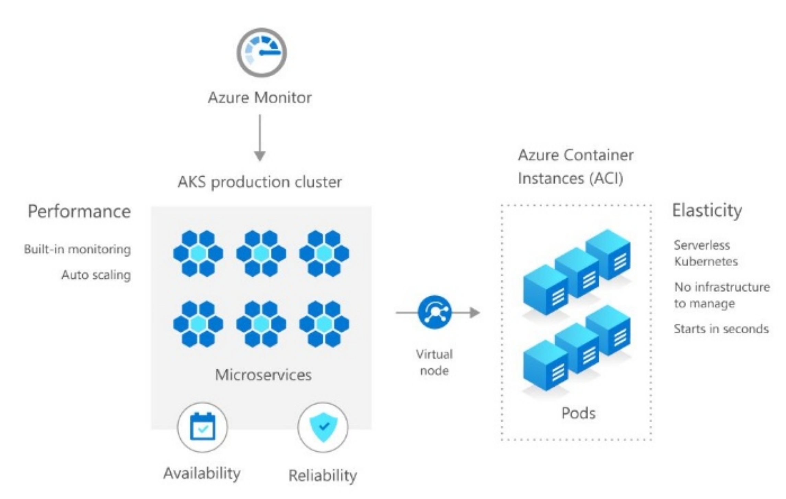
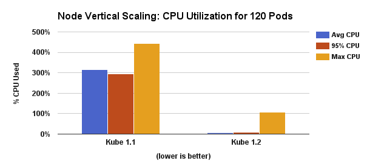
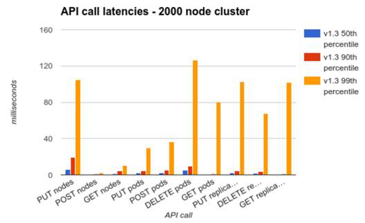
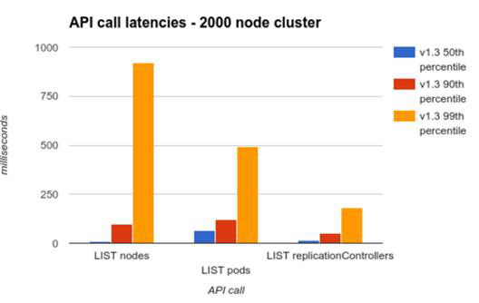
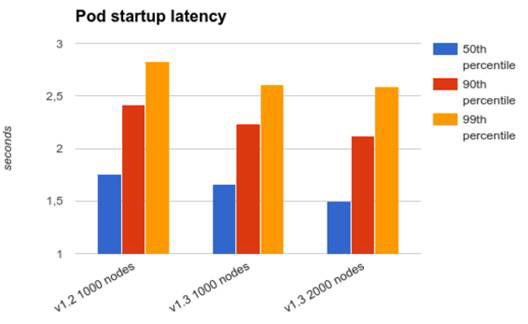
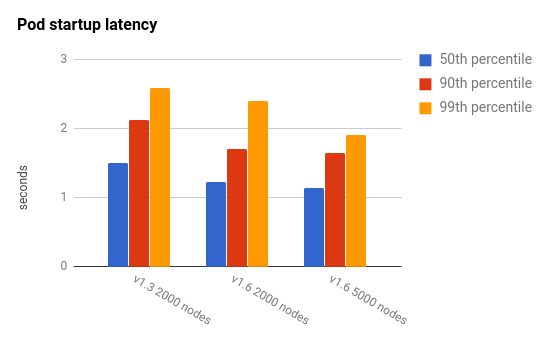

In this chapter, we will explore the automated pod scalability that Kubernetes provides, how it affects rolling updates, and how it interacts with quotas. We will touch on the important topic of provisioning and how to choose and manage the size of the cluster. Finally, we will go over how the Kubernetes team improved the performance of Kubernetes and how they test the limits of Kubernetes with the Kubemark tool. Here are the main points we will cover:

- Horizontal pod autoscaling
- Performing rolling updates with autoscaling
- Handling scarce resources with quotas and limits
- Pushing the envelope with Kubernetes performance

At the end of this chapter, you will have the ability to plan a large-scale cluster, provision it economically, and make informed decisions about the various trade-offs between performance, cost, and availability. You will also understand how to set up horizontal pod auto-scaling and use resource quotas intelligently to let Kubernetes automatically handle intermittent fluctuations in volume as well as deploy software safely to your cluster.

# Horizontal pod autoscaling

Kubernetes can watch over your pods and scale them when the CPU utilization or some other metric crosses a threshold. The autoscaling resource specifies the details (percentage of CPU, how often to check) and the corresponding autoscale controller adjusts the number of replicas, if needed.

The following diagram illustrates the different players and their relationships:


As you can see, the horizontal pod autoscaler doesn't create or destroy pods directly. It relies instead on the replication controller or deployment resources. This is very smart because you don't need to deal with situations where autoscaling conflicts with the replication controller or deployments trying to scale the number of pods, unaware of the autoscaler efforts.

The autoscaler automatically does what we had to do ourselves before. Without
the autoscaler, if we had a replication controller with replicas set to 3, but we determined that based on average CPU utilization we actually needed 4, then we would update the replication controller from 3 to 4 and keep monitoring the CPU utilization manually in all pods. The autoscaler will do it for us.

## Declaring horizontal pod autoscaler

To declare a horizontal pod autoscaler, we need a replication controller, or a deployment, and an autoscaling resource. Here is a simple deployment configured to maintain 3 nginx pods:

```
apiVersion: apps/v1
kind: Deployment
metadata:
  name: nginx
spec:
  replicas: 3
  selector:
    matchLabels:
      run: nginx
  template:
    metadata:
      labels:
        run: nginx
    spec:
      containers:
      - name: nginx
        image: nginx
        resources:
          requests:
            cpu: 400m
        ports:
        - containerPort: 80
```

Note that in order to participate in auto scaling the containers must request a specific amount of CPU.

The horizontal pod autoscaler references the Nginx deployment in scaleTargetRef:

```
apiVersion: autoscaling/v1
kind: HorizontalPodAutoscaler
metadata:
  name: nginx
spec:
  maxReplicas: 4
  minReplicas: 2
  targetCPUUtilizationPercentage: 90
  scaleTargetRef:
    apiVersion: apps/v1
    kind: Deployment
    name: nginx
```

The minReplicas and maxReplicas specify the range of scaling. This is needed to avoid runaway situations that could occur because of some problem. Imagine that, due to some bug, every pod immediately uses 100% CPU regardless of the actual load. Without the maxReplicas limit, Kubernetes will keep creating more and more pods until all cluster resources are exhausted. If we are running in a cloud environment with autoscaling of VMs then we will incur a significant cost. The other side of this problem is that, if there is no minReplicas and there is a lull in activity, then all pods could be terminated, and when new requests come in all the pods will have to be created and scheduled again. If there are patterns of on and off activity, then this cycle can repeat multiple times. Keeping the minimum of replicas running can smooth this phenomenon. In the preceding example, minReplicas is set to 2 and maxReplicas is set to 4. Kubernetes will ensure that there are always between 2 to 4 Nginx instances running.

The target CPU utilization percentage is a mouthful. Let's abbreviate it to TCUP. You specify a single number like 80%., but Kubernetes doesn't start scaling up and down immediately when the threshold is crossed. This could lead to constant thrashing if the average load  hovers around the TCUP.  Kuberentes will alternate frequently between adding more replicas and removing replicas. This is often not a desired behavior. To address this concern you can specify a delay for either scaling up or scaling down. There are two flags to the kube-controller-manager to support it:


- --horizontal-pod-autoscaler-downscale-delay: The value for this option is a duration that specifies how long the autoscaler has to wait before another downscale operation can be performed after the current one has completed. The default value is 5 minutes (5m0s).
- --horizontal-pod-autoscaler-upscale-delay: The value for this option is a duration that specifies how long the autoscaler has to wait before another upscale operation can be performed after the current one has completed. The default value is 3 minutes (3m0s).


Let's check the HPA:

```
$ kubectl get hpa
NAME    REFERENCE          TARGETS         MINPODS   MAXPODS   REPLICAS   AGE
nginx   Deployment/nginx   <unknown>/90%   2         4         0          4s
```

As you can see the targets are unknown. The HPA requires a metrics server to measure the CPU percentage. One of the easiest ways to install the metrics server is using Helm. We have installed Helm in chapter 3 already. Here is the command to install the Kubernetes metrics server into the monitoring namespace:

```
$ helm install stable/metrics-server --name metrics-server \
                                     --version 2.8.8       \
                                     --namespace monitoring
```

After redeploying nginx and the HPA you can see the utilization and that the replica count is 3, which is within the range of 2-4.

```
$ kubectl get hpa
NAME    REFERENCE          TARGETS   MINPODS   MAXPODS   REPLICAS   AGE
nginx   Deployment/nginx   0%/90%    2         4         3          109s
```


## Custom metrics

CPU utilization is an important metric to gauge if pods that are bombarded with too many requests should be scaled up, or if they are mostly idle and can be scaled down. But CPU is not the only and sometimes not even the best metric to keep track of. Memory may be the limiting factor, or even more specialized metrics, such as the depth of a pod's internal on-disk queue, the average latency on a request, or the average number of service timeouts.

The horizontal pod custom metrics were added as an alpha extension in version 1.2. In
version 1.6 they were upgraded to beta status. You can now autoscale your pods based on
multiple custom metrics. The autoscaler will evaluate all the metrics and will autoscale
based on the largest number of replicas required, so the requirements of all the metrics are
respected.


Using the horizontal pod autoscaler with custom metrics requires some configuration when launching your cluster. First, you need to enable the API aggregation layer. Then you need to register your resource metrics API and your custom metrics API. Heapster provides an implementation of the resource metrics API you can use. Just start Heapster with --api-server flag set to true, but note that Heapster is deprecated as of Kubernetes 1.11. You need to run a separate server that exposes the custom metrics API. A good starting point is:

https://github.com/kubernetes-incubator/custom-metrics-apiserver

The next step is to start the kube-controller-manager with the following flags:

* --horizontal-pod-autoscaler-use-rest-clients=true
* --kubeconfig <path-to-kubeconfig> OR --master <ip-address-of-apiserver>

The --master flag will override --kubeconfig if both are specified. These flags specify the location of the API aggregation layer, allowing the controller manager to communicate to the API server.

In Kubernetes 1.7, the standard aggregation layer that Kubernetes provides runs in-process with the kube-apiserver, so the target IP address can be found with:

```
$ kubectl get pods --selector k8s-app=kube-apiserver -n kube-system -o jsonpath='{.items[0].status.podIP}'
```

## Autoscaling with Kubectl

Kubectl can create an autoscale resource using the standard create command accepting a configuration file. But Kubectl also has a special command, `autoscale`, that lets you easily set an autoscaler in one command without a special
configuration file.

First, let's start a deployment that makes sure there are three replicas of a simple pod that just runs an infinite bash loop:

```
apiVersion: apps/v1
kind: Deployment
metadata:
  name: bash-loop-rc
spec:
  replicas: 3
  template:
    metadata:
      labels:
        name: bash-loop-rc
    spec:
      containers:
        - name: bash-loop
          image: g1g1/py-kube:0.2
        resources:
          requests:
            cpu: 500m
          command: ["/bin/bash", "-c", "while true; do sleep 10; done"]
```


```
$ kubectl create -f bash-loop-deployment.yaml
deployment.apps/bash-loop created
```

Here is the resulting deploymnt:

```
$ kubectl get deployment
NAME        READY   UP-TO-DATE   AVAILABLE   AGE
bash-loop   3/3     3            3           61m
```

You can see that the desired and current count are both three, meaning three pods are running. Let's make sure:


```
$ kubectl get pods
NAME                         READY   STATUS    RESTARTS   AGE
bash-loop-6746f7f75f-2w8ft   1/1     Running   0          62m
bash-loop-6746f7f75f-b2nks   1/1     Running   1          62m
bash-loop-6746f7f75f-g9j8t   1/1     Running   0          62m
```

Now, let's create an autoscaler. To make it interesting, we'll set the minimum number of replicas to 4 and the maximum number to 6:

```
$ kubectl autoscale deployment bash-loop --min=4 --max=6 --cpu-percent=50
horizontalpodautoscaler.autoscaling/bash-loop autoscaled
```

Here is the resulting horizontal pod autoscaler (you can use hpa). It shows the referenced deployment, the target and current CPU percentage, and the min/max pods. The name matches the referenced deployment bash-loop:

```
$ kubectl get hpa
NAME        REFERENCE              TARGETS   MINPODS   MAXPODS   REPLICAS   AGE
bash-loop   Deployment/bash-loop   0%/50%    4         6         4          58s
```

Originally, the deployment was set to have three replicas, but the autoscaler has a minimum of four pods. What's the effect on the deployment? Now the desired number of replicas is four. If the average CPU utilization goes above 50%, then it may climb to five or even six:

```
$ kubectl get deployment
NAME        READY   UP-TO-DATE   AVAILABLE   AGE
bash-loop   4/4     4            4           65m
```

Just to make sure everything works, here is another look at the pods. Note the new pod (2 minutes and 23 seconds old) that was created because of the autoscaling:

```
$ kubectl get po
NAME                         READY   STATUS    RESTARTS   AGE
bash-loop-6746f7f75f-2w8ft   1/1     Running   0          66m
bash-loop-6746f7f75f-b2nks   1/1     Running   1          66m
bash-loop-6746f7f75f-g9j8t   1/1     Running   0          66m
bash-loop-6746f7f75f-mvv74   1/1     Running   0          2m23s
```

When we delete the horizontal pod autoscaler, the deployment retains the last desired number of replicas (four in this case). Nobody remembers that deployment was created with three replicas:

```
$ kubectl delete hpa bash-loop
horizontalpodautoscaler.autoscaling "bash-loop" deleted
```

As you can see, the deployment wasn't reset and still maintains four pods even when the autoscaler is gone:

```
$ kubectl get deployment
NAME        READY   UP-TO-DATE   AVAILABLE   AGE
bash-loop   4/4     4            4           68m
```

Let's try something else. What happens if we create a new horizontal pod autoscaler with a range of 2 to 6 and the same CPU target of 50%?

```
$ kubectl autoscale deployment bash-loop --min=2 --max=6 --cpu-percent=50
horizontalpodautoscaler.autoscaling/bash-loop autoscaled
```

Well, the deployment still maintains its four replicas, which is within
the range:

```
$ kubectl get deployment
NAME        READY   UP-TO-DATE   AVAILABLE   AGE
bash-loop   4/4     4            4           73m
```

However, the actual CPU utilization is zero, or close to zero. The replica count should have been scaled down to two replicas, but because the horizontal pod autoscaler doesn't scale down immediately we have to wait a few minutes:


```
$ kubectl get deployment
NAME        READY   UP-TO-DATE   AVAILABLE   AGE
bash-loop   2/2     2            2           78m
```

Let's check out the horizontal pod autoscaler itself:

```
$ kubectl get hpa
NAME        REFERENCE              TARGETS   MINPODS   MAXPODS   REPLICAS   AGE
bash-loop   Deployment/bash-loop   0%/50%    2         6         2          8m43s
```

# Performing rolling updates with autoscaling

Rolling updates are the cornerstone of managing large clusters. Kubernetes supports rolling updates at the replication controller level and by using deployments. Rolling updates using replication controllers are incompatible with the horizontal pod autoscaler. The reason is that, during the rolling deployment, a new replication controller is created and the horizontal pod autoscaler remains bound to the old replication controller. Unfortunately, the intuitive Kubectl rolling-update command triggers a replication controller rolling update.

Since rolling updates are such an important capability, I recommend that you always bind horizontal pod autoscalers to a deployment object instead of a replication controller or a replica set. When the horizontal pod autoscaler is bound to a deployment, it can set the replicas in the deployment spec and let the deployment take care of the necessary underlying rolling update and replication.

Here is a deployment configuration file we've used for deploying the hue-reminders service:

```
apiVersion: apps/v1
kind: Deployment
metadata:
  name: hue-reminders
spec:
  replicas: 2
  selector:
    matchLabels:
      app: hue
      service: reminders
  template:
    metadata:
      name: hue-reminders
      labels:
        app: hue
        service: reminders
    spec:
      containers:
      - name: hue-reminders
        image: g1g1/hue-reminders:2.2
        resources:
          requests:
            cpu: 100m
        ports:
        - containerPort: 80

```

To support it with autoscaling and ensure we always have between 10 to 15 instances running, we can create an autoscaler configuration file:

```
apiVersion: autoscaling/v1
kind: HorizontalPodAutoscaler
metadata:
  name: hue-reminders
spec:
  maxReplicas: 15
  minReplicas: 10
  targetCPUUtilizationPercentage: 90
  scaleTargetRef:
    apiVersion: apps/v1
    kind: Deployment
    name: hue-reminders
```

Alternatively, we can use the kubectl autoscale command:

```
$ kubectl autoscale deployment hue-reminders --min=10 --max=15 --cpu-percent=90
```

Let's perform a rolling update from version 2.2 to 3.0.

```
$ kubectl set image deployment/hue-reminders hue-reminders=g1g1/hue-reminders:3.0 --record
```

We can check the status using the `rollout status`:

```
$ kubectl rollout status deployment hue-reminders

Waiting for deployment "hue-reminders" rollout to finish: 7 out of 10 new replicas have been updated...
Waiting for deployment "hue-reminders" rollout to finish: 7 out of 10 new replicas have been updated...
Waiting for deployment "hue-reminders" rollout to finish: 7 out of 10 new replicas have been updated...
Waiting for deployment "hue-reminders" rollout to finish: 8 out of 10 new replicas have been updated...
Waiting for deployment "hue-reminders" rollout to finish: 8 out of 10 new replicas have been updated...
Waiting for deployment "hue-reminders" rollout to finish: 8 out of 10 new replicas have been updated...
Waiting for deployment "hue-reminders" rollout to finish: 8 out of 10 new replicas have been updated...
Waiting for deployment "hue-reminders" rollout to finish: 9 out of 10 new replicas have been updated...
Waiting for deployment "hue-reminders" rollout to finish: 4 old replicas are pending termination...
Waiting for deployment "hue-reminders" rollout to finish: 3 old replicas are pending termination...
Waiting for deployment "hue-reminders" rollout to finish: 3 old replicas are pending termination...
Waiting for deployment "hue-reminders" rollout to finish: 3 old replicas are pending termination...
Waiting for deployment "hue-reminders" rollout to finish: 2 old replicas are pending termination...
Waiting for deployment "hue-reminders" rollout to finish: 2 old replicas are pending termination...
Waiting for deployment "hue-reminders" rollout to finish: 2 old replicas are pending termination...
Waiting for deployment "hue-reminders" rollout to finish: 1 old replicas are pending termination...
Waiting for deployment "hue-reminders" rollout to finish: 1 old replicas are pending termination...
Waiting for deployment "hue-reminders" rollout to finish: 1 old replicas are pending termination...
Waiting for deployment "hue-reminders" rollout to finish: 8 of 10 updated replicas are available...
Waiting for deployment "hue-reminders" rollout to finish: 9 of 10 updated replicas are available...
deployment "hue-reminders" successfully rolled out
```

Finally, we review the history of the deployment:

```
kubectl rollout history deployment hue-reminders
deployment.extensions/hue-reminders
REVISION  CHANGE-CAUSE
1         <none>
2         kubectl set image deployment/hue-reminders hue-reminders=g1g1/hue-reminders:3.0 --record=true
```

# Handling scarce resources with limits and quotas

With the horizontal pod autoscaler creating pods on the fly, we need to think about managing our resources. Scheduling can easily get out of control, and inefficient use of resources is a real concern. There are several factors that can interact with each other in subtle ways:

- Overall cluster capacity
- Resource granularity per node
- Division of workloads per namespace
- Daemon sets
- Stateful sets
- Affinity, anti-affinity, taints and tolerations

First, let's understand the core issue. The Kubernetes scheduler has to take into account all these factors when it schedules pods. If there are conflicts or a lot of overlapping requirements, then Kubernetes may have a problem finding room to schedule new pods. For example, a very extreme yet simple scenario is that a daemon set runs on every node a pod that requires 50% of the available memory. Now, Kubernetes can't schedule any pod that needs more than 50% memory because the daemon set pod gets priority. Even if you provision new nodes, the daemon set will immediately commandeer half of the memory.

Stateful sets are similar to daemon sets in that they require new nodes to expand. The trigger to adding new members to the stateful set is growth in data, but the impact is taking resources from the pool available for Kubernetes to schedule other members. In a multi-tenant situation, the noisy neighbor problem can rear its head in a provisioning or resource allocation context. You may plan exact rations meticulously in your namespace between different pods and their resource requirements, but you share the actual nodes with your neighbors from other namespaces that you may not even have visibility into.

Most of these problems can be mitigated by judiciously using namespace resource quotas and careful management of the cluster capacity across multiple resource types such as CPU, memory, and storage.

But, in most situations a more robust and dynamic approach is to take advantage of the cluster auto scaler that can
 add capacity to the cluster when needed.

## Enabling resource quotas

Most Kubernetes distributions support Resource Quota out of the box. The API servers' --admission-control flag must have ResourceQuota as one of its arguments. You will also have to create a ResourceQuota object to enforce it. Note that there may be at most one ResourceQuota object per namespace to prevent potential conflicts. This is enforced by Kubernetes.

## Resource quota types

There are different types of quota we can manage and control. The categories are compute, storage, and objects.

### Compute resource quota

Compute resources are CPU and memory. For each one, you can specify a limit or request a certain amount. Here is the list of compute related fields. Note that requests.cpu can be specified as just cpu, and requests.memory can be specified
as just memory:

- limits.cpu : Across all pods in a non-terminal state, the sum of CPU limits cannot exceed this value
- limits.memory : Across all pods in a non-terminal state, the sum of memory limits cannot exceed this value
- requests.cpu : Across all pods in a non-terminal state, the sum of CPU requests cannot exceed this value
- requests.memory : Across all pods in a non-terminal state, the sum of memory requests cannot exceed this value

Since Kubernetes 1.10 you can also specify quota for extended resources such as GPU resources. Here is an example:

```
requests.nvidia.com/gpu: 10
``` 

### Storage resource quota

The storage resource quota type is a little more complicated. There are two entities you can restrict per namespace: the amount of storage and the number of persistent volume claims. However, in addition to just globally setting the quota on total storage or total number of persistent volume claims, you can also do that per storage class. The notation for storage class resource quota is a little verbose, but it gets the job done:

- requests.storage: the total amount of requested storage across all persistent volume claims
- persistentvolumeclaims: the maximum number of persistent volume claims allowed in the namespace
- <storage-class>.storageclass.storage.k8s.io/requests.storage: the total amount of requested storage across all persistent volume claims associated with the storage-class-name
- <storage-class >.storageclass.storage.k8s.io/persistentvolumeclaims: the maximum number of persistent volume claims allowed in the namespace that are associated with the storage-class-name

Kubernetes 1.8 added alpha support for ephemeral storage quotas too:

- requests.ephemeral-storage:    the total amount of requested ephemeral storage across all pods in the namespace claims
- limits.ephemeral-storage:    the total amount of limits for ephemeral storage across all pods in the namespace claims

### Object count quota

Kubernetes has another category of resource quotas, which is API objects. My guess is that the goal is to protect the Kubernetes API server from having to manage too many objects. Remember that Kubernetes does a lot of work under the hood. It often has to query multiple objects to authenticate, authorize, and ensure that an operation doesn't violate any of the many policies that may be in place. A simple example is pod scheduling based on replication controllers. Imagine that you have 1,000,000,000 replication controller objects. Maybe you just have three pods and most of the replication controllers have zero replicas. Still, Kubernetes will spend all its time just verifying that indeed all those billion replication controllers have no replicas of their pod template and that they don't need to kill any pods. This is an extreme example, but the concept applies. Too many API objects means a lot of work for Kubernetes.

Since Kubernetes 1.9 you can restrict the number of any namespaced resource (prior to that coverage of objects that can be restricted was a little spotty). The syntax is interesting `count/<resource type>.<group>`. Typically in the YAML files and kubectl  you identify objects by group first as in `<group>/<resource type>`

Here are some objects you may want to limit (note that Deployments can be be limited for two separate API groups):

```
count/configmaps
count/deployments.apps
count/deployments.extensions
count/persistentvolumeclaims
count/replicasets.apps
count/replicationcontrollers
count/secrets
count/services
count/statefulsets.apps
count/jobs.batch
count/cronjobs.batch
```

Since Kubernetes 1.5 you can restrict the number of custom resources too. Note that while the custom resource definition is cluster wide this allows you to restrict the actual number of the custom resources in each namespace. For example:

```
count/awesome.custom.resource
```

The most glaring omission is namespaces. There is no limit to the number of namespaces. Since all limits are per namespace, you can easily overwhelm Kubernetes by creating too many namespaces, where each namespace has only a small number of API objects. But, the ability to create namespaces should be reserved to cluster administrator only, which don't need resource quotas to constrain them.

## Quota scopes

Some resources, such as pods, may be in different states, and it is useful to have different quotas for these different states. For example, if there are many pods that are terminating (this happens a lot during rolling updates) then it is OK to create more pods even if the total number exceeds the quota. This can be achieved by only applying a pod object count quota to non-terminating pods. Here are the existing scopes:

- Terminating: Match pods where activeDeadlineSeconds >= 0
- NotTerminating: Match pods where activeDeadlineSeconds is nil
- BestEffort: Match pods that have best effort quality of service
- NotBestEffort: Match pods that do not have best effort quality of service

While the BestEffort scope applies only to pods, the Terminating, NotTerminating, and NotBestEffort scopes apply to CPU and memory too. This is interesting because a resource quota limit can prevent a pod from terminating. Here are the supported objects:

- cpu
- memory
- limits.cpu
- limits.memory
- requests.cpu
- requests.memory
- pods

## Resource quotas and priority classes

Kubernetes 1.9 introduced priority class as a way to prioritize scheduling pods when resources are scarce. In Kubernetes 1.14 priority classes became stable. However, as of Kubernetes 1.12 resource quotas support separate resource quotas per priority class (in beta). That means that with priority classes you can sculpt your resource quotas in a very fine-grained manner even within a namespace. 

## Requests and limits

The meaning of requests and limits in the context of resource quotas is that it requires the containers to explicitly specify the target attribute. This way, Kubernetes can manage the total quota because it knows exactly what range of resources is allocated to each container.

## Working with quotas

That was a lot of theory. It's time to get hands on. Let's create a namespace first:

```
$ kubectl create namespace ns
namespace/ns created
```

### Using namespace-specific context

When working with namespaces other than default, I prefer to use a context, so I don't have to keep typing --namespace=ns for every command:

```
$ kubectl config set-context ns --namespace=ns --user=default --cluster=default
Context "ns" created.

$ kubectl config use-context ns
Switched to context "ns".
```

### Creating quotas

Here is a a quota for compute:

```
apiVersion: v1 
kind: ResourceQuota 
metadata: 
  name: compute-quota 
spec: 
  hard: 
    pods: 2 
    requests.cpu: 1 
    requests.memory: 20Mi 
    limits.cpu: 2 
    limits.memory: 2Gi 
```

We create it by typing:

```
$ kubectl apply -f compute-quota.yaml
resourcequota/compute-quota created
```

And here is a count quota:

```
apiVersion: v1 
kind: ResourceQuota 
metadata: 
  name: object-counts-quota 
spec: 
  hard: 
    count/configmaps: 10
    count/persistentvolumeclaims: 4
    count/jobs.batch: 20
    count/secrets: 3
```

We create it by typing:

```
$ kubectl apply -f object-count-quota.yaml
resourcequota/object-counts-quota created
```

We can observe all the quotas:

```
$ kubectl get quota
NAME                  CREATED AT
compute-quota         2019-10-16T16:44:28Z
object-counts-quota   2019-10-16T18:14:01Z
```


We can drill down using to get all the information using describe for both resource quotas:

```
$ kubectl describe quota compute-quota
Name:            compute-quota
Namespace:       ns
Resource         Used  Hard
--------         ----  ----
limits.cpu       0     2
limits.memory    0     2Gi
pods             0     2
requests.cpu     0     1
requests.memory  0     20Mi

$ kubectl describe quota object-counts-quota
Name:                         object-counts-quota
Namespace:                    ns
Resource                      Used  Hard
--------                      ----  ----
count/configmaps              0     10
count/jobs.batch              0     20
count/persistentvolumeclaims  0     4
count/secrets                 1     3
```

As you can see it reflects exactly the specification and it is defined in the `ns` namespace.

This view gives us an instant understanding of global resource usage of important resources across the cluster without diving into too many separate objects.

Let's add an Nginx server to our namespace:

```
$ kubectl create -f nginx-deployment.yaml
deployment.apps/nginx created
```

Let's check the pods:

```
$ kubectl get pods
No resources found.
```

Uh-oh. No resources found. But, there was no error when the deployment was created. Let's check out the deployment then:

```
$ kubectl describe deployment nginx
Name:                   nginx
Namespace:              ns
CreationTimestamp:      Thu, 17 Oct 2019 21:13:02 -0700
Labels:                 <none>
Annotations:            deployment.kubernetes.io/revision: 1
Selector:               run=nginx
Replicas:               3 desired | 0 updated | 0 total | 0 available | 3 unavailable
StrategyType:           RollingUpdate
MinReadySeconds:        0
RollingUpdateStrategy:  25% max unavailable, 25% max surge
Pod Template:
  Labels:  run=nginx
  Containers:
   nginx:
    Image:      nginx
    Port:       80/TCP
    Host Port:  0/TCP
    Requests:
      cpu:        400m
    Environment:  <none>
    Mounts:       <none>
  Volumes:        <none>
Conditions:
  Type             Status  Reason
  ----             ------  ------
  Progressing      True    NewReplicaSetCreated
  Available        False   MinimumReplicasUnavailable
  ReplicaFailure   True    FailedCreate
OldReplicaSets:    <none>
NewReplicaSet:     nginx-5759dd6b5c (0/3 replicas created)
Events:
  Type    Reason             Age   From                   Message
  ----    ------             ----  ----                   -------
  Normal  ScalingReplicaSet  72s   deployment-controller  Scaled up replica set nginx-5759dd6b5c to 3
```

There it is, in the conditions section - The ReplicationFailure status is `True` and the reason is `FailedCreate`. You can see that the deployment created a new replica set called 5759dd6b5c, but it couldn't create the pods it was supposed to create. We still don't know why. Let's check out the replica set. I use the json output format (`-o json`) and pipe it to `jq` for its nice layout, which is much better than the `jsonpath` output format that kubectl supports natively. 

```
$ kubectl get rs nginx-5759dd6b5c -o json | jq .status.conditions
[
  {
    "lastTransitionTime": "2019-10-18T04:13:02Z",
    "message": "pods \"nginx-5759dd6b5c-9wjk7\" is forbidden: failed quota: compute-quota: must specify limits.cpu,limits.memory,requests.memory",
    "reason": "FailedCreate",
    "status": "True",
    "type": "ReplicaFailure"
  }
]
```


The message is crystal clear. Since there is a compute quota in the namespace, every container must specify its CPU, memory requests, and limit. The quota controller must account for every container compute resources usage to ensure the total namespace quota is respected.

OK. We understand the problem, but how to resolve it? We can create a dedicated deployment object for each pod type we want to use and carefully set the CPU and memory requests and limit. 

For example, we can define nginx deployment with resources. Since the resource quota specifies a hard limit of 2 pods let's reduce the number of replicas from 3 to 2 as well.

```
apiVersion: apps/v1
kind: Deployment
metadata:
  name: nginx
spec:
  replicas: 2
  selector:
    matchLabels:
      run: nginx
  template:
    metadata:
      labels:
        run: nginx
    spec:
      containers:
      - name: nginx
        image: nginx
        resources:
          requests:
            cpu: 400m
            memory: 6Mi
          limits:
            cpu: 400m
            memory: 6Mi
        ports:
        - containerPort: 80
```

Let's create it and check the pods:

```
$ kubectl create -f nginx-deployment-with-resources.yaml
deployment.apps/nginx created

$ kubectl get po
NAME                   READY   STATUS    RESTARTS   AGE
nginx-c6db6d7d-zpz96   1/1     Running   0          36s
nginx-c6db6d7d-dztkr   1/1     Running   0          36s
```

Yeah, it works! However, specifying the limit and resources for each pod type can be exhausting. Is there an easier or better way?
 
### Using limit ranges for default compute quotas

A better way is to specify default compute limits. Enter limit ranges. Here is a configuration file that sets some defaults for containers:

```
apiVersion: v1 
kind: LimitRange 
metadata: 
  name: limits 
spec: 
  limits: 
  - default: 
      cpu: 400m 
      memory: 5Mi 
    defaultRequest: 
      cpu: 400m 
      memory: 5Mi 
    type: Container
```

Let's create it and observe the default limits

```
$ kubectl create -f limits.yaml
limitrange 'limits' created

$ kubectl describe limits
Name:       limits
Namespace:  ns
Type        Resource  Min  Max  Default Request  Default Limit  Max Limit/Request Ratio
----        --------  ---  ---  ---------------  -------------  -----------------------
Container   cpu       -    -    100m             200m           -
Container   memory    -    -    5Mi              6Mi            -
```

To test it, let's delete our current nginx deployment with the explicit limits and deploy again our original nginx: 

```
$ kubectl delete deployment nginx
deployment.extensions "nginx" deleted

$ kubectl create -f nginx-deployment.yaml
deployment.apps/nginx created

$ kubectl get deployment
NAME    READY   UP-TO-DATE   AVAILABLE   AGE
nginx   2/3     2            2           26s
```

As you can see only 2 out of 3 pods are ready. What happened? The default limits worked, but if you recall the compute quota had a hard limit of 2 pods for the namespace. There is no way to override it with the RangeLimit object, so the deployment was able to create only two nginx pods.

# Choosing and managing the cluster capacity

With Kubernetes' horizontal pod autoscaling, daemon sets, stateful sets, and quotas, we can scale and control our pods, storage, and other objects. However, in the end, we're limited by the physical (virtual) resources available to our Kubernetes cluster. If all your nodes are running at 100% capacity, you need to add more nodes to your cluster. There is no way around it. Kubernetes will just fail to scale. On the other hand, if you have very dynamic workloads then Kubernetes can scale down your pods, but if you don't scale down your nodes correspondingly you will still pay for the excess capacity. In the cloud you can stop and start instances on demand. Combining it with the cluster autoscaler can solve the compute  capacity problem automatically. That's the theory. In practice there are always nuances.

## Choosing your node types

The simplest solution is to choose a single node type with a known quantity of CPU, memory, and local storage. But that is typically not the most efficient and cost-effective solution. It makes capacity planning simple because the only question is how many nodes are needed and. Whenever you add a node, you add a known quantity of CPU and memory to your cluster, but most Kubernetes clusters and components within the cluster handle different workloads. We may have a stream processing pipeline where many pods receive some data and process it in one place. This workload is CPU-heavy and may or may not need a lot of memory. Other components, such as a distributed memory cache, need a lot of memory, but very little CPU. Other components, such as a Cassandra cluster, need multiple SSD disks attached to each node.

For each type of node you should consider proper labeling and making sure that Kubernetes schedules the pods that are designed to run on that node type.

## Choosing your storage solutions

Storage is a huge factor in scaling a cluster. There are three categories of scalable storage solution:

- Roll your own
- Use your cloud platform storage solution
- Use an out-of-cluster solution

When you use roll your own, you install some type of storage solution in your Kubernetes cluster. The benefits are flexibility and full control, but you have to manage and scale it yourself.

When you use your cloud platform storage solution, you get a lot out of the box, but you lose control, you typically pay more, and depending on the service you may be locked in to that provider.

When you use an out-of-cluster solution, the performance and cost of data transfer may be much greater. You typically use this option if you need to integrate with an existing system.

Of course, large clusters may have multiple data stores from all categories. This is one of the most critical decisions you have to make, and your storage needs may change and evolve over time.

## Trading off cost and response time

If money is not an issue you can just over-provision your cluster. Every node will have the best hardware configuration available, you'll have way more nodes than are needed to process your workloads, and you'll have copious amounts of available storage. Guess what? Money is always an issue!

You may get by with over-provisioning when you're just starting and your cluster doesn't handle a lot of traffic. You may just run five nodes, even if two nodes are enough most of the time. Multiply everything by 1,000 and someone will come asking questions if you have thousands of idle machines and petabytes of empty storage.

OK. So, you measure and optimize carefully and you get 99.99999% utilization of every resource. Congratulations, you
 just created a system that can't handle an iota of extra load or the failure of a single node without dropping requests on the floor or delaying responses.

You need to find the middle ground. Understand the typical fluctuations of your workloads and consider the cost/benefit ratio of having excess capacity versus having reduced response time or processing ability.
 
Sometimes, if you have strict availability and reliability requirements, you can build redundancy into the system and then you over-provision by design. For example, you want to be able to hot swap a failed component with no downtime and no noticeable effects. Maybe you can't lose even a single transaction. In this case, you'll have a live backup for all critical components, and that extra capacity can be used to mitigate temporary fluctuations without any special actions.

## Using effectively multiple node configurations

Effective capacity planning requires you to understand the usage patterns of your system and the load each component can handle. That may include a lot of data streams generated inside the system. When you have a solid understanding of the typical workloads, you can look at workflows and which components handle which parts of the load. Then you can compute the number of pods and their resource requirements. In my experience, there are some relatively fixed workloads, some workloads that vary predictively (such as office hours versus non-office hours), and then you have your completely crazy workloads that behave erratically. You have to plan according for each workload, and you can design several families of node configurations that can be used to schedule pods that match a particular workload.

## Benefiting from elastic cloud resources

Most cloud providers let you scale instances automatically, which is a perfect complement to Kubernetes' horizontal pod autoscaling. If you use cloud storage, it also grows magically without you having to do anything. However, there are some gotchas that you need to be aware of.

### Autoscaling instances

All the big cloud providers have instance autoscaling in place. There are some differences, but scaling up and down based on CPU utilization is always available, and sometimes custom metrics are available too. Sometimes, load balancing is offered as well. As you can see, there is some overlap with Kubernetes here. If your cloud provider doesn't have adequate autoscaling with proper control, it is relatively easy to roll your own, where you monitor your cluster resource usage and invoke cloud APIs to add or remove instances. You can extract the metrics from Kubernetes.

Here is a diagram that shows how two new instances are added based on a CPU
load monitor:


### Mind your cloud quotas

When working with cloud providers, some of the most annoying things are quotas. I've worked with four different cloud providers (AWS, GCP, Azure, and Alibaba cloud) and I was always bitten by quotas at some point. The quotas exist to let the cloud providers do their own capacity planning (and also to protect you from inadvertently starting 1,000,000 instances that you won't be able to pay for), but from your point of view it is yet one more thing that can trip you up. Imagine that you set up a beautiful autoscaling system that works like magic, and suddenly the system doesn't scale when you hit 100 nodes. You quickly discover that you are limited to 100 nodes and you open a support request to to increase the quota. However, a human must approve quota requests, and that can take a day or two. In the meantime, your system is unable to handle the load.

### Manage regions carefully

Cloud platforms are organized in regions and availability zones. Some services and machine configurations are available only in some regions. Cloud quotas are also managed at the regional level. Performance and cost of data transfers within regions is much lower (often free) than across regions. When planning your cluster, you should consider carefully your geo-distribution strategy. If you need to run your cluster across multiple regions, you may have some tough decisions to make regarding redundancy, availability, performance, and cost.

## Considering container-native solutions

A container-native solution is when your cloud provider offers a way to deploy containers directly into their infrastructure. You don't need to provision instances and then install a container runtime (like the Docker daemon) and only then deploy your containers. Instead, you just provide your containers and the platform is responsible for finding a machine to run your container. You are totally insulated from the actual machines your containers are running on.   

All the major cloud providers now provide solutions that abstract instances completely:

- AWS Fargate
- Azure Container Instances (ACI)
- Google Cloud Run

These solutions are not Kubernetes-specific, but they can work great with Kubernetes. The cloud providers already provide managed Kubernetes control plane with Google GKE, Microsoft AKS and AWS EKS. But, managing the data plane (the nodes) was left to the cluster administrator.

The container-native solution allow the cloud provider to to do that on your behalf. Google Run for GKE and AKS with ACI already provide it. AWS EKS will support Fargate in the near future.

For example, in Azure AKS you can provision virtual nodes. A virtual node is not backed up by an actual VM. Instead it utilizes ACI to deploy containers when necessary. You pay for it only when it the cluster needs to scale beyond the capacity of the regular nodes. It is faster to scale then using the cluster auto scaler that needs to provision an actual VM-backed node.

The following diagram illustrates this burst to the ACI approach

 

# Pushing the envelope with Kubernetes

In this section, we will see how the Kubernetes team pushes Kubernetes to its limit. The numbers are quite telling, but some of the tools and techniques, such as Kubemark, are ingenious, and you may even use them to test your clusters. In the wild, there are some Kubernetes clusters with 3,000 - 5,000 nodes. At CERN, the OpenStack team achieved 2 million requests per second:

http://superuser.openstack.org/articles/scaling-magnum-and-kubernetes-2-million-requests-per-second/.

Mirantis conducted a performance and scaling test in their scaling lab where they deployed 5,000 Kubernetes nodes (in VMs) on 500 physical servers.


OpenAI scaled their machine learning Kubernetes cluster to 2,500 nodes an learned some valuable lessons such as minding the query load of logging agents and storing events in a separate etcd cluster:

https://blog.openai.com/scaling-kubernetes-to-2500-nodes/

There are many more interesting use cases here:

https://www.cncf.io/projects/case-studies/

At the end of this section you'll appreciate the effort and creativeness that goes into improving Kubernetes on a large scale, you will know how far you can push a single Kubernetes cluster and what performance to expect, and you'll get an inside look at some tools and techniques that can help you evaluate the performance of your own Kubernetes clusters.

## Improving the performance and scalability of Kubernetes

The Kubernetes team focused heavily on performance and scalability in Kubernetes 1.6.
When Kubernetes 1.2 was released, it supported clusters of up to 1,000 nodes within the
Kubernetes service-level objectives. Kubernetes 1.3 doubled the number to 2,000 nodes, and
Kubernetes 1.6 brought it to a staggering 5,000 nodes per cluster. We will get into the
numbers later, but first let's look under the hood and see how Kubernetes achieved these
impressive improvements.

### Caching reads in the API server

Kubernetes keeps the state of the system in etcd, which is very reliable, though not super fast (although etcd 3 delivered massive improvement specifically to enable larger Kubernetes clusters). The various Kubernetes components operate on snapshots of that state and don't rely on real-time updates. That fact allows the trading of some latency for throughput. All the snapshots used to be updated by etcd watches. Now, the API server has an in-memory read cache that is used for updating state snapshots. The
in-memory read cache is updated by etcd watches. These schemes significantly reduces the load on etcd and increase the overall throughput of the API server.

### The pod lifecycle event generator

Increasing the number of nodes in a cluster is key for horizontal scalability, but pod density is crucial too. Pod density is the number of pods that the Kubelet can manage efficiently on one node. If pod density is low, then you can't run too many pods on one node. That means that you might not benefit from more powerful nodes (more CPU and memory per node) because the Kubelet will not be able to manage more pods. The other alternative is to force the developers to compromise their design and create coarse-grained pods that do more work per pod. Ideally, Kubernetes should not force your hand when it comes to pod granularity. The Kubernetes team understands this very well and invested a lot of work in improving pod density.

In Kubernetes 1.1, the official (tested and advertised) number was 30 pods per node. I actually ran 40 pods per node on Kubernetes 1.1, but I paid for it in excessive Kubelet overhead that stole CPU from the worker pods. In Kubernetes 1.2, the number jumped to 100 pods per node.

The Kubelet used to poll the container runtime constantly for each pod in its own goroutine. That put a lot of pressure on the container runtime that during peaks to performance has reliability issues, in particular CPU utilization. The solution was the `Pod Lifecycle Event Generator` (`PLEG`). The way the PLEG works is that it lists the state of all the pods and containers and compares it to the previous state. This is done once for all the pods and containers. Then, by comparing the state to the previous state, the PLEG knows which pods need to sync again and invokes only those pods. That change resulted in a significant four times lower CPU usage by the Kubelet and the container runtime. It also reduced the polling period, which improves responsiveness.

The following diagram shows the CPU utilization for 120 pods on Kubernetes 1.1 versus Kubernetes 1.2. You can see the 4X factor very clearly:




### Serializing API objects with protocol buffers

The API server has a REST API. REST APIs typically use JSON as their serialization format, and the Kubernetes API server was no different. However, JSON serialization implies marshaling and unmarshaling JSON to native data structures. This is an expensive operation. In a large-scale Kubernetes cluster, a lot of components need to query or update the API server frequently. The cost of all that JSON parsing and composition adds up quickly. In Kubernetes 1.3, the Kubernetes team added an efficient protocol buffers serialization format. The JSON format is still there, but all internal communication between Kubernetes components uses the protocol buffers serialization format.

### etcd 3

Kubernetes switched from etcd2 to etcd3 in Kubernetes 1.6. This was a big deal.  Scaling Kubernetes to 5,000 nodes wasn't possible due to limitations of etcd2, especially related to the watch implementation. The scalability needs of Kubernetes drove many of the improvements of etcd3, as CoreOS used Kubernetes as a measuring stick. Some of the big ticket items are:

#### GRPC instead of REST
 
etcd2 has a REST API, etcd3 has a gRPC API (and a REST API via gRPC gateway). The http/2 protocol at the base of gRPC can use a single TCP connections for multiple streams of requests and responses.

#### Leases instead of TTLs
 
etcd2 uses time to live (TTL) per key as the mechanism to expire keys, etcd3 uses leases with TTLs where multiple keys can share the same key. This reduces significantly keep alive traffic.

#### Watch implementation
 
 The watch implementation of etcd3 takes advantage of gRPC bi-directional streams and maintain a single TCP connection to send multiple events, which reduced the memory footprint by at least an order of magnitude.

#### State storage

With etcd3 Kubernetes started storing all the state as protocol buffers, which eliminated a lot of wasteful JSON serialization overhead.

### Other Optimizations

The Kubernetes team made many other optimizations such as:

- optimizing the scheduler (which resulted in 5-10x higher scheduling throughput)
- switching all controllers to a new recommended design using shared informers, which reduced resource consumption of controller-manager 
- optimizing individual operations in the API server (conversions, deep-copies, patch)
- reducing memory allocation in the API server (which significantly impacts the latency of API calls)

## Measuring the performance and scalability of Kubernetes

In order to improve performance and scalability, you need a sound idea of what you want to improve and how you're going to measure the improvements. You must also make sure that you don't violate basic properties and guarantees in the quest for improved performance and scalability. What I love about performance improvements is that they often buy you scalability improvements for free. For example, if a pod needs 50% of the CPU of a node to do its job and you improve performance so that the pod can do the same work using 33% CPU, then you can suddenly run three pods instead of two on that node, and you've improved the scalability of your cluster by 50% overall (or reduced your cost by 33%).

### The Kubernetes SLOs

Kubernetes has `Service Level Objectives` (SLOs). Those guarantees must be respected when trying to improve performance and scalability. Kubernetes has a one-second response time for API calls. That's 1,000 milliseconds. It actually achieves an order of magnitude faster response times most of the time.

### Measuring API responsiveness

The API has many different endpoints. There is no simple API responsiveness number. Each call has to be measured separately. In addition, due to the complexity and the distributed nature of the system, not to mention networking issues, there can be a lot of volatility to the results. A solid methodology is to break the API measurements into separate endpoints and then run a lot of tests over time and look at percentiles (which is standard practice).

It's also important to use enough hardware to manage a large number of objects.
The Kubernetes team used a 32-core VM with 120 GB for the master in this test.

The following diagram describes the 50th, 90th, and 99th percentile of various important API call latencies for Kubernetes 1.3. You can see that the 90th percentile is very low, below 20 milliseconds. Even the 99th percentile is less than 125 milliseconds for the DELETE pods operation, and less than 100 milliseconds for all other operations:



Another category of API calls is LIST operations. Those calls are more expansive because they need to collect a lot of information in a large cluster, compose the response, and send a potential large response. This is where performance improvements such as the in-memory read-cache and the protocol buffers serialization really shine. The response time is understandably greater than the single API calls, but it is still way below the SLO of one second (1,000 milliseconds):



### Measuring end to end pod startup time

One of the most important performance characteristics of a large dynamic cluster
is end-to-end pod startup time. Kubernetes creates, destroys, and shuffles pods around all the time. You could say that the primary function of Kubernetes is to schedule pods.

In the following diagram, you can see that pod startup time is less volatile than API calls. This makes sense since there is a lot of work that needs to be done, such as launching a new instance of a runtime, that doesn't depend on cluster size. With Kubernetes 1.2 on a 1,000-node cluster, the 99th percentile end-to-end time to launch a pod was less than 3 seconds. With Kubernetes 1.3, the 99th percentile end-to-end time to launch a pod was a little over 2.5 seconds. It's remarkable that the time is very close, but a little better with Kubernetes 1.3 on a 2,000-node cluster versus a 1,000-node clustuercluster:







## Testing Kubernetes at scale

Clusters with thousands of nodes are expensive. Even a project such as Kubernetes that enjoys the support of Google and other industry giants still needs to come up with reasonable ways to test without breaking the bank.

The Kubernetes team runs a full-fledged test on a real cluster at least once per release to collect real-world performance and scalability data. However, there is also a need for a lightweight and cheaper way to experiment with potential improvements and to detect regressions. Enter the Kubemark.

### Introducing the Kubemark tool

The Kubemark is a Kubernetes cluster that runs mock nodes called hollow nodes used for running lightweight benchmarks against large-scale (hollow) clusters. Some of the Kubernetes components that are available on a real node such as the Kubelet are replaced with a hollow Kubelet. The hollow Kubelet fakes a lot of the functionality of a real Kubelet. A hollow Kubelet doesn't actually start any containers, and it doesn't mount any volumes. But from the Kubernetes cluster point of view - the state stored in etcd - all those objects exist and you can query the API server. The hollow Kubelet is actually the real Kubelet with an injected mock Docker client that doesn't do anything.

Another important hollow component is the hollow-proxy, which mocks the Kubeproxy component. It again uses the real Kubeproxy code with a mock `proxier` interface that does nothing and avoids touching iptables.

### Setting up a Kubemark cluster

A Kubemark cluster uses the power of Kubernetes. To set up a Kubemark cluster, perform the following steps:

1. Create a regular Kubernetes cluster where we can run N hollow-nodes.
2. Create a dedicated VM to start all master components for the Kubemark cluster.
3. Schedule N hollow-node pods on the base Kubernetes cluster. Those hollow-nodes are configured to talk to the Kubemark API server running on the dedicated VM.
4. Create add-on pods by scheduling them on the base cluster and configuring them to talk to the Kubemark API server.

A full-fledged guide is available here:
https://github.com/kubernetes/community/blob/master/contributors/devel/sig-scalability/kubemark-guide.md

### Comparing a Kubemark cluster to a real-world cluster

The performance of Kubemark clusters is mostly similar to the performance of real clusters. For the pod startup end-to-end latency, the difference is negligible. For the API-responsiveness, the differences are higher, though generally less than a factor of two. However, trends are exactly the same: an improvement/regression on a real cluster is visible as a similar percentage drop/increase in metrics on Kubemark.

# Summary

In this chapter, we've covered many topics relating to scaling Kubernetes clusters. We discussed how the horizontal pod autoscaler can automatically manage the number of running pods based CPU utilization or other metrics, how to perform rolling updates correctly and safely in the context of auto-scaling, and how to handle scarce resources via resource quotas. Then we moved on to overall capacity planning and management of the cluster's physical or virtual resources. Finally, we delved into the ins and outs of performance benchmarking on Kubernetes.

At this point, you have a good understanding of all the factors that come into play when a Kubernetes cluster is facing dynamic and growing workloads. You have multiple tools to choose from for planning and designing your own scaling strategy.

In the next chapter, we will learn how to package applications for deployment on Kubernetes. We will discuss Helm as well as Kustomize and other solutions.
