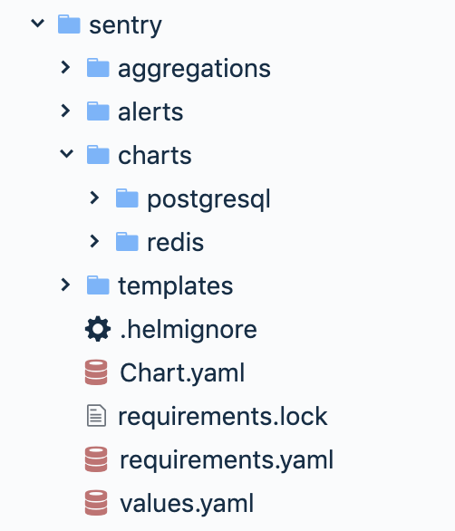

In this chapter, we are going to look into Helm, the Kubernetes package manager. Every successful and non-trivial platform must have a good packaging system. Helm was developed by Deis (acquired by Microsoft in April 04/2017) and later contributed to the Kubernetes project directly. It became a CNCF project in 2018. We will start by understanding the motivation for Helm, its architecture, and its components. Then, we'll get hands-on and see how to use Helm and its charts within Kubernetes. That includes finding, installing, customizing, deleting, and managing charts. Last but not least, we'll cover how to create your own charts and handle versioning, dependencies, and templating.

The topics we will cover are as follows:

- Understanding Helm
- Using Helm
- Creating your own charts

# Understanding Helm

Kubernetes provides many ways to organize and orchestrate your containers at runtime, but it lacks a higher-level organization of grouping sets of images together. This is where Helm comes in. In this section, we'll go over the motivation for Helm, its architecture and components, and discuss what has changed in the transition from Helm 2 to Helm 3.

## The motivation for Helm

Helm provides support for several important use cases:

- Managing complexity
- Easy upgrades
- Simple sharing
- Safe rollbacks

Charts can describe even the most complex apps, provide repeatable application installation, and serve as a single point of authority. In-place upgrades and custom hooks allow for easy updates. It's simple to share charts that can be versioned and hosted on public or private servers. When you need to rollback recent upgrades, Helm provides a single command to rollback a cohesive set of changes to your infrastructure.

## The Helm 2 architecture

Helm is designed to perform the following:

- Create new charts from scratch
- Package charts into chart archive (tgz) files
- Interact with chart repositories where charts are stored
- Install and uninstall charts into an existing Kubernetes cluster
- Manage the release cycle of charts that have been installed with Helm

Helm uses a client-server architecture to achieve these goals

## Helm 2 components

Helm has a server component that runs on your Kubernetes cluster and a client component that you run on a local machine.

### The Tiller server

The server is responsible for managing releases. It interacts with the Helm clients
as well as the Kubernetes API server. Its main functions are as follows:

- Listening for incoming requests from the Helm client
- Combining a chart and configuration to build a release
- Installing charts into Kubernetes
- Tracking the subsequent release
- Upgrading and uninstalling charts by interacting with Kubernetes

### The Helm client

You install the Helm client on your machine. It is responsible for the following:

- Local chart development
- Managing repositories
- Interacting with the Tiller server
- Sending charts to be installed
- Asking for information about releases
- Requesting upgrades or uninstallation of existing releases

## Helm 3

Helm 2 is great and plays a very important role in the Kubernetes ecosystem. But, there was a lot of criticism about Tiller - its server-side component. Helm 2 was designed and implemented before RBAC became the official access-control method. In the interest of usability Tiller is installed by default with a very open set of permissions. It wasn't easy to lock it down for production usage.  This is especially challenging in multi-tenant clusters.

The helm team listened to the criticisms and came up with the Helm 3 design. Instead of the Tiller in-cluster component Helm 3 will utilize the Kubernetes API server itself via CRDs to manage the state of releases. The bottom line is that Helm 3 is a client-only program. It can still manage releases and perform the same tasks as Helm 2, but without installing a server-side component.

This approach is more Kubernetes-native, less complicated and the security concerns are gone. Helm users can perform via Helm only as much as their kube config allows.   

# Using Helm

Helm is a rich package management system that lets you perform all the necessary steps to manage the applications installed on your cluster. Let's roll up our sleeves and get going. We'll look at installing both Helm 2 and Helm 3, but we will use Helm 3 for all of our hands own experiments and demonstrations. 

## Installing Helm

Installing Helm involves installing the client and the server. Helm is implemented in Go. The helm 2 executable can serve as either client or server. Helm 3 as mentioned before is a client-only program.

### Installing the Helm client

You must have Kubectl configured properly to talk to your Kubernetes cluster because the Helm client uses the Kubectl configuration to talk to the Helm server (Tiller)

Helm provides binary releases for all platforms here:

`https://github.com/helm/helm/releases`

For Windows, the [chocolatey](https://chocolatey.org/) package manager is the best option (usually up to date):

```
choco install kubernetes-helm
```

For Mac OSX and Linux, you can install the client from a script:

```
$ curl https://raw.githubusercontent.com/helm/helm/master/scripts/get > get_helm.sh
$ chmod 700 get_helm.sh
$ ./get_helm.sh
```

On Mac OSX, you can also use [Homebrew](https://brew.sh/):

```
brew install kubernetes-helm
```


```
$ helm version

version.BuildInfo{Version:"v3.0.0", GitCommit:"e29ce2a54e96cd02ccfce88bee4f58bb6e2a28b6", GitTreeState:"clean", GoVersion:"go1.13.4"}
```

### Installing the Tiller server for Helm 2

If you run Helm 2 for some reason you need to install Tiller - the server-side component, which is not needed for Helm 3. Tiller typically runs inside your cluster. For development, it is sometimes easier to run Tiller locally.

#### Installing Tiller in-cluster

The easiest way to install Tiller is from a machine where the Helm 2 client is installed. Run the following command: `helm init`.

This will initialize both the client as well as the Tiller server on the remote Kubernetes cluster. When the installation is done, you will have a running Tiller pod in the kube-system namespace of your cluster:

```
$ kubectl get po --namespace=kube-system -l name=tiller

NAME                            READY  STATUS   RESTARTS   AGE
tiller-deploy-3210613906-2j5sh  1/1    Running  0          1m
```

You can also run `helm version` to check out both the client's and the server's version:

```
$ helm version

Client: &version.Version{SemVer:"v2.2.3", GitCommit:"1402a4d6ec9fb349e17b912e32fe259ca21181e3", GitTreeState:"clean"}

Server: &version.Version{SemVer:"v2.2.3", GitCommit:"1402a4d6ec9fb349e17b912e32fe259ca21181e3", GitTreeState:"clean"}
```


## Finding charts

In order to install useful applications and software with Helm, you need to find their charts first. Helm was designed to work with multiple repositories of charts. Helm 2 was configured to search the stable repository by default, but you could add additional repositories. Helm 3 comes with no default, but you can search the recent [Helm Hub](https://hub.helm.sh/) or specific repositories. The Helm hub was launched in December 2018 and it designed to make it easy to discover charts and repositories hosted outside the stable or incubator repositories. 

This is where the helm search command comes in. Helm can search the Helm hub or a specific repository

The hub contains 852 charts at the moment

```
$ helm search hub | wc -l
     852 
```

We can search the hub for a specific keyword like mariadb

```
$ helm search hub mariadb
URL                                               	CHART VERSION	APP VERSION	DESCRIPTION
https://hub.helm.sh/charts/bitnami/phpmyadmin     	4.1.1        	4.9.1      	phpMyAdmin is an mysql administration frontend
https://hub.helm.sh/charts/bitnami/mariadb        	6.12.2       	10.3.18    	Fast, reliable, scalable, and easy to use open-...
https://hub.helm.sh/charts/bitnami/mariadb-galera 	0.4.4        	10.3.18    	MariaDB Galera is a multi-master database clust...
https://hub.helm.sh/charts/bitnami/mariadb-cluster	1.0.1        	10.2.14    	Chart to create a Highly available MariaDB cluster
https://hub.helm.sh/charts/ibm-charts/ibm-maria...	1.1.2        	           	MariaDB is developed as open source software an...
https://hub.helm.sh/charts/ibm-charts/ibm-galer...	1.1.0
```

As you can see there are several charts that match the keyword "mariadb". You can investigate those further and find the best one for your use case.

### Adding repositories

By default, Helm 3 comes with no repositories set up, so you can search only the hub. Let's add the stable repository, so we can limit our search to that repository only:

```
$ helm repo add stable https://kubernetes-charts.storage.googleapis.com
"stable" has been added to your repositories
```

Now, we can search the stable repo:

```
$ helm search repo mariadb
NAME             	CHART VERSION	APP VERSION	DESCRIPTION
stable/mariadb   	6.12.2       	10.3.18    	Fast, reliable, scalable, and easy to use open-...
stable/phpmyadmin	4.1.1        	4.9.1      	phpMyAdmin is an mysql administration frontend
```

The results are a subset of the results returned from the hub.


The official repository has a rich library of charts that represent all modern open source databases, monitoring systems, Kubernetes-specific helpers, and a slew of other offerings, such as a Minecraft server. Searching for Helm charts is a good way to find interesting projects and tools. I often search for the `kube` keyword:

```
$ helm search repo kube
NAME                           	CHART VERSION	APP VERSION  	DESCRIPTION
stable/chaoskube               	3.1.2        	0.14.0       	Chaoskube periodically kills random pods in you...
stable/kube-hunter             	1.0.3        	312          	A Helm chart for Kube-hunter
stable/kube-lego               	0.4.2        	v0.1.6       	DEPRECATED Automatically requests certificates ...
stable/kube-ops-view           	1.1.0        	0.11         	Kubernetes Operational View - read-only system ...
stable/kube-slack              	1.1.0        	v4.2.0       	Chart for kube-slack, a monitoring service for ...
stable/kube-state-metrics      	2.4.1        	1.8.0        	Install kube-state-metrics to generate and expo...
stable/kube2iam                	2.0.2        	0.10.7       	Provide IAM credentials to pods based on annota...
stable/kubed                   	0.3.3        	0.4.0        	DEPRECATED Kubed by AppsCode - Kubernetes daemon
stable/kubedb                  	0.1.3        	0.8.0-beta.2 	DEPRECATED KubeDB by AppsCode - Making running ...
stable/kuberhealthy            	1.2.6        	v1.0.2       	The official Helm chart for Kuberhealthy.
stable/kubernetes-dashboard    	1.10.0       	1.10.1       	General-purpose web UI for Kubernetes clusters
stable/kuberos                 	0.2.1        	2018-07-03   	An OIDC authentication helper for Kubernetes
stable/kubewatch               	0.8.12       	0.0.4        	Kubewatch notifies your slack rooms when change...
stable/sumokube                	1.0.0        	latest       	Sumologic Log Collector
stable/aerospike               	0.2.11       	v4.5.0.5     	A Helm chart for Aerospike in Kubernetes
stable/coredns                 	1.7.4        	1.6.4        	CoreDNS is a DNS server that chains plugins and...
stable/distributed-tensorflow  	0.1.2        	1.6.0        	A Helm chart for running distributed TensorFlow...
stable/etcd-operator           	0.10.0       	0.9.4        	CoreOS etcd-operator Helm chart for Kubernetes
stable/ethereum                	1.0.0        	v1.7.3       	private Ethereum network Helm chart for Kubernetes
stable/external-dns            	2.9.4        	0.5.17       	ExternalDNS is a Kubernetes addon that configur...
stable/filebeat                	3.1.0        	7.0.1        	A Helm chart to collect Kubernetes logs with fi...
stable/fluentd                 	2.1.3        	v2.4.0       	A Fluentd Elasticsearch Helm chart for Kubernetes.
stable/fluentd-elasticsearch   	2.0.7        	2.3.2        	DEPRECATED! - A Fluentd Helm chart for Kubernet...
stable/gangway                 	0.3.2        	3.0.0        	An application that can be used to easily enabl...
stable/ingressmonitorcontroller	1.0.48       	1.0.47       	IngressMonitorController chart that runs on kub...
stable/instana-agent           	1.0.18       	1            	Instana Agent for Kubernetes
stable/jaeger-operator         	2.10.2       	1.14.0       	jaeger-operator Helm chart for Kubernetes
stable/k8s-spot-rescheduler    	0.4.2        	v0.2.0       	A k8s-spot-rescheduler Helm chart for Kubernetes
stable/kanister-operator       	0.3.0        	0.10.0       	Kanister-operator Helm chart for Kubernetes
stable/katafygio               	1.0.0        	0.8.1        	Continuously backup Kubernetes objets as YAML f...
stable/keel                    	0.6.1        	0.9.5        	DEPRECATED Open source, tool for automating Kub...
stable/kiam                    	2.5.2        	3.3          	Integrate AWS IAM with Kubernetes
stable/logdna-agent            	1.2.0        	1.5.6        	Run this, get logs. All cluster containers. Log...
stable/metallb                 	0.12.0       	0.8.1        	MetalLB is a load-balancer implementation for b...
stable/metricbeat              	1.7.0        	6.7.0        	A Helm chart to collect Kubernetes logs with me...
stable/msoms                   	0.2.0        	1.0.0-30     	A chart for deploying omsagent as a daemonset K...
stable/nfs-server-provisioner  	0.3.1        	2.2.1-k8s1.12	nfs-server-provisioner is an out-of-tree dynami...
stable/nginx-lego              	0.3.1        	             	Chart for nginx-ingress-controller and kube-lego
stable/opa                     	1.12.0       	0.14.1       	Open source, general-purpose policy engine. Enf...
stable/openvpn                 	3.14.1       	1.1.0        	A Helm chart to install an openvpn server insid...
stable/prometheus-operator     	6.21.0       	0.32.0       	Provides easy monitoring definitions for Kubern...
stable/redis-ha                	3.9.2        	5.0.5        	Highly available Kubernetes implementation of R...
stable/reloader                	1.2.0        	v0.0.41      	Reloader chart that runs on kubernetes
stable/risk-advisor            	2.0.4        	1.0.0        	Risk Advisor add-on module for Kubernetes
stable/rookout                 	0.1.0        	1.0          	A Helm chart for Rookout agent on Kubernetes
stable/searchlight             	0.3.3        	5.0.0        	DEPRECATED Searchlight by AppsCode - Alerts for...
stable/sematext-agent          	1.0.20       	1.0          	Helm chart for deploying Sematext Agent to Kube...
stable/signalfx-agent          	0.3.1        	3.6.1        	DEPRECATED The SignalFx Kubernetes agent
stable/spartakus               	1.1.6        	1.0.0        	Collect information about Kubernetes clusters t...
stable/stash                   	0.5.3        	0.7.0-rc.1   	DEPRECATED Stash by AppsCode - Backup your Kube...
stable/traefik                 	1.78.4       	1.7.14       	A Traefik based Kubernetes ingress controller w...
stable/vault-operator          	0.1.1        	0.1.9        	CoreOS vault-operator Helm chart for Kubernetes
stable/voyager                 	3.2.4        	6.0.0        	DEPRECATED Voyager by AppsCode - Secure Ingress...
stable/wavefront               	1.0.0        	0.9.7        	Wavefront Kubernetes collector
stable/weave-cloud             	0.3.5        	1.3.0        	Weave Cloud is a add-on to Kubernetes which pro...
stable/zetcd                   	0.1.9        	0.0.3        	CoreOS zetcd Helm chart for Kubernetes
stable/buildkite               	0.2.4        	3            	DEPRECATED Agent for Buildkite
stable/cert-manager            	v0.6.7       	v0.6.2       	A Helm chart for cert-manager
stable/luigi                   	2.7.5        	2.7.2        	Luigi is a Python module that helps you build c...
stable/oauth2-proxy            	1.1.0        	4.0.0        	A reverse proxy that provides authentication wi...
``` 

To get more information about a specific chart we can use the show command (you can use the inspectalias too). Let's checkout stable/mariadb

```
$ helm show chart stable/mariadb
Error: failed to download "stable/mariadb" (hint: running `helm repo update` may help)
```

Ha-ha. Helm requires that the repositories are up to date. Let's update our repositories

```
$ helm repo update
Hang tight while we grab the latest from your chart repositories...
...Successfully got an update from the "stable" chart repository
Update Complete. ⎈ Happy Helming!⎈
```

Now, it works:

```
$ helm show chart stable/mariadb
apiVersion: v1
appVersion: 10.3.18
description: Fast, reliable, scalable, and easy to use open-source relational database
  system. MariaDB Server is intended for mission-critical, heavy-load production systems
  as well as for embedding into mass-deployed software. Highly available MariaDB cluster.
home: https://mariadb.org
icon: https://bitnami.com/assets/stacks/mariadb/img/mariadb-stack-220x234.png
keywords:
- mariadb
- mysql
- database
- sql
- prometheus
maintainers:
- email: containers@bitnami.com
  name: Bitnami
name: mariadb
sources:
- https://github.com/bitnami/bitnami-docker-mariadb
- https://github.com/prometheus/mysqld_exporter
version: 6.12.2
```

You can also ask Helm to show you the readem, the values or all the information associated with a chart. This can be overwhelming at times. 


## Installing packages

OK. You've found the package of your dreams. Now, you probably want to install it on your Kubernetes cluster. When you install a package, Helm creates a release that you can use to keep track of the installation progress. Let's install MariaDB using the helm install command. Let's go over the output in detail. The first part of the output lists the name of the release that we provided `mariadb`, when it was deployed, the namespace andthe revision.

```
$ helm install mariadb stable/mariadb

NAME: mariadb
LAST DEPLOYED: Sun Oct 27 12:26:34 2019
NAMESPACE: ns
STATUS: deployed
REVISION: 1
```

The next part is custom notes and it can be pretty wordy. There is a lot of good information here about verifying, getting credentials, connecting the the database and upgrading the chart if necessary:

```
NOTES:
Please be patient while the chart is being deployed

Tip:

  Watch the deployment status using the command: kubectl get pods -w --namespace default -l release=mariadb

Services:

  echo Master: mariadb.ns.svc.cluster.local:3306
  echo Slave:  mariadb-slave.ns.svc.cluster.local:3306

Administrator credentials:

  Username: root
  Password : $(kubectl get secret --namespace default mariadb -o jsonpath="{.data.mariadb-root-password}" | base64 --decode)

To connect to your database:

  1. Run a pod that you can use as a client:

      kubectl run mariadb-client --rm --tty -i --restart='Never' --image  docker.io/bitnami/mariadb:10.3.18-debian-9-r36 --namespace default --command -- bash

  2. To connect to master service (read/write):

      mysql -h mariadb.ns.svc.cluster.local -uroot -p my_database

  3. To connect to slave service (read-only):

      mysql -h mariadb-slave.ns.svc.cluster.local -uroot -p my_database

To upgrade this helm chart:

  1. Obtain the password as described on the 'Administrator credentials' section and set the 'rootUser.password' parameter as shown below:

      ROOT_PASSWORD=$(kubectl get secret --namespace default mariadb -o jsonpath="{.data.mariadb-root-password}" | base64 --decode)
      helm upgrade mariadb stable/mariadb --set rootUser.password=$ROOT_PASSWORD
```

### Checking installation status

Helm doesn't wait for the installation to complete because it may take a while. The helm status command displays the latest information on a release in the same format as the output of the initial helm install command. In the output of the install command you can see that the persistent volume claim had a pending status. Let's check it out now:


```
$ kubectl get pods -w -l release=mariadb
NAME               READY   STATUS    RESTARTS   AGE
mariadb-master-0   0/1     Pending   0          4m21s
mariadb-slave-0    0/1     Pending   0          4m21s
```

Oh, no. The pods are pending. A quick investigation discovered that mariadb declares a persistent volume claim, but since there is no default storage class in the cluster there is no way to provide the storage needed:

```
$ kubectl describe  pvc data-mariadb-master-0
Name:          data-mariadb-master-0
Namespace:     default
StorageClass:
Status:        Pending
Volume:
Labels:        app=mariadb
               component=master
               heritage=Helm
               release=mariadb
Annotations:   <none>
Finalizers:    [kubernetes.io/pvc-protection]
Capacity:
Access Modes:
VolumeMode:    Filesystem
Events:
  Type       Reason         Age                  From                         Message
  ----       ------         ----                 ----                         -------
  Normal     FailedBinding  3m3s (x42 over 13m)  persistentvolume-controller  no persistent volumes available for this claim and no storage class is set
Mounted By:  mariadb-master-0
```

That's OK. We can create a default storage class with a dynamic provisioner. First, let's install using Helm a dynamic host path provisioner. See https://github.com/rimusz/hostpath-provisioner for details. We add a new helm repo, update our repo list and then install the proper chart:

```
$ helm repo add rimusz https://charts.rimusz.net
"rimusz" has been added to your repositories

$ helm repo update
Hang tight while we grab the latest from your chart repositories...
...Successfully got an update from the "rimusz" chart repository
...Successfully got an update from the "stable" chart repository
Update Complete. ⎈ Happy Helming!⎈

$ helm upgrade --install hostpath-provisioner --namespace kube-system rimusz/hostpath-provisioner
Release "hostpath-provisioner" does not exist. Installing it now.
NAME: hostpath-provisioner
LAST DEPLOYED: Sun Oct 27 17:52:56 2019
NAMESPACE: kube-system
STATUS: deployed
REVISION: 1
TEST SUITE: None
NOTES:
The Hostpath Provisioner service has now been installed.

A storage class named 'hostpath' has now been created
and is available to provision dynamic volumes.

You can use this storageclass by creating a `PersistentVolumeClaim` with the
correct storageClassName attribute. For example:

    ---
    kind: PersistentVolumeClaim
    apiVersion: v1
    metadata:
      name: test-dynamic-volume-claim
    spec:
      storageClassName: "hostpath"
      accessModes:
        - ReadWriteOnce
      resources:
        requests:
          storage: 100Mi
```

Since we don't control the persistent volume claim that the mariadb chart is creating we can't specify the new "hostpath" storage class. But, we can make sure it is the default storage class!

```
```


```
$ kubectl get sc
NAME                 PROVISIONER   AGE
hostpath (default)   hostpath      6m26s
```

If you have another storage class set as the default, you can make it non-default like so:

```
kubectl patch storageclass <your-class-name> -p '{"metadata": {"annotations":{"storageclass.kubernetes.io/is-default-class":"false"}}}'
```

We have to perform one more non-conventional step. Since, we run our tests on k3d + k3s where the nodes are virtual then the host directory of the host path provisioner is actually allocated inside the Docker container that corresponds to the node. For some reason the permissions for those directories allows only root to create directories. This can be fixed by running the following command on each of the docker containers that corresponds to k3s nodes:

```
$ docker exec -it <container name> chmod -R 0777 /mnt/hostpath
```

Now, we can try again. This time everything works. Yay!

Here the pods, the volumes, the persistent volume claims  and the statefulset created by the mariadb release:

```
$ kubectl get po
NAME               READY   STATUS    RESTARTS   AGE
mariadb-master-0   1/1     Running   0          24m
mariadb-slave-0    1/1     Running   9          24m

$ kubectl get pv
NAME                                       CAPACITY   ACCESS MODES   RECLAIM POLICY   STATUS   CLAIM                           STORAGECLASS   REASON   AGE
pvc-b51aeb37-4a43-4f97-ad52-40e6b6eda4f4   8Gi        RWO            Delete           Bound    default/data-mariadb-master-0   hostpath                30m
pvc-58c7e42e-a01b-4544-8691-3e56de4676eb   8Gi        RWO            Delete           Bound    default/data-mariadb-slave-0    hostpath                30m

$ kubectl get pvc
NAME                    STATUS   VOLUME                                     CAPACITY   ACCESS MODES   STORAGECLASS   AGE
data-mariadb-master-0   Bound    pvc-b51aeb37-4a43-4f97-ad52-40e6b6eda4f4   8Gi        RWO            hostpath       30m
data-mariadb-slave-0    Bound    pvc-58c7e42e-a01b-4544-8691-3e56de4676eb   8Gi        RWO            hostpath       30m

$ kubectl get sts
NAME             READY   AGE
mariadb-master   1/1     30m
mariadb-slave    1/1     30m
``` 

Let's try to connect and verify mariadb is indeed accessible. Let's modify the suggested commands a little bit from the notes to connect. Instead of running bash and then running mysql, we can directly run the mysql command on the container. first, let's get the root password and copy it to the clipboard (on Mac):

```
$ kubectl get secret -o yaml mariadb -o jsonpath="{.data.mariadb-root-password}" | base64 --decode | pbcopy
```

Then we can connect using the mariadb-client and paste the password when you see `If you don't see a command prompt, try pressing enter.`:

```
$ kubectl run --generator=run-pod/v1 mariadb-client --rm -it --image bitnami/mariadb --command -- mysql -h mariadb.default.svc.cluster.local -uroot -p
If you don't see a command prompt, try pressing enter.

Welcome to the MariaDB monitor.  Commands end with ; or \g.
Your MariaDB connection id is 1364
Server version: 10.3.18-MariaDB-log Source distribution

Copyright (c) 2000, 2018, Oracle, MariaDB Corporation Ab and others.

Type 'help;' or '\h' for help. Type '\c' to clear the current input statement.

MariaDB [(none)]>
```

Then, we can start playing with our mariadb database:

```
MariaDB [(none)]> show databases;
+--------------------+
| Database           |
+--------------------+
| information_schema |
| my_database        |
| mysql              |
| performance_schema |
| test               |
+--------------------+
5 rows in set (0.001 sec)
```

### Customizing a chart

Very often as a user, you want to customize or configure the charts you install. Helm fully supports customization via config files. To learn about possible customizations you can use the `helm show` command again, but this time focus on the values. Here is a partial output:

```
$ helm show values stable/mariadb
db:
  forcePassword: false
  name: my_database
  password: null
  user: null
image:
  debug: false
  pullPolicy: IfNotPresent
  registry: docker.io
  repository: bitnami/mariadb
  tag: 10.3.18-debian-9-r36
master:
  affinity: {}
  antiAffinity: soft
  config: |-
    [mysqld]
    skip-name-resolve
    explicit_defaults_for_timestamp
    basedir=/opt/bitnami/mariadb
    port=3306
    socket=/opt/bitnami/mariadb/tmp/mysql.sock
    tmpdir=/opt/bitnami/mariadb/tmp
    max_allowed_packet=16M
    bind-address=0.0.0.0
    pid-file=/opt/bitnami/mariadb/tmp/mysqld.pid
    log-error=/opt/bitnami/mariadb/logs/mysqld.log
    character-set-server=UTF8
    collation-server=utf8_general_ci

    [client]
    port=3306
    socket=/opt/bitnami/mariadb/tmp/mysql.sock
    default-character-set=UTF8
...
rbac:
  create: false
replication:
  enabled: true
  forcePassword: false
  password: null
  user: replicator
rootUser:
  forcePassword: false
  password: null
```

For example, if you want to set a root password and create a database when installing mariadb, you can create the following YAML file and save it as mariadb-config.yaml:

```
mariadbRootPassword: supersecret
mariadbDatabase: awesome_stuff
```

Then, run helm and pass it the yaml file:

```
$ helm install -f mariadb-config.yaml stable/mariadb
```

You can also set individual values on the command line with `--set`. If both --f and --set try to set the same values, then --set takes precedence. For example, in this case the root password will be `evenbettersecret`:

```
$ helm install -f mariadb-config.yaml --set mariadbRootPassword=evenbettersecret stable/mariadb
```
You can specify multiple values using comma-separated lists: `--set a=1,b=2`.

### Additional installation options

The helm install command can install from several sources:

- A chart repository (as we've seen)
- A local chart archive (helm install foo-0.1.1.tgz)
- An unpacked chart directory (helm install path/to/foo)
- A full URL (helm install https://example.com/charts/foo-1.2.3.tgz)

### Upgrading and rolling back a release

You may want to upgrade a package you installed to the latest and greatest
version. Helm provide the upgrade command, which operates intelligently and
only updates things that have changed. For example, let's check the current values
of our mariadb installation:

```
$ helm get values mariadb
USER-SUPPLIED VALUES:
mariadbDatabase: awesome_stuff
mariadbRootPassword: evenbettersecret
```

Now, let's run, upgrade, and change the name of the database:

```
$ helm upgrade mariadb --set mariadbDatabase=awesome_sauce stable/mariadb

$ helm get values mariadb
USER-SUPPLIED VALUES:
mariadbDatabase: awesome_sauce
```

Note that we've lost our root password. All the existing values are replaced when you upgrade. OK, let's roll back. The helm history command shows us all the available revisions we can roll back to:

```
$ helm history mariadb
REVISION	UPDATED                 	STATUS    	CHART         	APP VERSION	DESCRIPTION
1       	Mon Oct 28 09:14:10 2019	superseded	mariadb-6.12.2	10.3.18    	Install complete
2       	Mon Oct 28 09:22:22 2019	superseded	mariadb-6.12.2	10.3.18    	Upgrade complete
3       	Mon Oct 28 09:23:47 2019	superseded	mariadb-6.12.2	10.3.18    	Upgrade complete
4       	Mon Oct 28 09:24:17 2019	deployed  	mariadb-6.12.2	10.3.18    	Upgrade complete
```

Let's roll back to revision 3:

```
$ helm rollback mariadb 3
Rollback was a success! Happy Helming!

$ helm history mariadb
REVISION	UPDATED                 	STATUS    	CHART         	APP VERSION	DESCRIPTION
1       	Mon Oct 28 09:14:10 2019	superseded	mariadb-6.12.2	10.3.18    	Install complete
2       	Mon Oct 28 09:22:22 2019	superseded	mariadb-6.12.2	10.3.18    	Upgrade complete
3       	Mon Oct 28 09:23:47 2019	superseded	mariadb-6.12.2	10.3.18    	Upgrade complete
4       	Mon Oct 28 09:24:17 2019	superseded	mariadb-6.12.2	10.3.18    	Upgrade complete
5       	Mon Oct 28 09:26:04 2019	deployed  	mariadb-6.12.2	10.3.18    	Rollback to 3
```

As you can see the rollback created a new revision number 5. Revision 4 is still there in case we want to go back to it.

Let's verify our changes were rolled back:

```
$ helm get values mariadb
USER-SUPPLIED VALUES:
mariadbDatabase: awesome_stuff
mariadbRootPassword: evenbettersecret
```

Yep. The database name was rolled back to awesome_stuff and we got the root password back.

### Deleting a release

You can, of course, uninstall a release too using the `helm uninstall` command:

First, let's examine the list of releases. We have only the mariadb release:

```
$ helm list
NAME   	NAMESPACE	REVISION	UPDATED                             	STATUS  	CHART         	APP VERSION
mariadb	default  	5       	2019-10-28 09:26:04.766743 -0700 PDT	deployed	mariadb-6.12.2	10.3.18
```

Now, let's uninstall it:

```
$ helm uninstall mariadb
release "mariadb" uninstalled
```

So, no more releases:

```
$ helm list
NAME	NAMESPACE	REVISION	UPDATED	STATUS	CHART	APP VERSION
```


Helm can keeps track of uninstalled releases too. If you provide the `--keep-history` when you uninstall then you'll be able to see uninstalled releases using the `--all` or `--uninstalled` flags to `helm list`. 

```
$ helm list --all
NAME   	NAMESPACE	REVISION	UPDATED                             	STATUS     	CHART         	APP VERSION
mariadb	default  	1       	2019-10-28 09:35:47.641033 -0700 PDT	uninstalled	mariadb-6.12.2	10.3.18
```

## Working with repositories

Helm stores charts in repositories that are simple HTTP servers. Any standard HTTP server can host a Helm repository. In the cloud, the Helm team verified that AWS S3 and Google Cloud storage can both serve as Helm repositories in web-enabled mode. 

Note that Helm doesn't provide tools for uploading charts to remote repositories because that would require the remote server to understand Helm, to know where to put the chart, and how to update the index.yaml file.

On the client side the `helm repo` command lets you list, add, remove, index, and update:

```
$ helm repo

This command consists of multiple subcommands to interact with chart repositories.

It can be used to add, remove, list, and index chart repositories.
Example usage:
    $ helm repo add [NAME] [REPO_URL]

Usage:
  helm repo [command]

Available Commands:
  add         add a chart repository
  index       generate an index file given a directory containing packaged charts
  list        list chart repositories
  remove      remove a chart repository
  update      update information of available charts locally from chart repositories
```

We've already used the `helm repo add` and command earlier. Let's see how to create our own charts and manage them. 


## Managing charts with Helm

Helm provides several commands to manage charts.

It can create a new chart for you:

```
$ helm create cool-chart
Creating cool-chart
```

Helm will create the following files and directories under cool-chart:

```
$ tree cool-chart
cool-chart
├── Chart.yaml
├── charts
├── templates
│   ├── NOTES.txt
│   ├── _helpers.tpl
│   ├── deployment.yaml
│   ├── ingress.yaml
│   ├── service.yaml
│   ├── serviceaccount.yaml
│   └── tests
│       └── test-connection.yaml
└── values.yaml
```

Once you have edited your chart, you can package it into a tar gzipped archive:

```
$ helm package cool-chart
$ helm package cool-chart
Successfully packaged chart and saved it to: cool-chart-0.1.0.tgz
```

Helm will create an archive called cool-chart-0.1.0.tgz and store both in the local directory.

You can also use `helm lint` to help you find issues with your chart's formatting or information:

```
$ helm lint cool-chart
==> Linting cool-chart
[INFO] Chart.yaml: icon is recommended

1 chart(s) linted, 0 chart(s) failed
```

### Taking advantage of starter packs

The helm create command takes an optional `--starter` flag that lets you specify a starter chart.

Starters are just regular charts located in $HELM_HOME/starters. As a chart developer, you may author charts that are specifically designed to be used as starters. Such charts should be designed with the following considerations in mind:

- The yaml will be overwritten by the generator
- Users will expect to modify such a chart's contents, so documentation should indicate how users can do so

At the moment there is no way to install charts, the only way to add a chart to $HELM_HOME/starters is to manually copy it there. Make sure to mention that in your chart's documentation if you develop starter pack charts.

# Creating your own charts

A chart is a collection of files that describe a related set of Kubernetes resources. A single chart might be used to deploy something simple, such as a memcached pod, or something complex, such as a full web app stack with HTTP servers, databases, caches, queues, and so on.

Charts are created as files laid out in a particular directory tree. Then they can be packaged into versioned archives to be deployed. The key file is `Chart.yaml`.

## The Chart.yaml file

The Chart.yaml file is the main file of a Helm chart. It requires a name and version fields:

- name: The name of the chart (same as the directory name)
- version: A SemVer 2 version

It may also contain various optional fields:

- kubeVersion: SemVer range of compatible Kubernetes versions
- description: single sentence description of this project
- keywords: list of keywords about this project:
- home: URL of this project's home page
- sources: list of URLs to source code for this project
- dependencies: list of (name, version, repository) for each dependency (repository is URL)
- maintainers: list of (name, email, url) for each maintainer (name is required) 
- icon: URL to an SVG or PNG image to be used as an icon
- appVersion: version of the app that this contains
- deprecated: is this chart is deprecated? (boolean)


### Versioning charts

The version field inside of the Chart.yaml is used by the many of the Helm tools. When generating a package, the helm package command will use the version that it finds in the Chart.yaml when constructing in the package name. The system assumes that the version number in the chart package name must match the version number in the Chart.yaml. Violating this assumption will cause an error.

### The appVersion field

The appVersion field is not related to the version field. It is not used by Helm and serves as metadata or documentation for users that want to understand what they are deploying. Helm ignores it.

### Deprecating charts

From time to time you may want to deprecate a chart. You can mark a chart as deprecated by setting the  optional deprecated field in Chart.yaml to "true". It's enough to deprecate the latest version of a chart. You can later reuse the chart name and publish a newer version that is not deprecated. The workflow for deprecating charts is:

- Update the chart's Chart.yaml file to mark the chart as deprecated and bump the version
- Release the new version to the chart repository
- Remove the chart from the source repository (for example, Git)

## Chart metadata files

Charts may contain various metadata files like README.md, LICENSE and NOTES.txt that describe the installation, configuration, usage, and license of a chart. The README.md file should be or a chart should be formatted as markdown. It should provide the following information:

- A description of the application or service the chart provides
- Any prerequisites or requirements to run the chart
- Description of options in yaml and default values
- Any other information that may be relevant to the installation or configuration of the chart

If the chart contains templates/NOTES.txt file will be displayed printed out after installation or , and when viewing the release status. The notes should be concise to avoid clutter and point to the README.md file for detailed explanations. It's common to put usage notes and next steps in this NOTES.txt. Remember that the file is evaluated as a template. The notes are printed to the screen when you run `helm install` as well as `helm status`.

## Managing chart dependencies

In Helm, a chart may depend on other charts. These dependencies are expressed explicitly by listing them in a requirements.yaml file or by copying the dependency charts into the charts/ sub-directory during installation. This provides a great way to benefit and reuse the knowledge and work of others. A dependency can be either a chart archive (foo-1.2.3.tgz) or an unpacked chart directory. But its name cannot start with `_` or `.`. Such files are ignored by
the chart loader.

### Managing dependencies with requirements.yaml

Instead of manually placing charts in the charts/ sub-directory, it is better to declare dependencies using a requirements.yaml file inside of your chart.

A requirements.yaml file is a simple file for listing the chart dependencies:

```
dependencies:
  - name: foo
    version: 1.2.3
    repository: http://example.com/charts
  - name: bar
    version: 43.52.6
    repository: http://another.example.com/charts
```

The name field is the name of the chart you want.

The version field is the version of the chart you want.

The repository field is the full URL to the chart repository. 

Note that you must also use helm repo add to add that repository locally if it isn't added already.

Once you have a dependencies file, you can run the Helm dependency update and it will use your dependency file to download all of the specified charts into the charts sub-directory for you:

```
$ helm dep up cool-chart
Hang tight while we grab the latest from your chart repositories...
...Successfully got an update from the "local" chart repository
...Successfully got an update from the "stable" chart repository
...Successfully got an update from the "example" chart repository
...Successfully got an update from the "another" chart repository

Update Complete. Happy Helming!

Saving 2 charts

Downloading Foo from repo http://example.com/charts
Downloading Bar from repo http://another.example.com/charts
```

Helm stores the dependency charts as archives in the charts/ directory. In our example, the charts sub-directory will contain the following files:

```
charts/
  foo-1.2.3.tgz
  bar-43.52.61.tgz
```

Managing charts and their dependencies with requirements.yaml is a best practice, both for explicitly documenting dependencies, sharing across the team and support automated pipelines.

### Utilizing special fields in requirements.yaml

Each entry in the requirements.yaml file requirements entry may also contain the optional fields tags and condition.

These fields can be used to dynamically control the loading of charts (by default all charts are loaded). If tags or condition are fields are present, Helm will evaluate them and determine if the target chart should be loaded or not.

- Condition - The condition field holds one or more comma-delimited YAML paths. If a path exists in the top parent's values and resolves to a boolean
value, the chart will be enabled or disabled based on that boolean value. Only the first valid path found in the list is evaluated, and if no paths exist then the condition has no effect and the chart will be loaded.

- Tags - The tags field is a YAML list of labels to associate with this chart. In the top parent's values, all charts with tags can be enabled or disabled by specifying the tag and a boolean value.

Here is an example requirements.yaml and values.yaml that make good use of conditions and tags to enable and disable the installation of dependencies. The requirements.yaml file defines two conditions for installing its dependencies based on the value of the global enabled field and the specific sub-charts enabled field:

```
# parent/requirements.yaml
dependencies:
  - name: subchart1
    repository: http://localhost:10191
    version: 0.1.0
    condition: subchart1.enabled, global.subchart1.enabled
    tags:
      - front-end
      - subchart1
  - name: subchart2
    repository: http://localhost:10191
    version: 0.1.0
    condition: subchart2.enabled,global.subchart2.enabled
    tags:
      - back-end
      - subchart2
```

The values.yaml file assigns values to some of the condition variables. The subchart2 tag doesn't get a value, so it is considered enabled automatically:

```
# parentchart/values.yaml
subchart1:
  enabled: true
tags:
  front-end: false
  back-end: true
```

You can set tag and conditions values from the command line too when installing a chart, and they'll take precedence over the values.yaml file:

```
$ helm install --set subchart2.enabled=false
```

The resolution of tags and conditions is as follows:

- Conditions that are set in values override tags. The first condition path that exists per chart takes effect, other conditions are ignored.
- If any of a chart's tags is true the chart is enabled.
- Tags and condition values must be set in the top parent's values.
- The tags: key-in values must be a top-level key. Globals and nested tags tables are not currently supported

## Using templates and values

Any non-trivial application will require configuration and adaptation to the specific use case. Helm charts are templates that use the Go template language to populate placeholders. Helm supports additional functions from the Sprig library and a few other specialized functions. The template files are stored in the `templates/`
sub-directory of the chart. Helm will use the template engine to render all files in this directory and apply the provided value files.

### Writing template files

Template files are just text files that follow the Go template language rules. They can generate Kubernetes configuration files as well as any other file. Here is the service template file of the Gitlab CE chart:

```
apiVersion: v1
kind: Service
metadata:
  name: {{ template "gitlab-ce.fullname" . }}
  labels:
    app: {{ template "gitlab-ce.fullname" . }}
    chart: "{{ .Chart.Name }}-{{ .Chart.Version }}"
    release: "{{ .Release.Name }}"
    heritage: "{{ .Release.Service }}"
spec:
  type: {{ .Values.serviceType }}
  ports:
  - name: ssh
    port: {{ .Values.sshPort | int }}
    targetPort: ssh
  - name: http
    port: {{ .Values.httpPort | int }}
    targetPort: http
  - name: https
    port: {{ .Values.httpsPort | int }}
    targetPort: https
  selector:
    app: {{ template "gitlab-ce.fullname" . }}
```

It is available here: https://github.com/helm/charts/tree/master/stable/gitlab-ce/templates/svc.yaml

Don't worry if it looks confusing. The basic idea is that you have a simple text file with placeholder for values that can be populates later in various ways as well as some functions and pipelines that can be applied to those values.


#### Using pipelines and functions

Helm allows rich and sophisticated syntax in the template files via the built-in Go template functions, sprig functions, and pipelines. Here is an example template that takes advantage of these capabilities. It uses the repeat, quote, and upper functions for the `food` and `drink` keys, and it uses pipelines to chain multiple functions together:

```
apiVersion: v1
kind: ConfigMap
metadata:
  name: {{ .Release.Name }}-configmap
data:
  greeting: "Hello World"
  drink: {{ .Values.favorite.drink | repeat 3 | quote }}
  food: {{ .Values.favorite.food | upper }}
```

Let's add a values.yaml files:

```
favorite:
  drink: coffee
  food: pizza
```

### Testing and troubleshooting your charts

Now, we can use the `helm template` to see the result:

```
$ helm template food food-chart
---
# Source: food-chart/templates/config-map.yaml
apiVersion: v1
kind: ConfigMap
metadata:
  name: food-configmap
data:
  greeting: "Hello World"
  drink: "coffeecoffeecoffee"
  food: PIZZA
```

As you can see our templating worked. The drink coffee was repeated 3 times and quoted. The food pizza became upper case PIZZA (unquoted)

Another good way of debugging is to run install with the --dry-run flag. It provides additional information:

```
$ helm install food food-chart --dry-run
NAME: food
LAST DEPLOYED: Fri Nov  1 08:13:48 2019
NAMESPACE: default
STATUS: pending-install
REVISION: 1
TEST SUITE: None
USER-SUPPLIED VALUES:
{}

COMPUTED VALUES:
favorite:
  drink: coffee
  food: pizza

HOOKS:
MANIFEST:
---
# Source: food-chart/templates/config-map.yaml
apiVersion: v1
kind: ConfigMap
metadata:
  name: food-configmap
data:
  greeting: "Hello World"
  drink: "coffeecoffeecoffee"
  food: PIZZA
```

You can also override values on the command-line

```
$ helm template food food-chart --set favorite.drink=water
---
# Source: food-chart/templates/config-map.yaml
apiVersion: v1
kind: ConfigMap
metadata:
  name: food-configmap
data:
  greeting: "Hello World"
  drink: "waterwaterwater"
  food: PIZZA
``` 

The ultimate test is of course to install your chart into your cluster. You don't need to upload your chart to a chart repository for testing just run `helm install` locally

```
$ helm install food food-chart
NAME: food
LAST DEPLOYED: Fri Nov  1 08:22:36 2019
NAMESPACE: default
STATUS: deployed
REVISION: 1
TEST SUITE: None
```

There is now a helm release called `food`:

```
$ helm list
NAME	NAMESPACE	REVISION	UPDATED                             	STATUS  	CHART           	APP VERSION
food	default  	1       	2019-11-01 08:22:36.217166 -0700 PDT	deployed	food-chart-0.1.0	1.16.0
```

Most importantly the food config map was created with the correct data:

```
$ kubectl get cm -o yaml
apiVersion: v1
items:
- apiVersion: v1
  data:
    drink: coffeecoffeecoffee
    food: PIZZA
    greeting: Hello World
  kind: ConfigMap
  metadata:
    creationTimestamp: "2019-11-01T15:22:36Z"
    name: food-configmap
    namespace: default
    resourceVersion: "313012"
    selfLink: /api/v1/namespaces/default/configmaps/food-configmap
    uid: a3c02518-4fe2-4a72-bdd0-99a268c7033f
kind: List
metadata:
  resourceVersion: ""
  selfLink: ""
```

### Embedding built-in objects

Helm provides some built-in objects you can use in your templates. In the Gitlab chart template above the Release.Name, Release.Service, Release.Service, Chart.Name, and Chart.Version are examples of Helm predefined values. Other objects are:

- Values
- Chart
- Template
- Files
- Capabilities

The Values object contains all the values defined in the values file or on the command-line. The Chart object is the content of Chart.yaml. The Template object contains information about the current template. The Files and Capabilities are map-like objects that allow access via various functions to the non-specialized files and general information about the Kubernetes cluster. 


Note that unknown fields in Chart.yaml are ignored by the template engine and cannot be used to pass arbitrary structured data to templates.

### Feeding values from a file

Here is part of the Gitlab CE default values file. The values from this file are used to populate multiple templates. The values represent defaults that you can override by copying the file and modifying to fit your needs. Note the useful comments that explain the purpose and various options for each value. 

```
## GitLab CE image
## ref: https://hub.docker.com/r/gitlab/gitlab-ce/tags/
##
image: gitlab/gitlab-ce:9.4.1-ce.0

## For minikube, set this to NodePort, elsewhere use LoadBalancer
## ref: http://kubernetes.io/docs/user-guide/services/#publishing-services---service-types
##
serviceType: LoadBalancer

## Ingress configuration options
##
ingress:
  annotations:
      # kubernetes.io/ingress.class: nginx
      # kubernetes.io/tls-acme: "true"
  enabled: false
  tls:
      # - secretName: gitlab.cluster.local
      #   hosts:
      #     - gitlab.cluster.local
  url: gitlab.cluster.local

## Configure external service ports
## ref: http://kubernetes.io/docs/user-guide/services/
sshPort: 22
httpPort: 80
httpsPort: 443
```


Here is how to provide your own YAML values files to override the defaults during the install command:

```
$ helm install --values=custom-values.yaml gitlab-ce
```

### Scope, dependencies, and values

Value files can declare values for the top-level chart, as well as for any of the charts that are included in that chart's charts/ directory. For example, let's look at the sentry chart from:
 
https://github.com/sapcc/helm-charts/blob/master/system/sentry

This Chart has two chart dependencies: postgressql and redis


**images/chapter 9 - sentry chart.png**

Both the postgressql and redis charts have their own values.yaml file with their defaults. But, the top-level values.yaml file contains some default values for its dependency charts, postgresql and redis:

```
postgresql:
  postgresDatabase: sentry
  persistence:
    enabled: true
    accessMode: ReadWriteMany
    size: 50Gi
  resources:
    requests:
      memory: 10Gi
      cpu: 4

redis:
  # redisPassword:
  persistence:
    enabled: true
    accessMode: ReadWriteMany
    size: 10Gi
  resources:
    requests:
      memory: 10Gi
      cpu: 2
```


The top-level chart has access to values of its dependent charts, but not vice versa. There is also a global value that is accessible to all charts. For example, you could add something like this:

```
global:
  app: cool-app
```

When a global is present, it will be replicated to each dependent chart's values as follows:

```
global:
  app: cool-app
postgresql:
  global:
    app: cool-app
  ...
 redis:
   global:
     app: cool-app
   ...
```

# Summary

In this chapter, we took a look at Helm, the Kubernetes package manager. Helm gives Kubernetes the ability to manage complicated software composed of many Kubernetes resources with inter-dependencies. It serves the same purpose as an OS package manager. It organizes packages and lets you search charts, install and upgrade charts, and share charts with collaborators. You can develop your own charts and store them in repositories. Helm 3 is a client-side only solution that uses CRDs to manage the status of releases instead of the Tiller server-sode component of Helm 2 that posed a lot of security issues with its default configuration.

At this point, you should understand the important role that Helm serves in the Kubernetes ecosystem and community. You should be able to use it productively and even develop and share your own charts.

In the next chapter, we will look how Kubernetes does networking at a pretty low-level.
